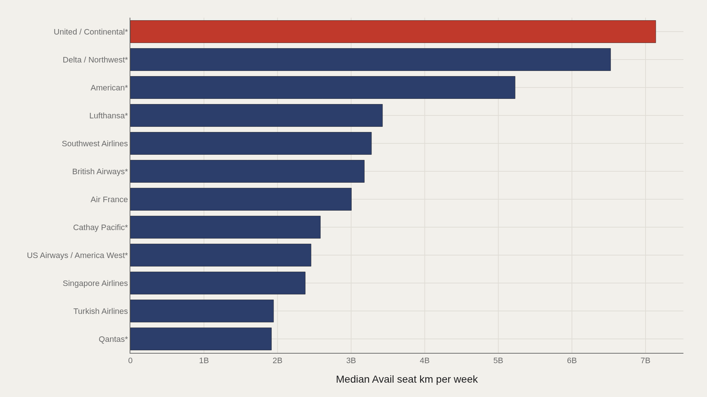
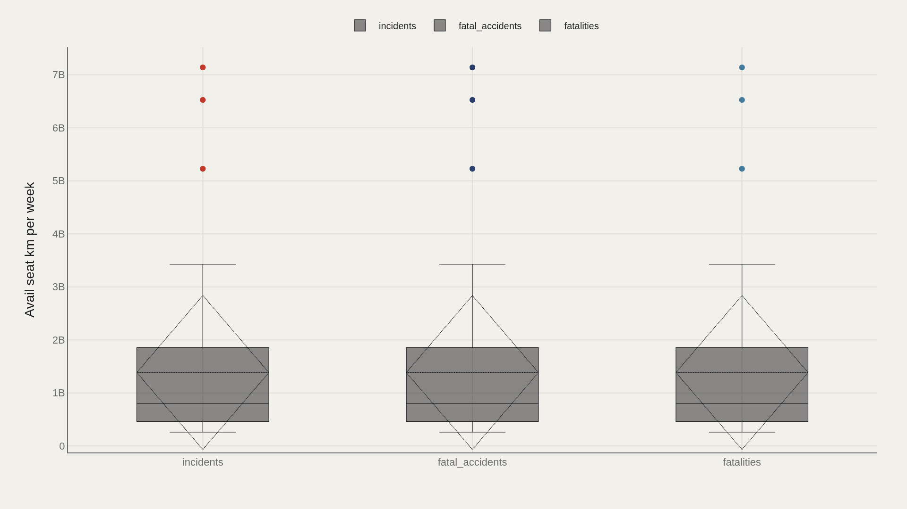
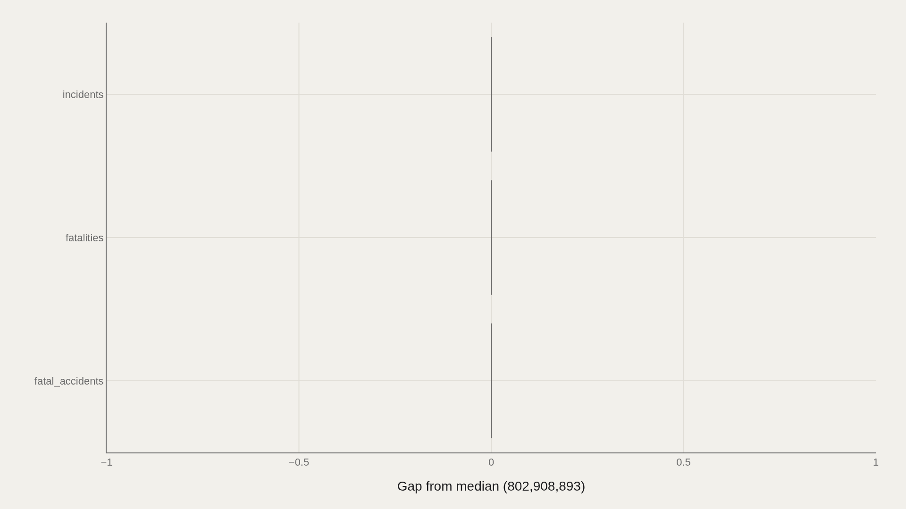
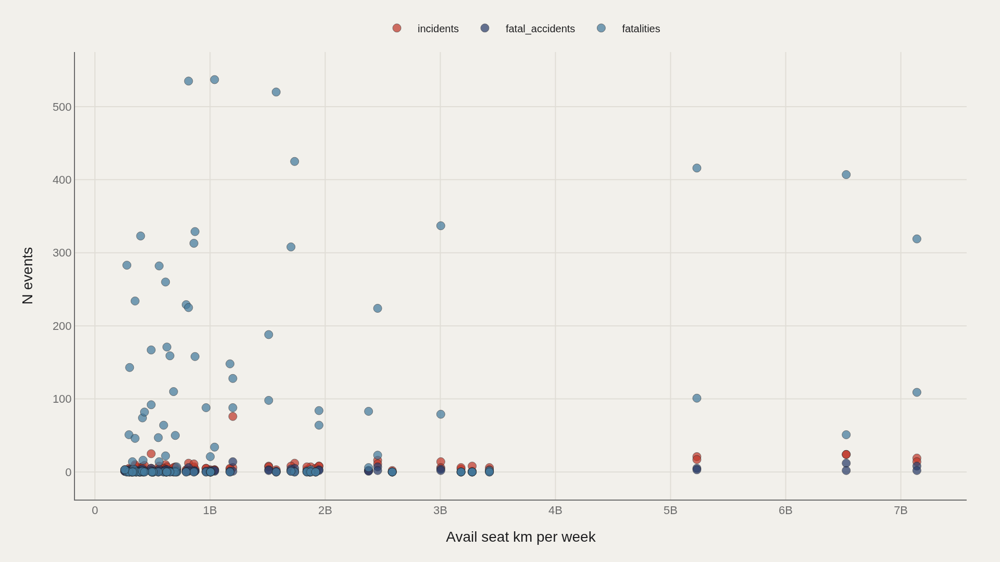

> **TL;DR** Raw incident counts rank airlines unfairly. The TidyTuesday airline-safety dataset includes 336 records normalized by available seat kilometers per week—a capacity metric that separates exposure from outcome. United/Continental leads at 7.1 billion seat-km weekly, but event counts don't move in lockstep with scale, showing that size and safety record are distinct questions.

Airline safety is usually discussed one crash at a time. The TidyTuesday airline-safety dataset does something different: it aligns carriers by available seat kilometers per week—a capacity metric—and then asks how incidents, fatal accidents, and fatalities sit against that scale. The working file contains 336 cleaned records after merging the week's tables.

Capacity is not the same as risk, but it is the right denominator for a fair first cut. A carrier flying 7.1 billion available seat kilometers per week operates in a different exposure class than one flying under 2 billion. The median in this extract is 802,908,893 available seat kilometers per week—a baseline for interpreting every ranking that follows.

The most common event type in the file is labeled incidents. That distinction matters: the archive mixes routine reportable events with rarer fatal outcomes, and conflating those categories would obscure the real story.

## Fast facts {#fast-facts}

The numbers that set the scale for this report:

- **336** — Records in the working dataset

  802,908,893Median available seat-km per week
  7,139,291,291Highest observed available seat-km per week
  United / Continental*Top airline by capacity
  incidentsMost common event type

## Data and method {#data-and-method}

The source is the TidyTuesday release dated August 7, 2018 from the R for Data Science community. After merging the week's CSV and XLSX tables, the working dataset contains 336 rows and five analysis columns used in these charts.

Medians are preferred wherever available seat kilometers skew toward megacarriers. Index-style fields are excluded. Charts ship as Plotly JSON with PNG fallbacks so values remain inspectable on hover.

## Capacity Concentrates Among Megacarriers {#capacity-concentrates-among-megacarriers}

### Available seat-km per week by airline

United/Continental* anchors the top at 7,139,291,291 available seat kilometers per week. Delta/Northwest* follows at approximately 6.53 billion, then American* at 5.23 billion. The next tier—Lufthansa*, Southwest, British Airways*, Air France—occupies the 3.0 to 3.4 billion range.

That gap is structural. The top three merged U.S. brands operate at a different scale than even large European flag carriers in this extract. When event counts are later compared across airlines, those capacity differences provide essential context.

## The Same Names Dominate the Leader Board {#the-same-names-dominate-the-leader-board}

### United/Continental* leads at 7,139,291,291—3,091,881,806 marks the median among the top dozen

The leaders chart restates the capacity hierarchy with precision: United/Continental* leads at 7,139,291,291, while the median among the top dozen sits near 3,091,881,806. Half of the top tier still operates at less than half the leader's scale.

Large airline is not a single category. It is a steep pyramid. Any analysis that ranks raw incident counts without accounting for this pyramid will systematically penalize the largest networks.

## Event Type Does Not Rewrite the Capacity Story {#event-type-does-not-rewrite-the-capacity-story}

### Available seat-km per week by event type

Box plots separate available seat kilometers by event type—incidents, fatal_accidents, and fatalities. Each group shows the same median of 802,908,893 and the same maximum of 7,139,291,291 across 112 observations per box.

That consistency is the finding. Event labels do not sort carriers into different capacity worlds; the same megacarrier scale appears whether the row is marked as an incident or a fatality record. The distribution reflects who operates the most seat-kilometers, not which label the row carries.

## Gaps to the Median Are Flat Across Labels {#gaps-to-the-median-are-flat-across-labels}

### Available seat-km per week vs median by event type

When available seat kilometers are compared to the sample median by event type, incidents, fatal_accidents, and fatalities all register essentially zero gap. This is a stability check, not a ranking.

The chart's purpose is to rule out a false narrative: that one event category concentrates among unusually large or unusually small carriers. In this extract, the labels do not shift capacity away from the median.

## Scale and Event Counts Do Not Move as One Line {#scale-and-event-counts-do-not-move-as-one-line}

### Available seat-km per week vs event count

Plotting available seat kilometers against event count reveals clusters that aggregate statistics erase. Some mid-size carriers report high incident counts; some of the largest networks register moderate totals relative to their seat-kilometer footprint.

The fatality panel is particularly uneven: the highest fatality totals are not always concentrated at the absolute capacity leaders. Exposure and outcome are related, but not linearly—which is why capacity and counts must be read together.

## What this file cannot tell you {#what-this-file-cannot-tell-you}

This is a community-cleaned TidyTuesday snapshot, not a live regulatory feed. Missing values, spelling variants on airline names (including starred merger labels), and the week-of-export coverage window all apply. Merged tables may duplicate or expand rows when join keys are imperfect.

Available seat kilometers measure exposure opportunity, not proven risk. The file cannot determine which carriers are safest in a causal sense; it can only show how capacity and event tallies align in this extract.

## What to take away {#what-to-take-away}

The clearest finding is structural: a handful of megacarriers dominate available seat kilometers, with United/Continental* at the apex and a median near 803 million seat kilometers per week for the wider field.

Event-type labels do not reorder that hierarchy. The meaningful question is not which airline has the most recorded events—it is how those events scale against the seat-kilometers actually flown.

## Sources {#sources}

Data Science Learning Community. (2018). TidyTuesday: Airline Safety. https://raw.githubusercontent.com/rfordatascience/tidytuesday/main/data/2018/2018-08-07/week19_airline_safety.csv

