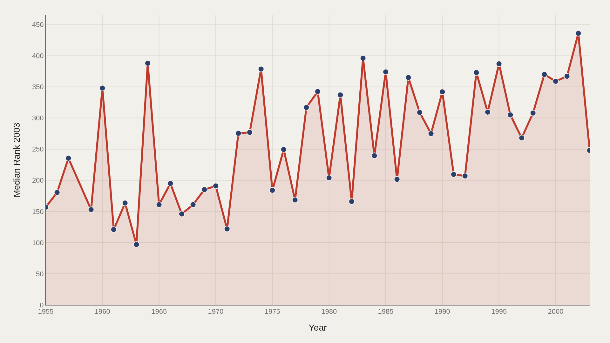
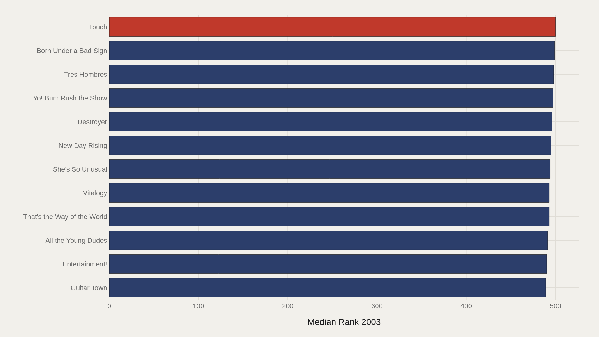
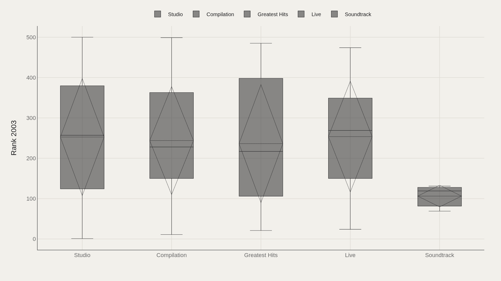
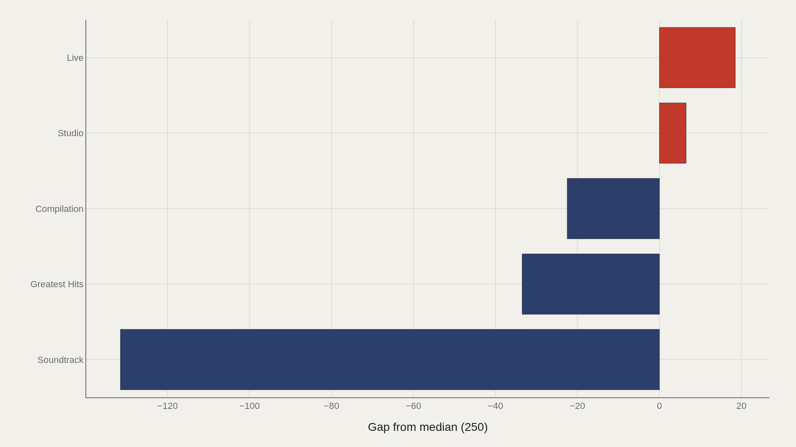
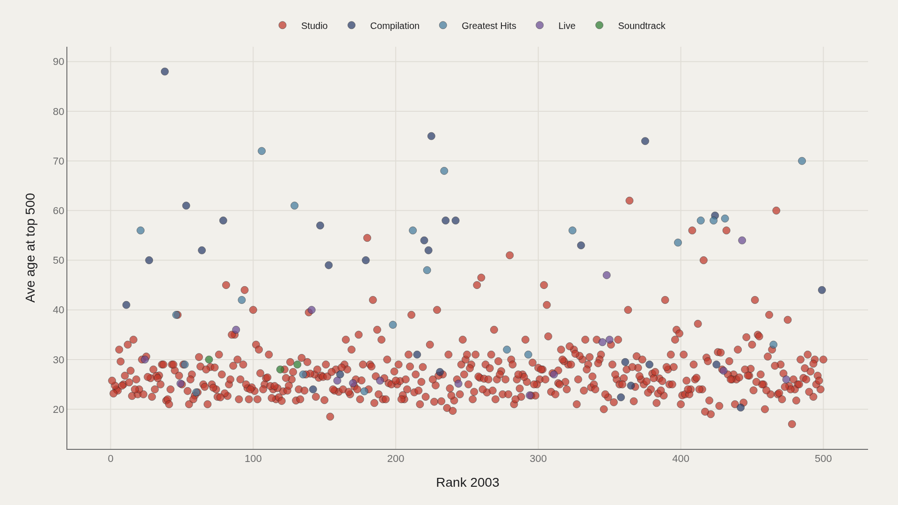

> **TL;DR** Rolling Stone's 2003 greatest-albums list contains 691 records with a median rank of 250. "Touch" leads the numeric rank field at 500, studio albums dominate the type distribution, and release years span 1955–2019. The list is an editorial artifact — a frozen moment of taste presented as permanent infrastructure.

Rolling Stone's 2003 greatest-albums list contains 691 records with a median rank of 250, and "Touch" sits at 500 — the numeric edge of a canon that spans 1955–2019 and privileges studio albums over all other formats.

The list is an editorial artifact. It freezes taste at a moment, then presents that freeze as permanent infrastructure. The working file shows how the freeze distributes: median rank at 250, highest observed rank at 500, studio albums as the default type, and a six-decade release span that carries albums from mid-century to the cusp of streaming.

Rank numbers run inverse to prestige — lower is better — but the charts below follow the file's stated leaders and medians without imposing a second scoring system.

## Data and method {#data-and-method}

The source is the TidyTuesday Rolling Stone albums release from the R for Data Science community. The working file contains 691 rows — album titles, artists, release years, types, genre labels, and 2003 rank fields.

Medians summarize a curated elite, not a random sample of recorded music. Charts export as Plotly JSON with PNG fallbacks. A magazine canon is an editorial object; treating it as market data misreads the politics of taste.

## How ranks sit across release years {#how-the-pattern-changed-over-time}

### Median Rank 2003 Over Time

Median 2003 rank across release years shows which eras the list favored when the ranking was locked. Mid-century and classic-rock decades sit differently from later indie and hip-hop entries — a fingerprint of the canon's compositional politics.

The rank field is anchored in 2003, so later release years in the file mark albums added after the original freeze or coverage quirks in the TidyTuesday extract.

## Who sits at the top of the numeric rank field {#who-sits-at-the-top}

### Touch leads at 500 — 494 marks the median among the top dozen

Touch leads at 500, with 494 as the median among the top dozen in this ordering. The upper numeric band clusters albums near the far end of the 2003 list's numbering.

Nearby titles — Guitar Town, Entertainment!, All the Young Dudes, Vitalogy, She's So Unusual — show how the list's lower prestige tier remains a hall of fame by ordinary standards. Being near 500 on a Rolling Stone 500 is not obscurity.

## Ranks by album type {#how-the-field-is-spread}

### Rank 2003 by Type

Box plots by type show whether rank consensus is shared or contested across release formats. Studio albums dominate because rock-critical canons historically privileged them over compilations, live records, and other forms.

Type concentration is an editorial fingerprint. A canon that underweights non-studio formats makes an aesthetic argument, not a neutral count of what exists.

## Who beats the median — and who trails {#who-beats-the-median-and-who-trails}

### Rank 2003 vs median by Type

The gap chart ranks types above or below the median 2003 rank. Differences encode which formats the list treated as central versus peripheral when the ranking was composed.

The entire file is already an elite list, so trailing the median still means membership in a magazine's chosen 500 — a narrow world compared with all recorded music.

## Rank and artist age {#what-moves-together}

### Rank 2003 vs Ave age at top 500

Plotting 2003 rank against average age at the top-500 marker shows clusters that averages erase. Some high-prestige albums come from young breakthrough artists; others from later-career peaks. The scatter refuses a single myth about youth and canonization.

Age is not destiny on a critical list, but it is a recurring covariate in rock historiography. The cloud shows variation that simplistic narratives hide.

## What this file cannot tell you {#what-this-file-cannot-tell-you}

Community-cleaned TidyTuesday snapshots are not live APIs. Missing values, spelling variants, and list-version mismatches apply. A 2003 rank is not a 2020s streaming share, and Rolling Stone's taste is not the world's taste.

Findings describe structural signals about one magazine canon's metadata — not a universal ranking of recorded music, and not a substitute for listening.

## What to take away {#what-to-take-away}

Rolling Stone's 2003 album canon contains 691 rows with a median rank of 250, studio albums as the dominant type, and a numeric range that runs to 500. The file encodes genre and generation politics: canons freeze taste at a moment, then teach that freeze as permanent.

The charts make the freeze measurable — the rest is interpretation.

## Sources {#sources}

