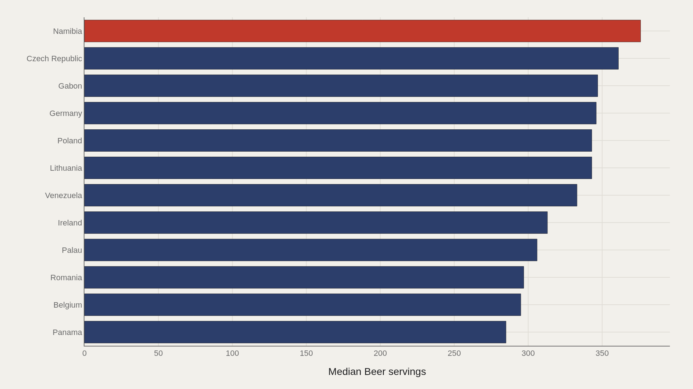
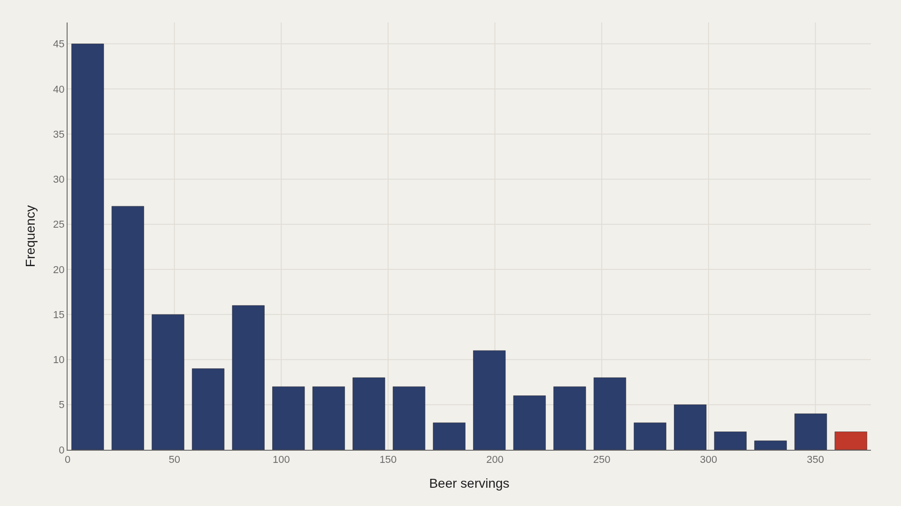
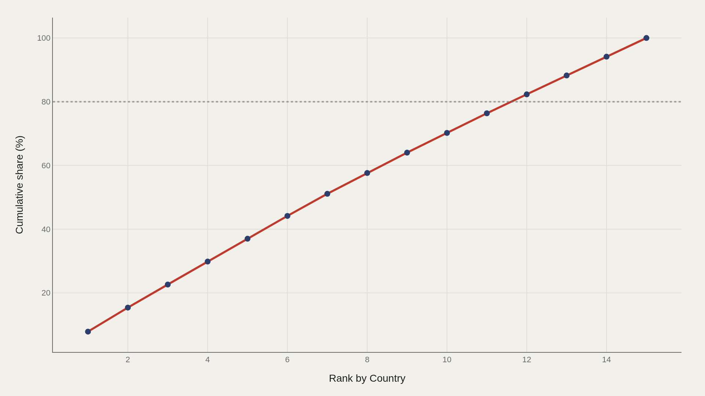
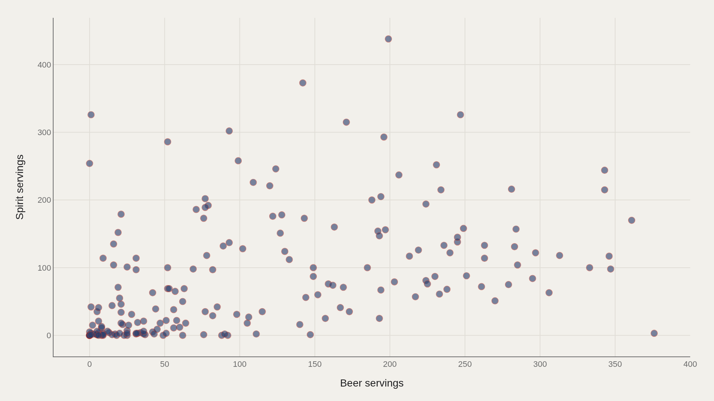

> **TL;DR** Global alcohol data is often collapsed into a single “drinks per person” headline. The TidyTuesday global alcohol extract keeps the beverage split intact — beer, spirits, and wine servings — across 193 country-level records. Beer is the metric that leads these charts, with a median of 76.0 servings and a recorded high of 376 in Namibia. That spread is the story.

Global alcohol data is often collapsed into a single “drinks per person” headline. The TidyTuesday global alcohol extract keeps the beverage split intact — beer, spirits, and wine servings — across 193 country-level records. Beer is the metric that leads these charts, with a median of 76.0 servings and a recorded high of 376 in Namibia.

That spread is the story. A median of 76 and a maximum of 376 means the top of the beer distribution is not a gentle tail; it is a different consumption regime. Country rankings on beer alone will not match rankings on spirits, and the scatter at the end makes that explicit.

## Research question {#research-question}

When alcohol data is separated by beverage, does a country’s apparent drinking profile still look like one national habit, or does it split into distinct beer, spirits, and wine cultures? This report uses the 2018 TidyTuesday global alcohol extract to ask where beer volume concentrates and whether the beer leaderboard can stand in for total alcohol behavior.

The observational question is deliberately narrow: which countries sit in the high-beer tail, how far above the median they are, and whether beer intensity travels with spirits intensity. That focus keeps the charts from becoming a generic public-health ranking and instead treats beverage mix as a measurable cultural and market structure.

## Fast facts {#fast-facts}

The numbers that set the scale for this report:

- **193** — Records in the working dataset

  76.0Median Beer servings
  376Highest observed Beer servings
  NamibiaTop Country by Beer servings

## Data and method {#data-and-method}

The source is the TidyTuesday release from 2018-06-26 (week13_alcohol_global.csv), maintained by the R for Data Science community. The working file used here contains 193 rows after cleaning.

Beer servings are the primary ranked metric in the chart stack. Medians are used where distributions skew. Charts are Plotly JSON with PNG fallbacks.

## Beer Consumption Has a Steep Country Ladder {#beer-consumption-has-a-steep-country-ladder}

### Beer servings by Country

Namibia leads the beer ranking at 376 servings, followed by the Czech Republic at 361, Gabon at 347, and Germany at 346. Lithuania and Poland tie near 343. Ireland sits lower in the top dozen at 313.

These are not clustered scores around the global median of 76. The leaders occupy roughly four to five times the typical country’s beer volume in this file — a reminder that beer culture is geographically concentrated, not evenly shared.

The country names matter because they point to different beverage systems. Namibia and Gabon place African markets in the same high-beer conversation as the Czech Republic, Germany, Lithuania, Poland, and Ireland — countries often associated with long-standing brewing industries, beer taxation regimes, and pub or lager cultures. A single “Europe drinks beer” shortcut would miss the African leaders; a single “income predicts beer” shortcut would miss the spread across very different economies.

The 2018 TidyTuesday file descends from World Health Organization alcohol indicators that summarize recorded servings rather than clinical outcomes. That distinction is important: a serving count can identify beverage concentration, but it does not measure binge patterns, liver disease, drunk-driving deaths, or unrecorded home output. The chart is strongest as a map of recorded beverage preference.

## The Top Dozen Has Its Own Median {#the-top-dozen-has-its-own-median}

### Namibia leads at 376 — 338 marks the median among the top dozen

Among the top twelve beer countries, Namibia’s 376 still leads, while the median of that elite group is 338. Even inside the high-beer club, the distribution has a ceiling that most of the world never approaches.

Reading only the global median would hide that club entirely. Reading only Namibia would hide how many Central European and other high-beer countries sit just behind it.

The top-dozen median of 338 is almost as revealing as the maximum. It says the leaders are not one outlier and eleven ordinary countries; they are a compact high-consumption band. Czech, German, Lithuanian, Polish, and Irish entries sit in a historically industrial beer belt, while Namibia and Gabon remind us that contemporary beer markets also reflect colonial trade routes, urban retail systems, and modern commercial breweries.

For public-health interpretation, this is where volume and harm begin to diverge. WHO and OECD alcohol reports usually emphasize liters of pure alcohol, age-standardized mortality, and sex-specific patterns because beverage-specific servings alone cannot compare the ethanol load of beer, wine, and spirits. This Artometrics cut keeps the serving metric because it asks a cultural-economy question first: where is beer, as a category, unusually dominant?

## Most Countries Cluster Far Below the Peaks {#most-countries-cluster-far-below-the-peaks}

### Beer servings Distribution

The distribution chart piles most countries into lower beer-serving bins. Counts peak in the low double-digit and mid-range bins, while the extreme high bins that hold Namibia and the Czech Republic contain only a handful of countries.

That shape is why the median (76.0) is the right headline number: it describes the typical country, not the viral maximum.

The skew also changes how readers should interpret “per capita” comparisons. A country can sit below the median because beer is less available, because spirits or wine dominate the market, because alcohol consumption is lower overall, or because religious and legal rules suppress recorded sales. Those mechanisms are not interchangeable, even if they all land in the same low-beer bins.

The lower half of the distribution should therefore be read as a mixture of abstention, substitution, market structure, and reporting practice. In many Muslim-majority countries, for example, recorded beer servings will reflect legal and religious constraints as much as consumer taste. In wine-producing countries, the same low beer value may simply mean the alcohol profile has moved to another column.

## Concentration Rises Quickly Among the Leaders {#concentration-rises-quickly-among-the-leaders}

### Cumulative Beer servings

The Pareto curve shows how cumulative beer servings accumulate as countries are added from the top. The first five entries already account for about 37% of the aggregate among the plotted leaders; by fifteen entries the curve reaches 100% of that restricted total.

Beer volume at the top is not democratic. A short list of countries carries a disproportionate share of the servings represented in this ranking view.

A Pareto view is useful because alcohol markets often look concentrated at multiple scales: a few beverage categories, a few dominant firms, and a few countries with unusually high recorded intake. The first five countries in this leader-only curve are not a global share of all alcohol; they are the head of the beer ranking. That narrower denominator is exactly why the curve is steep.

Concentration also affects policy comparison. If a small set of countries drives the visual range, then a dashboard built around maxima will exaggerate the distance between most countries. Median-centered views and beverage-specific scatterplots are better for separating ordinary national profiles from the high-consumption head.

## Beer and Spirits Are Not the Same Map {#beer-and-spirits-are-not-the-same-map}

### Beer servings vs Spirit servings

Plotting beer servings against spirit servings across all 193 countries breaks the assumption that “heavy drinking” is one behavior. Some countries post high beer with moderate spirits; others invert the pattern.

The joint distribution is the corrective lens: beverage preference is cultural and economic, not a single alcohol intensity score. Namibia’s beer lead does not automatically imply a spirits lead.

The scatter is the most important methodological guardrail in the report. Eastern European and post-Soviet alcohol research, for example, often emphasizes spirits because high-proof beverages can dominate harm profiles even when beer is not the leading column. Mediterranean comparisons often separate wine from both. A beer-only table cannot adjudicate those patterns.

That is why the article does not collapse the file into a total-servings index. Total alcohol may be the right measure for burden-of-disease work; beverage separation is the right measure for understanding culture, taxation, retail systems, and substitution. The same country can be a beer outlier, a spirits moderate, and a wine footnote.

## What this file cannot tell you {#what-this-file-cannot-tell-you}

Country-level serving estimates inherit survey, sales, and tourism distortions. Unrecorded alcohol, home output, and cross-border purchases can bias official figures. The 2018 TidyTuesday snapshot is not a live WHO dashboard.

Rankings on beer servings alone should not be quoted as total alcohol harm rankings. Spirits and wine columns exist precisely because the beverage mix differs.

## What to take away {#what-to-take-away}

Beer consumption in this extract is a steep hierarchy: Namibia at 376 servings against a world median of 76. The top dozen forms its own high plateau around a median of 338.

The lasting insight is comparative: beer leaders and spirits leaders are not the same set of countries, and any serious alcohol map has to keep those axes separate.

## Sources {#sources}

Data Science Learning Community. (2018). TidyTuesday: Alcohol Consumption. https://raw.githubusercontent.com/rfordatascience/tidytuesday/main/data/2018/2018-06-26/week13_alcohol_global.csv

World Health Organization. (2018). Global status report on alcohol and health 2018. https://www.who.int/publications/i/item/9789241565639

World Health Organization. (2024). Global status report on alcohol and health and treatment of substance use disorders. https://www.who.int/publications/i/item/9789240096745

OECD. (2021). Preventing Harmful Alcohol Use. https://doi.org/10.1787/6e4b4ffb-en

Rehm, J., et al. (2009). Global burden of disease and injury and economic cost attributable to alcohol use and alcohol-use disorders. The Lancet, 373(9682), 2223–2233. https://doi.org/10.1016/S0140-6736(09)60746-7

