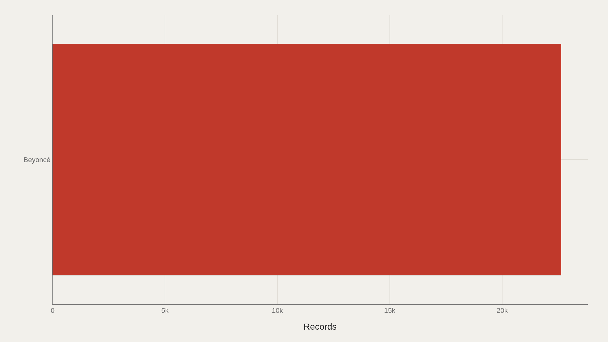
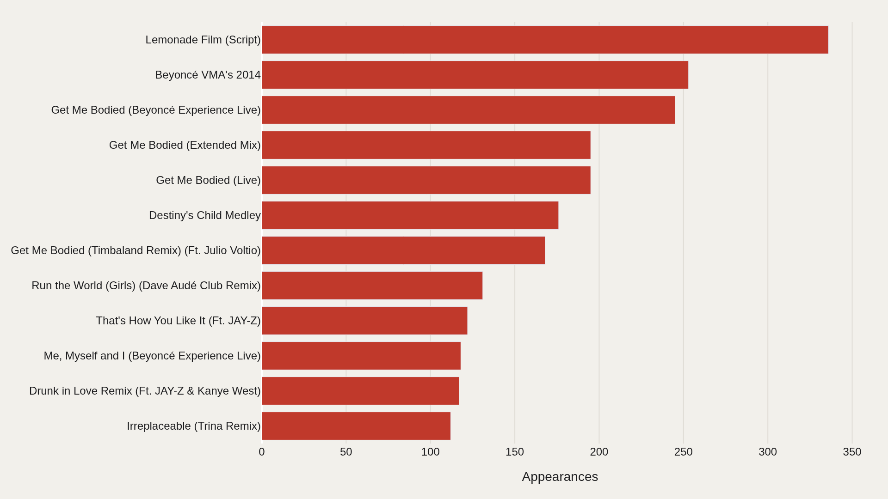
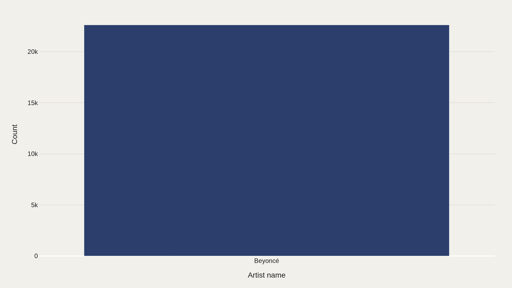
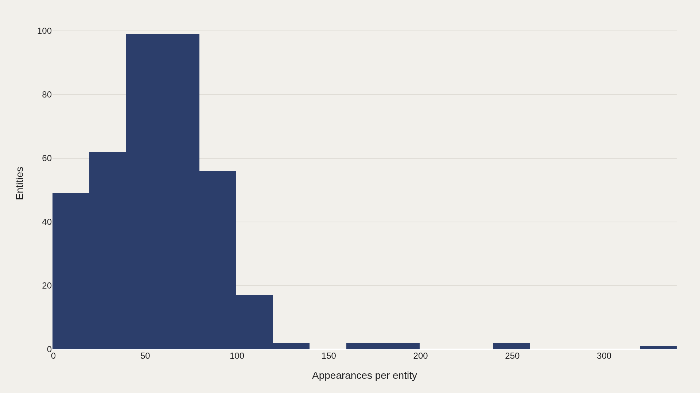
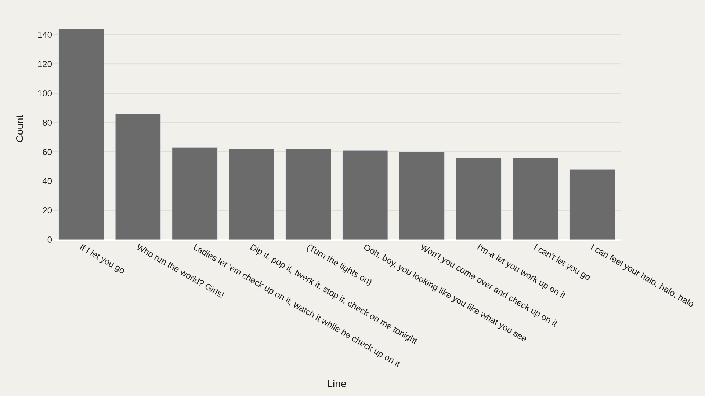

> **TL;DR** Two catalogs define a generation of pop authorship. Line-level lyric tables make it possible to compare them the way a critic compares albums — by recurring titles, repeated lines, and how densely each artist’s words fill the extract. The working file holds 22,616 records.

Two catalogs define a generation of pop authorship. Line-level lyric tables make it possible to compare them the way a critic compares albums — by recurring titles, repeated lines, and how densely each artist’s words fill the extract.

The working file holds 22,616 records. Beyoncé is the most common artist name in the rows on hand — a reminder to read every chart as a view of this extract’s balance, not as a claim that one career is larger than the other in absolute terms.

## Fast facts {#fast-facts}

The numbers that set the scale for this report:

- **22,616** — Records in the working dataset

  BeyoncéMost common Artist name

## Data and method {#data-and-method}

The source is the TidyTuesday release from 2020-09-29 (R for Data Science community). The working file contains 22,616 rows and 6 columns after merging available tables in the week folder.

Rows are lyric lines and related identifiers — song names, artist labels, and text fields — not audio features. Charts export as Plotly JSON with PNG fallbacks. Frequency and mix plots matter because the primary table has no single numeric “quality” score.

## Landscape {#landscape}

### Beyoncé dominates with 22,616 records

Beyoncé dominates with 22,616 records in the category view of this extract. The main bucket carries the story; the field does not show a meaningful long-tail split of artist labels once the file is filtered as published.

Treat that dominance as a coverage fact about the working table — which lines were included — before treating it as a comparative verdict on two careers.

## Who sits at the top {#who-sits-at-the-top}

### Top Song name

Lemonade Film (Script) appears 336 times — the most recurring song-name entity in the file. The top dozen account for a visible share of all 22,616 rows.

Long scripts and multi-part projects generate more line rows than a three-minute single. Recurrence at the top is often a document-length effect as much as a “favorite song” effect.

## Category {#category}

### Beyoncé is the largest bucket with 22,616 records

Beyoncé is the largest bucket with 22,616 records. Category concentration shows where editorial attention should focus first when reading the extract.

If the file is Beyoncé-heavy by construction, every later frequency claim inherits that imbalance. Fair comparison starts by stating the row share out loud.

## Frequency {#frequency}

### Most song name entities appear only once; a small head revisits repeatedly

Most song-name entities appear only once; a small head revisits repeatedly.

That power-law shape is typical of lyric catalogs, guest lists, and credit tables: a long tail of unique titles, a short head of projects that keep generating lines.

## Mix {#mix}

### If I let you go is the most repeated line in the extract

“If I let you go” is the most repeated line in the extract — a refrain-level recurrence that secondary dimensions surface when the primary table has no numeric score column.

Repeated lines are the lyric equivalent of a hook chart: they show what the text keeps returning to, not which song sold the most.

## What this file cannot tell you {#what-this-file-cannot-tell-you}

Community-cleaned TidyTuesday snapshots are not live APIs. Missing values, spelling variants, and week-of-export coverage limits apply. Merged tables may fan out or duplicate rows when join keys are imperfect.

Findings describe the file on hand — structural signals about lyric rows for Beyoncé and Taylor Swift in this extract, not a complete linguistic theory of either catalog.

## What to take away {#what-to-take-away}

Line-by-line tables make authorship countable: 22,616 rows, a Beyoncé-heavy artist share in this extract, Lemonade Film (Script) at 336 appearances, and “If I let you go” as the most repeated line. Frequency and mix answer different questions than sales or streams.

Use the charts to see coverage and recurrence — then check how the extract was built before treating any refrain as a career-wide signature.

## Sources {#sources}

Data Science Learning Community. (2020). TidyTuesday: Beyoncé & Taylor Swift Lyrics. https://raw.githubusercontent.com/rfordatascience/tidytuesday/main/data/2020/2020-09-29/beyonce_lyrics.csv

