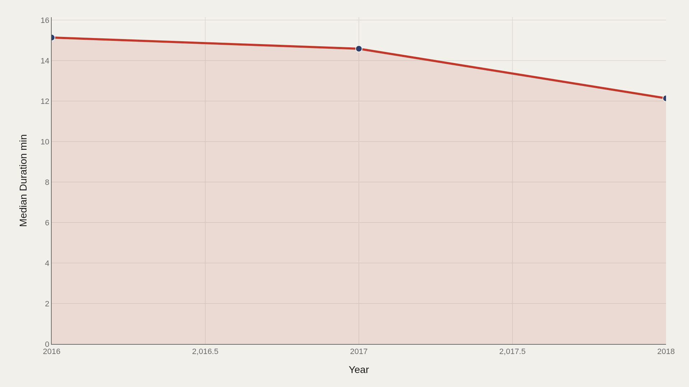
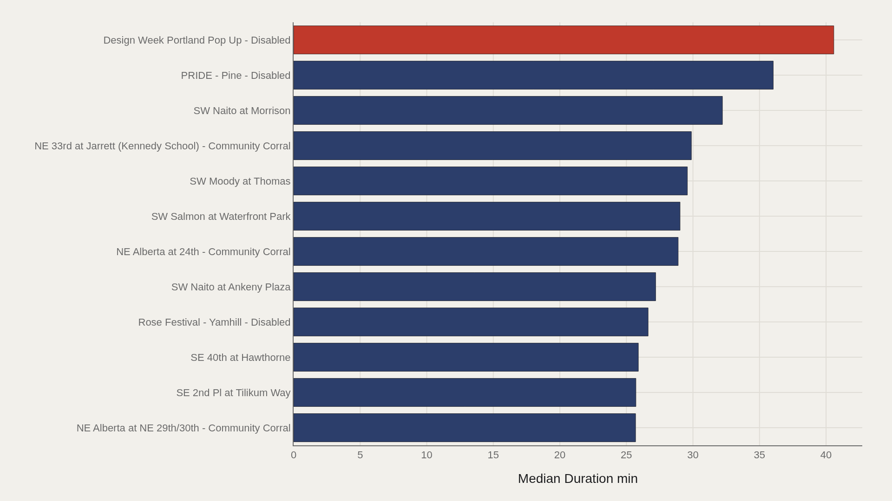
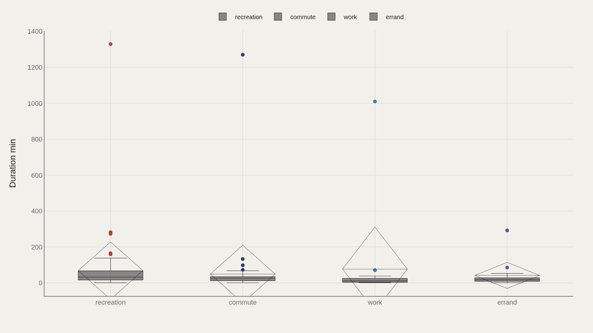
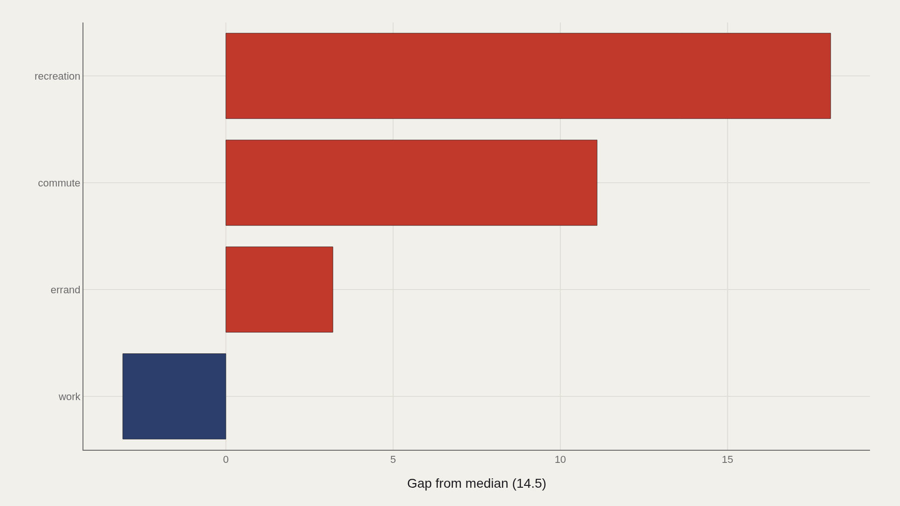
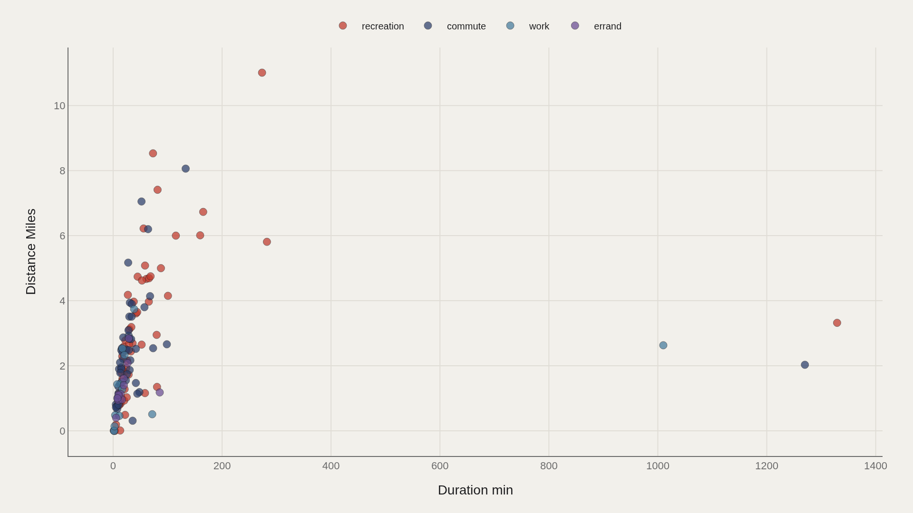

> **TL;DR** Portland’s Biketown system turns everyday movement into timestamped trips. The TidyTuesday extract used here holds 100,000 ride records spanning 2016–2018 , with a median duration of 14.5 minutes and a recorded high of 1,392 minutes — multi-hour outliers that sit far from the commute core. Recreation is the most common trip type in the file.

Portland’s Biketown system turns everyday movement into timestamped trips. The TidyTuesday extract used here holds 100,000 ride records spanning 2016–2018, with a median duration of 14.5 minutes and a recorded high of 1,392 minutes — multi-hour outliers that sit far from the commute core.

Recreation is the most common trip type in the file. That single label already hints at the system’s dual life: tourist and leisure loops on one side, workday hops on the other. Duration is the metric that organizes the charts.

## Data and method {#data-and-method}

The source is the TidyTuesday release from 2018-06-05 (week10_biketown.zip). After cleaning, the working sample used for these charts contains 100,000 rows.

Hub names, trip types, duration, and distance fields drive the visual stack. Medians are used because duration has a long right tail. Charts are Plotly JSON with PNG fallbacks.

## Median Trip Length Fell Across Three Seasons {#median-trip-length-fell-across-three-seasons}

### Median Duration min Over Time

Median duration slips from about 15.1 minutes in 2016 to 14.6 in 2017 and 12.1 in 2018. The system’s typical ride got shorter even as the archive grew.

That decline can reflect denser hub coverage, more habitual short hops, or a changing mix of recreation versus commute. The trend line alone cannot pick the cause — but it establishes that “a Biketown ride” was not a fixed product over these years.

## Pop-Up and Waterfront Hubs Stretch Ride Time {#pop-up-and-waterfront-hubs-stretch-ride-time}

### Design Week Portland Pop Up - Disabled leads at 40.6 — 29.0 marks the median among the top dozen

Design Week Portland Pop Up - Disabled leads median duration at about 40.6 minutes. PRIDE - Pine - Disabled follows near 36.0, with waterfront and event-adjacent hubs such as SW Naito at Morrison also running long.

The median among the top dozen hubs is about 29.0 minutes — double the system-wide median of 14.5. Event and scenic starts systematically produce longer rides than the everyday grid.

## Recreation Lasts Longer Than Work Trips {#recreation-lasts-longer-than-work-trips}

### Duration min by TripType

By trip type, recreation shows a median duration near 32.6 minutes (n=73 in the boxed sample), versus about 25.6 for commute, 17.7 for errand, and 11.4 for work.

The boxes also expose extreme outliers above 1,000 minutes in recreation, commute, and work — dock failures, forgotten returns, or data quirks. The medians remain the honest center of each category.

## Recreation Sits Furthest Above the System Median {#recreation-sits-furthest-above-the-system-median}

### Duration min vs median by TripType

Relative to the overall duration median, recreation leads the gap chart at roughly +18 minutes, with commute about +11 and errand slightly positive. Work sits below the median by about 3 minutes.

That ordering matches the city’s split personality on two wheels: leisure explores; work punches a short path.

## Longer Minutes Do Not Always Mean More Miles {#longer-minutes-do-not-always-mean-more-miles}

### Duration min vs Distance Miles

Duration versus distance, colored by trip type, shows recreation spanning both long loopy rides and short spins. Commute points tighten toward moderate distances; work and errand clouds are smaller and closer to the origin.

A 40-minute recreation ride may cover only a few miles along the waterfront. Minutes measure time in possession of the bike; miles measure geography. Biketown’s archive needs both.

## What this file cannot tell you {#what-this-file-cannot-tell-you}

Hub renaming, disabled pop-up stations, and GPS noise all affect duration and distance fields. Extremely long trips may be failures to dock rather than heroic tours.

The 2016–2018 window predates later network expansions. Findings describe this extract’s behavior, not the live 2020s system map.

## What to take away {#what-to-take-away}

Biketown’s typical ride is short — a 14.5-minute median — and got shorter from 2016 to 2018. Recreation and event hubs pull the upper tail; work trips pull toward brevity.

The system is not one behavior. It is a leisure network and a commuting tool sharing the same docks, and duration is where that split becomes measurable.

## Sources {#sources}

Data Science Learning Community. (2018). TidyTuesday: Biketown Bikeshare. https://raw.githubusercontent.com/rfordatascience/tidytuesday/main/data/2018/2018-06-05/week10_biketown.zip

