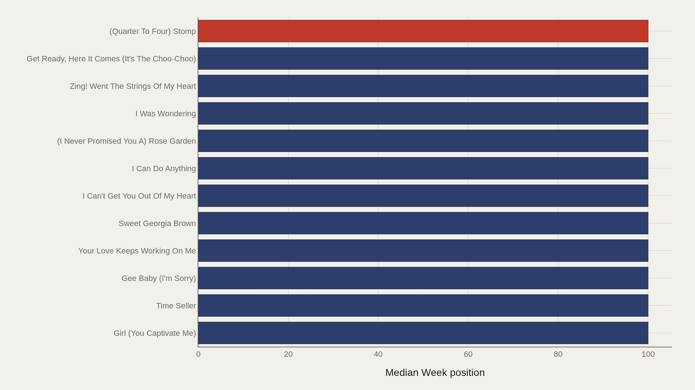
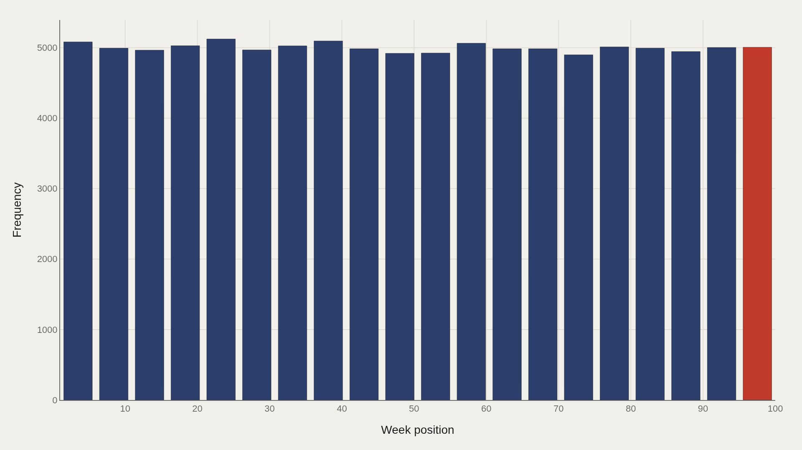
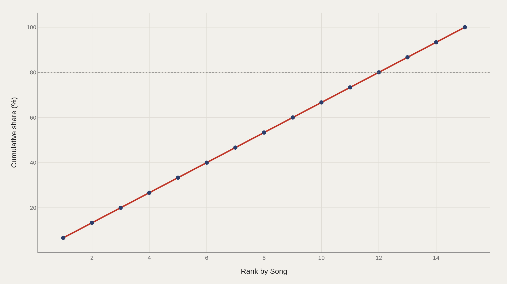
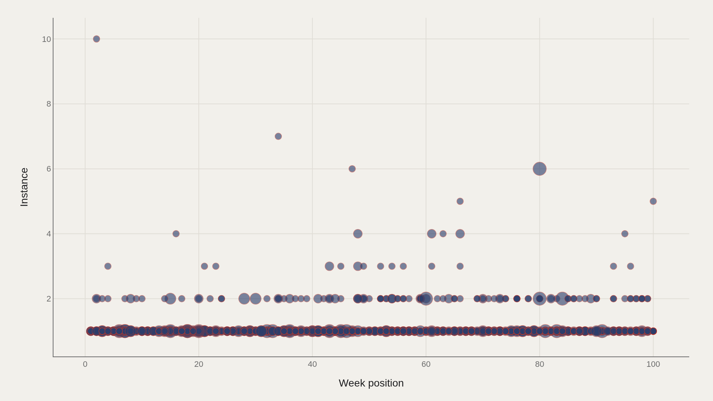

> **TL;DR** The Billboard Hot 100 is a weekly ranking machine: 100 positions, endlessly refreshed. The TidyTuesday billboard extract used here holds 100,000 song-week rows, with a median week position of 50.0 — exactly mid-chart — and a highest observed week position of 100 (the bottom rung).

The Billboard Hot 100 is a weekly ranking machine: 100 positions, endlessly refreshed. The TidyTuesday billboard extract used here holds 100,000 song-week rows, with a median week position of 50.0 — exactly mid-chart — and a highest observed week position of 100 (the bottom rung).

That median of 50 is almost tautological in a full 1–100 ranking, which is why the interesting questions shift to concentration, re-entries (instance), and which titles spend time at the chart’s edges. “Down By The River” appears among the fact-box leaders for week position in this working file.

## Fast facts {#fast-facts}

The numbers that set the scale for this report:

- **100,000** — Records in the working dataset

  50.0Median Week position
  100Highest observed Week position
  Down By The RiverTop Song by Week position

## Data and method {#data-and-method}

The source is the TidyTuesday release from 2021-09-14 (billboard.csv). After cleaning, the analysis sample contains 100,000 records.

Week position is the primary metric; lower numbers are better ranks in Billboard’s native scale, but several charts here rank the numeric position field directly as stored. Charts are Plotly JSON with PNG fallbacks.

## Song-Level Position Averages Crowd the Bottom Rung {#song-level-position-averages-crowd-the-bottom-rung}

### Week position by Song

When songs are ranked by week-position summaries, a block of titles ties at 100 — including Girl (You Captivate Me), Time Seller, Gee Baby (I’m Sorry), and others. Those are songs whose observed positions in this aggregation sit at the chart floor.

The chart is less a hall of fame than a map of how many titles live at the margins of the Hot 100’s attention economy.

## Leaders by Week Position Are a Flat Elite {#leaders-by-week-position-are-a-flat-elite}

### (Quarter To Four) Stomp leads at 100 — 100 marks the median among the top dozen

(Quarter To Four) Stomp and peer titles in the leaders view hit 100, and the median among the top dozen is also 100. There is no graded ladder here — the “leaders” by this numeric field are a plateau at the bottom rank.

That flatness is informative: many songs brush the Hot 100 without climbing. Presence is not the same as dominance.

## Weekly Positions Fill the Chart Almost Uniformly {#weekly-positions-fill-the-chart-almost-uniformly}

### Week position Distribution

The distribution of week positions across the 100,000-row sample is remarkably even: bin counts hover near 5,000 observations across the 1–100 range. A full Hot 100 every week produces that rectangular shape by design.

Uniform position counts are the baseline. Deviations in other charts — concentration among songs, re-entry instances — are where the cultural story lives.

## Concentration Among Songs Is Mechanical at First {#concentration-among-songs-is-mechanical-at-first}

### Cumulative Week position

The Pareto curve over leading song entries rises in near-equal steps in this view, reaching 100% by the fifteenth plotted entry. Within the restricted leader set, share accumulates steadily rather than in a single spike.

Full-catalog fame concentration is a different question; this curve describes the ranked subset on display, not every Hot 100 occupant since the 1950s.

## Re-Entries Stretch a Song’s Life Without Guaranteeing Rank {#re-entries-stretch-a-song-s-life-without-guaranteeing-rank}

### Week position vs Instance

Week position versus instance (re-entry or appearance count) shows titles returning to the chart at many ranks. High instance values appear across both strong and weak positions.

Longevity on Billboard is not only about peaking at No. 1. It is also about how many times a song is allowed to reappear — a second career path the scatter makes visible.

## What this file cannot tell you {#what-this-file-cannot-tell-you}

Billboard’s chart methodology has changed over decades (sales, airplay, streaming). A pooled file mixes eras with different rules. Song-title collisions and punctuation variants can split or merge identities.

Numeric “leaders” by week position in this stack highlight the bottom of the chart, not the cultural canon. Read rank direction carefully before citing.

## What to take away {#what-to-take-away}

A 100,000-row Hot 100 extract is mostly a uniform grid of weekly ranks — median 50, full coverage from 1 to 100. The drama is in which songs repeatedly occupy that grid and which only touch position 100.

Cite the uniform distribution when explaining the chart’s structure; cite instance versus position when explaining how hits persist.

## Sources {#sources}

Data Science Learning Community. (2021). TidyTuesday: Billboard Top 100. https://raw.githubusercontent.com/rfordatascience/tidytuesday/main/data/2021/2021-09-14/billboard.csv

