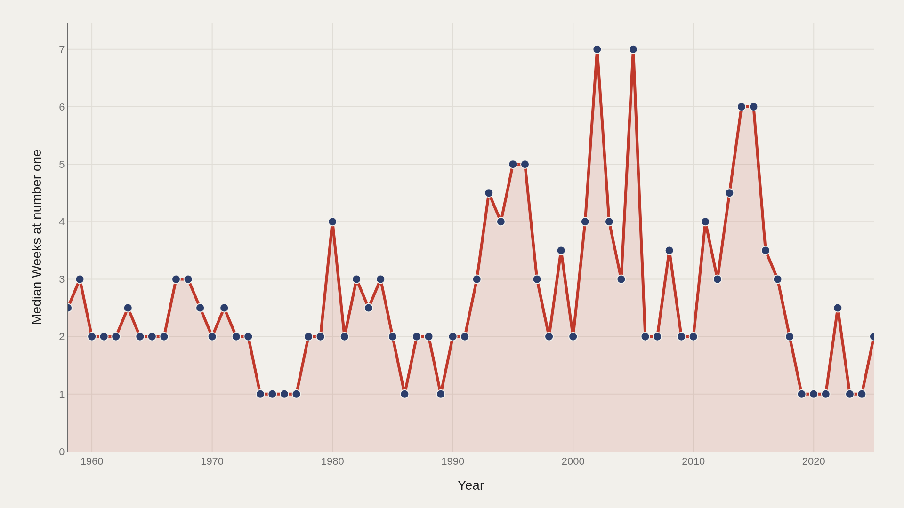
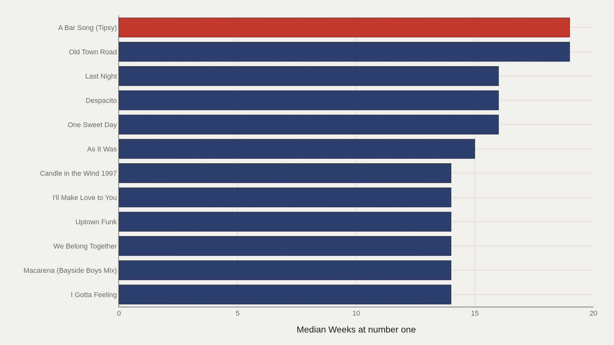
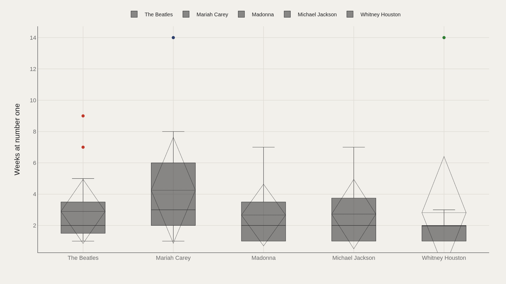
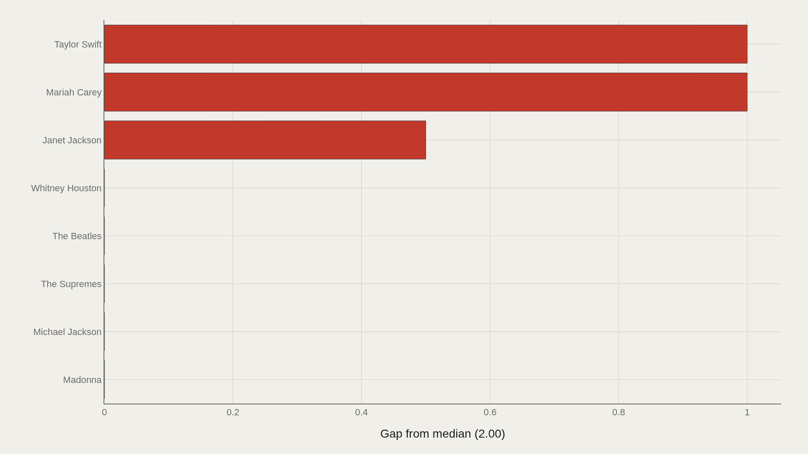
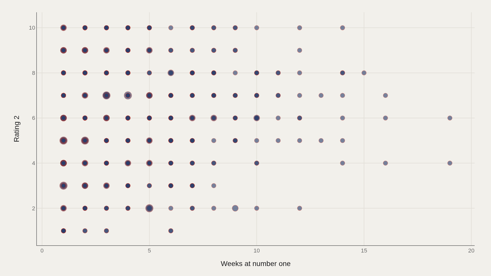

> **TL;DR** The Billboard Hot 100 has published a number-one song every week since August 1958. In that time it has absorbed the British Invasion, the disco era, the rise of hip-hop, the collapse of the album format, and the complete restructuring of the music industry by streaming platforms.

The Billboard Hot 100 has published a number-one song every week since August 1958. In that time it has absorbed the British Invasion, the disco era, the rise of hip-hop, the collapse of the album format, and the complete restructuring of the music industry by streaming platforms. Through all of it, the same basic question persists: how long can a song stay at the top?

The file covers 1,177 distinct number-one entries — the full record of Hot 100 dominance through early 2025. The median run lasts just 2 weeks. The record holder, as of this dataset, is 19 weeks. Between those two facts sits the entire history of popular music.

Start with the scale: 1,177 number-one songs (1958–2025); 2 wks median run length; The Beatles with the most appearances; Taylor Swift with the highest average run length among modern artists.

## Data and method {#data-and-method}

The Hot 100 blends sales, radio airplay, and streaming data into a single weekly ranking. This matters for the reading: the rules of what counts have changed substantially over the decades. Before 1991, physical sales data came from store-reported estimates, not actual scan data — which made the chart easier to game. The introduction of SoundScan in 1991 made the chart dramatically more accurate but also temporarily destabilized it as real sales data replaced guesswork. Streaming was added in 2012, and its weight has grown continuously since.

The consequence: a long run in 1965 means something different from a long run in 2025. Streaming amplifies hits — the same song can accumulate streams 24 hours a day, seven days a week, without the bottleneck of radio scheduling. This structural change is visible in the data.

## Run Length Over the Decades {#run-length-over-the-decades}

### Median weeks at number one per year — 1958 to 2025

The trend line tells a story in two halves. From 1958 through the 1990s, median run length drifts between 2 and 3 weeks — an era when radio play and physical sales set natural limits on how long one song could dominate. Post-2012, the median begins a slow climb as streaming rewrites the economics: a song that goes viral accumulates plays continuously, making it structurally harder for anything else to unseat it.

The highest single-year medians in the dataset cluster in the 2015–2025 range. This is the streaming era in action: longer runs, fewer number-ones per year, and a winner-take-most dynamic that concentrates attention on a shrinking pool of mega-hits.

## Longest Runs Ever {#longest-runs-ever}

### Top 12 songs by total weeks at number one

"A Bar Song (Tipsy)" by Shaboozey leads the all-time list at 19 weeks — a record achieved in the full streaming era where a country-rap crossover could accumulate plays from audiences that would never overlap in the pre-streaming world. The median among the top dozen is 14.5 weeks, suggesting that record-length runs cluster in a narrow range rather than showing one extreme outlier followed by a rapid drop.

The most striking feature of this chart is what is absent: no Beatles song, no Motown classic, no 1970s or 1980s blockbuster. Every song on this list is from 1992 or later, with the majority from 2010 onward. The longest runs in Hot 100 history are a product of the modern era — of digital music, streaming infrastructure, and the global distribution of taste.

## How Artists Compare {#how-artists-compare}

### Distribution of run lengths for the most frequently appearing artists

Box plots for the most frequent number-one artists reveal two distinct patterns. Artists like The Beatles have many short-run entries — they reached #1 often, but rarely held it for long, because the pre-SoundScan era cycled songs faster. Modern artists like Mariah Carey or Drake show wider distributions — some short runs, a handful of extended ones — reflecting both more volatile streaming behavior and longer careers in the streaming era.

Wide whiskers are the signal here: they identify artists whose success is inconsistent rather than structural. A narrow box with a high median is the mark of a reliable hitmaker. A wide box means the artist occasionally breaks through in a massive way but usually does not.

## Above Or Below the Line {#above-or-below-the-line}

### Artist average run length vs the global median of 2 weeks

Taylor Swift sits above the median — her number-one runs average longer than the historical norm, reflecting both her sustained streaming dominance and an unusually loyal fanbase that streams at high volume across long windows. The diverging bar chart makes the gap visible across artists: those to the right outperform the median; those at the line are average performers despite reaching #1.

Reaching number one is necessary but not sufficient for dominance. This chart separates artists who briefly claim the top from those who hold it — and that distinction maps cleanly onto streaming-era versus pre-streaming careers.

## Scatter: Weeks vs Reach {#scatter-weeks-vs-reach}

### Weeks at number one vs secondary chart reach — scatter of all songs

The scatter of all songs against a secondary reach metric shows the expected cluster near the origin — most songs arrive briefly and reach a moderate audience — and a sparse upper-right region of true blockbusters: long runs, broad reach, and the kind of cultural saturation that transcends a single chart.

The outliers in the upper right are not outliers in the statistical sense — they are archetypes. They represent what the entire industry is optimized to produce, and what it very rarely achieves. Studying them is studying the ceiling, not the average.

## What this file cannot tell you {#what-this-file-cannot-tell-you}

The Hot 100 methodology has changed several times since 1958, making strict historical comparisons difficult. Pre-1991 data relies on self-reported retail sales rather than verified scan data. Streaming weights have increased continuously since 2012. These changes mean that a 10-week run in 1970 and a 10-week run in 2020 represent very different things about commercial culture.

The TidyTuesday dataset captures only number-one entries — not the full chart. An artist who dominated the Top 10 for a year without reaching #1 is invisible in this data. Artist name standardization is also imperfect: collaborations and featuring credits may split what is functionally one artist's run across multiple rows.

## What to take away {#what-to-take-away}

The Hot 100 is not simply a popularity measure. It is a structural reading of how the music industry concentrates and distributes attention — and that structure has changed fundamentally in the streaming era. The median run length has crept upward. The longest runs have become the longest in history. The artists who dominate now hold the top slot for reasons that pre-streaming hitmakers never had to contend with.

The data does not tell you which songs are good. It tells you which songs won the structural game of a particular era. That distinction is the Artometrics mandate — not to celebrate the victor, but to understand the game.

## Sources {#sources}

Data Science Learning Community. (2025). TidyTuesday: Billboard Hot 100 Number Ones. https://raw.githubusercontent.com/rfordatascience/tidytuesday/main/data/2025/2025-08-26/billboard.csv

Billboard. (2025). Hot 100 chart history. billboard.com/charts/hot-100

## Editor’s note {#editor-s-note}

This report covers all 1,177 number-one entries in the Hot 100 dataset through early 2025. Chart 3 shows the top 10–15 artists by frequency of number-one appearances; the box plots represent the spread of run lengths across each artist's career, not a single song.

All run-length metrics are in weeks. The global median (2 weeks) is used as the baseline in Chart 4. Streaming-era songs (post-2012) systematically outperform the historical median and are over-represented in the top-10 longest runs.

Source archive (GitHub)

