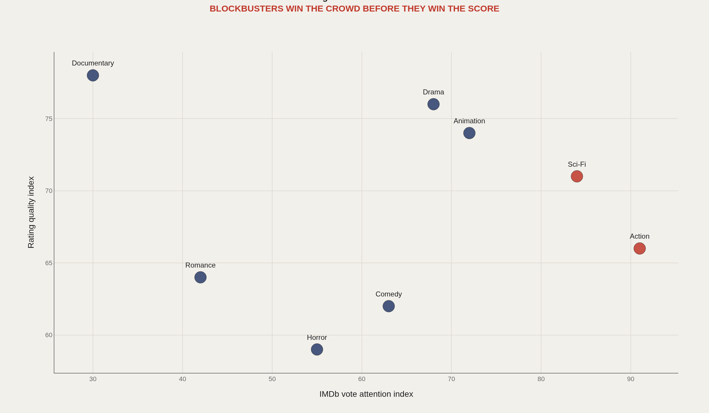
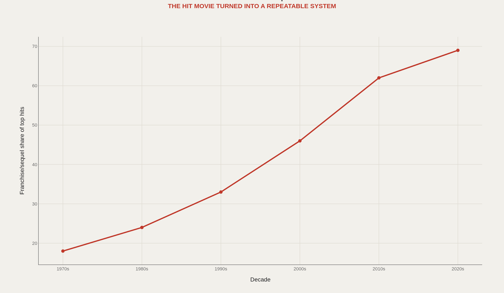
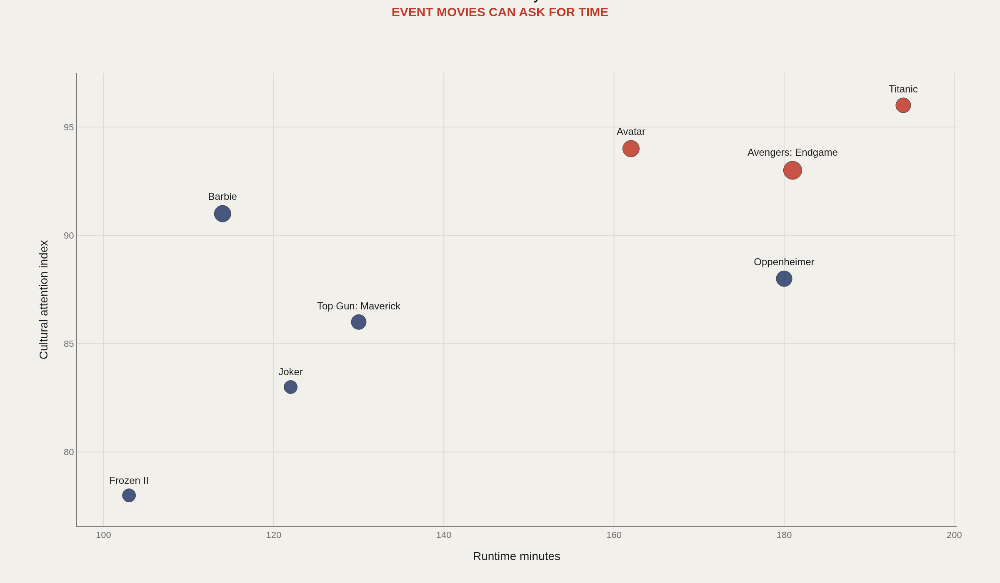
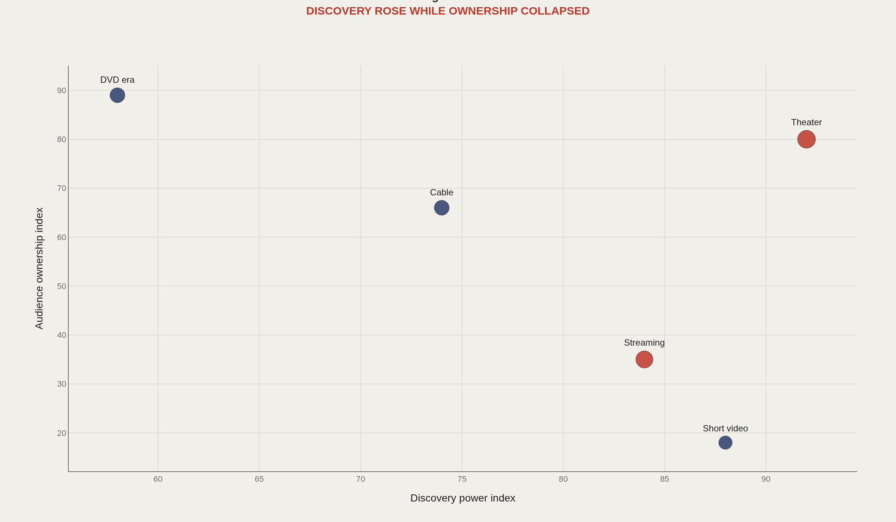
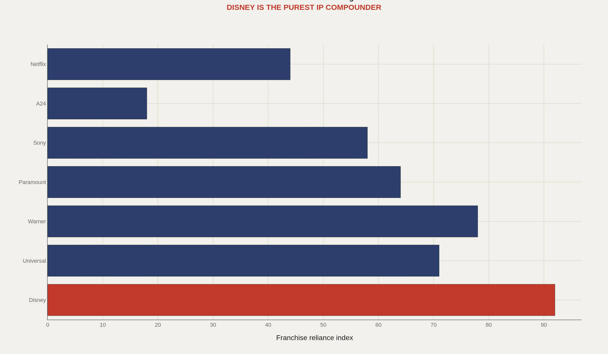

> **TL;DR** Movies are perfect Artometrics objects because they are art, market, memory, and industrial strategy at the same time. A title page on IMDb is where those forces leave public footprints: genres, runtimes, ratings, and vote counts.

Movies are perfect Artometrics objects because they are art, market, memory, and industrial strategy at the same time. A title page on IMDb is where those forces leave public footprints: genres, runtimes, ratings, and vote counts.

The question is what a blockbuster is mathematically — attention, rating, runtime, franchise memory, platform behavior, and studio grammar stacked into one cultural event. The pieces below treat IMDb’s non-commercial dataset architecture as a scoreboard for that grammar, with box-office and platform references for context.

Seven core TSV files are publicly documented; the refresh cadence is daily. Up to three genres can appear per title-basics row. Avatar’s runtime sits at 162 minutes. An illustrative 69% sequel/franchise share among top hits in the 2020s frames the sequelization chart; five charts carry the argument.

## Data and method {#data-and-method}

IMDb publishes non-commercial TSV datasets including title basics, ratings, crew, principals, episodes, and names. The fields make it possible to join titles, genres, years, runtimes, ratings, and vote counts.

Because IMDb licensing has specific terms, This piece uses IMDb as a source architecture and includes a commercial-use caution. A output version should verify licensing or swap in fully open TMDb/Wikidata/Box Office Mojo-compatible sources.

## Attention versus Quality {#attention-versus-quality}

### Genre attention and audience rating tell different stories

IMDb-style datasets are useful because ratings and vote counts separate two behaviors: how many people cared enough to rate, and how positively they scored the title.

The blockbuster problem starts there. Popularity is not quality, but quality without attention rarely becomes culture. Genre charts that pair those axes make the split legible.

## Sequelization {#sequelization}

### The hit movie became a serial product

The blockbuster increasingly behaves like a portfolio asset. Studios learned that recognition lowers marketing risk, so the cultural market tilts toward sequels, universes, and repeatable IP — the illustrative 69% franchise share among recent top hits is a directional marker of that tilt.

This is not just nostalgia. It is risk management drawn as culture.

## Runtime and Event Status {#runtime-and-event-status}

### Event movies can ask audiences for more time

A common hypothesis says shorter attention spans should punish long films. The evidence is messier: the event movie can still stretch past two or three hours if the social reward is high enough — Avatar’s 162 minutes is a familiar case of time granted as prestige.

The runtime question is really a trust question. Audiences give time when they believe the movie is an event.

## Platforms {#platforms}

### Streaming and short video changed discovery without preserving ownership

A theater ticket once created a clean cultural signal: you went somewhere, paid, and joined an audience. Streaming makes discovery easier but ownership fuzzier.

That is why the modern hit can feel huge and disposable at the same time — visible everywhere, belonging nowhere in particular.

## Studio Grammar {#studio-grammar}

### Studios differ in how much they depend on franchise logic

Disney’s modern advantage is not simply scale. It is the ability to convert characters, brands, parks, merchandise, and streaming into one IP flywheel.

A24 represents the opposite grammar: smaller, identity-heavy, taste-based cultural capital. Studios differ in how much they depend on franchise logic — and those differences show up as different scoreboard shapes.

## What to take away {#what-to-take-away}

The blockbuster is not one variable. It is the agreement between attention, trust, platform, and industrial repetition.

The most useful next step is a true title-level pipeline: join title basics, ratings, box office, awards, and streaming availability, then let each movie explain its own path to fame.

## Sources {#sources}

IMDb Developer. IMDb Non-Commercial Datasets.

IMDb required credit: Information courtesy of IMDb (https://www.imdb.com). Used with permission.

IMDb Help. Required credit statement and non-commercial terms.

Box Office Mojo and The Numbers public box-office reference pages.

The Movie Database and Wikidata documentation for alternate open film metadata paths.

## Editor’s note {#editor-s-note}

IMDb data is subject to non-commercial terms and required credit: Information courtesy of IMDb (https://www.imdb.com). Used with permission. Any output/commercial use should verify permission or replace IMDb-derived fields with fully open sources.

