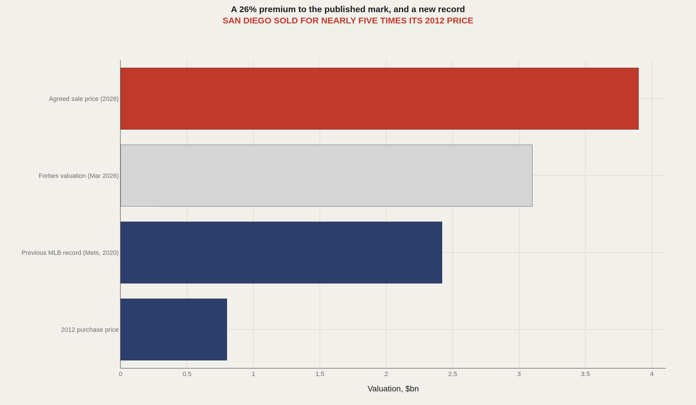
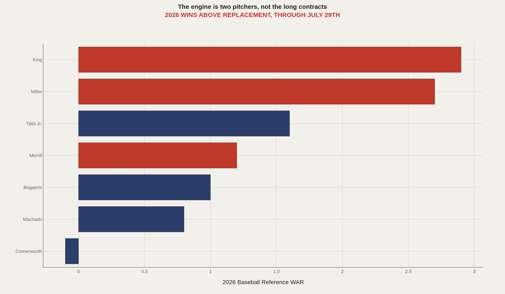
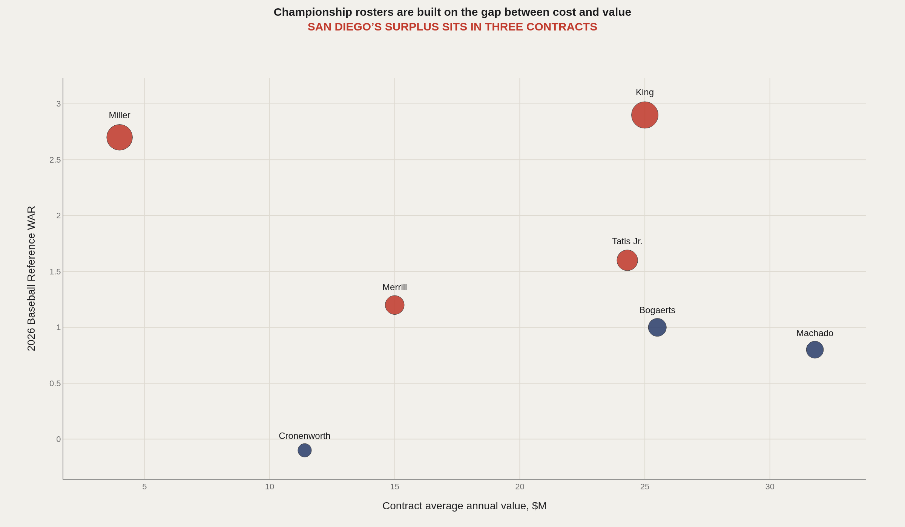
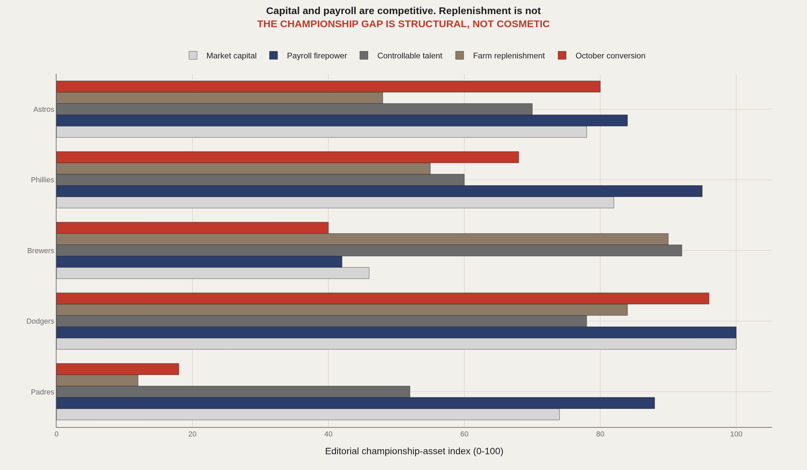
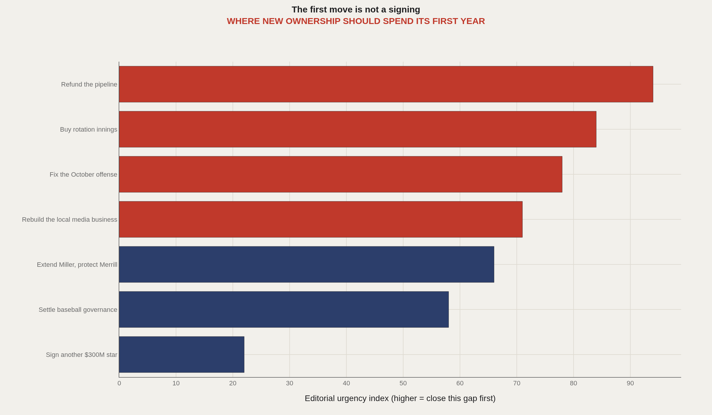

> **TL;DR** José E. Feliciano and Kwanza Jones agreed to pay $3.9bn for the Padres in May 2026—a record for a baseball club and a 26% premium to Forbes' $3.1bn March valuation. The deal inherits the sport's second-best attendance and its worst farm system, $858m owed to five aging stars producing 4.5 wins in 2026, and local media revenue that fell from $60m+ to $20m-$30m after Diamond Sports stopped paying in 2023.

The most expensive baseball team ever sold has the emptiest farm system in the sport, $858m owed to five players, and no regional television network.

José E. Feliciano and Kwanza Jones agreed in May 2026 to pay $3.9bn for the San Diego Padres—a 26% premium to Forbes' $3.1bn March valuation, which was based on estimated revenue of $484m and operating income of roughly $20m. The arithmetic is eight times revenue for a club in the 30th-largest media market in the United States.

That price sets the terms of everything that follows. No plausible baseball operating margin services $3.9bn of capital. The return has to come from franchise appreciation, from the events and property business around Petco Park, and from the one asset San Diego has never held: a championship, and the permanent revaluation of a market that has waited 57 years for one.

The transfer is not yet complete. Final documentation reached the league in late July, approval requires 22 of the other 29 owners, and a vote is expected in August, after the August 3rd trade deadline. "It's a question of getting investment commitments, documentation to be put in a condition that it's ready for a club vote," commissioner Rob Manfred said on July 14th.

What follows is a buyer's memo: what works, what is broken, where the surplus sits, and what to do first.

## Asset: demand is not the problem {#demand-asset}

San Diego is the only major-league franchise left in the city, and it behaves like a far larger market than its television rank implies. The club drew 3.4m in 2025, second in baseball behind the Dodgers, and is averaging close to 42,000 a game in 2026. It has set franchise attendance records in three consecutive seasons, holds about 25,000 full-season memberships against a wait list three years old, and renewed 94% of them into 2026 after a 7% price rise.

The valuation ladder tells the same story from the other end. The Fowler-Seidler group paid $800m in 2012. Forbes marked the club at $3.1bn in March, a 59% jump in a year and tenth in the sport. The agreed sale is $3.9bn. Whatever else is wrong, no one is being asked to create a market.

The underpriced line item is geography. The club's home television territory includes Tijuana, and no other franchise in the sport has an adjacent metropolitan area of that size with no competing team in it.

## Liability: the television hole {#media-liability}

The largest structural problem is not on the field. In May 2023 Diamond Sports stopped paying on a 20-year, $1.2bn contract, and the collapse of Bally Sports San Diego erased more than $60m a year of contracted revenue. MLB has produced and distributed the club's local telecasts ever since—San Diego was the first team into the league's local-media portfolio—and reported local media revenue is now in the $20m-$30m range, with industry sources placing it slightly higher.

The club has handled the transition better than anyone: 70,000 direct-to-consumer subscribers to Padres.TV, the largest such base under the league's umbrella, plus ten free over-the-air Saturday games through the local CBS affiliate. ESPN takes in-market streaming rights in 2026 under the league's new agreement. But the underlying position has not changed. San Diego has been paying a top-seven payroll out of a bottom-tier local media base, and the difference was covered by an owner willing to lose money.

Forbes' estimate—roughly $20m of operating income on $484m of revenue—is the thesis in one line. The incoming owners are buying a club whose competitive posture depends on a continued appetite for absorbing losses.

## Asset: the win engine, and what it costs {#win-engine}

Through July 29th the most productive Padres by Baseball Reference's wins above replacement are Michael King at 2.9, Mason Miller at 2.7, Fernando Tatis Jr. at 1.6, Jackson Merrill at 1.2, and Manny Machado at 0.8.

Miller's season is an outlier in the sport: a 0.79 earned-run average, 28 saves, 85 strikeouts in 45⅔ innings, an adjusted ERA more than five times the league norm. He is being paid $4m and is under club control through 2029. King is in the first year of a three-year, $75m contract with player options attached, and is the only starter to have held the rotation together through an injury-wrecked summer.

Together those two pitchers have produced 5.6 wins for about $21m of 2026 salary. The five players owed $858m after this season—Tatis, Machado, Xander Bogaerts, Merrill, and Jake Cronenworth—have produced 4.5 between them.

Two pitchers costing $21m this season have been worth more than the five players owed $858m after it.

## Liability: the pipeline is empty {#pipeline-liability}

FanGraphs ranks the Padres' farm system last in baseball. Baseball America places it 30th, describing the strength as a handful of high-ceiling names and the weakness as depth, with minor-league rosters "full of old-for-their-level players." Scouts consulted by the Union-Tribune in late July put it last of 30.

The proximate cause is the July 2025 trade that sent Leo De Vries and three other young arms to the Athletics for Miller and JP Sears. Miller has been superb. De Vries is now rated the second-best prospect in the sport. That is A.J. Preller's method in a single transaction: certainty now, paid for with the only cheap wins a club ever gets.

Ethan Salas, a 20-year-old catcher at Double-A, is healthy and hitting again and remains a top-ten prospect nationally. Two Single-A left-handers, Kruz Schoolcraft and Kash Mayfield, are the next-best assets, and both are years away. The consequence for an owner is not sentimental: an empty system means every hole on the roster is filled at retail, permanently, which is a large part of why the payroll is $259m and the run differential is minus 18.

## Where the surplus actually sits {#surplus}

Championship teams are not built on the largest contracts. They are built on the gap between what players produce and what they cost, and in San Diego that gap is concentrated in three places.

Merrill's nine-year, $135m extension, signed before this season at a $15m average, pays him $7.1m in 2027. Miller is arbitration-controlled through 2029. King's deal is expensive but short. Against them sit Machado at a $31.8m average through 2033, Bogaerts at $25.5m through 2033, and Cronenworth at $11.4m through 2030—a trio worth 1.7 wins between them this year, at 33, 33, and 32 years old.

The instruction that follows is unglamorous. The surplus contracts are the franchise, and the temptation before the August 3rd deadline will be to spend them: San Diego has been widely reported as a possible seller of Miller. Trading three controlled years of the best relief pitcher in baseball to relieve a balance sheet that a $3.9bn buyer is about to recapitalize would be the most expensive kind of saving.

## The peer gap, measured against the clubs in the way {#peer-gap}

Set the Padres against the teams they have to beat and the shape of the deficit is consistent. Capital and payroll are competitive. Replenishment and October conversion are not.

The Dodgers are the immediate obstacle and cannot be outspent: back-to-back champions, roughly twice San Diego's revenue, thirteen games clear in the division. Milwaukee is the more instructive comparison—67-40 this season on a $124m Opening Day payroll, built almost entirely through internal development. San Diego has spent five years trying to beat Los Angeles at its own game on a fifth of its local media revenue, while running Milwaukee's problem in reverse.

The championship-asset index is editorial, not a model. It scores five dimensions on a 0-100 scale to make the shape of the gap legible; the inputs are valuation, tax payroll, share of value from controlled players, published farm rankings, and postseason results since 2020.

## The memo: six moves, in order {#playbook}

The instinct at this price will be a statement signing. It is the wrong first move: the roster's marginal need is not another $300m bat. In rough order of urgency:

1. Refund the pipeline as a capital project, not a scouting line. Spend the full draft and international bonus pools, buy development infrastructure, and hire away the staff that rival clubs use to turn marginal prospects into major leaguers. It is the cheapest source of wins in the sport and the only one that compounds. It is also the item the outgoing regime spent.

2. Buy innings, not headliners. The rotation has been carried by King through a summer in which the salary sitting on the injured list has been the ninth-largest in baseball. October is decided by a club's fourth and fifth-best pitchers, which is the category San Diego has never bought and the one available cheaply every winter.

3. Fix the October offense deliberately. The last two eliminations were failures to score: shut out over the final two games of the 2024 division series, five runs across three games in 2025. This lineup is built on power and aggression, a profile that fails against elite pitching in short series. On-base skill and contact are the missing inputs, and they cost less than power does.

4. Treat local media as a business you own. Seventy thousand direct subscribers is the biggest such base in baseball and it was assembled in three seasons out of a bankruptcy. Own the funnel, price it properly, and extend it across the border rather than waiting for a regional network that is not coming back.

5. Extend Miller; treat Merrill as untouchable. Both are cheap, both are in their twenties, and neither can be replaced from within this system. Buying out Miller's arbitration years fixes a cost curve for four seasons; trading him fixes a quarter.

6. Settle governance before the winter. Feliciano will be the control person and intends to run the club in partnership with Jones. The most valuable document they can produce internally is the mandate: one decision-maker for baseball, one time horizon, one definition of success. The Seidler era's strength was clarity of purpose; its weakness was that the purpose outlived the plan for achieving it.

## The arithmetic of a first title {#conclusion}

San Diego does not have a 90-win problem. It has reached the postseason four times in six years and will probably do so again inside two. It has a twelve-game problem: the tournament that follows the season, which the Padres have entered five times since 2020 and left without a pennant every time.

Closing that gap is not a payroll exercise, which is fortunate, because payroll is the one lever this club has already pulled to its limit. It is a depth-and-pipeline exercise, and those are the two things a recapitalized franchise can buy quickly—if the owners spend on infrastructure rather than announcements.

The Padres are worth a record price because someone finally believes the last step is available. Those six moves are what has to be true for that belief to pay. The companion report explains why 57 years of evidence makes it such an expensive bet.

## Data and method {#dataset-context}

Player value figures are Baseball Reference wins above replacement, current through games of July 29th 2026. Contract terms and average annual values come from Spotrac and FanGraphs' RosterResource; tax payrolls are Spotrac's. Valuations are Forbes, March 2026; sale terms and the approval timetable come from MLB.com, Sportico, Sports Business Journal, and the San Diego Union-Tribune. Farm-system ranks are FanGraphs, Baseball America, and MLB Pipeline, July 2026. Media revenue figures are as reported by SBJ and the Union-Tribune.

The championship-asset index is editorial. It converts five inputs—valuation, tax payroll, share of value from controlled players, published farm rank, and postseason results since 2020—into a 0-100 score per club so the shape of the gap can be read at a glance. It is a framing device, not a forecast, and no projection of wins or title probability is implied.

## References {#references}

Baseball Reference. 2026 San Diego Padres Statistics.

Forbes. Baseball's Most Valuable Teams 2026, March 2026.

Sportico. San Diego Padres Sale: Feliciano, Jones to Pay MLB-Record $3.9 Billion, 2026.

Sports Business Journal. Feliciano group submits final documentation for Padres sale, July 2026.

San Diego Union-Tribune. Padres have minor-league pieces to entice teams at trade deadline, July 2026.

Baseball America. MLB Farm System Midseason Talent Rankings, July 2026; FanGraphs RosterResource; Spotrac contract tables.

Related Artometrics reports: The Most Expensive Team That Has Never Won Anything · Dodgers · Sports Dynasty Index.

## Editor's note {#editors-note}

This report is editorial analysis, not investment advice, and Artometrics has no relationship with any party to the transaction. Valuations, revenue, and media-rights figures are third-party estimates. Player value figures are current through July 29th 2026 and the season is unfinished. The championship-asset and urgency indices are editorial constructs, clearly labelled as such.

