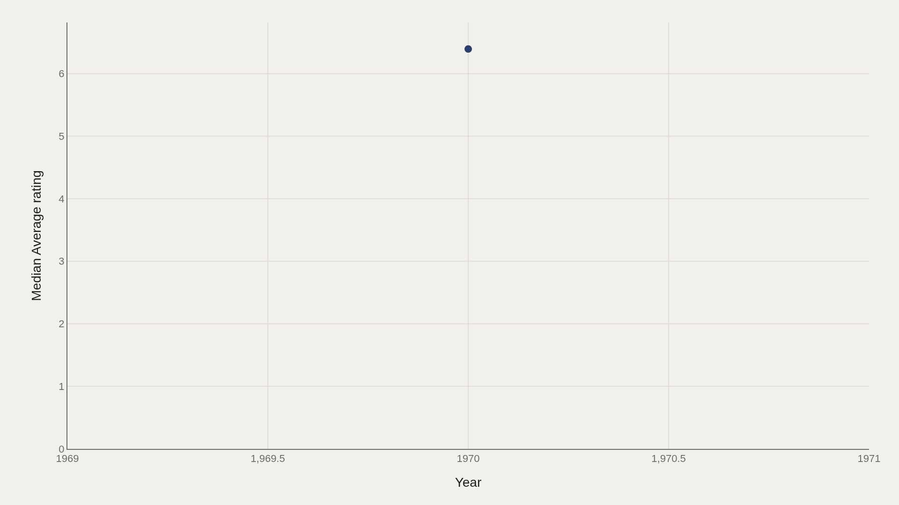
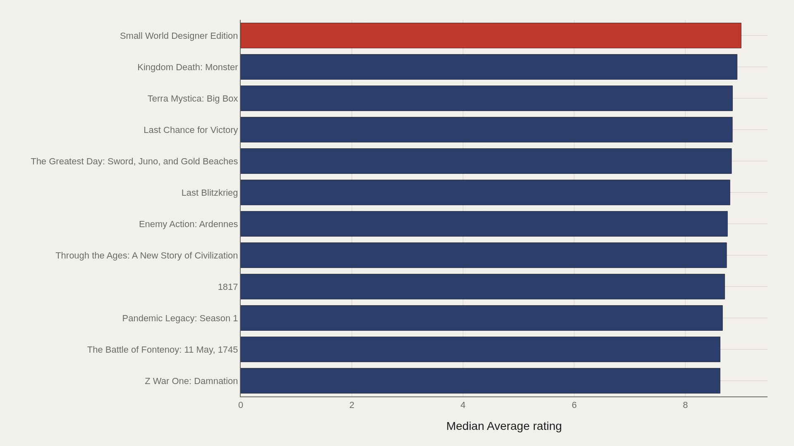
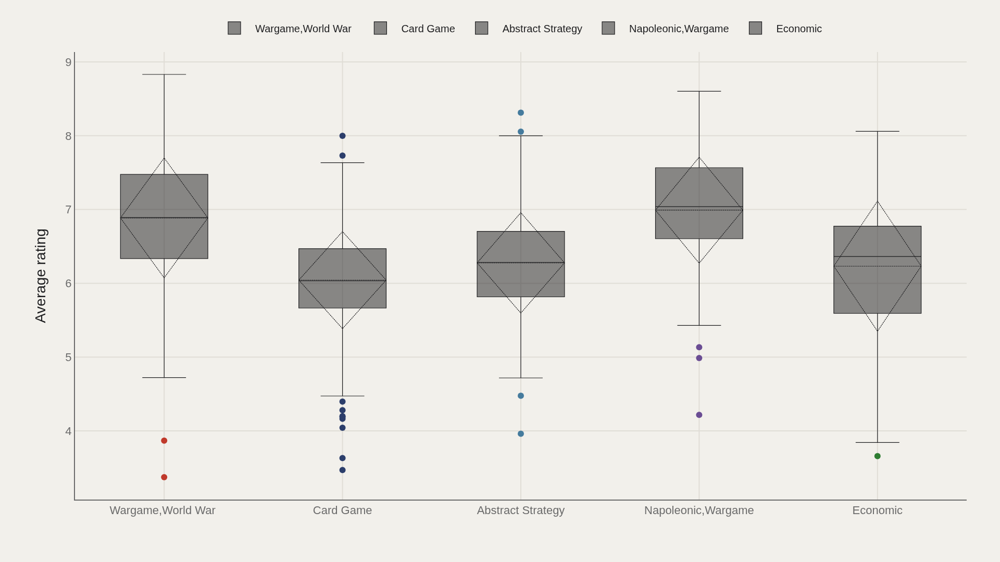
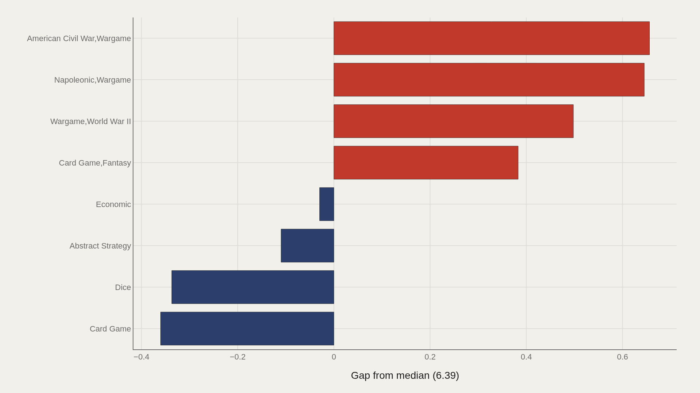
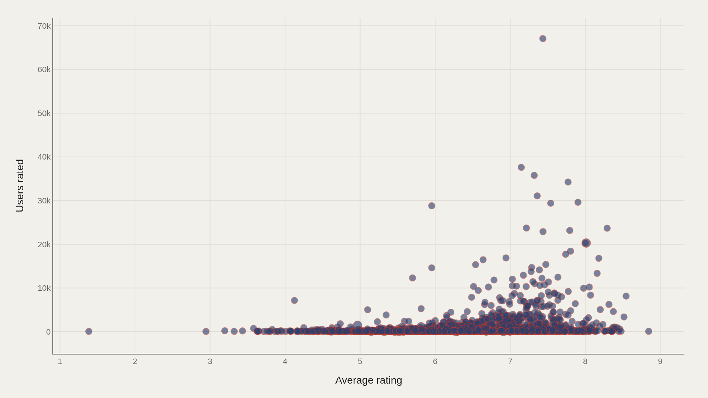

> **TL;DR** BoardGameGeek ratings are a public taste machine: tens of thousands of titles, each scored by the people willing to log plays. The TidyTuesday board-games extract used here holds 10,532 records with a median average rating of 6.39 and a high of 9.00 for Small World Designer Edition. Wargame, World War II is the most common category label in the file.

BoardGameGeek ratings are a public taste machine: tens of thousands of titles, each scored by the people willing to log plays. The TidyTuesday board-games extract used here holds 10,532 records with a median average rating of 6.39 and a high of 9.00 for Small World Designer Edition.

Wargame, World War II is the most common category label in the file. That already tilts the catalog toward conflict simulations — a hobby subculture with its own rating norms. The charts ask how ratings split by category, how leaders separate from the median, and whether crowdfunding-scale user counts track with elite scores.

## Fast facts {#fast-facts}

The numbers that set the scale for this report:

- **10,532** — Records in the working dataset

  6.39Median Average rating
  9.00Highest observed Average rating
  Small World Designer EditionTop Name by Average rating
  1970–1970Year span covered in the file
  Wargame,World War IIMost common Category

## Data and method {#data-and-method}

The source is the TidyTuesday release from 2019-03-12 (board_games.csv). After cleaning, 10,532 rows remain in the working frame.

Average rating is the primary metric. Category fields can be multi-label strings. Charts are Plotly JSON with PNG fallbacks. The year span encoded in the fact box reflects the filtered time field present in this build of the file.

## The Catalog’s Median Rating Sits Near 6.39 {#the-catalog-s-median-rating-sits-near-6-39}

### Median Average rating Over Time

The time view in this extract collapses to a median average rating of about 6.39 — the same calibration point as the fact box. In BoardGameGeek terms, that mid-6s band is ordinary: playable, not legendary.

Everything that follows should be read against that baseline. A 9.00 specialty edition is not “a bit better than average”; it is a different prestige tier.

## Designer Editions and Heavy Games Own the Peak {#designer-editions-and-heavy-games-own-the-peak}

### Small World Designer Edition leads at 9.00 — 8.78 marks the median among the top dozen

Small World Designer Edition leads at 9.00. Kingdom Death: Monster (~8.93), Terra Mystica: Big Box (~8.85), and a run of deep wargames — Last Chance for Victory, The Greatest Day, Last Blitzkrieg, Enemy Action: Ardennes — fill out the top dozen. The median among those leaders is about 8.78.

These are not mass-market party games. They are hobby-complete objects — big boxes, campaign systems, hex-and-counter epics — rated by audiences selected for intensity.

## Wargame Categories Rate Higher Than Card Games {#wargame-categories-rate-higher-than-card-games}

### Average rating by Category

Category boxes show Napoleonic wargames with a median near 7.04 (n=124) and World War II wargames near 6.89 (n=449). Card games sit lower, with a median near 6.03 (n=438). Abstract strategy lands near 6.28 (n=284).

Volume and prestige diverge: card games are numerous but center closer to the catalog median; dedicated wargame labels clear a higher bar among the people who rate them.

## Civil War and Napoleonic Titles Beat the Median Most {#civil-war-and-napoleonic-titles-beat-the-median-most}

### Average rating vs median by Category

Gaps to the overall median are largest for American Civil War wargames (~+0.66) and Napoleonic wargames (~+0.65), with World War II wargames also positive. Dice and generic card-game labels sit below the median.

The pattern is consistent: historical conflict simulations, as tagged in this file, are the categories that most reliably clear the 6.39 baseline.

## Crowd Size and Rating Are Related — Loosely {#crowd-size-and-rating-are-related-loosely}

### Average rating vs Users rated

Average rating versus users rated shows popular hits with tens of thousands of ratings landing across the mid-to-high 7s, while many high-rated titles still have modest user counts. Elite scores without crowd scale remain possible.

The scatter’s lesson is citable: popularity predicts attention, not a precise quality score. A 9.00 designer edition and a 7.4 smash hit solve different problems in the hobby economy.

## What this file cannot tell you {#what-this-file-cannot-tell-you}

BoardGameGeek ratings are self-selected by hobbyists; children’s games and mass-market titles can be systematically under- or over-represented. Multi-label categories double-count games across boxes.

Expansions and designer editions inflate prestige relative to base games. The file is a 2019 community snapshot, not a live BGG API pull.

## What to take away {#what-to-take-away}

Across 10,532 games, the median rating is 6.39; the top dozen lives near 8.8–9.0. Wargame categories clear the baseline more often than broad card-game labels.

Cite 6.39 as the catalog’s center of gravity, and treat 9.00 specialty editions as a separate prestige economy — not as proof that “games got better.”

## Sources {#sources}

Data Science Learning Community. (2019). TidyTuesday: Board Games. https://raw.githubusercontent.com/rfordatascience/tidytuesday/main/data/2019/2019-03-12/board_games.csv

