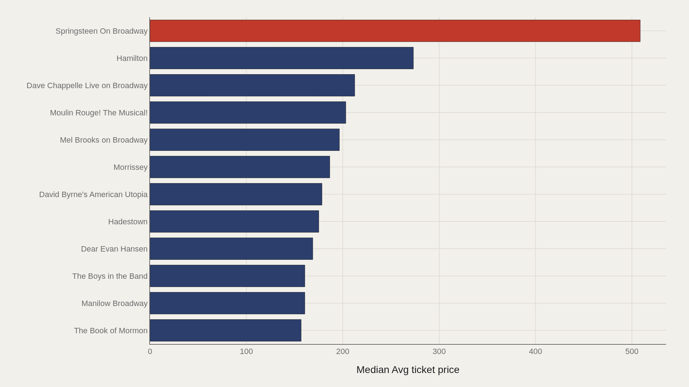
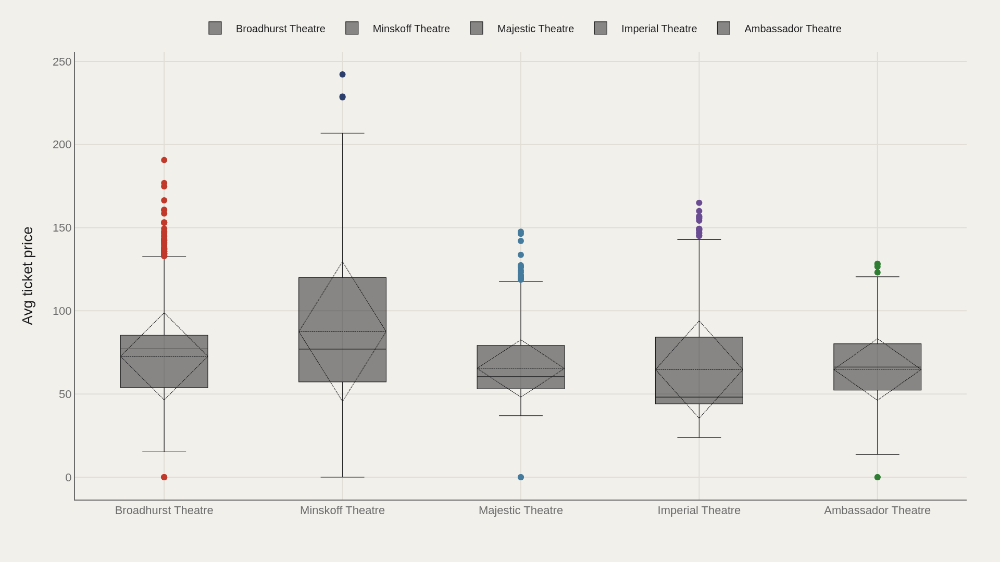
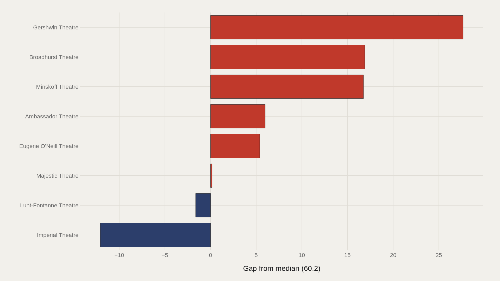
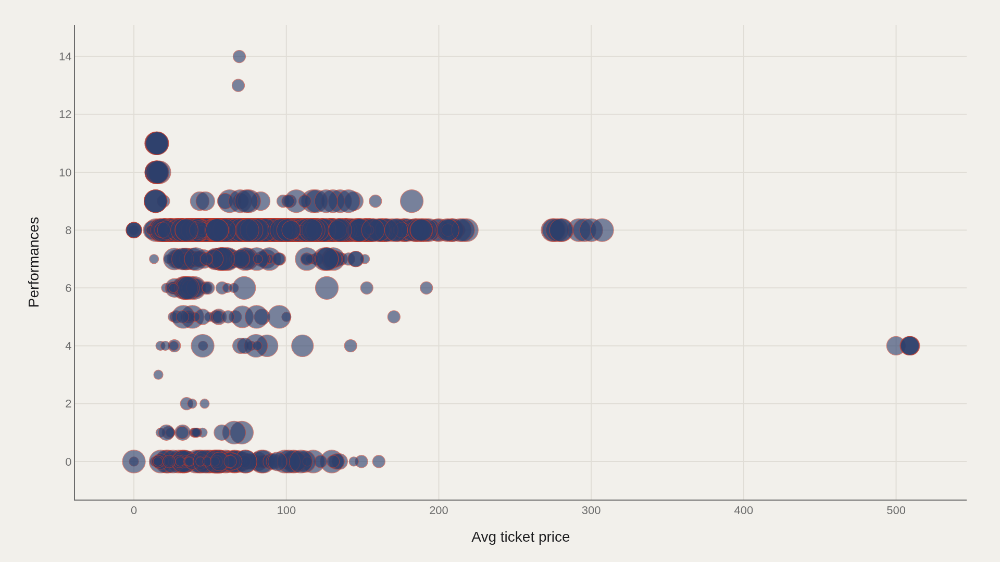

> **TL;DR** Broadway divides into two pricing tiers: long-running musicals cluster near a $60.2 median, while concert residencies push toward $509. Springsteen On Broadway leads the 47,524-record TidyTuesday dataset; Hamilton follows at $273.

Springsteen On Broadway averages $509 per ticket—nearly double Hamilton's $273 and more than eight times the $60.2 industry median. This gap separates concert-style residencies from long-running musicals and reveals two parallel pricing markets operating inside the same theater district.

The TidyTuesday grosses dataset holds 47,524 performance records. Broadhurst Theatre appears most frequently; Springsteen On Broadway claims the highest average ticket price. The data map a clear division: established houses run near stable mid-range prices, while event residencies reset the ceiling.

## Fast facts {#fast-facts}

The numbers that set the scale for this report:

- **47,524** — Records in the working dataset

  60.2Median Avg ticket price
  512Highest observed Avg ticket price
  Springsteen On BroadwayTop Show by Avg ticket price
  Broadhurst TheatreMost common Theatre

## Data and method {#data-and-method}

The source is the TidyTuesday release from 2020-04-28 (grosses.csv). After cleaning, 47,524 records remain for analysis.

Average ticket price is the primary metric; theatre and show fields provide the grouping. Charts are Plotly JSON with PNG fallbacks.

## Concert Residencies Rewrite the Price Ceiling {#concert-residencies-rewrite-the-price-ceiling}

### Avg ticket price by Show

Springsteen On Broadway leads at $508.63 average ticket price—nearly double Hamilton's $273. Dave Chappelle Live, Moulin Rouge!, Mel Brooks on Broadway, Morrissey, and David Byrne's American Utopia follow in the premium band above $175.

Concert-style residencies occupy the top tier. Traditional musicals, regardless of critical success, cluster far below the residency model.

## Even Among Leaders, Springsteen Is an Outlier {#even-among-leaders-springsteen-is-an-outlier}

### Springsteen On Broadway leads at 509 — 182 marks the median among the top dozen

Springsteen On Broadway stands at $509, while the median among the top dozen is $182. Hamilton is extraordinary relative to the $60.2 industry median—yet still 46% below the Springsteen residency.

Reference $182 as the premium Broadway median; reference $509 when discussing absolute event-ticket pricing.

## House Medians Cluster Near the Industry Middle {#house-medians-cluster-near-the-industry-middle}

### Avg ticket price by Theatre

Broadhurst Theatre (n=1,829) shows a median average ticket near $77; Minskoff near $77; Majestic near $60; Ambassador near $66; Imperial near $48. Peak prices within those houses still exceed $100 when hit shows run.

Theatre identity matters less than show identity. The same building can host a $50 median season and a $200 event week.

## Gershwin Leads the Gap Above the Median {#gershwin-leads-the-gap-above-the-median}

### Avg ticket price vs median by Theatre

Relative to the overall $60.2 average-ticket median, Gershwin Theatre leads at +$27.67, with Broadhurst and Minskoff also positive. Imperial sits below the median by $12.

House premiums track programming: theaters hosting mega-hits and premium brands pull above the baseline.

## Price and Performance Counts Are Weakly Coupled {#price-and-performance-counts-are-weakly-coupled}

### Avg ticket price vs Performances

Average ticket price versus performances shows low-price, low-performance weeks and occasional high-price short runs. Long runs at moderate prices remain the traditional musical model.

The scatter resists a simple correlation: expensive tickets do not always signal short runs, and longevity does not require discounting. Broadway monetizes both scarcity and stamina.

## What this file cannot tell you {#what-this-file-cannot-tell-you}

Grosses data include atypical weeks, previews, and dark periods sometimes coded as zeros. Average ticket price does not reflect face value for every seat. Concert residencies mix genres inside a Broadway dataset.

The snapshot timing predates later reopenings and dynamic pricing expansion.

## What to take away {#what-to-take-away}

Broadway's median average ticket in this dataset is $60.2, while event residencies reach $509. The top-dozen median of $182 defines the premium club without equating to the Springsteen outlier.

Reference house medians when comparing venues; reference show leaders when comparing brands.

## Sources {#sources}

Data Science Learning Community. (2020). TidyTuesday: Broadway Musicals. https://raw.githubusercontent.com/rfordatascience/tidytuesday/main/data/2020/2020-04-28/grosses.csv

