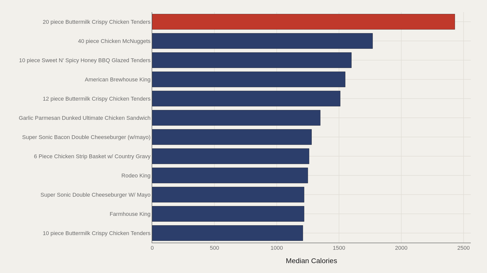
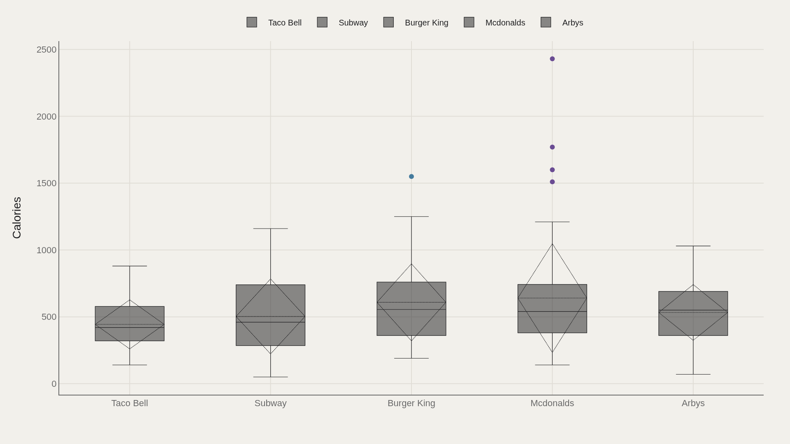
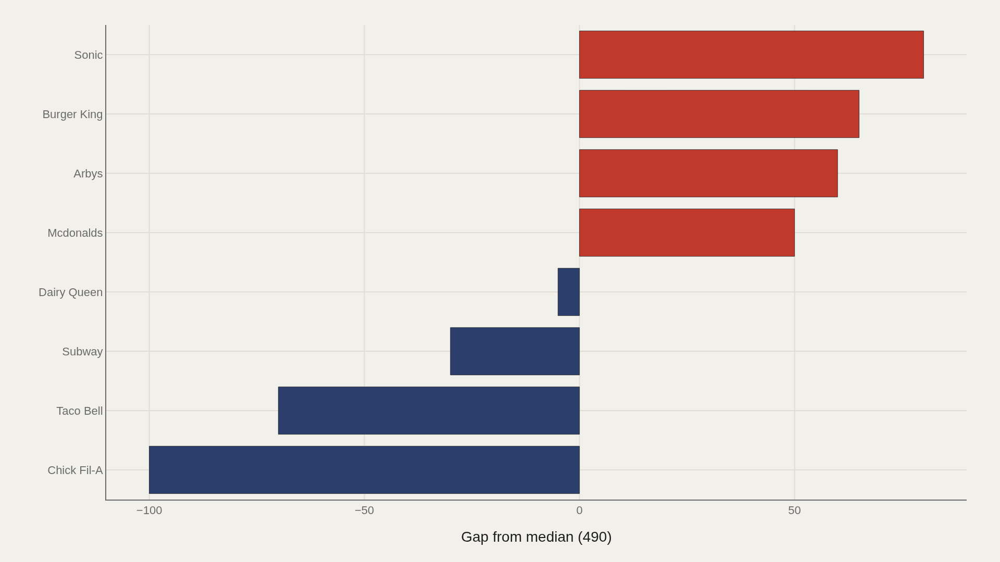
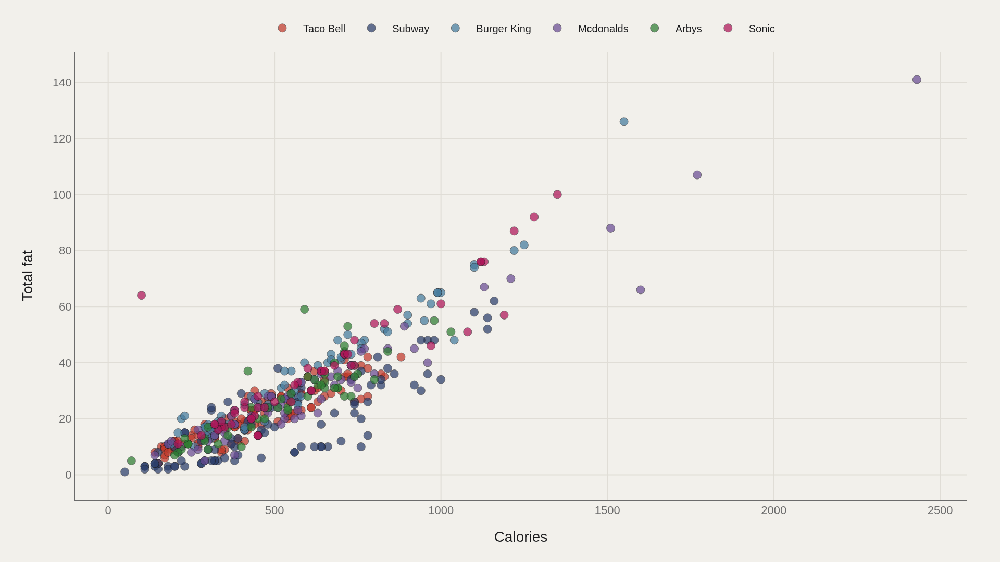

> **TL;DR** 515 calories menu items from major U.S. chains show a median of 490 calories. The heaviest item — a 20-piece buttermilk crispy chicken tray — reaches 2,430 calories. The top 12 items median 1,315 calories, 2.7× the dataset median. Sonic sits 80 calories above median; Chick-fil-A trails by 100.

515 menu items from major U.S. calories chains show a median of 490 calories, but the top tier — shareable trays and stacked sandwiches — reaches 2,430 calories, nearly five times higher.

The dataset, from TidyTuesday's 2018-09-04 release, records restaurant name, item, calories, total fat, and related nutrition fields. Taco Bell appears most often in the file, but frequency does not equal intensity. The signal is in which items and chains sit above the median and how portion size drives the calorie ceiling.

Chain averages without portion context mis-rank brands that sell both modest sandwiches and extreme trays under the same logo. Catalog comparisons are more useful than chain-level means.

## Data and method {#data-and-method}

The source is the TidyTuesday release from 2018-09-04, maintained by the R for Data Science community. The working file contains 515 rows and 17 columns after merging available CSV tables — restaurant name, item, calories, total fat, and related nutrition fields.

Medians are preferred where distributions skew. Index-style fields and sequential IDs are excluded from metric selection. Charts ship as Plotly JSON with PNG fallbacks. The snapshot is a menu catalog for a fixed release window, not a live API.

## Calorie ceilings by item {#breakdown}

### Calories by Item

The 20-piece buttermilk crispy chicken tender tray leads at 2,430 calories. Related tender trays populate the upper tier: the 12-piece sits near 1,510, the 10-piece near 1,210.

Portion size drives the ceiling. Doubling the piece count nearly doubles the calorie load. Burger King and Sonic doubles — Farmhouse King, Rodeo King, Super Sonic doubles — fill the same high band for a different reason: stacked patties, sauces, and bun mass rather than tray size.

## Who sits at the top {#who-sits-at-the-top}

### 20-piece Buttermilk Crispy Chicken Tenders leads at 2,430 — 1,315 marks the median among the top dozen

Among the top 12 calorie items, the median is 1,315 — more than 2.5 times the dataset-wide median of 490. The head of the menu is not a gentle slope; it is a separate altitude.

Shareable trays and king-style sandwiches dominate the list. Chain averages without portion context will mis-rank brands that sell both modest sandwiches and extreme trays under the same logo.

## How chains spread calories {#how-the-field-is-spread}

### Calories by Restaurant

Box plots by restaurant show whether a chain's calorie consensus is shared or contested. Some menus cluster tightly around the middle. Others stretch from light sides to extreme trays, producing wide interquartile ranges that averages erase.

Taco Bell's heavy representation in the file does not place it at the caloric peak. Volume of SKUs and intensity of SKUs are different questions — the distribution chart is where that split becomes visible.

## Who beats the median — and who trails {#who-beats-the-median-and-who-trails}

### Calories vs median by Restaurant

Relative to the dataset median, Sonic sits 80 calories above center. Chick-fil-A trails by 100. Burger King, Arby's, and McDonald's sit on the high side of the gap chart; Subway and Taco Bell sit below.

These gaps are menu-composition effects as much as health branding. A chain that lists more grilled items and fewer shareable trays will land below the median even if its signature sandwich is not light. The gap chart ranks catalogs, not single hero products.

## Calories and fat move together {#what-moves-together}

### Calories vs Total fat

Plotting calories against total fat produces the expected positive slope — and the clusters that averages erase. Dense clumps of ordinary sandwiches sit in the middle; extreme trays and stacked burgers occupy the upper-right corner where both axes spike together.

Fat is not a perfect proxy for calories, but in this menu file the two metrics rarely disagree about which items are extreme. When they do separate, it is usually because sugar-heavy drinks or desserts pull calories without matching fat.

## What this file cannot tell you {#what-this-file-cannot-tell-you}

Community-cleaned TidyTuesday snapshots are not live APIs. Missing values, spelling variants, and week-of-export coverage limits apply. Merged tables may fan out or duplicate rows when join keys are imperfect.

The file does not measure how often items are ordered, how portions are actually consumed, or how recipes have changed since the 2018 release. Treat the numbers as a structural map of listed menu calories — not a verdict on every current drive-through board.

## What to take away {#what-to-take-away}

The median calories item in this catalog sits near 490 calories. The items that define the public argument about fast food often sit two to five times higher — trays and stacked sandwiches that are easy to order and hard to compare without portion context.

Chain gaps of 80 to 100 calories around the median are real, but they are catalog effects. The clearest signal is the ceiling: once shareable chicken trays enter the frame, the conversation about a typical item and the conversation about the heaviest item are no longer the same conversation.

## Sources {#sources}

