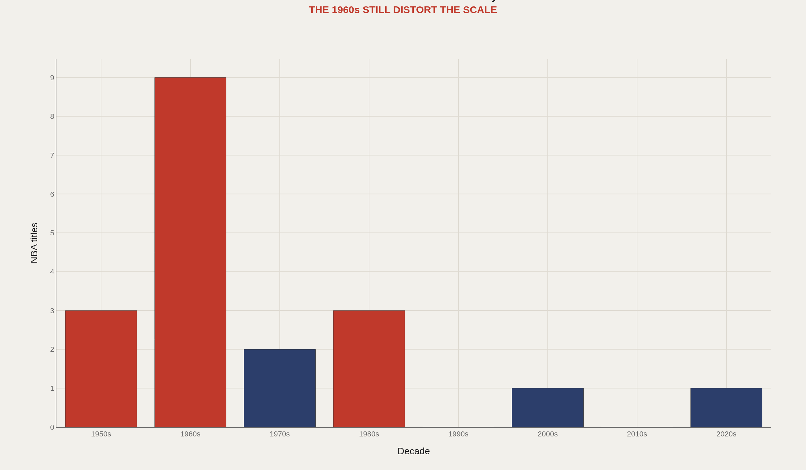
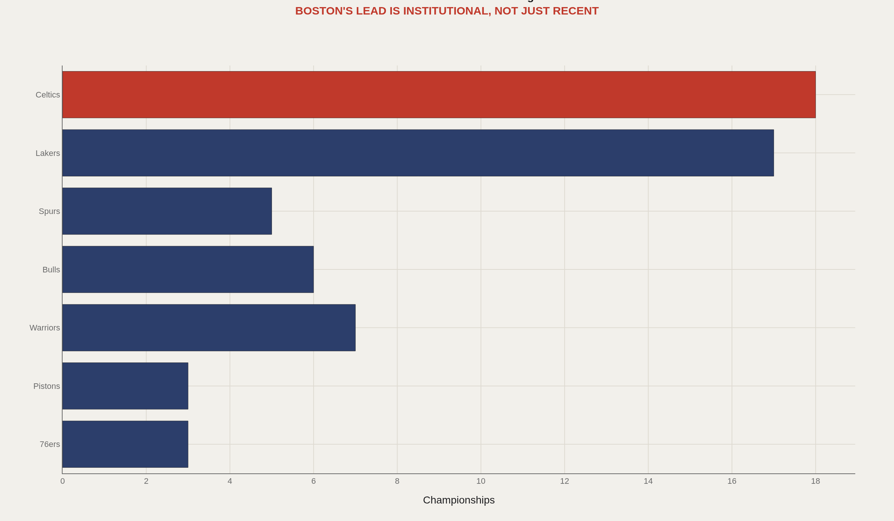
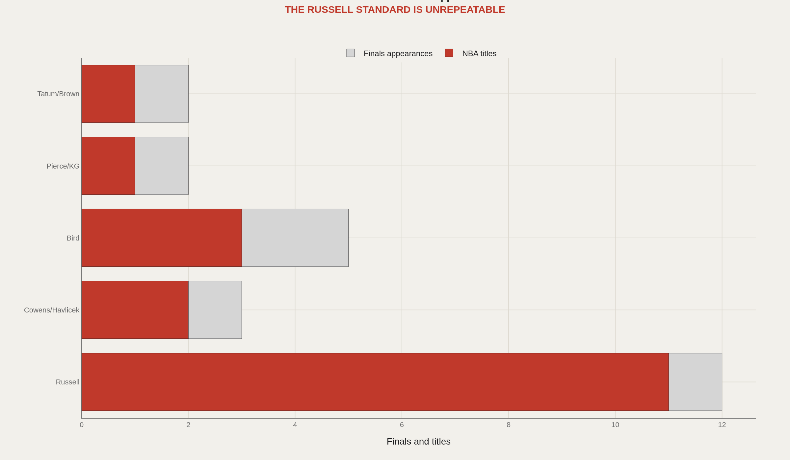
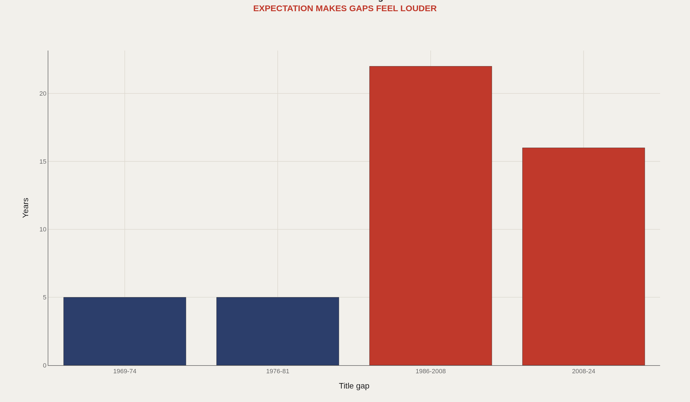
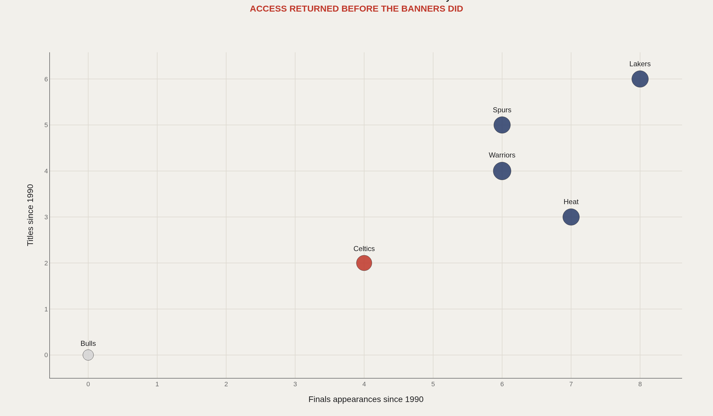

> **TL;DR** The Boston Celtics hold 18 NBA championships, the league record entering 2025. Eleven arrived during the Bill Russell era, a concentration dense enough to turn winning into institutional identity. The 22-year gap between the 1986 and 2008 titles shows even privileged franchises can wander; the 2024 title proves the pressure cycle still closes when a roster matches the archive's demand.

Eighteen NBA championships entering 2025—the league record—mean every Boston Celtics season is judged against Bill Russell's 11 titles, Larry Bird's mid-1980s certainty, and the institutional claim that banners are normal weather. The franchise was capitalized so early that even good years can feel underleveraged.

This report examines the Celtics through championship density, Finals conversion rates across five title eras, and the franchise's capacity to rebuild through trades rather than lottery luck—a pattern no other NBA team has replicated at the same scale.

Eleven of those 18 titles arrived in the Russell era alone, a concentration dense enough to turn winning into identity rather than achievement. Later cores inherited the mythology when the conversion rate fell. The 22 years between 1986 and 2008 proved that even a privileged franchise can wander; the 2024 title proved the pressure cycle still closes when a roster matches the archive's demand.

What follows reads Boston as an institution of expectation: how densely the titles stacked, how the franchise sits against the rest of the league's ceiling, how eras converted Finals chances into rings, how droughts rewrote the emotional calendar, and whether the Tatum–Brown core has reopened the pipeline.

## The 1960s are still the gravitational center {#how-densely-championships-stack}

Boston's historical lead is not evenly distributed. The 1960s remain the dominant decade: a period so successful it still defines the franchise's expectations. Later title decades matter, but they orbit that original surplus rather than replace it.

That density is why Celtics exceptionalism feels permanent even when seasons do not. The institution was capitalized early; every modern roster pays interest on that balance sheet.

## Boston and Los Angeles define the league's summit {#the-ceiling-on-titles}

Boston and Los Angeles form the NBA's summit. Everyone else is explaining distance. For a Celtics fan, the comparison is not trivia—it is the operating standard by which every rebuild is judged.

The chart clarifies what "contender" means in green. Mid-tier title totals that look historic elsewhere register as unfinished business in Boston, because the franchise's peer set is the other archive monopoly.

## Russell converted chances; later eras inherited the burden {#converting-eras-into-banners}

The Russell era was not merely successful—it converted nearly every opportunity into a ring. Later eras look great by ordinary standards and modest by Boston standards. That gap is institutional burden in chart form: greatness shrinks when the archive is impossible.

Five defining title eras make the pattern readable. Access still arrives. Conversion is what separates mythology from maintenance.

## Droughts do not erase the claim—they test it {#what-long-droughts-do-to-a-franchise}

The 22-year gap from Bird to Pierce/Garnett shows how long even a privileged franchise can wander. The Celtics do not avoid droughts—they narrate them as temporary violations of the natural order. Pressure accumulates precisely because the brand never stops promising banners.

The 2024 title closed another cycle. In Boston, a ring is never only a championship. It is a restoration of institutional order.

## Has the modern core reopened the pipeline? {#whether-the-modern-team-still-has-a-claim}

Through 2024, the Tatum–Brown core produced two Finals appearances—present in the modern title economy, but not as frequently as mythology implies. Presence alone does not settle the institutional argument. Conversion does.

The 2020s matter because they reopened the pipeline: historical identity and contemporary output narrowed again. That is the live question for Boston now—not whether the archive is real, but whether the present roster can keep paying its debt.

## The expectation never left {#conclusion}

The Celtics are not just successful. They are historically overcapitalized: so rich in past winning that even good seasons can feel underleveraged. Ordinary contention reads as shortfall because the franchise's unit of account is banners, not playoff relevance.

The 2024 title matters because it reconnects the present roster to the institution's oldest claim. Boston is supposed to convert windows into banners. The data says the expectation never left. The modern work is proving it can still be earned.

## Data and method {#dataset-context}

The charts draw on public NBA championship records, Basketball Reference franchise summaries, and Sports Reference Finals appearance totals. Era buckets follow the players most responsible for each title window—Russell, Bird, Pierce/Garnett/Allen, and the current Tatum–Brown core—so the conversion story can be read as institutional chapters rather than a flat career list.

The useful question sits one layer above fandom: how does historical surplus change the meaning of modern results? A Finals appearance that would crown another franchise can feel unfinished in green, because the archive still sets the standard.

## References {#references}

Basketball Reference. Boston Celtics Franchise Index.

NBA.com historical championship records.

Sports Reference Finals appearance summaries.

Related Artometrics reports: Lakers · Warriors.

## Editor's note {#editors-note}

Championship counts are through the 2023–24 season. Era buckets are editorial groupings for chart legibility, not official NBA designations.

