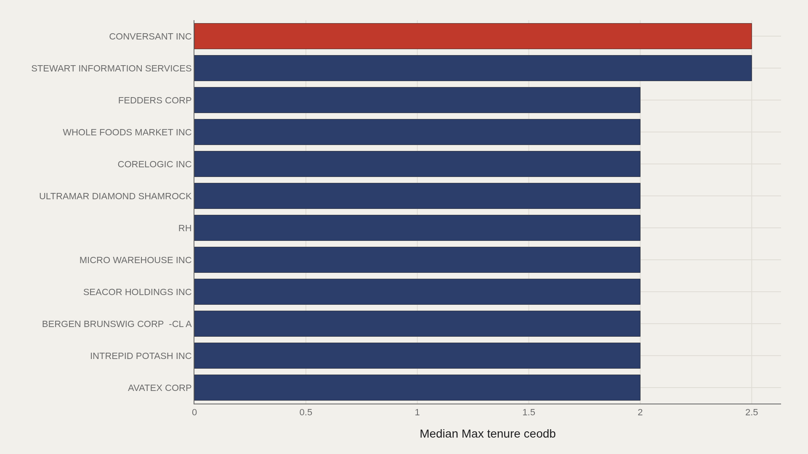
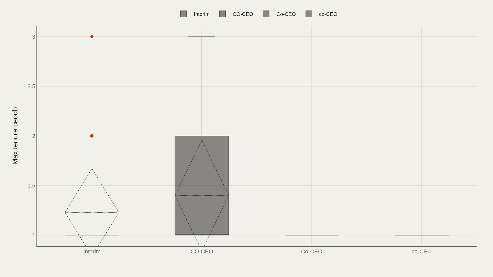
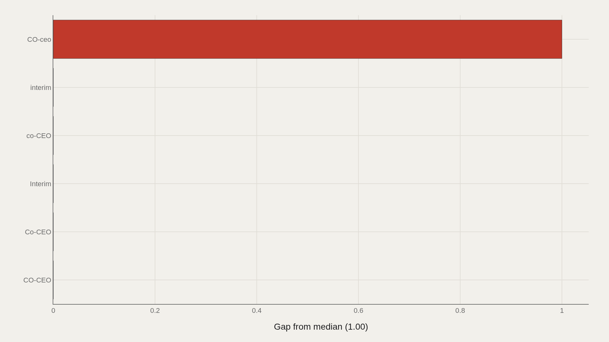
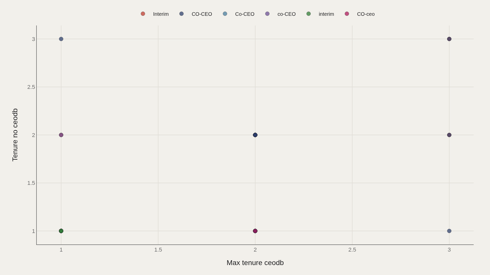

> **TL;DR** In 9,423 CEO-departure records from TidyTuesday, median max tenure ceodb is 1.00 year and the highest observed value is 4.00. "Interim" is the dominant succession label, appearing in 218 rows; company-level leaders reach 2.0–2.5 years at most.

In 9,423 TidyTuesday CEO-departure records, median max tenure ceodb is 1.00 year and the ceiling is 4.00. "Interim" appears in 218 rows—the dominant succession label—while company-level leaders reach 2.0–2.5 years at most.

The median of 1.00 sets the baseline: many coded departure spells are short. The data ask which companies show longer max tenures, how interim versus co-CEO labels differ, and whether tenure fields move together.

## Data and method {#data-and-method}

The source is the TidyTuesday release from 2021-04-27 (departures.csv). After cleaning, 9,423 rows remain.

Max tenure ceodb is the primary ranked metric. Interim/co-CEO spelling variants appear as separate categories and reflect label noise as well as structure. Charts are Plotly JSON with PNG fallbacks.

## Longer Max Tenures Are Rare in the Company Ranking {#longer-max-tenures-are-rare-in-the-company-ranking}

### Max tenure ceodb by Coname

Stewart Information Services and Conversant Inc lead at 2.50 on max tenure ceodb. A second tier—Avatex, Intrepid Potash, Bergen Brunswig, SEACOR, Micro Warehouse, RH—clusters at 2.00.

Relative to the file median of 1.00, even these leaders are only modestly longer spells. Extended CEO tenure is the exception, not the rule.

## The Top Dozen Caps Out Quickly {#the-top-dozen-caps-out-quickly}

### CONVERSANT INC leads at 2.50 — 2.00 marks the median among the top dozen

Conversant Inc appears at 2.50, and the median among the top dozen is 2.00. There is no long tail of decade-scale max tenures in this ranking metric.

Cite 2.00 as the elite-club median for max tenure ceodb—double the overall median, still short of popular narratives about imperial CEOs.

## Interim Labels Dominate the Category Mix {#interim-labels-dominate-the-category-mix}

### Max tenure ceodb by Interim coceo

Interim accounts for 218 observations with a median max tenure of 1.0 and a mean near 1.23. CO-CEO shows 85 rows with the same median of 1.0 but a slightly higher mean of approximately 1.4. Smaller capitalization variants are tiny samples.

The file is thick with interim spells—a succession-system fact: many departures pass through temporary authority before a permanent appointment.

## Gaps to the Median Are Mostly Flat {#gaps-to-the-median-are-mostly-flat}

### Max tenure ceodb vs median by Interim coceo

Most interim/co-CEO labels sit at a zero gap to the median on max tenure ceodb, with only a thinly populated CO-ceo variant showing a positive gap of 1.0.

Category labels do not produce a dramatic tenure hierarchy. The larger pattern is the volume of spells coded interim.

## Tenure Fields Track Closely Within Labels {#tenure-fields-track-closely-within-labels}

### Max tenure ceodb vs Tenure no ceodb

Max tenure ceodb versus tenure no ceodb, colored by interim/co-CEO label, largely follows a tight correspondence—points hug aligned values, especially in the interim cloud (n=218).

Where the two tenure fields disagree, coding definitions matter more than boardroom narrative. The scatter is a consistency check on the file's tenure construction.

## What this file cannot tell you {#what-this-file-cannot-tell-you}

Tenure fields are database constructions, not calendar biographies. Spelling variants of co-CEO fragment categories. Firm name changes and dual-class structures can split identities.

A median of 1.00 may reflect coding granularity as much as calendar instability. Read the metric definition before converting it into a headline.

## What to take away {#what-to-take-away}

In 9,423 departure records, max tenure ceodb centers at 1.00, with company-level leaders reaching only 2.0–2.5. Interim is the dominant succession label.

The institutional story: departure files are full of short and interim spells, not a catalog of decades-long reigns.

## Sources {#sources}

Data Science Learning Community. (2021). TidyTuesday: CEO Departures. https://raw.githubusercontent.com/rfordatascience/tidytuesday/main/data/2021/2021-04-27/departures.csv

