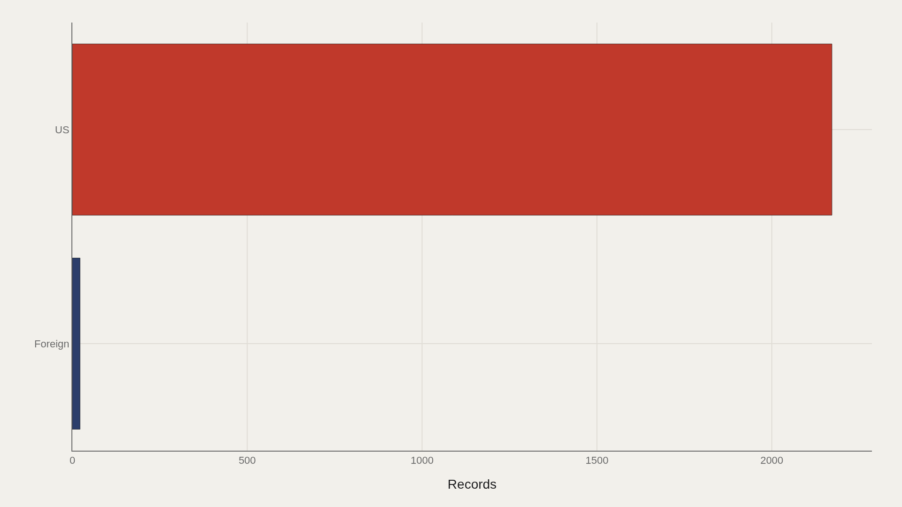
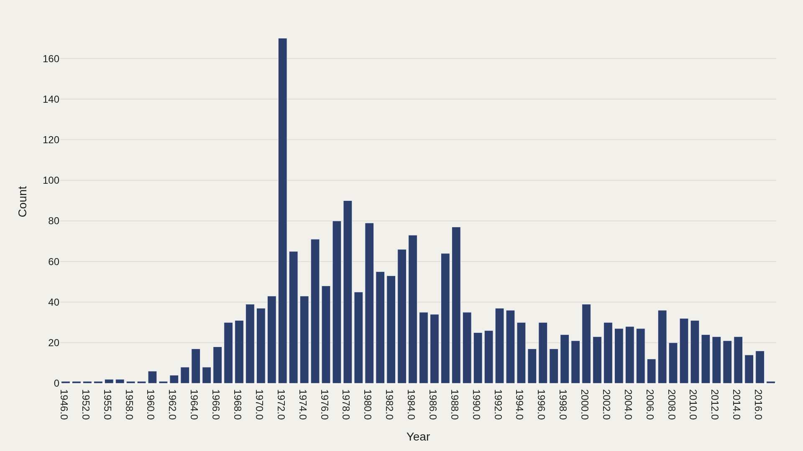
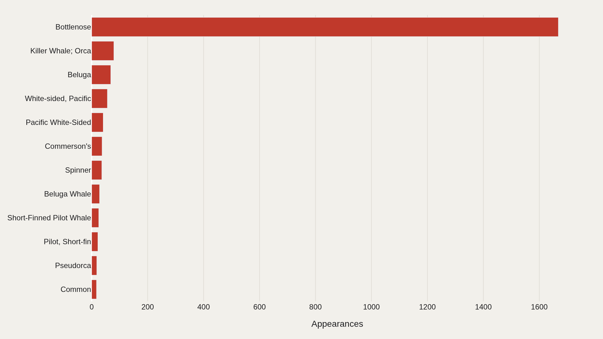
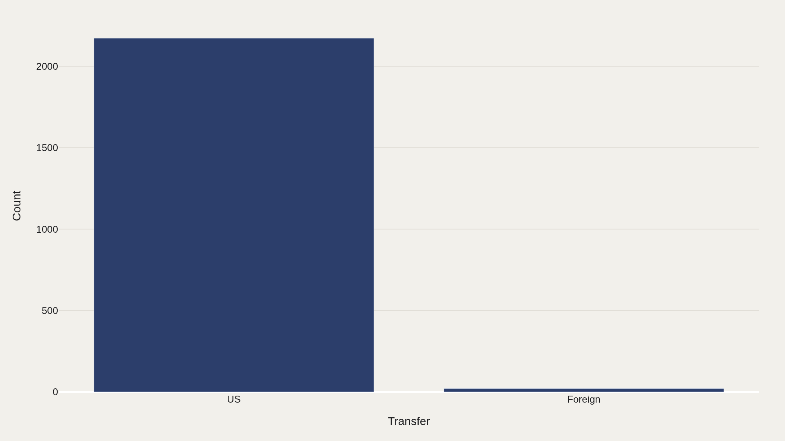
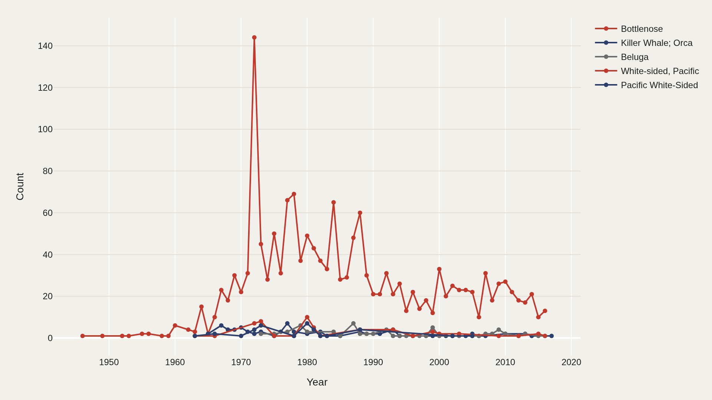

> **TL;DR** Captive cetacean transfer records from 1946–2017 concentrate overwhelmingly in US institutions (2,172 of 2,194 entries) and bottlenose dolphins (1,668 records). Annual volume peaked in 1972 at roughly 170 entries, then declined through the 2010s.

Captive cetacean transfer records from 1946–2017 concentrate overwhelmingly in US institutions: 2,172 of 2,194 entries carry a US label, and bottlenose dolphins account for 1,668 records—76% of the file. Annual volume peaked around 1972 at roughly 170 entries, then declined through the 2010s.

Every timeline and species comparison inherits this bottlenose bias. The archive is a US-centric captivity ledger, not a balanced global survey.

## Fast facts {#fast-facts}

The numbers that set the scale for this report:

- **2,194** — Records in the working dataset

  1946–2017Year span covered in the file
  USMost common Transfer

## Data and method {#data-and-method}

The source is the TidyTuesday release from 2018-12-18 (allCetaceanData.csv). After cleaning, 2,194 rows remain.

Charts emphasize transfer geography, annual volume, species leaders, and timelines for the most frequent names. Charts are Plotly JSON with PNG fallbacks.

## Transfers Concentrate Overwhelmingly in the US {#transfers-concentrate-overwhelmingly-in-the-us}

### US dominates with 2,172 records

US-labeled transfers account for 2,172 records versus 22 marked Foreign. The geography of the file reflects US institutional reporting, not global captivity patterns.

Any species comparison inherits that reporting bias. What looks like a biological pattern may be an artifact of institutional geography.

## Annual Volume Peaked in the Early 1970s {#annual-volume-peaked-in-the-early-1970s}

### Records By Period

Record counts by year crest around 1972 at roughly 170 entries, with smaller peaks in the late 1970s and early 1980s: 90 in 1978, 80 in 1977, 79 in 1980. By the 2010s, annual counts decline to single digits.

The volume timeline tracks institutional activity—when transfers were logged most densely, and when documentation thinned.

## Bottlenose Is the Archive's Default Animal {#bottlenose-is-the-archive-s-default-animal}

### Bottlenose appears 1,668 times — the most recurring name in the file

Bottlenose appears 1,668 times—an order of magnitude above Killer Whale/Orca (79), Beluga (68), and Pacific white-sided variants (combined labels in the several dozens).

Without bottlenose, this would be a small file. With it, every other species is a minority subplot.

## The US Bucket Is the Landscape {#the-us-bucket-is-the-landscape}

### US is the largest bucket with 2,172 records

Restating the geography: US 2,172 versus Foreign 22. The category chart is almost a single bar.

Claims about global captivity patterns cannot be read from this extract without external sources that rebalance non-US institutions.

## Species Timelines Follow Different Eras {#species-timelines-follow-different-eras}

### Leaders Over Time

Bottlenose transfers spike with the early-1970s volume peak (about 144 in 1972). Orca records show smaller pulses across the late 1960s–1980s. Beluga counts rise in scattered later years. White-sided labels show activity in the 1970s–1980s.

Different species enter the ledger on different clocks—bottlenose sets the tempo.

## What this file cannot tell you {#what-this-file-cannot-tell-you}

US overrepresentation may reflect data compilation, not true global distribution. Species name variants (Beluga vs Beluga Whale; multiple white-sided spellings) fragment counts.

The file does not measure welfare outcomes, wild population status, or legal regime changes except insofar as they altered what got recorded.

## What to take away {#what-to-take-away}

Across 2,194 rows, the story is concentration twice over: US geography (2,172) and bottlenose identity (1,668).

Cite the 1972 volume peak when discussing historical intensity, and treat non-bottlenose species as sparse but distinct timelines inside a bottlenose-dominated ledger.

## Sources {#sources}

Data Science Learning Community. (2018). TidyTuesday: Cetaceans. https://raw.githubusercontent.com/rfordatascience/tidytuesday/main/data/2018/2018-12-18/allCetaceanData.csv

