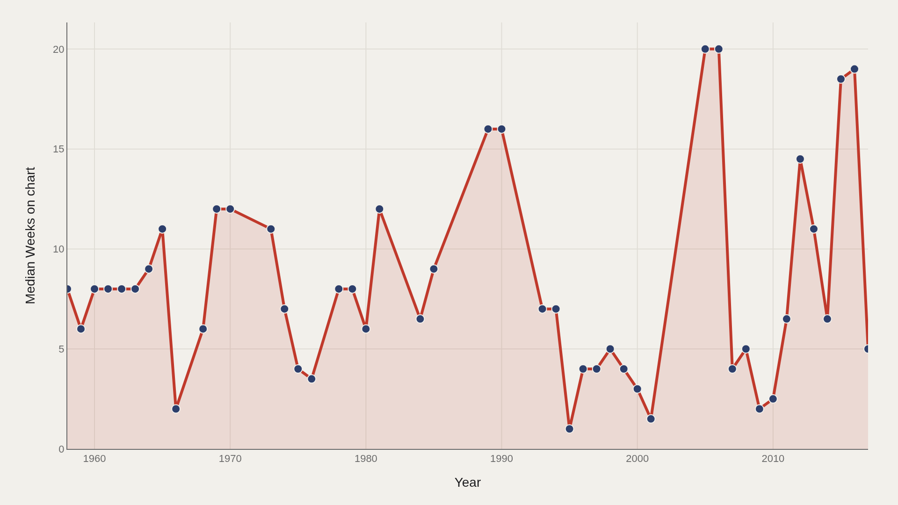
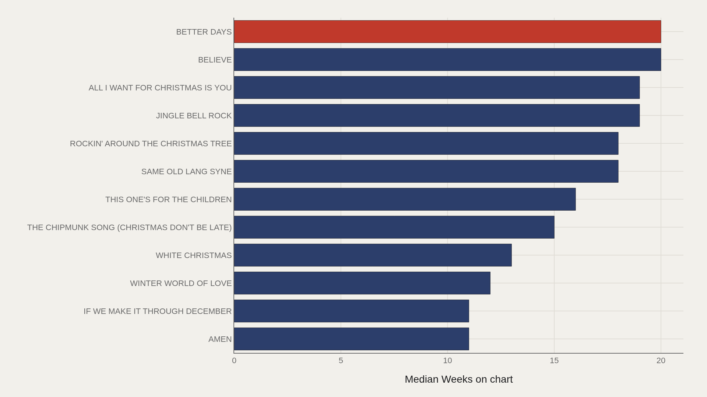
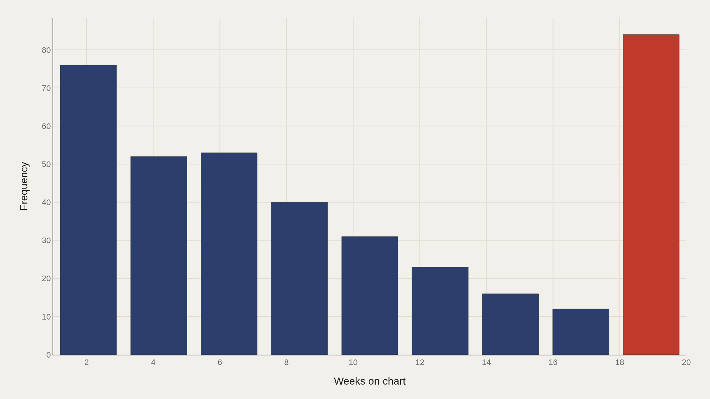
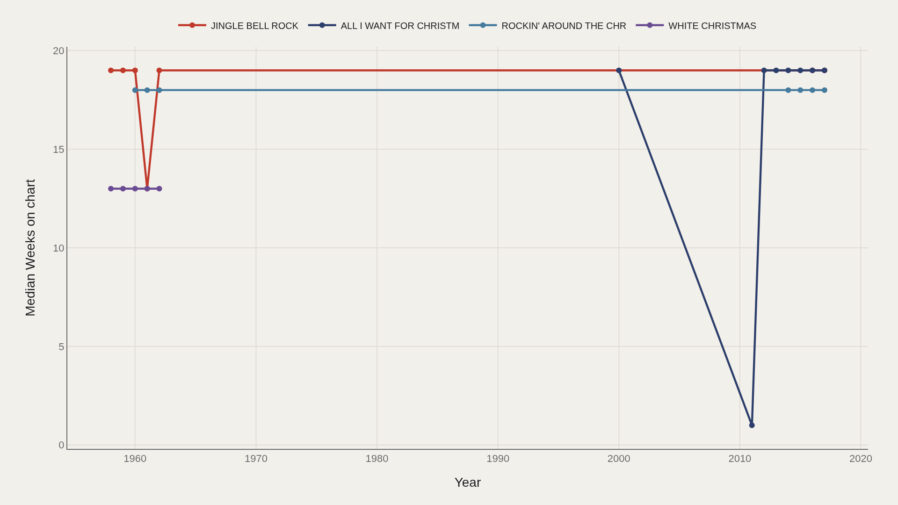
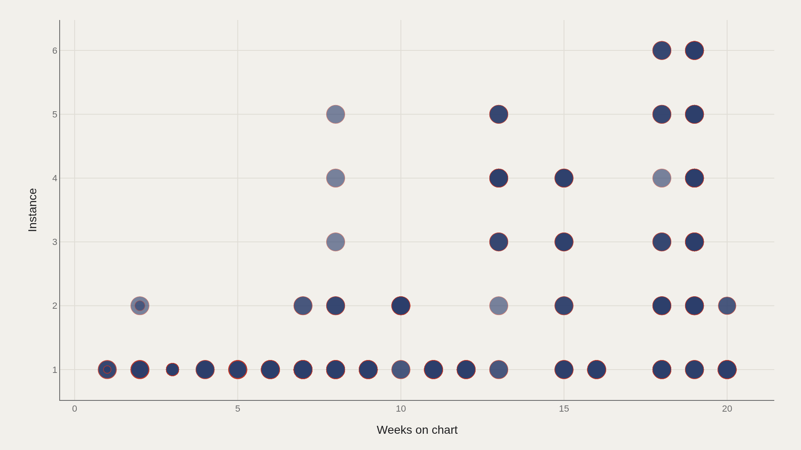

> **TL;DR** Holiday songs return each December, accumulate weeks, then vanish. Analysis of 387 records (1958–2017) shows a median 8 weeks on chart, a 20-week maximum, and perennial standards like Jingle Bell Rock and All I Want for Christmas Is You dominating the top tier.

Holiday songs occupy a peculiar chart niche: they return every December, accumulate weeks, then disappear. Analysis of 387 records spanning 1958–2017 shows a median of 8 weeks on chart and a maximum of 20. Better Days and Believe reach the ceiling. Perennial titles—Jingle Bell Rock, All I Want for Christmas Is You, Rockin' Around the Christmas Tree, White Christmas—form the recurring core across six decades.

The pattern reveals a repertoire system, not a new-release market. The same recordings cycle through decades, accumulating weeks on each return.

## Fast facts {#fast-facts}

The numbers that define this analysis:

- **387** — Records in the working dataset

  8.00Median Weeks on chart
  20.0Highest observed Weeks on chart
  17.0Median Weeks on chart (top dozen songs)
  1958–2017Year span covered in the file

## Data and method {#data-and-method}

The source is the TidyTuesday release from 2019-12-24 (christmas_songs.csv). After cleaning, 387 rows remain.

Weeks on chart is the primary metric; instance captures repeat chart appearances. Charts are Plotly JSON with PNG fallbacks.

## Seasonal Weeks Spiked in the Mid-2000s {#seasonal-weeks-spiked-in-the-mid-2000s}

### Median Weeks on chart Over Time

Median weeks on chart by year reached 20 in 2005–2006, with other peaks in the mid-2010s (2016 at approximately 19 weeks, 2015 at approximately 18.5 weeks). Earlier years ranged between 11 and 16 weeks; a few years dropped to single digits or near 1 week.

Changes in chart methodology (from airplay to sales to streaming) and the expansion of seasonal playlists both contributed to how many weeks holiday songs accumulated per year.

## Twenty Weeks Marks the Upper Club {#twenty-weeks-marks-the-upper-club}

### Better Days and Believe lead at 20.0 weeks; top dozen songs average 17.0 weeks

Better Days and Believe lead at 20 weeks. Jingle Bell Rock and All I Want for Christmas Is You follow at 19 weeks each; Same Old Lang Syne and Rockin' Around the Christmas Tree at 18 weeks each. The median among the top dozen is 17 weeks.

Against a file median of 8 weeks, that elite group exceeds the typical holiday chart life by more than double.

## Most Songs Cluster at Short Chart Lives {#most-songs-cluster-at-short-chart-lives}

### Weeks on chart Distribution

The distribution shows substantial counts at both very short weeks-on-chart values and a high concentration near the upper teens (approximately 84 observations near the distribution's peak). Mid-range stays occupy the space between these two poles.

Holiday songs cluster at two extremes: brief seasonal appearances and extended multi-week December occupations. Few settle in the middle.

## Standards Reappear Across Decades {#standards-reappear-across-decades}

### Top Songs Over Time

Jingle Bell Rock posted 19-week seasons in the late 1950s–early 1960s and again in 2016–2017. All I Want for Christmas Is You showed 19-week runs across multiple 2010s seasons after earlier quiet appearances. Rockin' Around the Christmas Tree similarly appeared in the early 1960s and mid-2010s peaks. White Christmas charted at 13 weeks in 1958–1962.

The timeline confirms a repertoire system, not a new-release market. The same recordings cycle through decades, accumulating weeks on each return.

## More Instances Often Meet Longer Weeks {#more-instances-often-meet-longer-weeks}

### Weeks on chart vs Instance

Weeks on chart versus instance count shows perennial titles with multiple chart appearances clustering in the high-weeks region, while one-time chart entries scatter across both short and long stays.

Re-entry drives holiday chart longevity. The same recording returns each December, accumulating new weeks with each cycle.

## What this file cannot tell you {#what-this-file-cannot-tell-you}

Chart methodologies changed over the 1958–2017 span (airplay, sales, streaming), making weeks on chart across decades imperfectly comparable. Title capitalization and punctuation variations can split identical songs into separate records.

The dataset reflects U.S. chart logic only and does not measure global streaming playlists or contemporary holiday releases beyond 2017.

## What to take away {#what-to-take-away}

Holiday chart life centers at 8 weeks, with a 20-week ceiling and a top-dozen median of 17 weeks. Standards recur across decades rather than aging out of rotation.

Cite standards like Jingle Bell Rock, All I Want for Christmas Is You, and Rockin' Around the Christmas Tree when discussing cultural durability in music. Cite the 8-week median when addressing a typical seasonal chart appearance.

## Sources {#sources}

Data Science Learning Community. (2019). TidyTuesday: Christmas Songs. https://raw.githubusercontent.com/rfordatascience/tidytuesday/main/data/2019/2019-12-24/christmas_songs.csv

