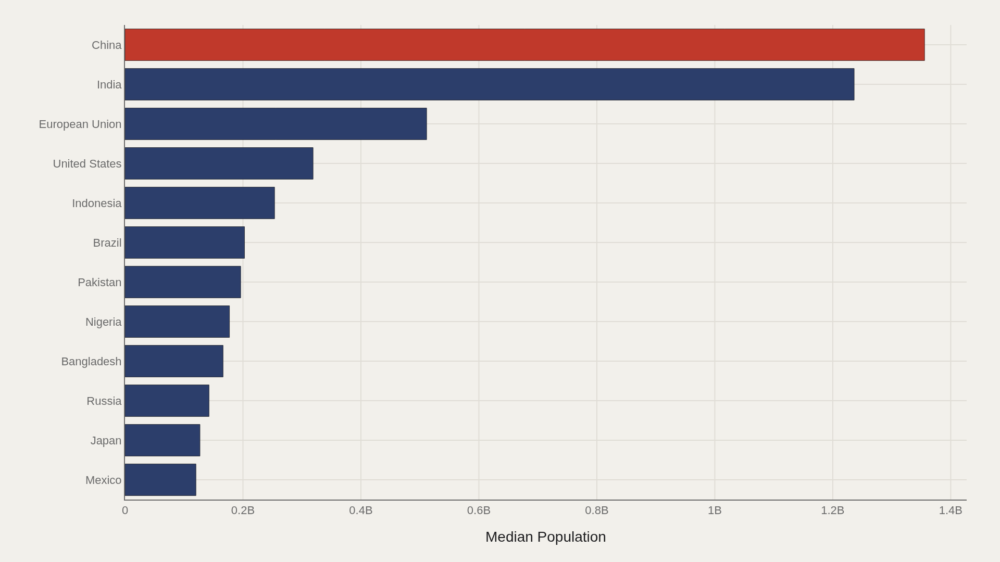
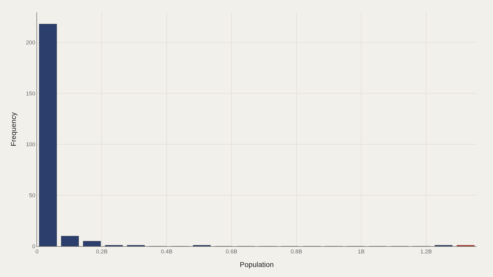
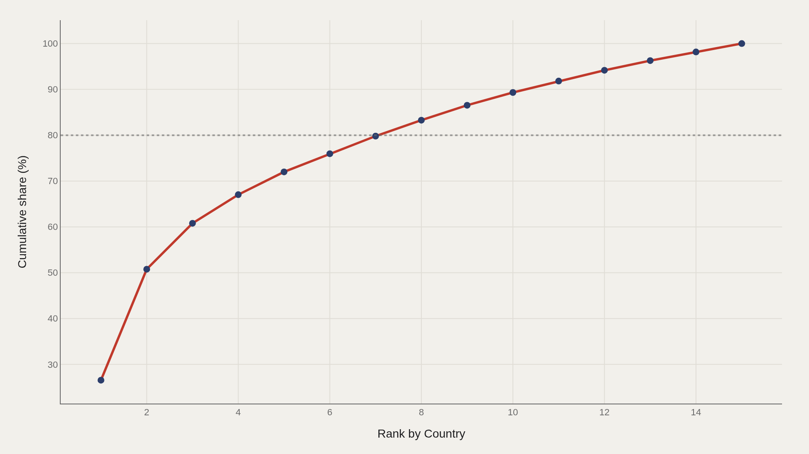
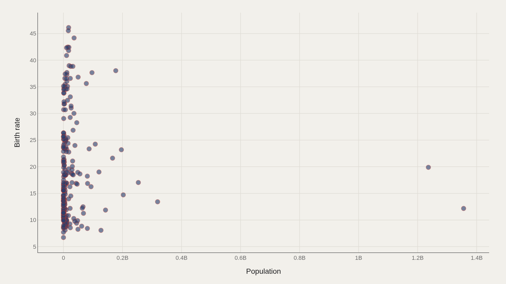

> **TL;DR** 259 countries in the CIA World Factbook extract show a median population of 5,220,371 while China reaches 1,355,692,576. The top five countries account for 72% of aggregate population. High birth rates cluster among smaller nations, not demographic giants.

China's 1,355,692,576 people sit against a global median of 5,220,371 in the CIA World Factbook extract — a 260-fold gap that drives every concentration metric. The top five countries hold 72% of aggregate population; most nations operate at a scale closer to the median than to the summit.

Mean population (~32 million) sits far above the median because a handful of giants pull the average upward. The distribution is right-skewed: 218 of 259 entries fall into the smallest bin.

## Fast facts {#fast-facts}

The numbers that set the scale for this report:

- **259** — Records in the working dataset

  5,220,371Median Population
  1,355,692,576Highest observed Population
  ChinaTop Country by Population

## Data and method {#data-and-method}

The source is the TidyTuesday release from 2024-10-22 (cia_factbook.csv). After cleaning, 259 rows remain.

Population is the primary ranked metric; birth rate appears in the joint scatter. Charts are Plotly JSON with PNG fallbacks.

## A Handful of Giants Dominate Headcount {#a-handful-of-giants-dominate-headcount}

### Population by Country

China leads at 1.36 billion, India at 1.24 billion, the European Union aggregate near 511 million, the United States near 319 million, Indonesia near 254 million, and Brazil near 203 million.

These six operate in a different scale class than the median country at 5.2 million. They are not outliers; they are the architectural beams of every global concentration statistic.

## Even the Top Dozen Has a Steep Internal Drop {#even-the-top-dozen-has-a-steep-internal-drop}

### China leads at 1,355,692,576 — 199,415,584 marks the median among the top dozen

Within the top twelve, the median is 199,415,584 — less than one-sixth of China's total. The drop from first to sixth is steeper than the drop from sixth to twelfth.

"Large country" is a pyramid, not a plateau. Second-tier giants are already far smaller than the demographic summit.

## Most Countries Sit in the Small-Population Mass {#most-countries-sit-in-the-small-population-mass}

### Median 5,220,371 vs mean 32,294,361 — the shape is right-skewed

The first bin holds 218 of 259 entries. Only a handful of observations reach the billionaire tier or approach it.

The median (5.2 million) describes the typical country; the mean (~32 million) is pulled upward by the giants. Use the median when the question is "most countries" and the top five when the question is "most people."

## The Top Five Already Hold Most of the People {#the-top-five-already-hold-most-of-the-people}

### The top 5 country entries account for 72% of the aggregate population

The Pareto curve shows the top five countries accounting for 72% of aggregate population. By fifteen entries the curve approaches the full plotted total.

Global population is not evenly distributed across flags. It is concentrated in a short list of demographic powers.

## High Birth Rates Cluster Among Smaller Populations {#high-birth-rates-cluster-among-smaller-populations}

### Population vs Birth rate

Birth rates above 40 per 1,000 cluster among countries well below the mega-population tier. Several large countries sit at lower birth rates.

Demographic giants are not fertility leaders. Scale and birth rate are independent stories in the Factbook.

## What this file cannot tell you {#what-this-file-cannot-tell-you}

Factbook figures are estimates with uneven vintage and methodology across entities. Including the European Union alongside countries double-counts if users sum naively. Small territories and disputed entities add definitional noise.

Population totals are not prosperity scores. Pairing with birth rate is descriptive, not a development ranking.

## What to take away {#what-to-take-away}

In 259 Factbook rows, the median country has 5.2 million people while China exceeds 1.35 billion. The top five entries hold 72% of the aggregate in the concentration view.

Cite the median for a typical state; cite China, India, and the Pareto share when the question is planetary concentration.

## Sources {#sources}

Data Science Learning Community. (2024). TidyTuesday: CIA World Factbook. https://raw.githubusercontent.com/rfordatascience/tidytuesday/main/data/2024/2024-10-22/cia_factbook.csv

