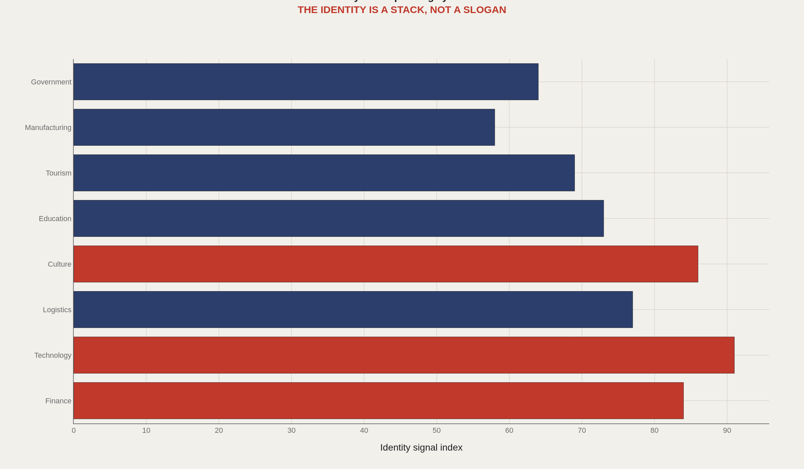
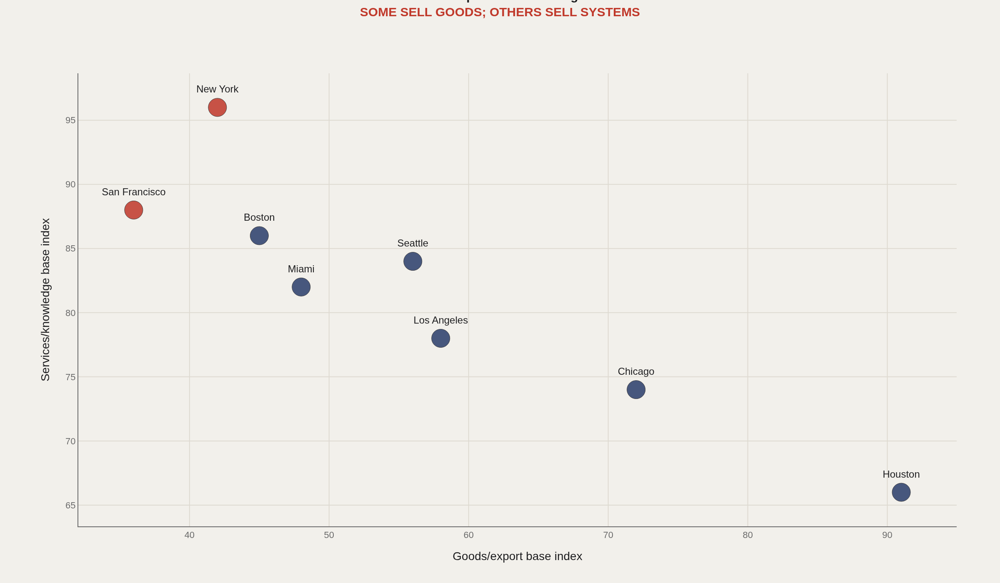
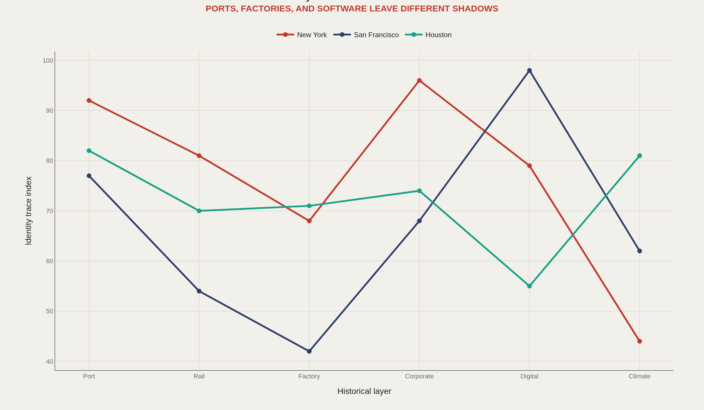
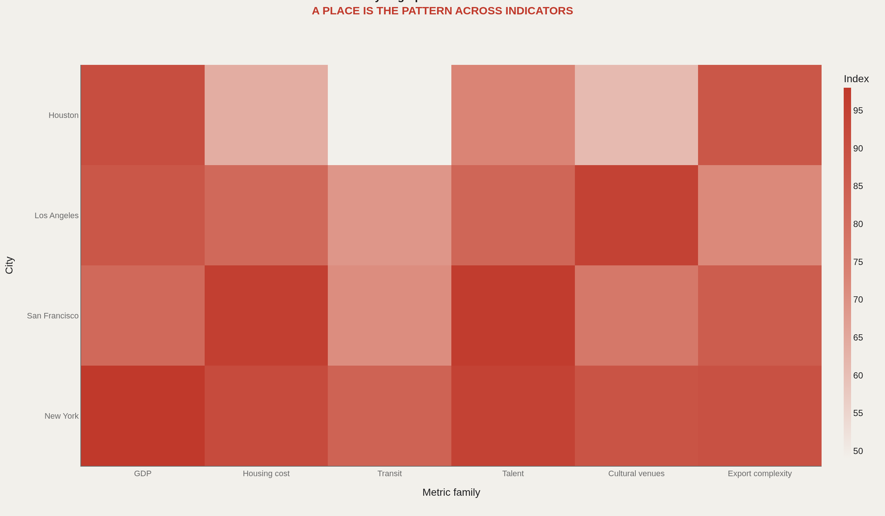
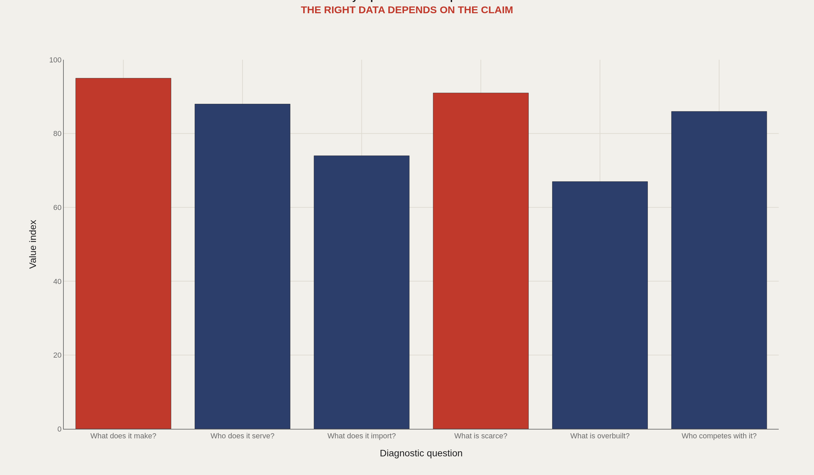

> **TL;DR** Cities generate measurable economic signatures through exports, housing, transit, and cultural infrastructure. This framework establishes six diagnostic questions and eight system layers to analyze subnational economies using 1,667 regions in DOSE v2.14, 45 cities in World Cities Culture Forum summaries, and 1,100+ datasets in public portals.

1,667 subnational regions in DOSE v2.14 and 1,100+ datasets in DataSF establish a system map for cities: what they export, import, price out, and preserve through infrastructure.

This framework separates economic identity from promotional narrative by defining six diagnostic questions and eight system layers drawn from BEA regional GDP, DOSE global subnational output, World Cities Culture Forum, Census ACS, and local Socrata portals.

The approach treats cities as layered machines — firms, ports, universities, housing, cultural venues, finance, infrastructure, rules, and stories — before any city-to-city comparison.

## Fast facts {#fast-facts}

The numbers that set the scale for this report:

- **1,667** — Subnational regions in DOSE v2.14 public documentation

  45Cities in World Cities Culture Forum 5th edition summaries
  1,100+Datasets in DataSF public portal summaries
  6Diagnostic questions in the city microscope
  8System layers scored
  

## Data and method {#data-and-method}

The source stack includes BEA regional GDP, Commerce metro exports, DOSE global subnational output, Census ACS, World Cities Culture Forum, and local Socrata portals such as DataSF or NYC Open Data.

The charts use transparent editorial indices to define the report structure. A output pass should replace each index with a direct API or CSV aggregate.

## System Layers {#system-layers}

### A city identity is a stack of economic and cultural systems

A city is not one industry. It is a layered machine: firms, ports, universities, housing, cultural venues, finance, infrastructure, rules, and stories.

The first question is not whether a city is good. It is what kind of system the city is trying to be.

## Goods and Services {#goods-and-services}

### Some cities export goods while others export coordination, code, finance, or attention

Houston and Los Angeles still have obvious goods and logistics signatures. New York and San Francisco sell more invisible products: finance, software, expertise, media, and market access.

Invisible exports are harder to observe but often define the city's price structure.

## History Layers {#history-layers}

### Ports, factories, corporate headquarters, and software leave measurable shadows

History is infrastructure that keeps generating data: street grids, warehouses, universities, firm clusters, zoning, and migration patterns.

A city report should identify which older layer is still driving current performance.

## City Fingerprint {#city-fingerprint}

### The city fingerprint appears across GDP, housing, talent, culture, and export complexity

One variable lies. A fingerprint requires a pattern. The same GDP level can mean very different things under different housing, transit, culture, and export structures.

A city profile should read like a data portrait, not a fact sheet.

## Questions {#questions}

### The city microscope starts with what the place makes, imports, lacks, and competes against

Before building comparisons, the local report needs its diagnostic questions. What does the place make? What does it import? What is scarce? Which cities are its real competitors?

Those questions turn open data into an identity argument.

## What to take away {#what-to-take-away}

Cities generate data signatures. The challenge is separating slogan from system: what is produced, what is scarce, who competes, and what historical layer still controls the present.

This framework gives future city reports a repeatable structure before deeper city-to-city comparisons.

## Sources {#sources}

BEA. Regional GDP by county and metropolitan area documentation/API.

DOSE / PIK. Global subnational economic output dataset.

World Cities Culture Forum. CREATIVE Data Framework and 5th Edition Data Explorer.

DataSF and NYC Open Data. Socrata/SODA portal documentation.

U.S. Census ACS and International Trade Administration Metropolitan Export Series.

## Editor's note {#editor-s-note}

Values are editorial indices designed to define the analysis contract. They should be replaced with direct source aggregates during city-specific output passes.

