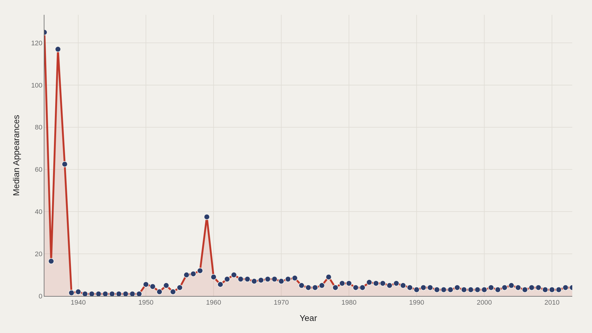
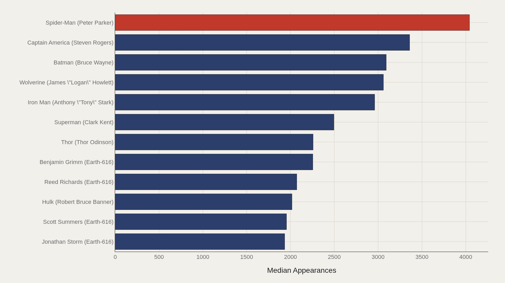
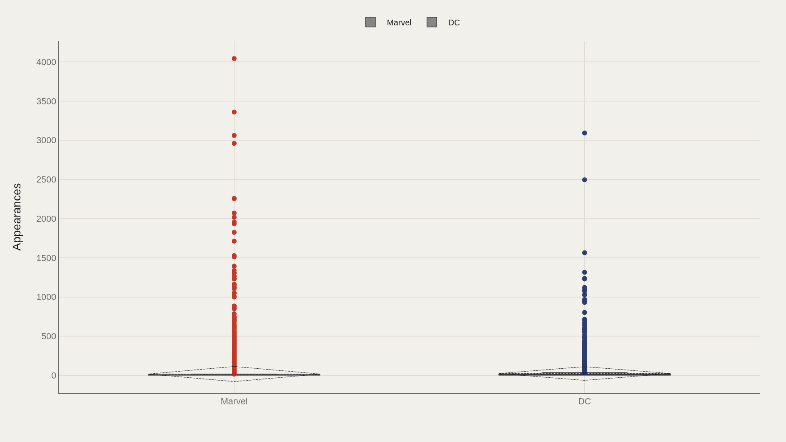
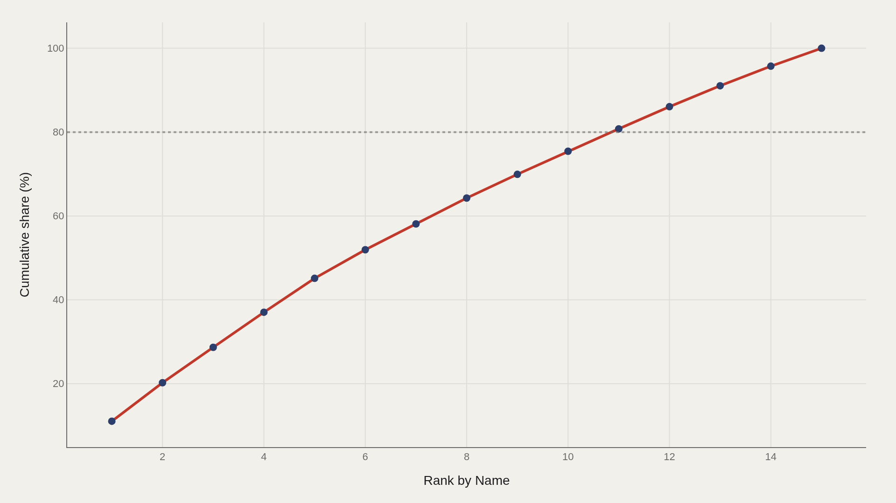

> **TL;DR** Spider-Man (Peter Parker) leads 23,272 comic characters (1935–2013) with 4,043 appearances. The median character appears four times. The top five names account for 45% of cumulative appearances in the ranked dataset.

Spider-Man (Peter Parker) logged 4,043 appearances across the 23,272 characters in the TidyTuesday comic-characters dataset (1935–2013), while the median character appeared 4 times. The top five names account for 45% of cumulative appearances in the ranked view, concentrating franchise mass in a narrow band of superhero infrastructure.

That four-appearance median reflects structural reality: most named characters never become franchise centers. The charts below measure how appearance volume clusters at the top.

## Fast facts {#fast-facts}

The numbers that set the scale for this report:

- **23,272** — Records in the working dataset

  4Median Appearances
  4,043Highest observed Appearances
  Spider-Man (Peter Parker)Top Name by Appearances
  1935–2013Year span covered in the file
  MarvelMost common Publisher

## Data and method {#data-and-method}

The source is the TidyTuesday release from 2018-05-29 (week9_comic_characters.csv). After cleaning, 23,272 rows remain.

Appearances is the primary metric; publisher splits Marvel versus DC; Pareto charts show concentration among leading names. Charts are Plotly JSON with PNG fallbacks.

## Early Characters Logged Higher Median Appearances {#early-characters-logged-higher-median-appearances}

### Median Appearances Over Time

Median appearances by first-appearance year peak in the mid-1930s—125 in 1935, 117 in 1937—then decline toward single digits as the catalog expands with short-lived characters.

Golden Age cohorts logged higher medians because survivors were reprinted and reintroduced more often. Later decades added thousands of characters who never anchored ongoing series.

## A Dozen Icons Own the Appearance Summit {#a-dozen-icons-own-the-appearance-summit}

### Spider-Man (Peter Parker) leads at 4,043 — 2,377 marks the median among the top dozen

Spider-Man leads at 4,043 appearances, followed by Captain America (3,360), Batman (3,093), Wolverine (3,061), Iron Man (2,961), and Superman (2,496). The median among the top dozen is 2,377.

These characters are publishing infrastructure—identities that anchor ongoing series, crossovers, and adaptation franchises. Popularity alone does not explain the gap between 4,043 and 4; continuous editorial use does.

## Marvel Has More Characters; DC's Median Appearances Run Higher {#marvel-has-more-characters-dc-s-median-appearances-run-highe}

### Appearances by Publisher

Marvel contributed 15,280 records with a median of 3 appearances and a maximum of 4,043. DC contributed 6,541 records with a median of 6 and a maximum of 3,093 (Batman).

Marvel's catalog is wider; DC's typical character logged more appearances. Volume and intensity represent different editorial strategies—Marvel expanded the roster, DC concentrated use among established names.

## The Top Five Names Hold Nearly Half the Leader Aggregate {#the-top-five-names-hold-nearly-half-the-leader-aggregate}

### The top 5 name entries account for 45% of the aggregate appearances

The top five characters account for 45% of cumulative appearances among ranked leaders. The curve climbs steeply to 100% by the fifteenth name.

Franchise comics follow a power-law distribution. A short list of identities absorbs most cumulative attention; the long tail contributes little to aggregate appearance volume.

## Concentration Repeats as a Structural Fact {#concentration-repeats-as-a-structural-fact}

### The top 5 name entries account for 45% of the aggregate appearances

The second Pareto chart restates the same concentration: top five near 45%, curve approaching 100% by the fifteenth name.

Repeating the view confirms the pattern is structural, not a binning artifact. Appearance mass in superhero publishing concentrates systematically at the top of the roster.

## What this file cannot tell you {#what-this-file-cannot-tell-you}

Appearance counts depend on how databases credit cameos, alternate Earths, and reboots. The publisher field collapses imprints. The 2013 cutoff predates the full MCU/DCEU feedback loop on print appearances.

The four-appearance median should not be interpreted as "characters only show up four times then vanish" without verifying how incomplete rows are handled in the source.

## What to take away {#what-to-take-away}

Across 23,272 characters, the median appearance count is 4 while Spider-Man logged 4,043. The top five leaders hold 45% of cumulative appearances in the ranked view.

Marvel's wider catalog contrasts with DC's higher median. The dozen icons above 2,300 appearances represent the industry's core publishing capital—characters that carry ongoing series, crossovers, and franchise adaptations.

## Sources {#sources}

Data Science Learning Community. (2018). TidyTuesday: Comic Book Characters. https://raw.githubusercontent.com/rfordatascience/tidytuesday/main/data/2018/2018-05-29/week9_comic_characters.csv

