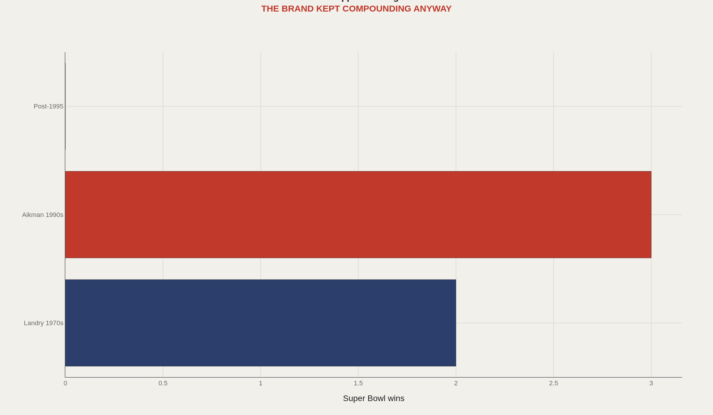
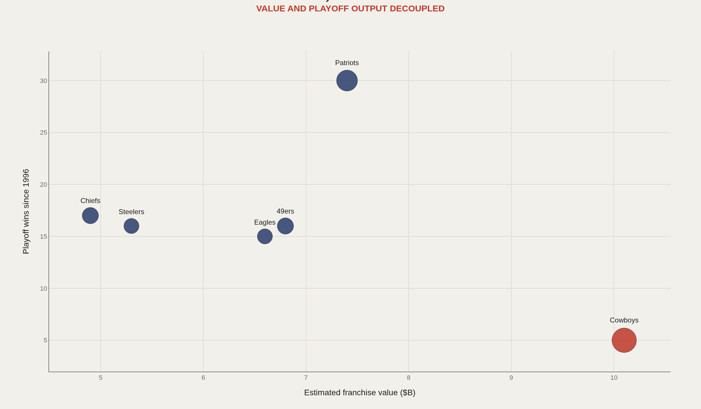
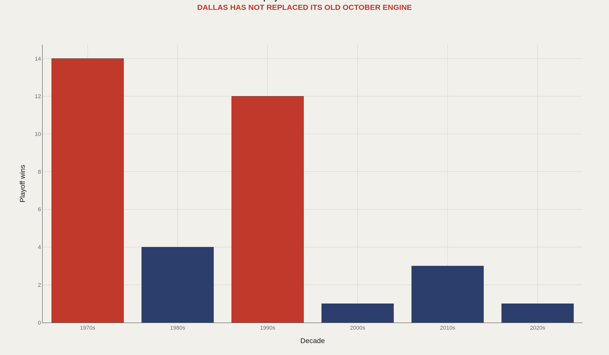
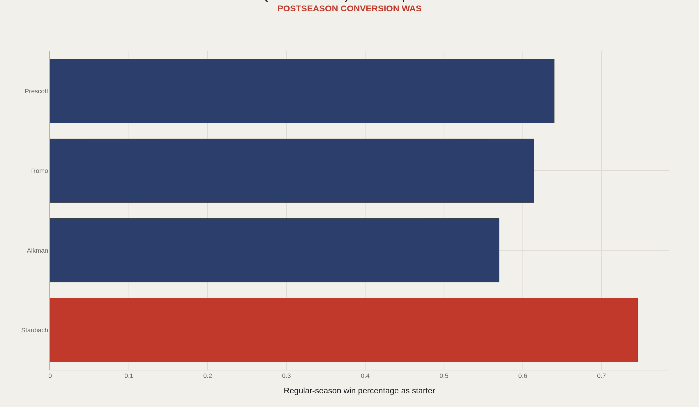
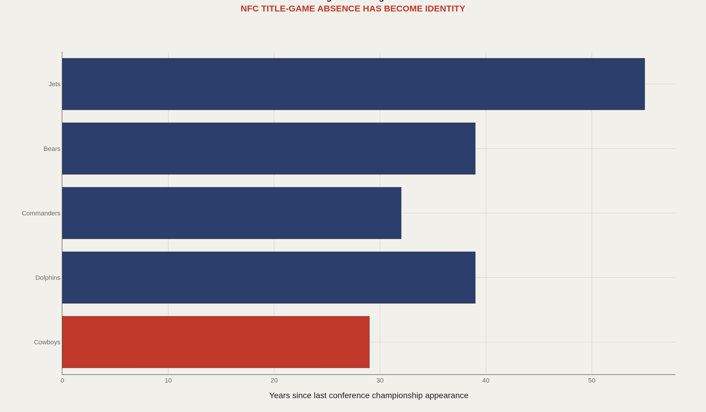

> **TL;DR** The Dallas Cowboys hold the NFL's highest franchise value—above $10 billion—while posting zero NFC championship appearances since 1995. Five Super Bowl titles built the mythology; the last arrived 29 years ago. The modern paradox: brand attention scales while playoff conversion stalls.

The Dallas Cowboys hold the NFL's highest franchise value—above $10 billion—while posting zero NFC championship appearances since 1995. Every season begins with outsized coverage and outsized expectation, yet the same question remains unresolved: when does brand gravity become football gravity again?

This report examines the Cowboys' NFC East competitive dynamics, the revenue premium attached to the "America's Team" brand, and the measurable gap between franchise valuation and Super Bowl conversion since 1995—the last time Dallas won it all.

Five Super Bowl titles built the mythology. The last arrived in the 1995 season. Entering 2025, the Cowboys have gone 29 years without an NFC championship appearance. The franchise is now defined by a modern paradox: the most valuable brand in American sports has mastered demand while failing to convert playoff chances under maximum visibility.

The charts measure that split: titles by era, franchise value against playoff wins since 1996, playoff wins by decade, regular-season winning percentage by quarterback era, and the conference championship drought beside other frustrated franchises.

## The numbers behind the story {#fast-facts}

- **5** — Super Bowl championships

  1995Most recent Super Bowl-winning season
  29Years since last NFC championship appearance entering 2025
  $10B+Widely cited estimated franchise value range
  3Super Bowls from the 1990s Aikman-Smith-Irvin core
  0Conference championship appearances since the 1995 season

## The Super Bowl column froze after two old engines {#titles-by-era}

Dallas title history concentrates in two eras: Landry's 1970s dynasty and the Aikman–Smith–Irvin 1990s core, which delivered three of five franchise Super Bowls. Since 1995, the Super Bowl column is empty.

The Cowboys did not cease being nationally important when they stopped winning titles. That disconnect is the problem: brand continuity without championship renewal.

## The richest brand, a modest recent playoff archive {#brand-outlier}

The Cowboys occupy the strangest point in modern football economics: the richest brand with a modest postseason record. Franchise value and January wins have decoupled.

The organization excels at monetizing attention but underperforms at converting playoff chances. That split defines the franchise's modern identity.

## The 1970s and 1990s still carry the memory {#the-old-october-engine}

The 1970s and 1990s account for the franchise's postseason credibility. Decades after do not match the logo's cultural weight. Playoff wins no longer scale with America's Team status.

This is not ordinary losing. It is a globally recognized franchise whose postseason record has fallen out of step with its attention share.

## Quarterback competence never solved conversion {#quarterback-era-paradox}

Quarterback competence has not been missing. Romo and Prescott produced enough regular-season wins to sustain national relevance. The missing link is conversion: translating stable quarterback play into deep playoff runs.

Regular-season competence preserves the brand. It does not automatically reopen the conference championship path.

## The drought now ranks with football's other long waits {#the-conference-wall}

The Cowboys' NFC championship drought now belongs on the same chart as franchises synonymous with futility. Twenty-nine years without that appearance, entering 2025, transcends a regional problem.

Dallas is not cursed by invisibility. It is cursed by maximum visibility. The spotlight transforms a football gap into national theater.

## America's Team has mastered demand, not January supply {#conclusion}

The Cowboys are not a failed sports business. They may be the most successful sports business in America. That makes the football gap more stark.

America's Team has mastered demand. The unfinished work is converting demand back into postseason supply—conference championships first, Super Bowls only after the conversion engine restarts.

## Data and method {#dataset-context}

Public Pro Football Reference playoff records, Sports Reference franchise summaries, and Forbes franchise valuation estimates supply the figures. Values are rounded because the argument depends on order of magnitude, not accounting precision. Quarterback win percentages follow conventional starter-record methods—era indicators, not individual value models.

A front-office analyst calls this a conversion problem. A Cowboys fan calls it pain. Both are measurable: the gap between attention and January output.

## References {#references}

Pro Football Reference. Dallas Cowboys Franchise Encyclopedia.

Forbes. NFL Team Valuations, recent estimates.

Sports Reference playoff and quarterback starter records.

NFL historical postseason records.

Related Artometrics reports: Patriots.

## Editor's note {#editors-note}

Franchise valuation figures are widely cited Forbes estimates, rounded for order-of-magnitude comparison. Quarterback-era win percentages are conventional starter-record summaries, not advanced value models.

