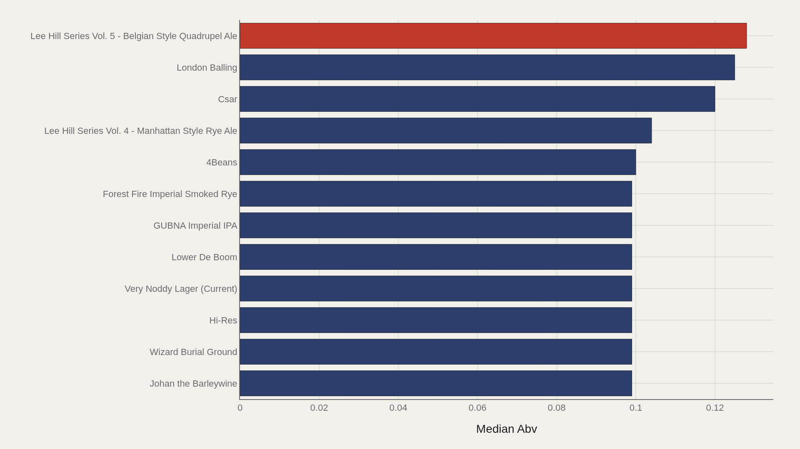
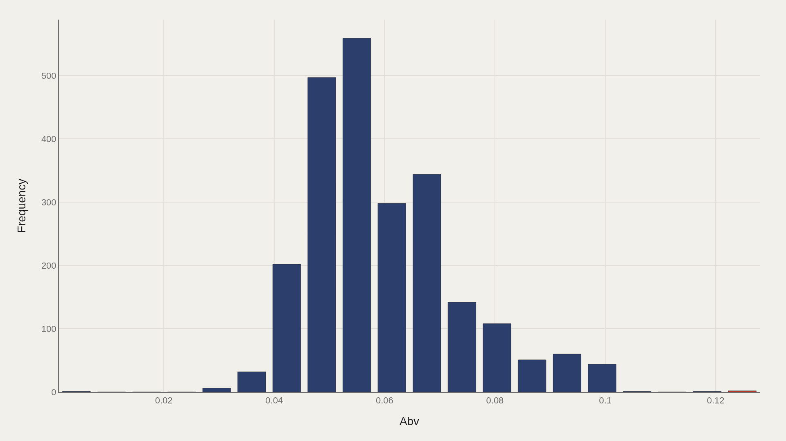
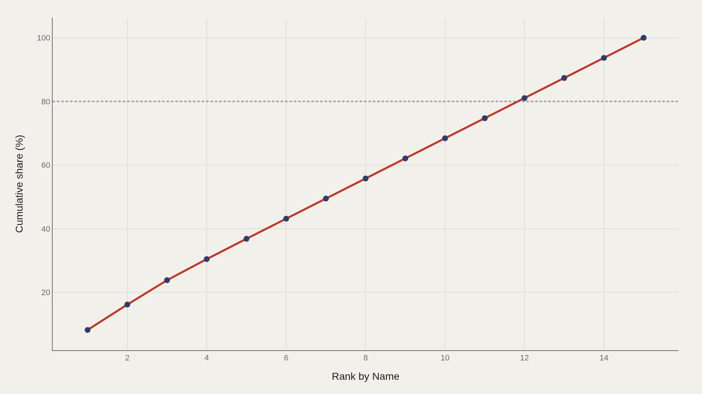
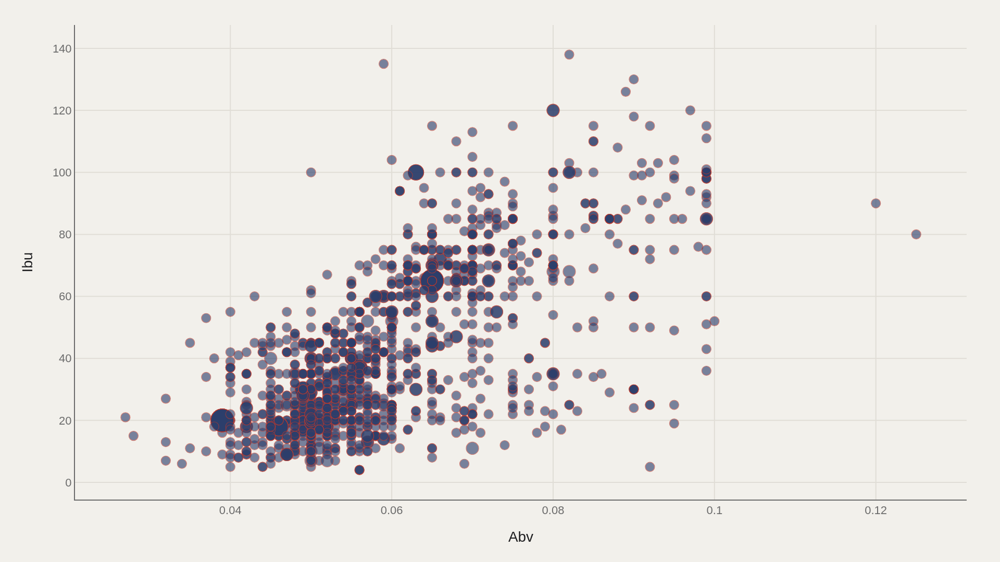

> **TL;DR** U.S. craft beer's strength distribution centers on 6% ABV across 2,410 records. Lee Hill Series Vol. 5 — Belgian Style Quadrupel Ale tops the range at 12.8%. High-ABV outliers above 10% represent a boutique tail; most beers cluster near session strength, and bitterness (IBU) rises with alcohol but not uniformly.

The strongest U.S. craft beer in this 2,410-record extract reaches 12.8% ABV (Lee Hill Series Vol. 5 — Belgian Style Quadrupel Ale), but the median sits at 6%. High-gravity outliers above 10% form a boutique tail; the bulk of the catalog clusters near session-to-standard strength, with bitterness (IBU) rising alongside alcohol in hop-forward styles but diverging in malt-heavy quads and stouts.

The distribution is right-skewed: hundreds of beers occupy the 5–6% bins, counts fall past 9%, and the famous 12–13% outliers are rare.

## Fast facts {#fast-facts}

The numbers that set the scale for this report:

- **2,410** — Records in the working dataset

  0.06Median Abv
  0.13Highest observed Abv
  Lee Hill Series Vol. 5 - BelTop Name by Abv

## Data and method {#data-and-method}

The source is the TidyTuesday release from 2018-07-10 (week15_beers.xlsx). After cleaning, 2,410 rows remain.

ABV is the primary ranked metric; IBU joins in the scatter. Charts are Plotly JSON with PNG fallbacks.

## High-ABV Outliers Are Named Experiments {#high-abv-outliers-are-named-experiments}

### Abv by Name

Lee Hill Series Vol. 5 leads at 0.128 ABV, London Balling at 0.125, and Csar at 0.120. The next cluster — Lee Hill Vol. 4, 4Beans, Johan the Barleywine, Wizard Burial Ground, Hi-Res — sits near 0.10.

These titles are the marketing edge of craft, not the median pint.

## The Top Dozen Still Doubles Everyday Strength {#the-top-dozen-still-doubles-everyday-strength}

### Lee Hill Series Vol

The leaders cap at 0.128, with the rest of the top dozen occupying the 0.10–0.12 band — roughly double the 0.06 median.

Use 0.06 as the typical craft ABV in this extract and 0.10+ as the specialty high-gravity threshold.

## Most Beers Pile Up Near 5–6% ABV {#most-beers-pile-up-near-5-6-abv}

### Median 0.06 vs mean 0.06 — the shape is right-skewed

The tallest bins sit at 0.05–0.06 ABV (hundreds of beers each), with counts falling as ABV climbs toward 0.09–0.10 and almost vanishing above 0.11.

Right skew is real but thin: the famous 12–13% outliers are rare relative to the pale-ale middle.

## High-ABV Names Concentrate in a Short List {#high-abv-names-concentrate-in-a-short-list}

### The top 5 name entries account for 37% of the aggregate abv

The first five high-ABV beers hold 37% of the aggregate strength share, rising toward the full total by the fifteenth entry.

Extreme ABV is boutique — concentrated among a few strong releases.

## Bitterness and Strength Rise Together — Imperfectly {#bitterness-and-strength-rise-together-imperfectly}

### Abv vs Ibu

ABV versus IBU across roughly 1,400 plotted points shows many high-IBU IPAs in the 0.06–0.09 ABV band, with some beers exceeding 120 IBU. High ABV does not guarantee high IBU; stouts and quads can be strong without chasing hop extremes.

The joint distribution maps the craft design space: hop-forward versus malt-forward paths to intensity.

## What this file cannot tell you {#what-this-file-cannot-tell-you}

ABV and IBU fields can be missing or rounded. Style coverage depends on which breweries entered the scrape. "Craft" definitions and the 2018 vintage miss later hard-seltzer and nonalcoholic shifts.

Name-level leaders may be one-off specialty releases, not flagship year-round beers.

## What to take away {#what-to-take-away}

Across 2,410 U.S. craft beers, median ABV is 0.06 while the ceiling reaches 0.128. Most of the catalog lives near everyday strength; the high-gravity tail is short and famous.

Use the ABV–IBU scatter to explain style strategy: bitterness and alcohol are correlated tools, not a single dial.

## Sources {#sources}

Data Science Learning Community. (2018). TidyTuesday: Craft Beer USA. https://raw.githubusercontent.com/rfordatascience/tidytuesday/main/data/2018/2018-07-10/week15_beers.xlsx

