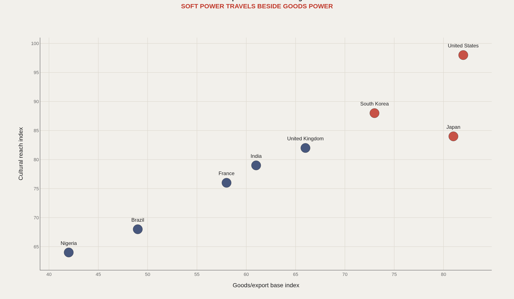
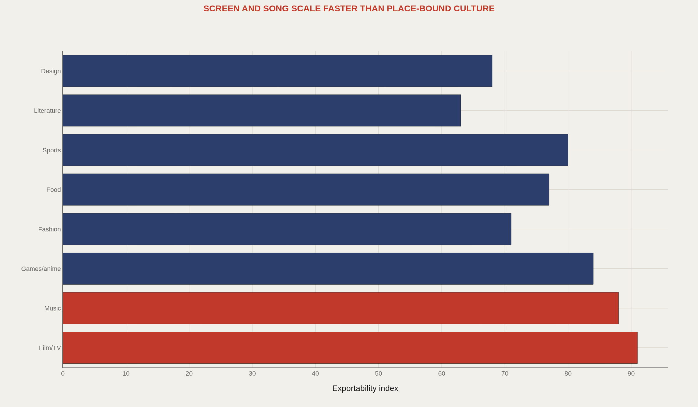
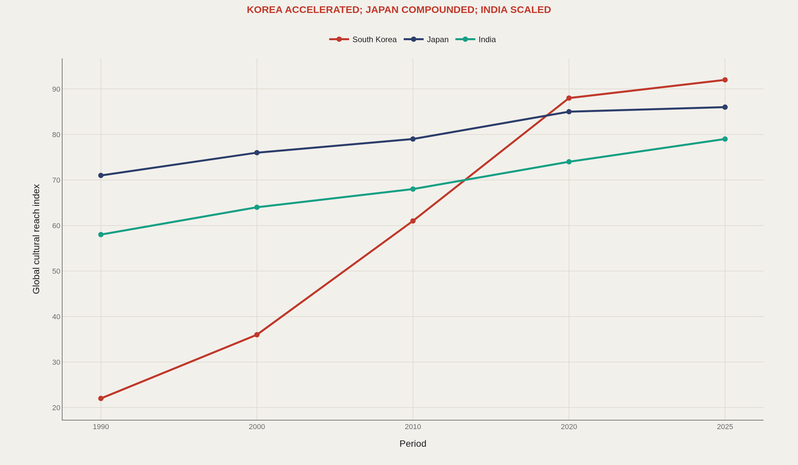
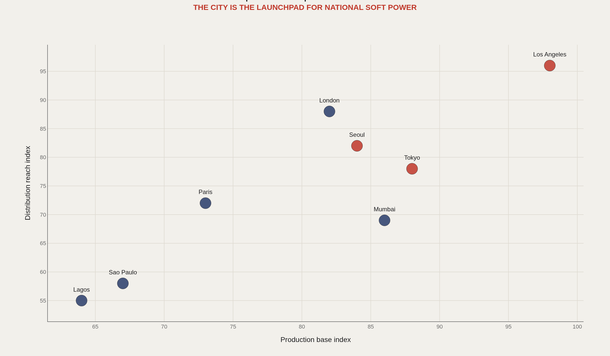
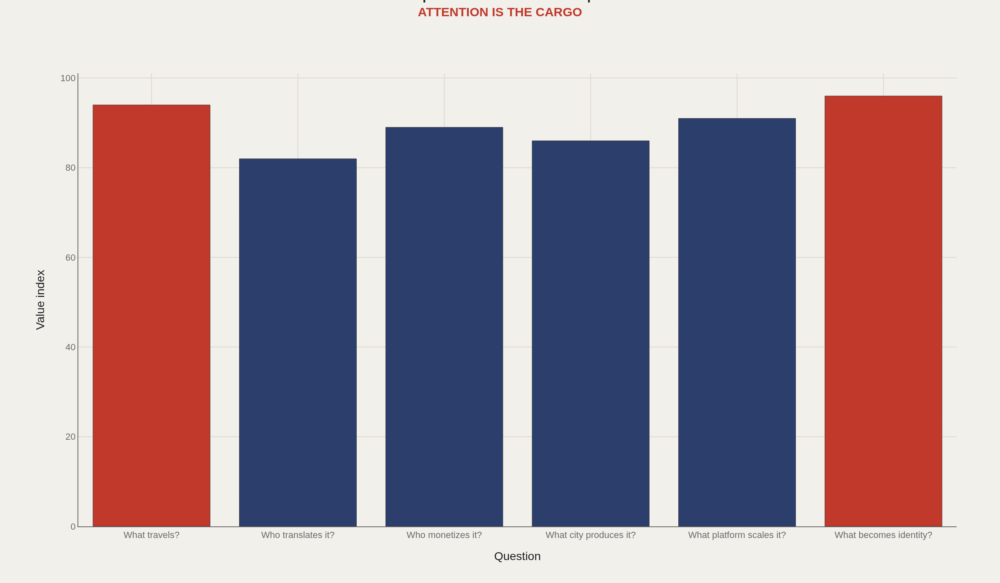

> **TL;DR** Film and music rank highest on exportability indices among eight cultural mediums. South Korea's cultural wave index rose from 22 in 1990 to 92 in 2025. Cities function as production and distribution launchpads for national soft power, with distinct acceleration patterns across Japan, South Korea, and India.

Film scores 91 on exportability, music 88, and games/anime 84 across eight cultural mediums. South Korea's cultural wave index rose from 22 in 1990 to 92 in 2025, Japan compounded from 71 to 86, and India scaled from 58 to 79 over the same period. This analysis covers 8 cultural-export systems, 45 global cities in the World Cities Culture Forum dataset, and 6 diagnostic questions that convert attention into measurable trade.

The charts use editorial indices to structure the cultural-trade question before deeper alignment with UNESCO, WIPO, and platform data: what travels, where it is produced, who monetizes it, and how it becomes identity.

## Fast facts {#fast-facts}

The numbers that set the scale for this report:

- **8** — Countries and cultural-export systems highlighted

  8Mediums scored for exportability
  6Diagnostic cultural trade questions
  45Global cities in World Cities Culture Forum 5th edition summaries
  3Asian cultural wave paths compared
  

## Data and method {#data-and-method}

The source stack includes UNESCO cultural statistics, WIPO creative-industry indicators, World Bank and OECD services data, MusicBrainz, IMDb/TMDb-style film metadata, Wikidata, and World Cities Culture Forum materials.

Values in the figures are editorial indices that structure the argument. Direct ingestion should replace them with cultural trade, platform, awards, tourism, and city infrastructure aggregates.

## Soft Power and Trade {#soft-power-and-trade}

### Cultural exports travel alongside goods and services exports

The soft-power versus goods-power scatter places eight systems along both axes, with the strongest joint positions reaching the high 80s and 90s on the editorial scales. Culture and merchandise exports often move together, but not always in equal proportion.

A country can export cars, chips, oil, or software. It can also export characters, songs, films, cuisine, style, and celebrity. Attention shifts the world's willingness to engage with the rest of the economic proposition.

## Medium Exportability {#medium-exportability}

### Screen and song scale faster than place-bound culture

Film/TV scores 91 on exportability, music 88, and games/anime 84. Sports sits at 80, food at 77, fashion at 71, design at 68, and literature at 63 among the eight mediums.

Screen and song scale through platforms with minimal need for physical presence. Place-bound culture travels too, but typically requires translation, institutional support, or logistical infrastructure.

## Cultural Waves {#cultural-waves}

### South Korea accelerated, Japan compounded, and India scaled through different cultural clocks

South Korea's editorial wave index rises from 22 in 1990 to 92 in 2025—a 70-point climb. Japan compounds from 71 in 1990 to 86 in 2025. India scales from 58 to 79 over the same markers.

The comparison documents mechanism, not ranking: strategic acceleration, long compounding through anime, games, and design, and diaspora-plus-film scaling represent distinct patterns.

## Cultural Pipeline Cities {#cultural-pipeline-cities}

### Cultural export cities combine output base with distribution reach

City pipeline scores pair output base with distribution reach. The strongest joint positions sit near the top-right of the scatter (high 90s), with a descending ladder of other export cities behind them.

Los Angeles-style output-distribution hubs, Seoul-style coordinated export platforms, and Tokyo-style games, anime, and design engines function as urban launchpads for national soft power.

## Cultural Trade Questions {#cultural-trade-questions}

### Cultural exports ask what travels, who translates it, and what becomes identity

The diagnostic ranking elevates what becomes identity (96), what travels (94), what platform scales it (91), who monetizes it (89), what city produces it (86), and who translates it (82).

Those questions convert culture into a measurable export system without collapsing it to ticket revenue alone. Attention is the cargo; identity is the durable inventory.

## What this file cannot tell you {#what-this-file-cannot-tell-you}

Editorial indices are scaffolding for later ingestion of UNESCO, WIPO, platform, and city data—not official trade rankings. Cultural "exports" blur royalties, tourism spillovers, and platform geography in ways a single score cannot isolate.

Language markets, censorship regimes, and diaspora size can dominate outcomes in ways the exportability indices alone cannot capture.

## What to take away {#what-to-take-away}

Cultural exports belong in geoeconomics because attention moves markets: tourism, language learning, fashion, food demand, and diplomatic standing.

Screen and music travel fastest on these indices; South Korea, Japan, and India show distinct wave patterns; cities function as production and distribution launchpads. Replace the indices with direct data before treating the scores as league tables.

## Sources {#sources}

UNESCO Institute for Statistics and UNESCO cultural trade references.

WIPO creative economy and intellectual property indicators.

World Cities Culture Forum. CREATIVE Data Framework.

MusicBrainz / MetaBrainz dumps.

IMDb/TMDb/Wikidata public metadata references.

World Bank and OECD services and export datasets.

## Editor's note {#editor-s-note}

Values are editorial indices. They define the cultural export framework before direct UNESCO, WIPO, platform, and city data ingestion.

