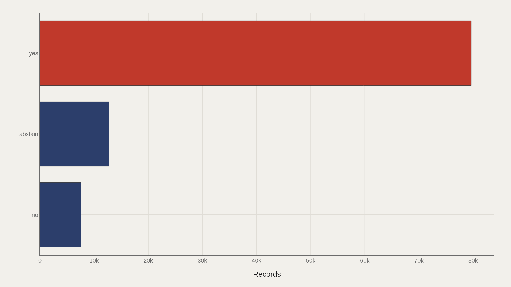
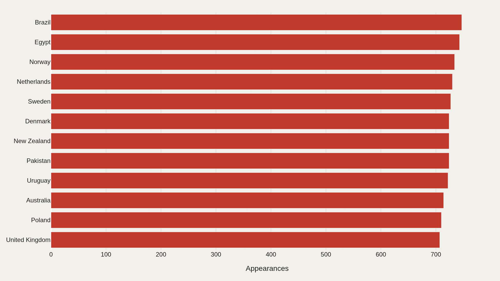
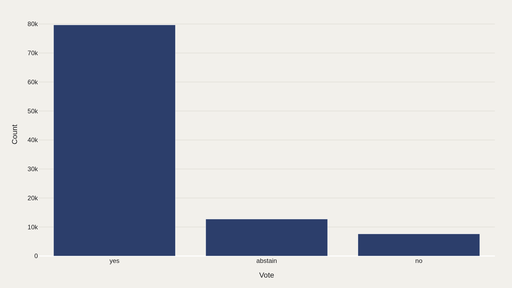
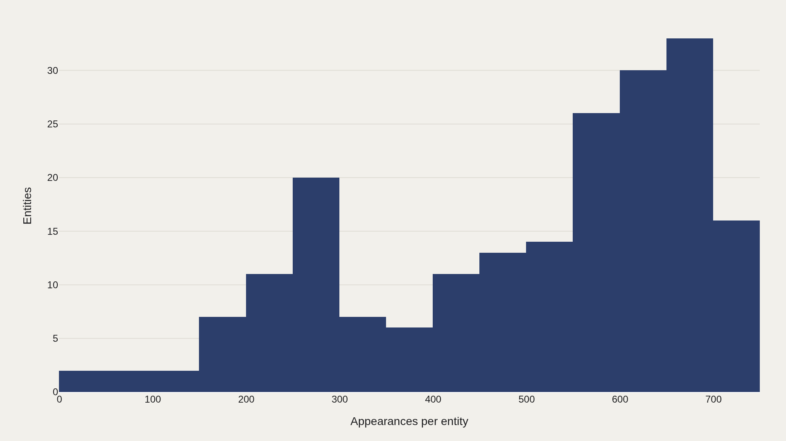
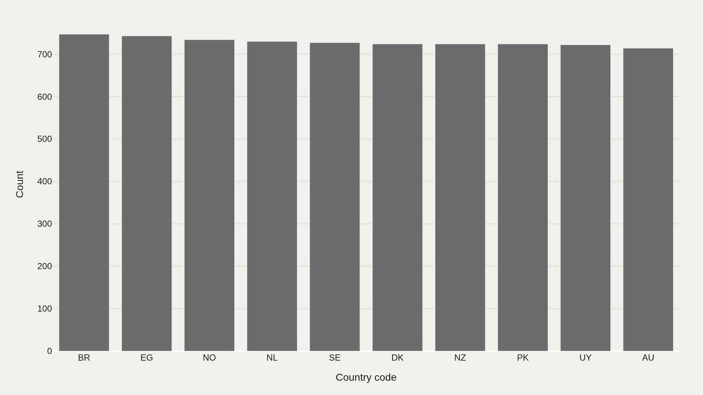

> **TL;DR** A 100,000-record extract of United Nations roll-call votes shows 79,663 affirmative positions (80%), Brazil appearing 747 times as the most recurring member state, and a long-tail distribution in which most countries appear only once. The dataset is categorical — no numeric scores — making it a recurrence and frequency archive rather than a win-rate leaderboard.

In a 100,000-record extract of United Nations roll-call votes, 79,663 positions (80%) are affirmative, Brazil appears 747 times as the most recurring member state, and most country entities appear only once. The dataset is categorical — no numeric scores — making it a recurrence and frequency archive rather than a win-rate leaderboard.

The first job of this file is structural: map the distribution of yes, no, and abstain, identify which member names recur, and confirm whether country-code metadata aligns with entity labels across the sample.

## Research question {#research-question}

What does a 100,000-row extract of United Nations roll-call votes reveal before any ideological coalition model is fitted? This report asks how vote categories are distributed, which member-state names recur most often, and whether country-code metadata confirms or complicates the entity picture.

The question is descriptive. A yes-heavy table does not mean the General Assembly lacks conflict; it means this sample's recorded positions concentrate in one category. The analysis starts with vote mass and country recurrence before moving toward interpretive claims about alignment.

## Data and method {#data-and-method}

The source is the TidyTuesday release from 2021-03-23 (R for Data Science community). The working file contains 100,000 rows and 4 columns after merging available tables in the week folder. Vote is the primary categorical field; country and country code provide entity axes; frequency charts summarize repetition.

There is no single numeric score column. The analysis is categorical: counts, shares, and recurrence.

## Yes votes dominate the sampled UN record {#yes-votes-dominate-the-sampled-un-record}

### Yes votes dominate the sampled UN record

Yes dominates with 79,663 records. In a 100,000-row extract, that is the center of gravity: 80% of recorded positions in this slice are affirmative. Abstain and no exist, but they do not match yes for volume.

Dominance here is a frequency fact, not proof that the General Assembly always agrees. It shows where the mass of the table sits before any conflict analysis begins.

The United Nations General Assembly often votes on resolutions that have already passed through committees, negotiations, amendments, and diplomatic bargaining. A large yes category can therefore reflect agenda-setting and consensus-building before the roll call, not an absence of disagreement in world politics. The public vote is the final visible record of a process that began earlier.

UN voting scholars usually move beyond raw categories into ideal-point models, affinity scores, or issue-area subsets because the meaning of a yes vote depends on the resolution. A yes on decolonization, a yes on nuclear disarmament, and a yes on a budgetary item are all affirmative votes, but they do not carry the same geopolitical signal.

## Brazil appears most often among country names {#brazil-appears-most-often-among-country-names}

### Brazil appears most often in this extract

Brazil appears 747 times — the most recurring country name in the file. The top dozen countries account for a visible share of all 100,000 rows, which is what a recurring-member chart shows: who is densely present in the extract.

High appearance counts can reflect coverage, membership longevity, or how the sample was built. They are presence metrics, not win rates.

Brazil has been a United Nations member since 1945 and is a frequent actor in General Assembly voting records. The country's foreign-policy tradition includes visible positions on development, non-intervention, South-South cooperation, and Security Council reform. But the 747 appearances shown here are a row-count fact, not a claim that Brazil is uniquely influential in every issue area.

Country recurrence is also shaped by institutional continuity. Newer UN members, dissolved states, renamed states, and countries with interrupted or transformed membership histories appear differently from long-standing members. The Soviet Union/Russia, Yugoslavia/successor states, Czechoslovakia/Czechia and Slovakia, and country-name standardization issues are why entity handling matters in UN vote data.

## Vote categories restate the file's center of gravity {#vote-categories-restate-the-file-s-center-of-gravity}

### Vote categories reveal the file's center of gravity

Yes is again the largest bucket with 79,663 records when vote categories are plotted as a bar landscape. Repeating the category cut confirms that the headline frequency is not an artifact of a single chart type.

Category concentration shows where editorial attention should start — with the yes majority — while still leaving room to inspect the smaller no and abstain bands.

Abstentions deserve caution because they can mean several things: neutrality, strategic ambiguity, alliance pressure, domestic constraint, protest against wording, or unwillingness to oppose a popular resolution directly. In Cold War voting studies, abstention is often treated as analytically distinct from both yes and no because it can carry diplomatic information without joining either pole.

No votes are smaller in this extract, but they are often more diagnostic. A rare no can identify a strongly contested resolution, a bloc split, or a state protecting a core interest. The category chart gives the denominator; substantive research still needs resolution identifiers and issue tags to interpret the minority categories.

## Country appearances follow a long-tail pattern {#country-appearances-follow-a-long-tail-pattern}

### Country appearances follow a long-tail pattern

Most country entities appear only once in the frequency view; a small head recurs repeatedly. That power-law shape is typical of catalog-style international tables: a few members are densely observed, many are sparse.

Long tails warn against over-reading rare countries as if they had the same sample depth as Brazil-scale recurrence.

The long tail can reflect countries that entered the United Nations later, states that changed names, country labels split across historical entities, or sample construction that does not preserve every roll call for every member equally. Tuvalu, South Sudan, Czechia, and North Macedonia do not have the same historical runway as Brazil, India, France, or the United States.

For comparative work, this means country-level rates need exposure denominators. A country observed 747 times can sustain a more stable voting-profile estimate than a country observed only a handful of times. Presence depth is a statistical precondition for diplomatic interpretation.

## Country codes add a second identity layer {#country-codes-add-a-second-identity-layer}

### Country codes add metadata rather than a new thesis

BR is the most repeated country code in the extract — the code-level echo of Brazil's name-level lead. Secondary dimensions like codes add join keys and metadata when the primary table has no numeric score column.

Codes are infrastructure for linking, not a rival thesis to the vote-share story. They confirm entity identity across the 100,000-row sample.

Country codes matter because names are historically unstable. "Congo," "Democratic Republic of the Congo," "Congo, Democratic Republic," "Russia," "Russian Federation," and former state names can fracture a table if the join key is text alone. Codes make it possible to connect UN votes to region, income group, alliance, population, or trade data without hand-cleaning every label.

The BR code leading alongside Brazil's name indicates that the entity layer is internally coherent for the top case. That does not guarantee the whole file is perfectly standardized, but it shows why the extra chart exists: metadata fields are the connective tissue that allow UN voting records to become analyzable political data.

## What this file cannot tell you {#what-this-file-cannot-tell-you}

Community-cleaned TidyTuesday snapshots are not the full UN voting API. Missing values, country-name variants, and week-of-export coverage limits apply. A 100,000-row extract may be a sample or a capped export rather than every roll call ever taken.

Findings describe this UN votes file — structural signals about vote categories and country recurrence — not a complete theory of international coalitions.

## What to take away {#what-to-take-away}

In this extract, yes is the majority language of recorded votes (79,663 of 100,000), Brazil is the most recurring country name (747 appearances), and BR leads among country codes.

The long tail of country appearances means presence is uneven. Start with the yes majority and the dense head of member recurrence; treat sparse countries as thin evidence until coverage is checked.

## Sources {#sources}

Data Science Learning Community. (2021). TidyTuesday: UN Votes. https://raw.githubusercontent.com/rfordatascience/tidytuesday/main/data/2021/2021-03-23/unvotes.csv

Data Science Learning Community. (2021). TidyTuesday UN Votes source folder. https://github.com/rfordatascience/tidytuesday/tree/main/data/2021/2021-03-23

Erik Voeten. United Nations General Assembly Voting Data. Harvard Dataverse. https://doi.org/10.7910/DVN/LEJUQZ

Bailey, M. A., Strezhnev, A., & Voeten, E. (2017). Estimating dynamic state preferences from United Nations voting data. Journal of Conflict Resolution, 61(2), 430–456. https://doi.org/10.1177/0022002715595700

United Nations Digital Library. Voting data and General Assembly records. https://digitallibrary.un.org/

United Nations. Member States. https://www.un.org/en/about-us/member-states

## Editor's note {#editors-note}

Artometrics data report from the TidyTuesday research pipeline. Charts and aggregates are reproducible from the embedded exhibits and public source files.

Source archive (GitHub)

