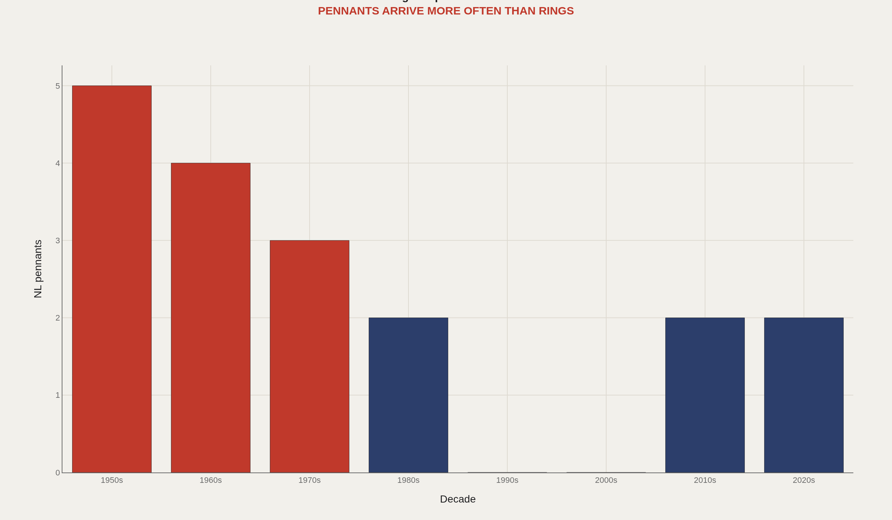
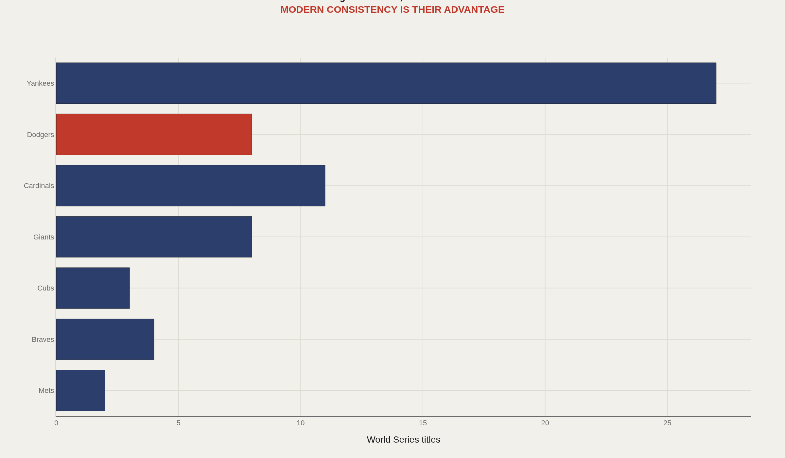
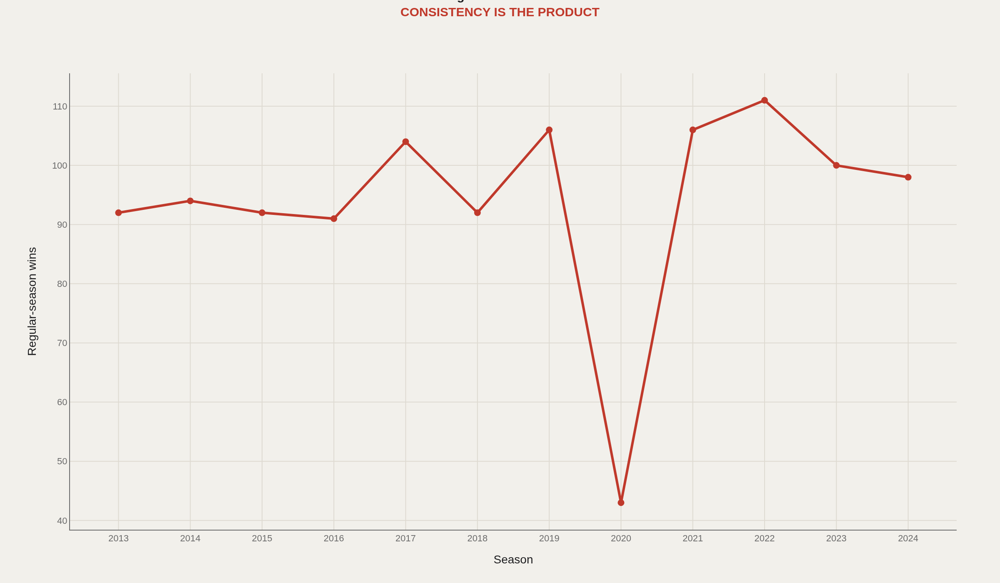
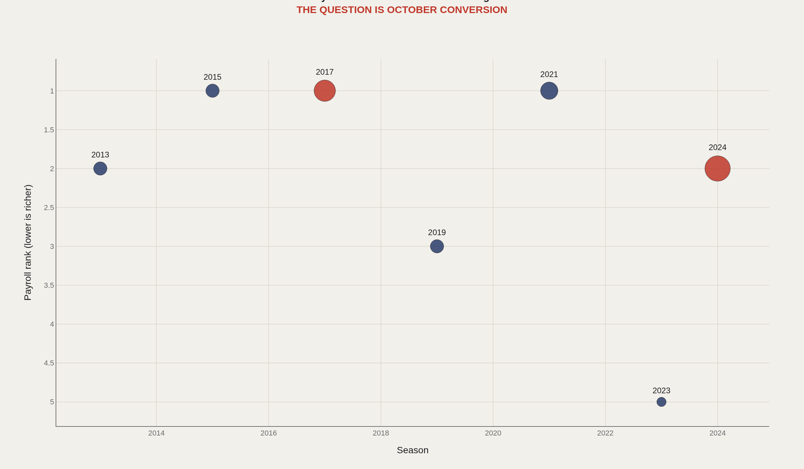
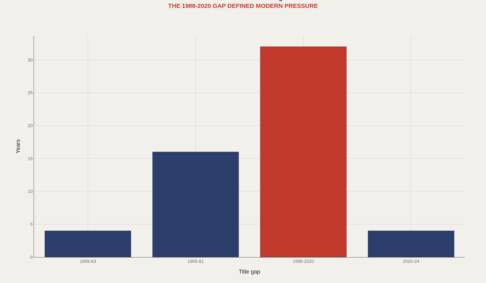

> **TL;DR** The Dodgers made the playoffs twelve consecutive years from 2013 through 2024, won 111 games in 2022, and claimed championships in 2020 and 2024. The system is depth and payroll converting into October access. The risk is that short series erase everything the regular season proves.

The Dodgers won 111 regular-season games in 2022, reached the playoffs twelve consecutive years from 2013 through 2024, and still needed championships in 2020 and 2024 to prove the machine could close.

Eight World Series titles and roughly twenty-five National League pennants place the franchise among baseball's historic elite—without Yankee-scale monopoly. The better label is access machine: an organization designed to survive variance until variance finally cooperates. Depth, development, payroll, and market power working as one system produce the regular-season floor. October still decides whether the floor matters.

What follows charts that machine: pennants by decade, title context among historic clubs, the modern 90-win floor, spending against October markers, and the long shadow of the 1988-to-2020 ring gap.

## The numbers behind the story {#fast-facts}

- **8** — World Series championships in franchise history

  25Approximate National League pennants
  111Regular-season wins in 2022
  32Years between the 1988 and 2020 titles
  12Straight postseason appearances from 2013 through 2024
  2024Most recent championship

## Los Angeles is built to manufacture October chances {#pennant-machine}

The Dodgers treat October access as a renewable resource. Pennants by decade show an organization built around reaching the postseason repeatedly and staying in the pennant race long enough for randomness to break their way.

Los Angeles looks less like a championship factory and more like a machine for creating the conditions where championships become possible.

## Historically elite—without Yankee-scale monopoly {#title-context}

Eight titles place the Dodgers among baseball's historic clubs without putting them in the Yankees' separate category. The modern argument rests on consistency: the team has made contention feel industrial.

The question is whether a high-floor machine can beat postseason variance often enough to match its regular-season reputation.

## Since the 2010s, 90-win baseball has looked normal {#the-90-win-floor}

Since the early 2010s, the Dodgers have made 90-win baseball look normal. Organizational infrastructure shows up as a line chart—the 111-win 2022 season as the ceiling spike inside a sustained high floor.

The shortened 2020 season interrupts the scale, but not the story. The floor stayed high even when the schedule compressed.

## Spending is structural—October still breaks machines {#spending-conversion}

Los Angeles spends structurally: depth, scouting, player development, stars, and injury insurance. Payroll rank and October markers show how often that infrastructure buys access—and how often short series erase it.

Postseason baseball can make the best system look fragile in a five-game sample. The modern Dodgers debate lives in that contradiction.

## Thirty-two years of access without closure still shape the brand {#the-1988-shadow}

The thirty-two years between 1988 and 2020 remain the emotional center of modern Dodger analysis. The team was often good, sometimes excellent, and still ringless. Access without closure became the franchise's defining frustration.

2020 and 2024 matter differently because they validate the machine after decades of opportunity that refused to finish.

## Repeated access is the defining trait {#conclusion}

The Dodgers are system-rich: player development, payroll, scouting, and market power keeping the contention line high season after season.

The defining trait is not one championship. It is repeated access to the conditions where championships become possible—and, finally, enough conversion to prove the industrial model can close.

## Data and method {#dataset-context}

Public Baseball Reference franchise records, Lahman-style season summaries, and widely cited payroll-rank histories feed the charts. The emphasis is franchise identity and era structure rather than player-level WAR modeling. The shortened 2020 season is left unadjusted and read separately in the prose.

Analysts focus on depth and conversion. Fans feel the distance between six months of excellence and surviving October. The gap between those experiences is the Dodgers' modern story.

## References {#references}

Baseball Reference. Los Angeles Dodgers Franchise History.

Lahman, S. Lahman Baseball Database.

Forbes and public payroll-rank summaries.

Retrosheet and Baseball Almanac pennant/title records.

Related Artometrics reports: Yankees · Padres · Giants.

## Editor's note {#editors-note}

Pennant totals are approximate franchise summaries from public records. The 2020 season is shown unadjusted. Payroll ranks are editorial summaries from public salary tables, not tax-payroll figures.

