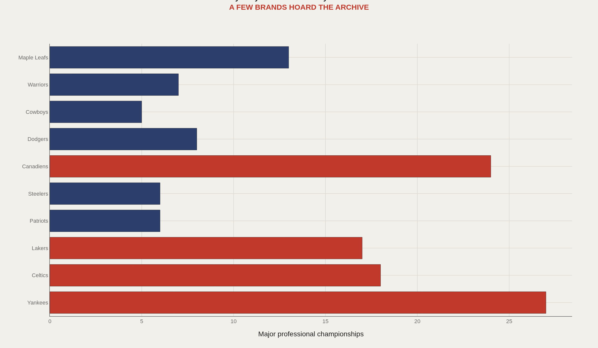
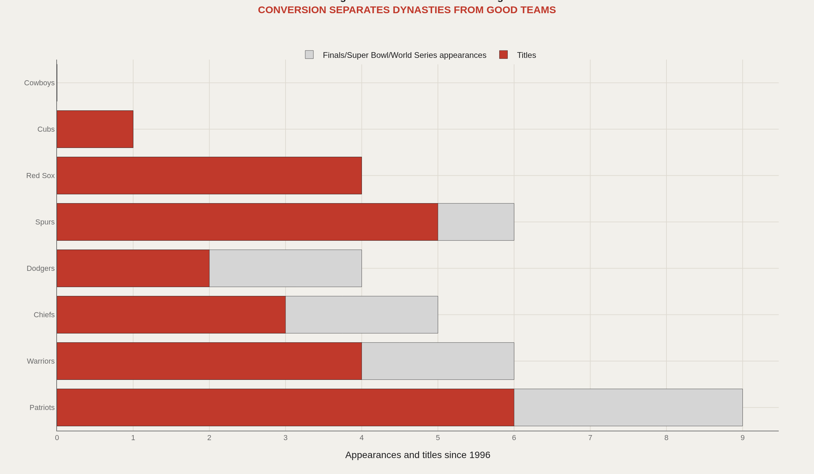
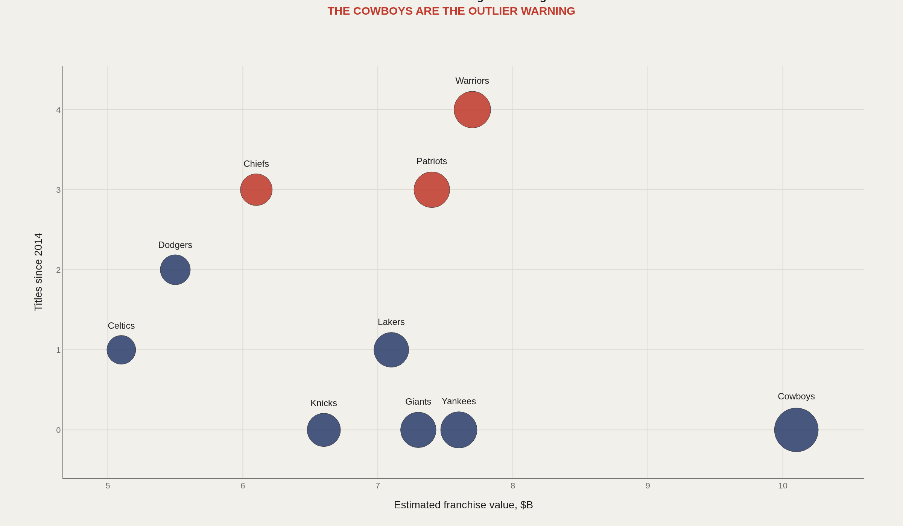
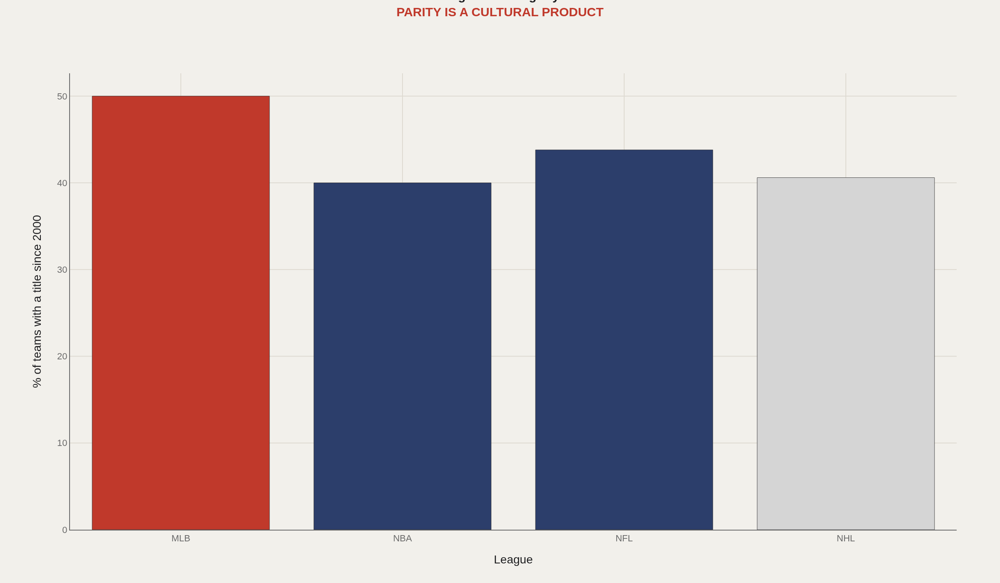
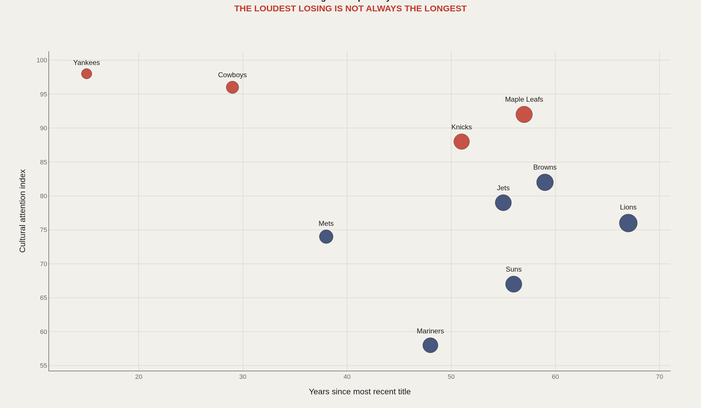

> **TL;DR** Championship mass, Finals conversion rate, and market value split into separate dimensions when measured across MLB, NBA, NFL, and NHL. The Yankees' 27 titles anchor baseball's archive, but the Patriots' 55% Super Bowl conversion rate (6 of 11) defines modern finishing efficiency. Dallas has won zero titles since 1996 while maintaining top-5 franchise value.

The Patriots converted 6 of 11 Super Bowl appearances between 2001 and 2019—a 55% finishing rate that separates modern dynasties from teams that merely reach Finals. The Yankees' 27 World Series titles anchor baseball's championship archive, but their 40% conversion rate over 40 appearances reveals a different competitive profile. Across MLB, NBA, NFL, and NHL, championship mass and finishing efficiency measure separate dimensions of institutional dominance.

The Cowboys have won zero Super Bowls since 1996 while ranking in the top five of franchise valuations every year. The Maple Leafs entered 2025 with a 57-year Stanley Cup drought. These outcomes share no natural comparison until championship counts, conversion rates, market value, and drought duration are mapped on a common scale across all four leagues.

This index uses five charts drawn from Baseball Reference, Basketball Reference, Pro Football Reference, Hockey Reference, and Forbes valuations to compare championship mass, Finals conversion efficiency, brand premium versus recent output, league title rotation, and the relationship between drought length and market spotlight.

## Data and method {#data-and-method}

This comparative model draws from public franchise records maintained by Baseball Reference, Basketball Reference, Pro Football Reference, and Hockey Reference, plus Forbes franchise valuations published between 2020 and 2025. It is not a win-probability model. Attention indices are editorial constructs labeled as comparative signals, not official league statistics.

Front offices optimize payroll allocation, injury management, and draft capital. This analysis operates one level higher: how do championship count, market value, finishing efficiency, and fan attention interact when placed on the same page?

## A few franchises own championship memory itself {#dynasty-mass}

### A few franchises carry an outsized share of championship memory

Cross-league comparison begins with total championships. The Yankees' 27 World Series titles and the Canadiens' 24 Stanley Cups are not normal franchise résumés—they are historical infrastructure that redefines what "dynasty" means in their respective leagues.

This chart establishes the baseline scale. A franchise either chases its league average or chases the archive monopolies that anchor championship memory across decades.

## Modern dynasties are finishers, not just invitees {#conversion}

### Modern dynasties are defined by converting appearances into titles

Finals appearances measure competitive access. Titles measure finishing ability. The Patriots (55% Super Bowl conversion), Spurs, Warriors, and Red Sox solved the finishing problem more efficiently than their peers during their dynasty windows.

A visible franchise can carry lower conversion than a quieter finisher. Brand sustains attention between titles; conversion refreshes the claim.

## Market power and competitive power are different variables {#brand-versus-output}

### The richest sports brands do not all convert attention into recent championships

Franchise value does not track championships on a one-to-one basis. The Cowboys—zero titles since 1996—and the Knicks demonstrate that brand equity can survive extended competitive gaps. The Chiefs and Warriors show what happens when recent winning aligns with market attention.

This is the first major split in dynasty measurement: market power and competitive power are related but not identical. Treating them as the same variable is how franchises become misleading examples of success.

## Each league teaches fans a different theory of fairness {#league-rotation}

### Title rotation differs by league structure and postseason randomness

Leagues impose different competitive structures. Baseball's 162-game season and best-of-seven playoff rounds create a different championship path than the NBA's star-driven postseason or the NFL's single-elimination tournament. The NHL's 57-year Maple Leafs drought reflects a third variance profile.

Each league's rotation pattern teaches fans a different theory of what "deserving" means and what constitutes an acceptable wait between titles.

## The longest drought is not always the loudest {#pain-and-attention}

### Fan pain grows when droughts happen under a bright spotlight

Drought duration is not the same as drought volume. A small-market wait can be existential without national visibility. A New York, Toronto, or Dallas drought becomes sustained media narrative. Market attention multiplies the same number of years into different magnitudes of fan experience.

Cross-league analysis clarifies this relationship: the calendar count tells half the story; the attention structure determines how the count registers emotionally.

## What to take away {#what-to-take-away}

Dynasty measurement fractures into separate dimensions across MLB, NBA, NFL, and NHL. The Yankees and Canadiens dominate championship archives; the Patriots and Warriors define modern conversion efficiency; the Cowboys embody the split between brand value and competitive output.

Single-franchise profiles can reference this index whenever a team's standing requires cross-league context—best, worst, and most misleading by design.

## Sources {#sources}

Baseball Reference. Franchise history pages.

Basketball Reference. Team season and playoff records.

Pro Football Reference. Team franchise records.

Hockey Reference. Franchise records.

Forbes. Professional sports franchise valuations, recent lists.

