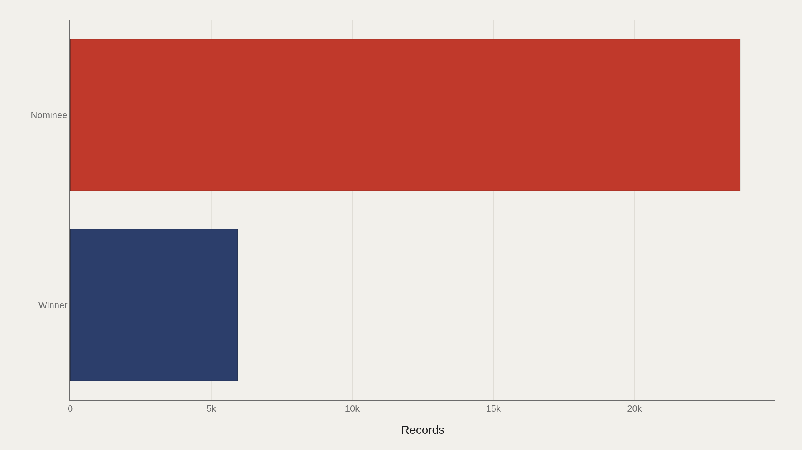
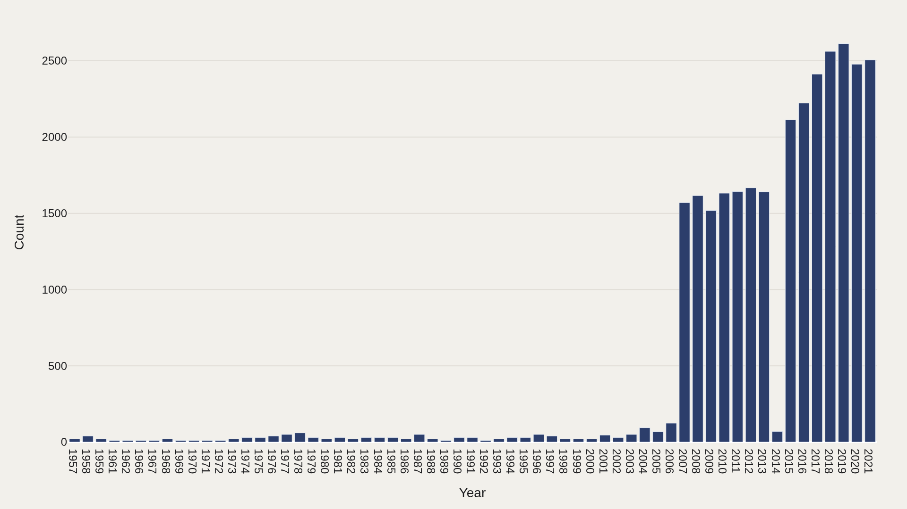
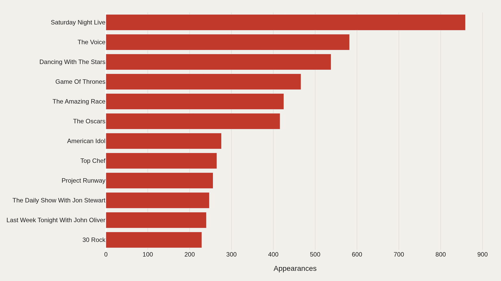
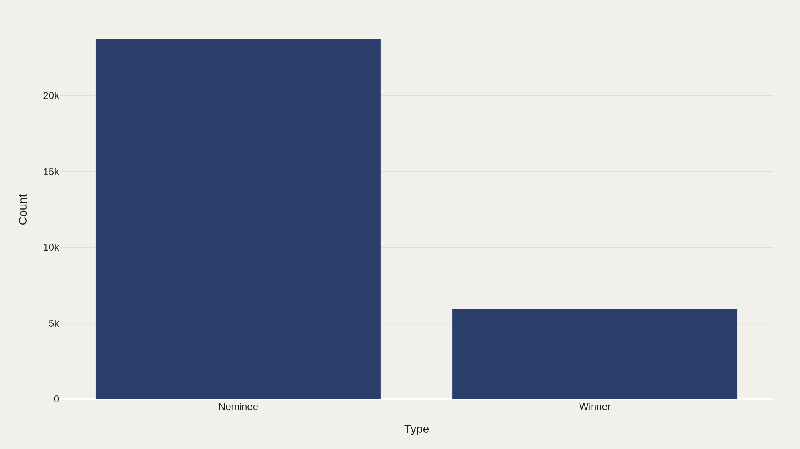
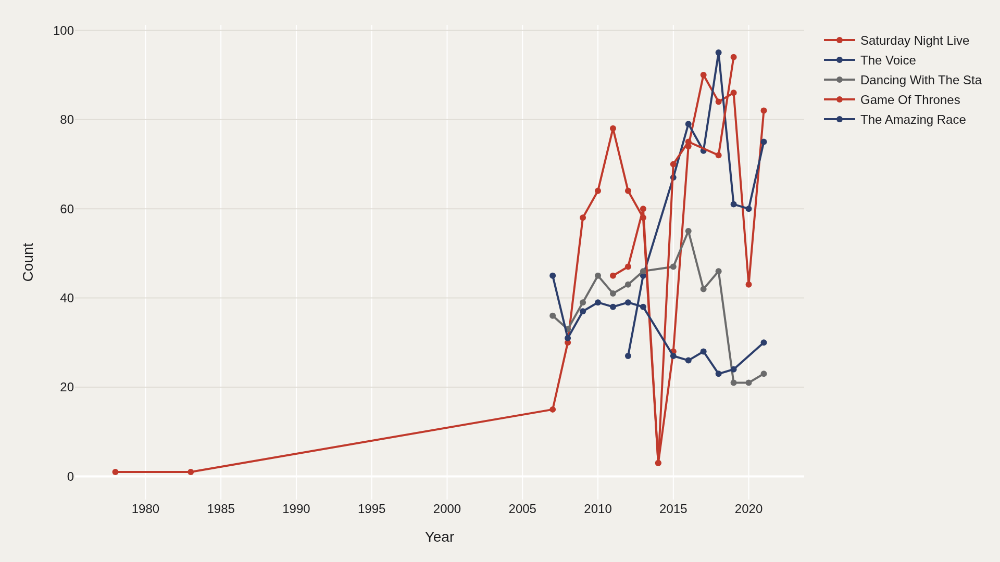

> **TL;DR** Sixty-four years of Emmy records reveal a concentrated awards landscape: Saturday Night Live appears 859 times, 2019 holds 2,613 records—the densest year on file—and 80% of all entries carry the "nominee" label, not "winner." Long-running variety programs accumulate nominations the way careers accumulate credits, producing a recurrence map rather than a single-night sweep story.

Saturday Night Live appears 859 times across 29,678 Emmy records from 1957–2021—three times more than the next-closest show and a sign that Emmy concentration tilts toward programs that return year after year rather than one-night sweeps.

The working file holds 29,678 records spanning 1957–2021. Nominee is the most common label, accounting for 23,739 rows—wins and other designations occupy a thinner slice, which means any leaderboard drawn from this extract ranks recurrence more than victory.

## Data and method {#data-and-method}

The source is the TidyTuesday release from 2021-09-21 (R for Data Science community). The working file contains 29,678 rows and 11 columns after merging available tables in the week folder.

Charts export as Plotly JSON with PNG fallbacks. Counts by type, period, and recurring name are the main instruments—this table captures volume and recurrence rather than a single quality score.

## Landscape {#landscape}

### Nominee dominates with 23,739 records

Nominee dominates with 23,739 records. The file is built around nomination rows; wins and other type labels sit in a thinner slice.

That imbalance is structural—any leaderboard drawn from this extract ranks how often names enter the nominee column, not how often they win.

## Volume {#volume}

### Records By Period

Activity peaks in 2019 with 2,613 records—the densest year in the span.

Period-level counts show when Emmy paperwork thickened: more categories, more programs, more named credits. Volume is the first signal that awards seasons are not equally crowded across decades.

## Who sits at the top {#who-sits-at-the-top}

### Saturday Night Live appears 859 times — the most recurring name in the file

Saturday Night Live appears 859 times—the most recurring name in the file. The top dozen account for a visible share of all 29,678 rows.

Long-running variety and franchise programs accumulate nominations the way long careers accumulate credits. Dominance here is recurrence, not a single sweep night.

## Category {#category}

### Nominee is the largest bucket with 23,739 records

Nominee is the largest bucket with 23,739 records. Category concentration shows where editorial attention should focus when reading the table.

If the question is "who swept," separate win rows carefully. If the question is "who kept getting invited," this nominee-heavy landscape is the right map.

## Timeline {#timeline}

### Leaders Over Time

Leading names do not move in lockstep—some fade as others surge.

Tracking counts over time separates sustained presence from one-off spikes. A show that dominates a single ceremony is a different data shape from a name that returns for decades.

## What this file cannot tell you {#what-this-file-cannot-tell-you}

Community-cleaned TidyTuesday snapshots are not live APIs. Missing values, spelling variants, and week-of-export coverage limits apply. Merged tables may fan out or duplicate rows when join keys are imperfect.

Findings describe the file on hand—structural signals about Emmy nomination volume and recurrence through 2021, not a complete history of television quality.

## What to take away {#what-to-take-away}

Emmy concentration shows up as recurrence: Saturday Night Live at 859 appearances, a nominee column that holds 23,739 of 29,678 rows, and a 2019 peak of 2,613 records. Leaders, volume, and timelines each answer a different question about how lopsided the season became.

Use the charts to separate invitation from victory—then check the type field before treating any name as a sweep.

## Sources {#sources}

Data Science Learning Community. (2021). TidyTuesday: Emmy Awards. https://raw.githubusercontent.com/rfordatascience/tidytuesday/main/data/2021/2021-09-21/nominees.csv

