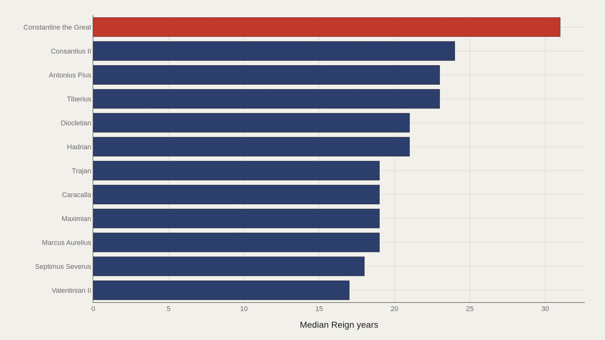
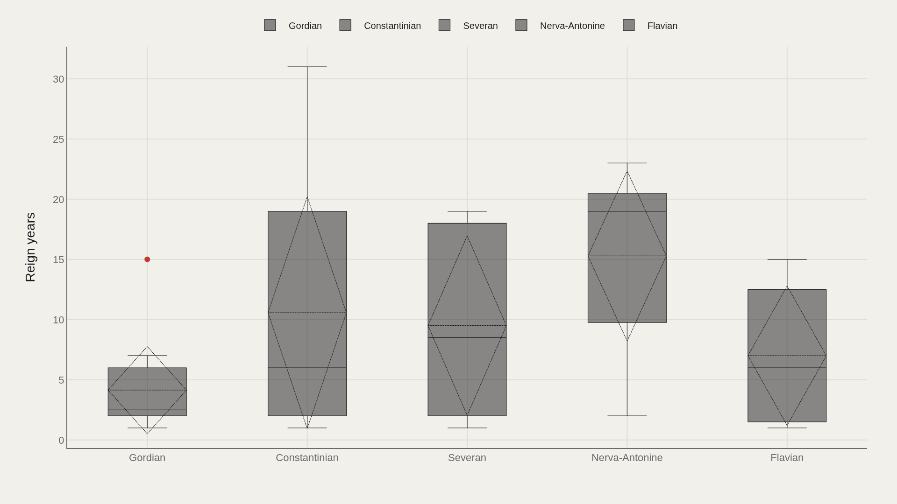
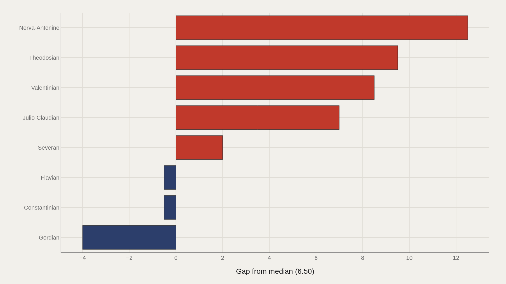
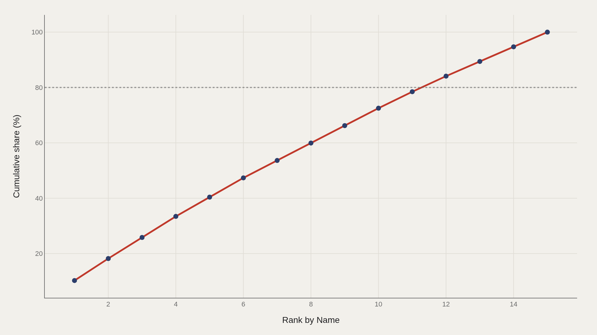

> **TL;DR** 68 emperors yield a median reign of 6.50 years—half the tenure of the typical top-dozen ruler. Constantine the Great's 31.0-year reign sits at the ceiling. Dynasty membership mattered, but unevenly: Nerva–Antonine emperors averaged 12.5 years above median; Gordian, despite being the most common dynasty label, trailed by 4.0.

Constantine the Great ruled for 31.0 years. The median Roman emperor in this 68-record file lasted 6.50. That five-to-one gap frames the question: did dynasty membership buy stability, or did survival depend on forces that overwhelmed house labels? The answer is both, but unevenly—Nerva–Antonine emperors averaged 12.5 years above median, while Gordian, despite being the most common dynasty name, trailed by 4.0.

The file covers 68 emperors drawn from the TidyTuesday Roman Emperors release. Reign length is measured from recorded start and end dates; dynasty labels come from the source table. The charts separate name-level longevity from dynasty-level structure so the two are not confused.

## Research question {#research-question}

Did dynastic identity extend Roman imperial tenure, or did individual political survival overwhelm house-level labels? The report asks whether reign length concentrates around exceptional rulers, whether dynasties show distinct tenure distributions, and how much aggregate imperial time is carried by the longest-reigning names.

The question is observational. This 68-record TidyTuesday file is not a full constitutional model of Rome. It uses recorded reign spans to compare names and dynasties, treating the median emperor's 6.50-year tenure as the baseline.

## Data and method {#data-and-method}

Reign spans are derived from start and end dates in the emperors table. Negative or zero spans are excluded. The source is the TidyTuesday Roman Emperors release (2019-08-13), a community-cleaned historical table rather than a live prosopography API.

Medians are preferred over means because reign distributions skew—a handful of long rulers pull averages up while the typical emperor sits near the 6.50-year center. Index fields are excluded so charts answer questions about tenure, not spreadsheet order.

## Constantine's thirty-one years set the name-level ceiling {#constantine-s-thirty-one-years-set-the-name-level-ceiling}

### Reign years by Name

Constantine the Great leads at 31.0 reign years. Valentinian II anchors the low end of the top group at 17.0—still far above the file median of 6.50. The chart shows a curated upper slice, not the full distribution.

Grouping by name makes the catalog's major entities comparable on a single scale. The question is not who is famous, but who lasted. The gap between Constantine and the rest of the top tier shows that longevity was exceptional rather than routine.

Constantine's 306–337 CE reign sits at a hinge in Roman institutional history: civil war, Tetrarchic succession, Christian legalization after the Edict of Milan, the Council of Nicaea in 325, and the foundation of Constantinople all fall inside or around his rule. The dataset reduces that to 31.0 years, but the named entity carries enough historical context to explain why the ceiling is not a spreadsheet oddity.

## The top dozen still sits far above the median emperor {#the-top-dozen-still-sits-far-above-the-median-emperor}

### Constantine the Great leads at 31.0 — 20.0 marks the median among the top dozen

Among the top dozen emperors, the median is 20.0 years—three times the full-file median of 6.50. Even the typical elite tenure in this slice is a different political animal from the typical emperor in the dataset.

That separation matters for interpretation. Leaderboards describe the right tail, not Rome's everyday succession reality, which lived closer to half a decade than to two decades.

The 20.0-year median among the top dozen contains the familiar names that make imperial history feel more stable than it was: Augustus, Tiberius, Hadrian, Antoninus Pius, Marcus Aurelius, Constantine. The full-file median pulls the reader back toward usurpers, assassinations, co-rule, civil wars, and short-lived crisis reigns.

## Dynasty boxes show contested, not uniform, tenure {#dynasty-boxes-show-contested-not-uniform-tenure}

### Reign years by Dynasty

When reign years are split by dynasty, the boxes do not collapse into a single shared consensus. Some houses stretch higher; others sit tighter and lower. The spread shows dynasty is a contested axis for tenure rather than deterministic.

Read the boxes as structural signals: belonging to a named dynasty did not automatically purchase Constantine-length stability. It bought a distribution, and those distributions differ.

The Nerva-Antonine adoption sequence has long been associated with high imperial stability, while the third-century crisis illustrates how military acclamation and rapid turnover can shred dynastic continuity. The box plot asks whether succession packages mattered—and the answer is yes, but variably.

## Nerva–Antonine sits above the median; Gordian trails {#nerva-antonine-sits-above-the-median-gordian-trails}

### Reign years vs median by Dynasty

Relative to the file median, Nerva-Antonine sits 12.5 years above; Gordian trails by 4.0. That is the cleanest dynasty-level contrast in the gap chart: one house systematically above the center of the distribution, another systematically below.

Gordian is also the most common dynasty label in the fact boxes—volume without longevity. Frequency of naming and length of rule are not the same political achievement.

The Nerva-Antonine result aligns with the conventional account of fewer violent turnovers and longer administrative horizons in the second century. A positive gap does not prove the dynasty caused stability, but it matches the historical pattern.

The Gordian contrast points to the opposite problem. Gordian I and Gordian II ruled briefly in 238 CE during the Year of the Six Emperors, while Gordian III lasted longer but still belongs to a crisis environment shaped by military pressure and senatorial maneuvering. A repeated dynasty label can mark a famous rupture rather than a durable house.

## Five names carry forty percent of aggregate reign years {#five-names-carry-forty-percent-of-aggregate-reign-years}

### Cumulative Reign years

The top five emperors account for 40% of aggregate reign years in the working file. A steep head means a small set of long rulers dominates the sum, while the long tail of shorter reigns fills out the catalog without moving the total as much.

That shape reframes the median. A 6.50-year center can coexist with heavily concentrated aggregate if a few Constantine-scale tenures exist. Both facts are true; they answer different questions.

Concentration connects biography to institutions. Long reigns give rulers time to appoint governors, restructure armies, mint ideological programs, build capitals, codify religious settlements, and shape elite careers. Short reigns often leave the opposite signature: coinage, military proclamation, purge, assassination, or succession crisis.

## What this file cannot tell you {#what-this-file-cannot-tell-you}

This is a community-cleaned TidyTuesday snapshot, not a continuously updated classical-history database. Missing values, spelling variants, and week-of-export coverage limits apply. Reign years depend on how start and end dates were recorded and cleaned; disputed chronologies are not adjudicated here.

Dynasty labels are editorial categories in the source table. Findings describe the file on hand—structural signals about tenure and dynasty in this emperors extract—not a complete political history of imperial Rome.

## What to take away {#what-to-take-away}

The median emperor lasted 6.50 years. Constantine the Great lasted 31.0. Dynasty membership did not flatten that gap. Nerva–Antonine clears the median by 12.5 years; Gordian, despite being the most common dynasty label, trails it by 4.0.

Use the charts as three separate instruments—name leaders, dynasty spreads, and concentration—rather than collapsing them into a single verdict. Longevity, frequency, and aggregate share each tell a different part of the succession story.

## Sources {#sources}

Data Science Learning Community. (2019). TidyTuesday: Roman Emperors. https://raw.githubusercontent.com/rfordatascience/tidytuesday/main/data/2019/2019-08-13/emperors.csv

Data Science Learning Community. (2019). TidyTuesday Roman Emperors source folder. https://github.com/rfordatascience/tidytuesday/tree/main/data/2019/2019-08-13

Boatwright, M. T., Gargola, D. J., Lenski, N., & Talbert, R. J. A. (2012). The Romans: From Village to Empire (2nd ed.). Oxford University Press.

Potter, D. S. (2014). The Roman Empire at Bay, AD 180–395 (2nd ed.). Routledge. https://doi.org/10.4324/9780203080971

Ando, C. (2012). Imperial Rome AD 193 to 284: The Critical Century. Edinburgh University Press. https://edinburghuniversitypress.com/book-imperial-rome-ad-193-to-284.html

## Editor's note {#editors-note}

Artometrics data report from the TidyTuesday research pipeline. Charts and aggregates are reproducible from the embedded exhibits and public source files.

Source archive (GitHub)

