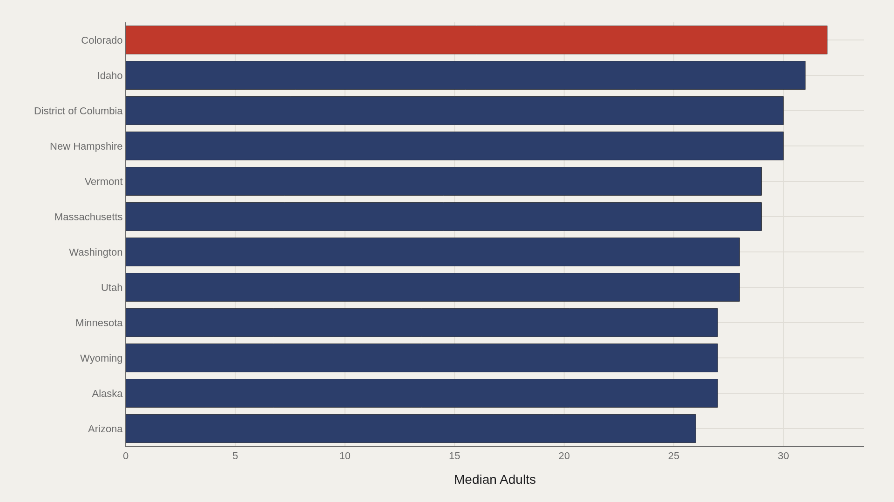
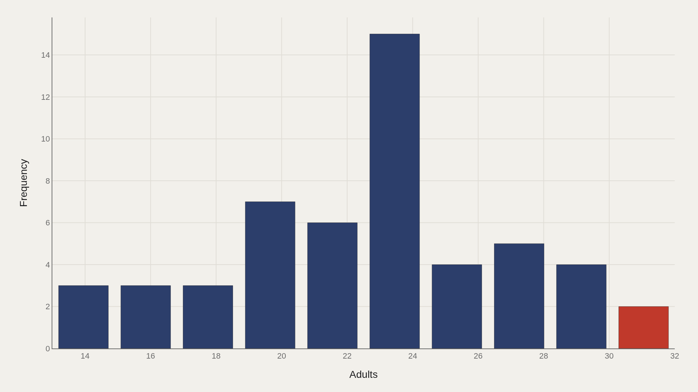
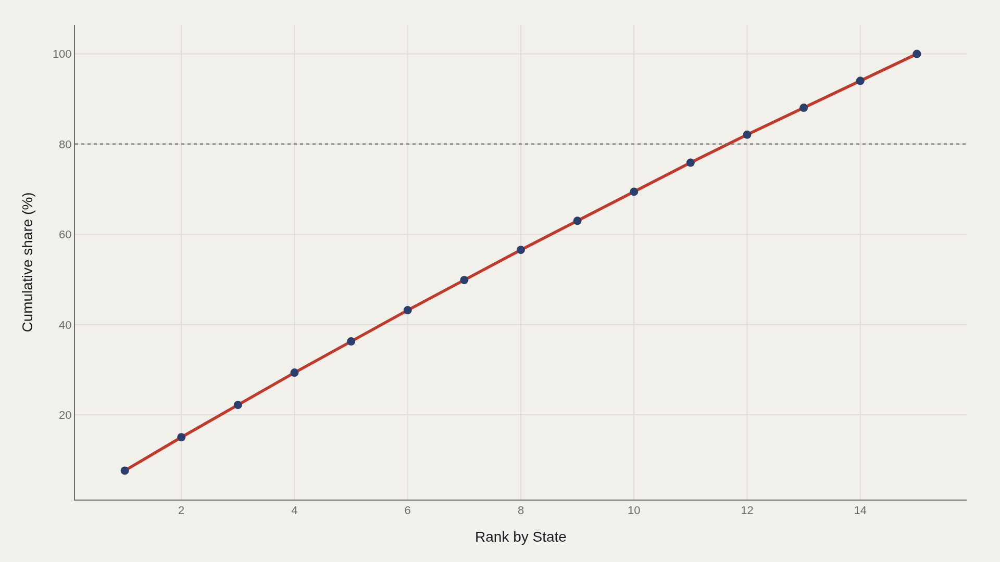
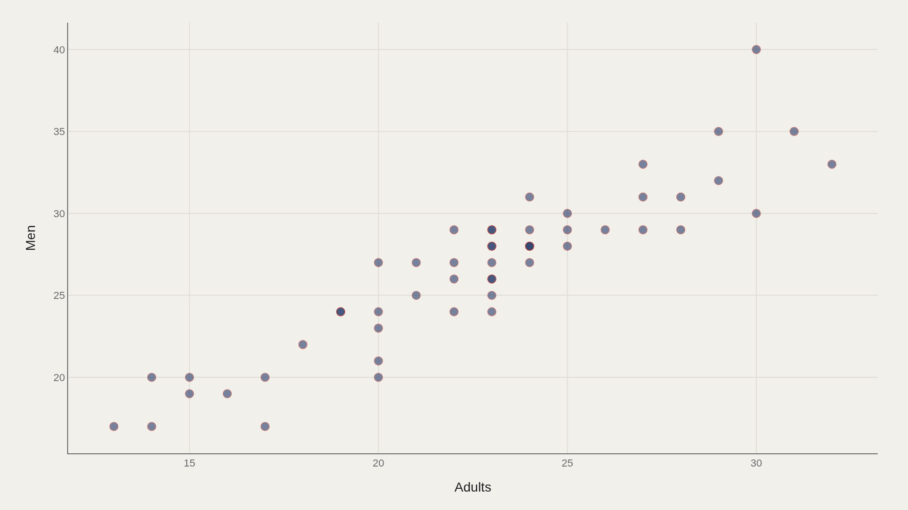

> **TL;DR** Colorado leads U.S. exercise participation at 32.0, while the median across 52 jurisdictions stands at 23.0. Mountain and New England states occupy the top tier; the top five account for 36% of aggregate participation.

Colorado leads U.S. exercise participation at 32.0, while the median across 52 jurisdictions stands at 23.0. Mountain West and New England states occupy eight of the top twelve positions, and the top five account for 36% of aggregate participation.

The data, from TidyTuesday's 2018 exercise extract, shows geographic concentration rather than even distribution. The charts document the spread, the gap between leaders and the median, and the relationship between adult and male participation rates.

## Fast facts {#fast-facts}

The numbers that establish the scale:

- **52** — Jurisdictions in the dataset

  23.0Median adults rate
  32.0Highest observed adults rate
  ColoradoLeading jurisdiction by adults rate

## Data and method {#data-and-method}

The source is the TidyTuesday release from 2018-07-17 (week16_exercise.xlsx). After cleaning, 52 rows remain.

Adults is the primary ranked metric; Men appears in the scatter. Charts are Plotly JSON with PNG fallbacks.

## Western and New England States Lead Adult Exercise {#western-and-new-england-states-lead-adult-exercise}

### Adults by State

Colorado leads at 32.0, followed by Idaho at 31, New Hampshire and D.C. at 30, and Massachusetts and Vermont at 29. Utah and Washington round out the upper band at 28.

Eight of the top twelve are Mountain West or New England states. The cluster reflects outdoor access, income, and age structures that support higher activity levels.

## The Top Dozen Sits Well Above the National Median {#the-top-dozen-sits-well-above-the-national-median}

### Colorado at 32.0 — median among top dozen is 28.5

Colorado remains first at 32.0, while the median among the top dozen stands at 28.5—5.5 points above the overall median of 23.0.

The gap documents geographic clustering: high-exercise participation concentrates in specific regions rather than distributing evenly across all 52 jurisdictions.

## Most States Cluster Near the Low-20s {#most-states-cluster-near-the-low-20s}

### Median 23.0 and mean 22.6 indicate a relatively symmetric distribution

The tallest bin centers near 23.5 with approximately 15 states. Smaller counts appear in both the mid-teens and the high-20s/30s. The mean of 22.6 sits close to the median, indicating symmetry at the state level.

Symmetry does not eliminate the elite tier: Colorado's 32 remains a clear outlier at the right edge.

## Top States Hold a Disproportionate Share of the Aggregate {#top-states-hold-a-disproportionate-share-of-the-aggregate}

### The top five state entries account for 36% of the aggregate adults

The top five jurisdictions account for 36% of the aggregate adults measure. Cumulative share approaches 100% by the fifteenth entry.

In a 52-row dataset, concentration among top performers remains pronounced.

## Adult and Male Rates Move in the Same Direction {#adult-and-male-rates-move-in-the-same-direction}

### Adults vs Men

Adults and Men track together across 52 jurisdictions: states with higher adult participation rates also post higher male rates. Leaders reach the low-to-mid 30s on the adults axis and the 30s–40s range on the men's axis.

The pattern confirms the same state hierarchy across gender categories.

## What this file cannot tell you {#what-this-file-cannot-tell-you}

Self-reported exercise measures vary by survey methodology and year. State averages mask within-state variation by urban/rural location and race. D.C. is included but is not a state.

The 2018 TidyTuesday snapshot does not represent current CDC data; use these rankings as structural for this extract only.

## What to take away {#what-to-take-away}

Adult exercise rates center at 23.0 across 52 jurisdictions, while Colorado reaches 32.0 and the top-dozen median stands at 28.5.

Reference the Mountain West and New England cluster when explaining geographic patterns, and the 36% top-five share when discussing concentration of activity.

## Sources {#sources}

Data Science Learning Community. (2018). TidyTuesday: Exercise USA. https://raw.githubusercontent.com/rfordatascience/tidytuesday/main/data/2018/2018-07-17/week16_exercise.xlsx

