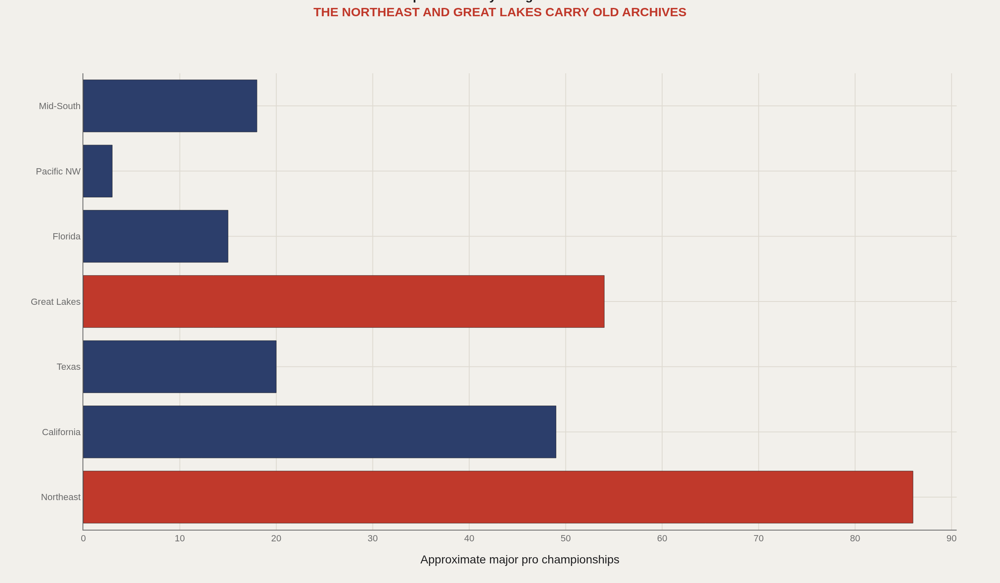
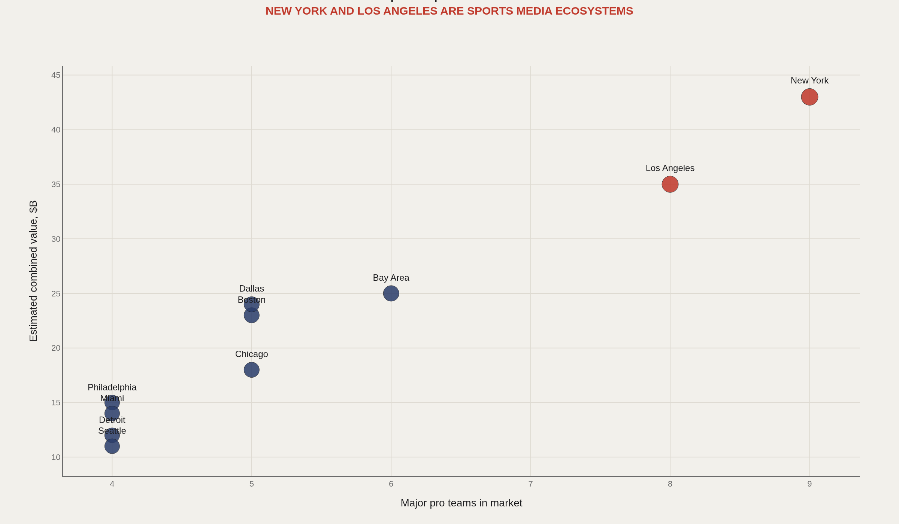
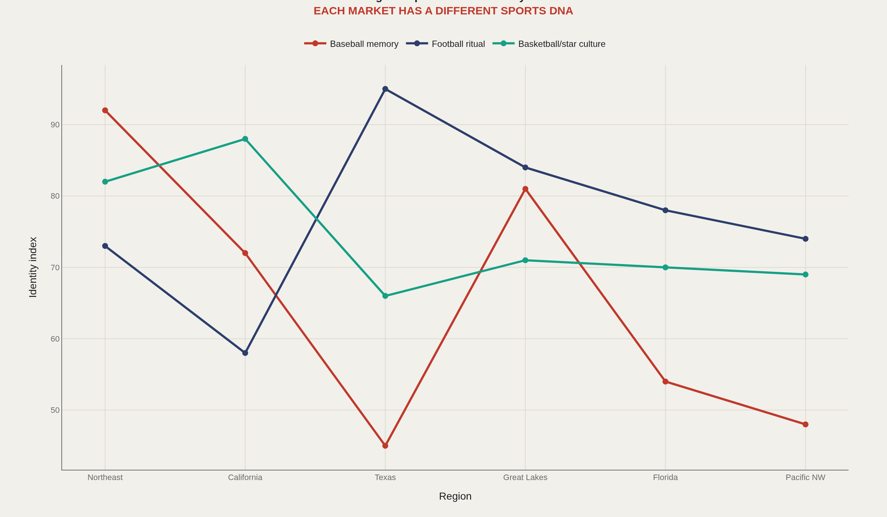
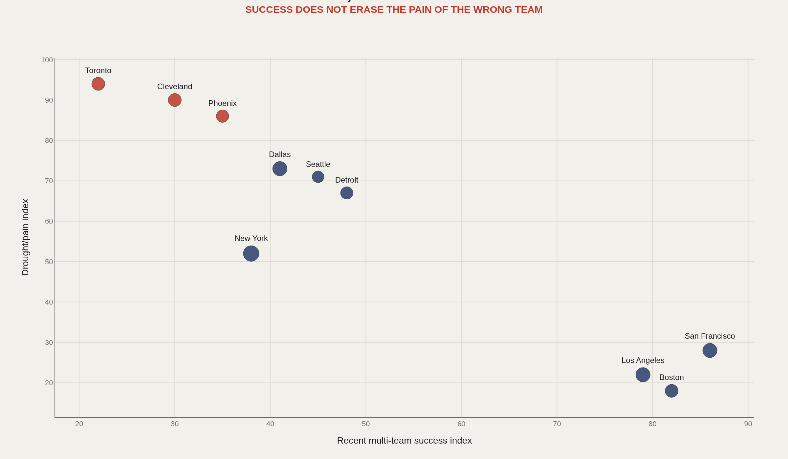
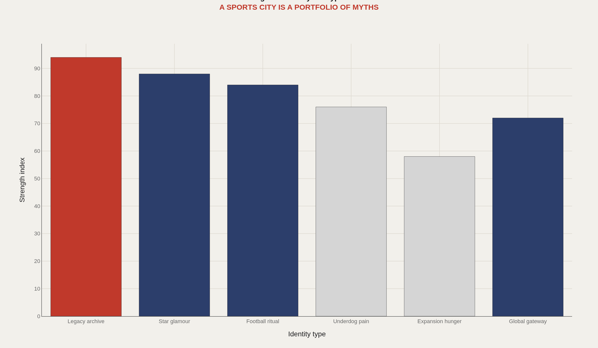

> **TL;DR** Ten large U.S. markets split into six sports identity archetypes—archive cities, star cities, football rituals, hunger cities, glamour hubs, and balanced portfolios. Title density clusters in the Northeast and Great Lakes. Toronto's drought index hits 94 in this model. New York's combined franchise value reaches $43 billion.

Ten large U.S. markets split into six sports identity archetypes, shaped by title density, league mix, and championship drought length.

A team is never just a team. It is attached to a region, a media market, a league structure, and a local memory system. That context changes what the same number means. This analysis maps how regions become recognizable under the data microscope.

The scale: 10 large markets compared, grouped into 7 regions for title-density analysis, producing 6 identity archetypes.

## Data and method {#data-and-method}

The charts use public franchise histories, rounded valuation summaries, and editorial identity indices. The indices are not official statistics; they are structured prompts for comparing markets.

A cultural economist would ask how facilities, media density, migration, ownership, and league rules shape local identity. This piece is the first map layer for that conversation.

## Regional Title Density {#regional-title-density}

### Championship memory clusters by region

A region's sports identity is not only current fandom. It is the sediment of old championships, old rivalries, and inherited expectations.

The Northeast and Great Lakes have unusually deep archives because their leagues, cities, and media systems matured early.

## Market Stack {#market-stack}

### Deep markets create sports media ecosystems rather than single-team identities

New York and Los Angeles are not simply large markets. They are sports ecosystems where multiple teams compete for attention, mythology, and local legitimacy.

That makes cross-report comparison useful: a Knicks drought and a Lakers title live in the same media bloodstream.

## Sport Dna {#sport-dna}

### Regions specialize in different sports identities

Texas reads as football ritual. California leans toward basketball and glamour. The Northeast keeps baseball memory unusually alive.

The point is not stereotype; it is signal. Regional sports culture gives the same win-loss record a different accent.

## City Pain versus Success {#city-pain-versus-success}

### A city can be successful overall and still carry a famous wound

Multi-team cities do not experience success cleanly. A Boston fan can live near constant banners while a specific rival city experiences one drought as civic identity.

Pain is often team-specific, but markets distribute and amplify it.

## Identity Types {#identity-types}

### Sports cities are portfolios of myths

Some places sell archive. Some sell stars. Some sell football Sundays. Some sell hunger because they have not yet received the validating title.

This is the bridge to future city bioeconomics reports: sports data is one part of a place's cultural fingerprint.

## What to take away {#what-to-take-away}

Sports identity is regional before it is rational. Market size, title archives, sport specialization, and drought all shape the meaning of a fan base.

This gives the next batch a new tool: every team profile can now ask not only how good the team is, but what kind of place produced that version of good, bad, rich, cursed, or glamorous.

## Sources {#sources}

Reference franchise histories from Baseball Reference, Basketball Reference, Pro Football Reference, and Hockey Reference.

Forbes. Professional sports franchise valuation lists.

U.S. Census regional framing, used only as a broad geography reference.

Public attendance, championship, and market summaries from league history pages.

## Editor's note {#editor-s-note}

Regional and identity indices are editorial approximations designed to organize cross-report thinking. They should be refined as more city/team reports are added.

