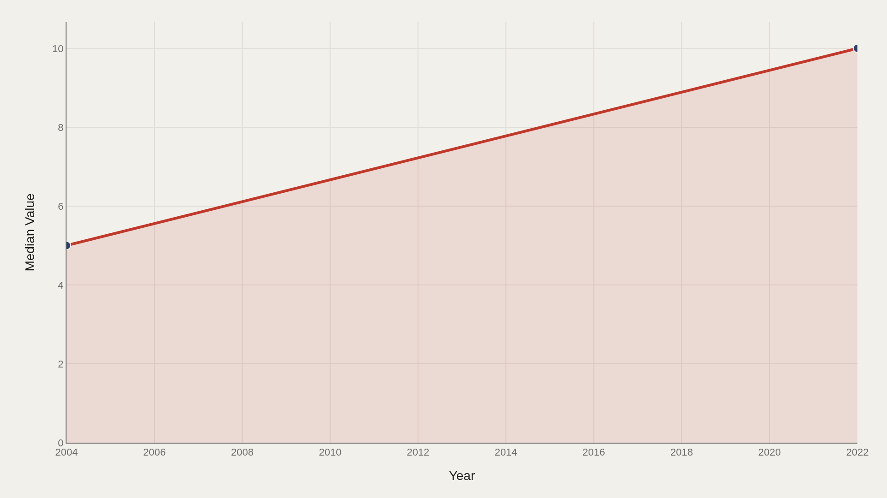
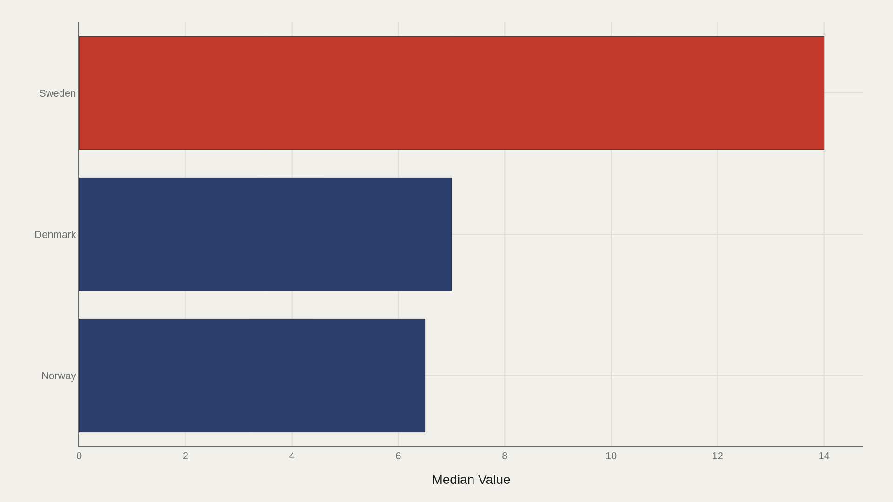
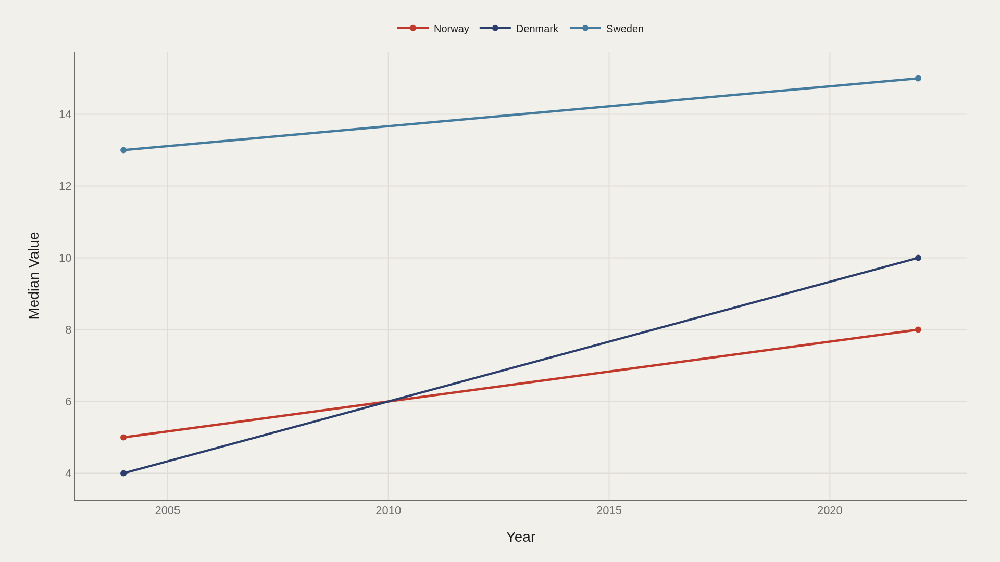
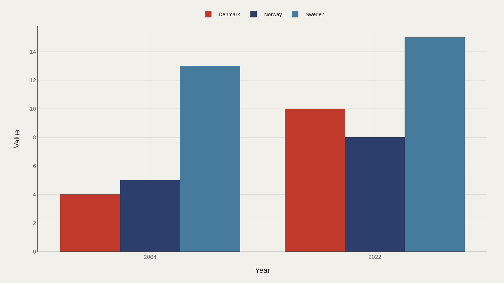
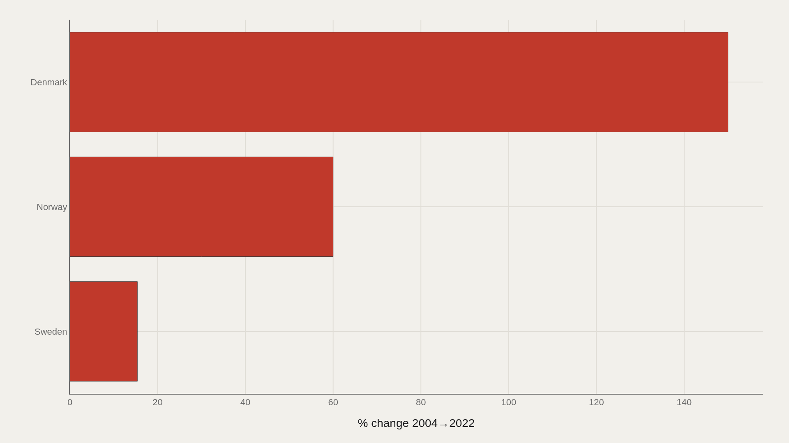

> **TL;DR** Six Scandinavian country-year records from 2004–2022 show Sweden leading with 15 UNESCO sites by 2022, while Denmark posted the largest growth at 150%. The median count rose from 5.00 to 10.0 across the period.

Sweden reached 15 UNESCO World Heritage sites by 2022, the highest count among Scandinavian countries in this extract, while Denmark posted 150% growth from 2004. The median site count doubled from 5.00 to 10.0 across the 18-year span, showing broad expansion beyond the leader.

Six country-year pairs are enough to separate level from growth. Sweden led on absolute count; Denmark led on percentage gain. The median shift from 5.00 to 10.0 anchors the regional trend.

## Data and method {#data-and-method}

The source is the TidyTuesday release from 2024-02-06 via the R for Data Science community. The working file contains 6 rows and 3 columns: country, year, and site count. Years are 2004 and 2022; countries are Sweden, Norway, and Denmark.

Medians summarize the center; percentage changes normalize different starting levels. Index fields are excluded from metric selection.

## Median heritage counts doubled at the center {#median-heritage-counts-doubled-at-the-center}

### Median Value Over Time

The median rose from 5.00 in 2004 to 10.0 in 2022, indicating that the center of the Scandinavian distribution moved upward. With three countries at two time points, the median shift is visible in the raw table and the chart confirms it.

A doubling at the median means broad gains, not isolated leader expansion.

## Sweden leads the country ladder {#sweden-leads-the-country-ladder}

### Sweden leads at 14.0 — 7.00 marks the median among the top dozen

Sweden leads at 14.0, with the median at 7.00 among the top entries in this extract. In a small peer set, Sweden is both the largest inventory and the charted leader.

Leading on count does not guarantee leading on growth rate. The next charts separate stock from speed.

## Leaders diverge when tracked over time {#leaders-diverge-when-tracked-over-time}

### Top Country Over Time

Leading countries move at different rates. Some start high and add modestly; others start low and surge. Tracking value over time separates sustained dominance from momentum.

In a two-point panel, trajectory is measured by who added sites between 2004 and 2022, not who merely inherited a large base.

## 2004 versus 2022 makes the gains visible side by side {#2004-versus-2022-makes-the-gains-visible-side-by-side}

### Value by year and Country

Grouped bars show who gained between 2004 and 2022. Side-by-side bars reveal per-country momentum that totals alone obscure.

The year comparison displays absolute change before converting those deltas into percentages.

## Denmark posted the largest percentage gain {#denmark-posted-the-largest-percentage-gain}

### Value growth by Country

Denmark grew 150% from 2004 to 2022, the largest percentage gain in the file. Percentage bars normalize different starting counts, which is necessary when Sweden, Norway, and Denmark began at different levels.

Sweden leads on absolute count; Denmark leads on growth rate. Both measures appear in the file and answer different questions.

## What this file cannot tell you {#what-this-file-cannot-tell-you}

This TidyTuesday extract is a six-row Scandinavian panel for 2004 and 2022, not a global census or the live UNESCO World Heritage List API. It does not cover every country or every year in between.

Findings describe country counts and growth in this extract, not a qualitative assessment of individual sites or their cultural significance.

## What to take away {#what-to-take-away}

Sweden reached 15 UNESCO sites by 2022, the highest in this Scandinavian extract, while Denmark grew 150% from 2004 to 2022. The median count doubled from 5.00 to 10.0, indicating broad regional expansion.

Absolute level and percentage growth are distinct metrics. The year-compare and growth charts keep them separate so prestige stock is not mistaken for expansion speed.

## Sources {#sources}

Data Science Learning Community. (2024). TidyTuesday: World Heritage Sites. https://raw.githubusercontent.com/rfordatascience/tidytuesday/main/data/2024/2024-02-06/heritage.csv

## Editor's note {#editors-note}

Artometrics data report from the TidyTuesday research pipeline. Charts and aggregates are reproducible from the embedded exhibits and public source files.

Source archive (GitHub)

