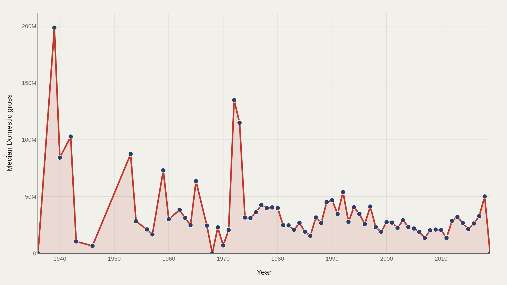
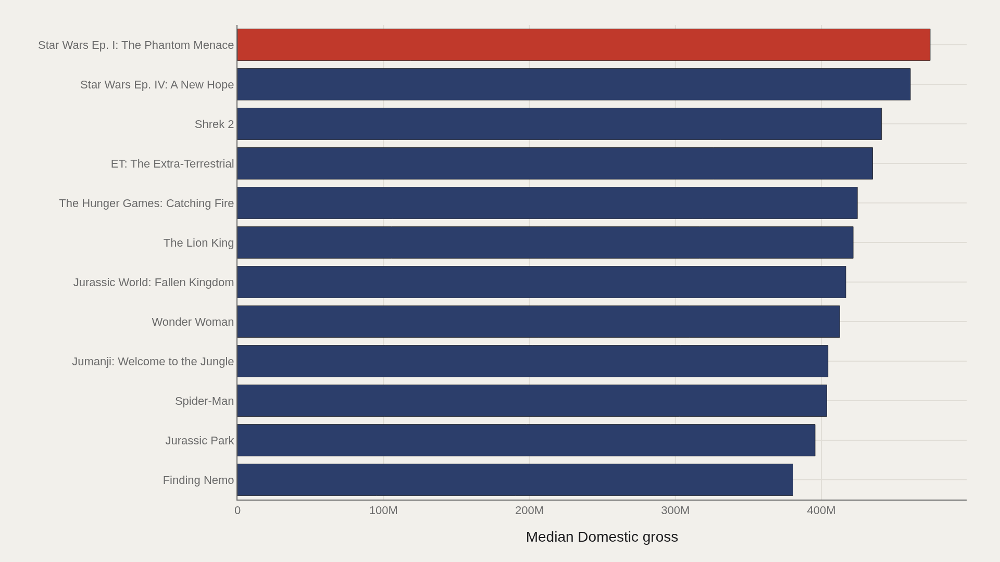
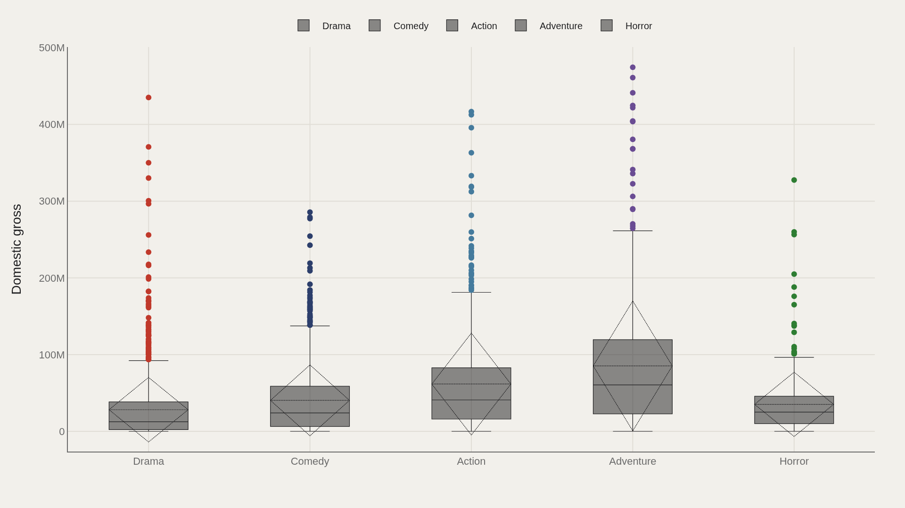
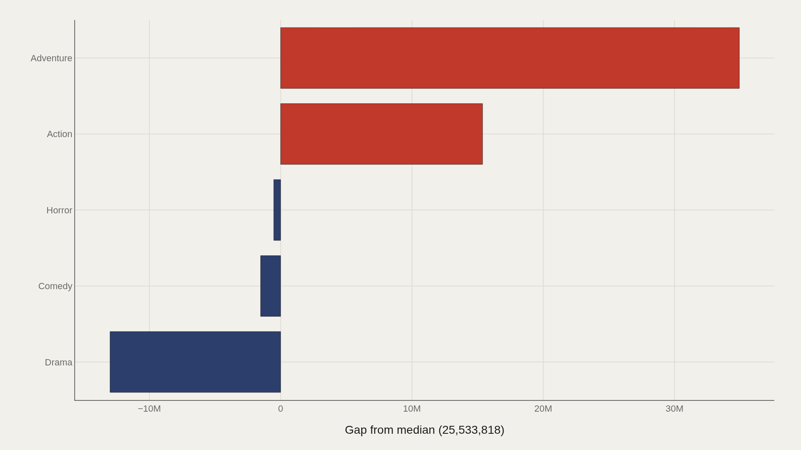
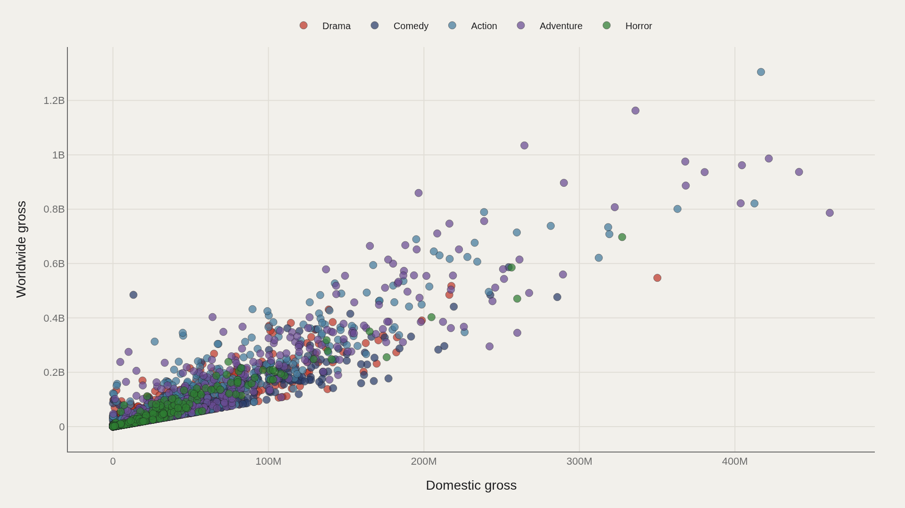

> **TL;DR** A TidyTuesday dataset of 3,401 films spanning 1936–2019 shows median domestic gross of $25,533,818, but Star Wars Episode I leads at $474,544,677—a signal that genre tags in community-cleaned box-office tables are unreliable. Adventure titles sit $34.9M above the median; Drama sits $13M below. The domestic-to-worldwide scatter reveals which films traveled and which stayed home.

Star Wars Episode I: The Phantom Menace leads a dataset supposedly tracking horror-film profits at $474,544,677 domestic—proof that genre tags in community-cleaned box-office tables are unreliable and that the highest grossers are not always the films the label promises.

The working file holds 3,401 records spanning 1936–2019. Median domestic gross sits at $25,533,818; the highest observed domestic gross is $474,544,677. Drama is the most common genre label in the merge—a reminder that genre tags in box-office tables are rarely as clean as marketing copy.

## Fast facts {#fast-facts}

The numbers that set the scale for this report:

- **3,401** — Records in the working dataset

  25,533,818Median Domestic gross
  474,544,677Highest observed Domestic gross
  Star Wars Ep. I: The PhantomTop Movie by Domestic gross
  1936–2019Year span covered in the file
  DramaMost common Genre

## Data and method {#data-and-method}

The source is the TidyTuesday release from 2018-10-23 (R for Data Science community). The working file contains 3,401 rows and 9 columns after merging all available CSV/XLSX tables in the week folder.

Charts are exported as Plotly JSON with PNG fallbacks. Medians are preferred where distributions skew. Index-style fields are excluded from metric selection. The table mixes genre labels and franchise outliers—read peaks as structural signals in the file, not as a pure horror-only ledger.

## How the pattern changed over time {#how-the-pattern-changed-over-time}

### Median Domestic gross Over Time

Median domestic gross falls from $163,245 in the opening period to $0 at the close—a path shaped by missing values and sparse later rows rather than box-office collapse.

Trend lines in merged profit tables encode coverage gaps as much as commerce. Treat the decline as a prompt to inspect year density, not as a finished verdict on the genre's economics.

## Who sits at the top {#who-sits-at-the-top}

### Star Wars Ep

Star Wars Ep. I: The Phantom Menace leads at $474,544,677—and $419,277,314 marks the median among the top dozen.

When a non-horror franchise tops a profit extract labeled for horror analysis, the chart shows concentration at the head and reveals how genre filters leak in community-cleaned tables. The ceiling of the file is not the ceiling of the horror aisle alone.

## How the field is spread {#how-the-field-is-spread}

### Domestic gross by Genre

Genre boxes show how domestic gross spreads once labels are treated as categories rather than marketing slogans.

Some genres share a tight middle; others stretch into long upper whiskers. That shape separates consensus mid-budget outcomes from a handful of titles that define the category's mythology.

## Who beats the median — and who trails {#who-beats-the-median-and-who-trails}

### Domestic gross vs median by Genre

Adventure sits $34,936,402 above the median; Drama trails by $12,994,440.

The gap chart is the practical reading of the distribution: which genre labels systematically clear the file's middle, and which sit below it even when volume is high.

## What moves together {#what-moves-together}

### Domestic gross vs Worldwide gross

Domestic and worldwide gross move together for most titles, but the scatter still leaves clusters that a single average would erase—films that travel abroad, films that stay domestic, and sparse points where one market dominates the total.

Profit stories live in those clusters. A multiple earned at home is not the same business as a multiple earned on the global ledger.

## What this file cannot tell you {#what-this-file-cannot-tell-you}

Community-cleaned TidyTuesday snapshots are not live APIs. Missing values, spelling variants, and week-of-export coverage limits apply. Merged tables may fan out or duplicate rows when join keys are imperfect.

Findings describe the file on hand—structural signals about movie profit rows in this extract, not exhaustive truth about every horror release ever made.

## What to take away {#what-to-take-away}

Domestic gross alone is never enough: leaders, genre gaps, time coverage, and the domestic–worldwide scatter each answer a different question about who returned capital.

Use the charts to sharpen the question, then check the source and limits before turning any peak into a studio strategy claim.

## Sources {#sources}

Data Science Learning Community. (2018). TidyTuesday: Horror Movie Profit. https://raw.githubusercontent.com/rfordatascience/tidytuesday/main/data/2018/2018-10-23/movie_profit.csv

