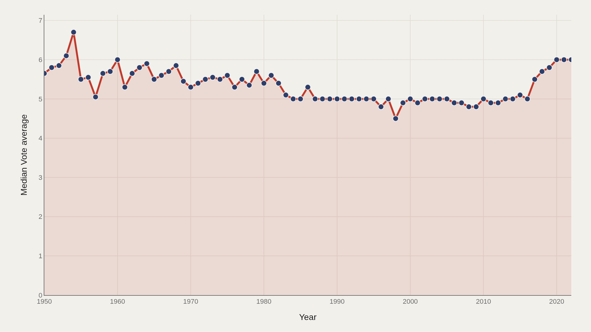
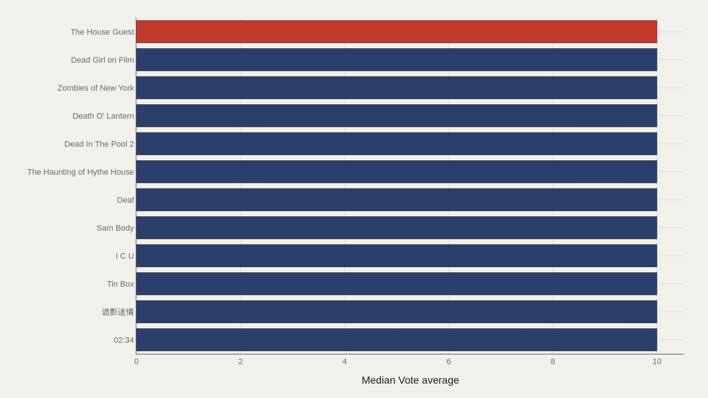
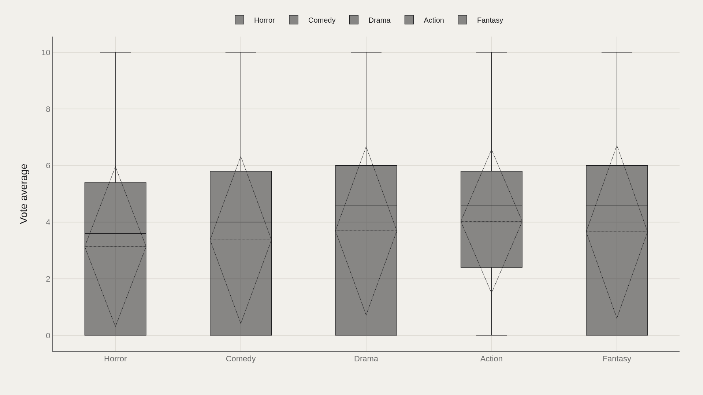
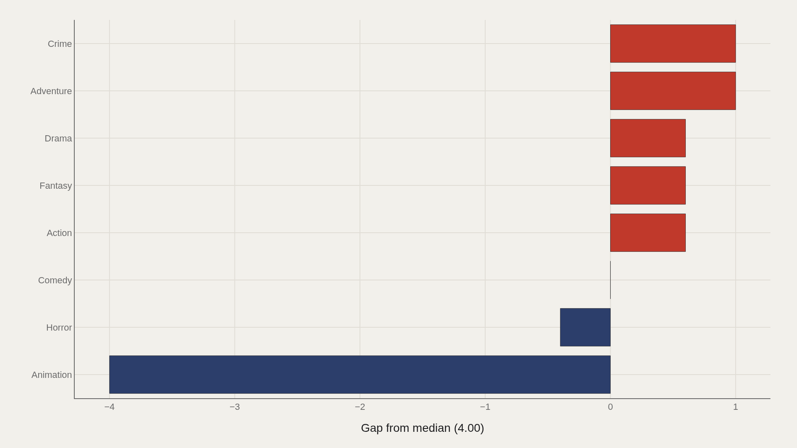
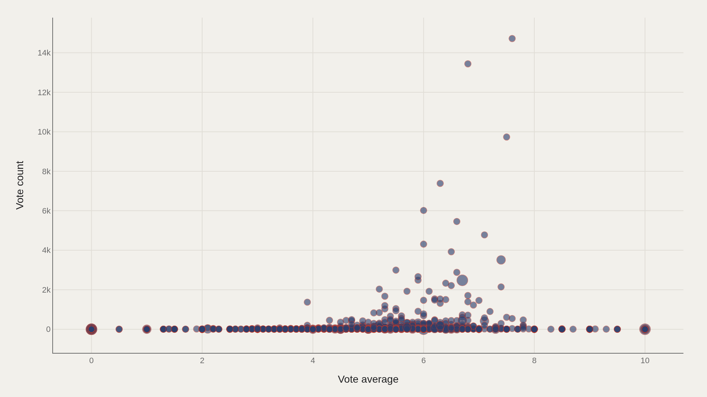

> **TL;DR** 32,540 horror-tagged films from TMDB (1950–2022) carry a median vote average of 4.00. The median rose from 5.65 in early decades to 6.00 by 2022 — a 0.35-point climb as catalog volume expanded. Perfect 10.0 scores cluster at the top, signaling sparse vote counts rather than universal consensus.

The median vote average for horror films climbed from 5.65 to 6.00 between 1950 and 2022 — a 0.35-point rise across seven decades that added 32,540 titles to the catalog.

TMDB metadata for horror-tagged films yields 32,540 records from 1950–2022. The median vote average is 4.00; the highest observed average is 10.0. Horror is the most common primary genre label, as expected in a horror-tagged extract.

## Fast facts {#fast-facts}

The numbers that set the scale for this report:

- **32,540** — Records in the working dataset

  4.00Median Vote average
  10.0Highest observed Vote average
  Piranha WomenTop Title by Vote average
  1950–2022Year span covered in the file
  HorrorMost common Primary genre

## Data and method {#data-and-method}

The file merges TMDB metadata for thousands of horror-tagged films: ratings, budgets, runtimes, and genre tags from 1950 through 2022, released via TidyTuesday.

Charts ship as Plotly JSON with PNG fallbacks. Medians handle skew better than means. Perfect 10.0 scores often sit on thin vote counts — treat the ceiling as a signal about sparse ratings, not universal critical consensus.

## How the pattern changed over time {#how-the-pattern-changed-over-time}

### Median Vote average Over Time

Median vote average rises from 5.65 in the opening period to 6.00 at the close — a 0.35-point lift across decades of catalog growth.

Volume exploded while the middle of the scoreboard edged up. More titles filled the shelf; the median shifted modestly upward rather than holding flat or declining.

## Who sits at the top {#who-sits-at-the-top}

### The House Guest leads at 10.0 — 10.0 marks the median among the top dozen

The House Guest leads at 10.0, and 10.0 also marks the median among the top dozen. The head of the leaderboard is a cluster of perfect averages, not a gentle taper.

In large rating tables, that pattern signals low vote counts or niche titles with small, enthusiastic rater pools. The top is a ceiling effect, not a ranked canon.

## How the field is spread {#how-the-field-is-spread}

### Vote average by Primary genre

Primary-genre boxes reveal whether vote averages converge across hybrid tags or split by outliers.

Horror-tagged films carry secondary labels — crime, animation, drama — and those buckets disagree about quality. Consensus is uneven once the tag set widens.

## Who beats the median — and who trails {#who-beats-the-median-and-who-trails}

### Vote average vs median by Primary genre

Crime sits 1.00 above the median; Animation trails by 4.00.

Those gaps are relative to this file's middle, not absolute statements about every crime or animated horror title. They mark where hybrid labeling and rater pools pull averages apart.

## What moves together {#what-moves-together}

### Vote average vs Vote count

Vote average and vote count do not move as a simple line. Perfect scores with tiny counts sit apart from widely watched mid-range films.

Popularity and perceived quality are related but not interchangeable — the scatter shows where that distinction becomes visible.

## What this file cannot tell you {#what-this-file-cannot-tell-you}

Community-cleaned TidyTuesday snapshots are not live APIs. Missing values, spelling variants, and week-of-export coverage limits apply. Merged tables may fan out or duplicate rows when join keys are imperfect.

Findings describe the file on hand — structural signals about horror-tagged ratings, not a complete history of the genre's artistry.

## What to take away {#what-to-take-away}

The median vote average rose 0.35 points (5.65 to 6.00) as the catalog expanded by tens of thousands of titles. Perfect 10.0 leaders reflect sparse vote counts rather than broad acclaim.

Read leaders, gaps, and the average–count scatter together before treating any title as proof of a golden age.

## Sources {#sources}

Data Science Learning Community. (2022). TidyTuesday: Horror Movies. https://raw.githubusercontent.com/rfordatascience/tidytuesday/main/data/2022/2022-11-01/horror_movies.csv

