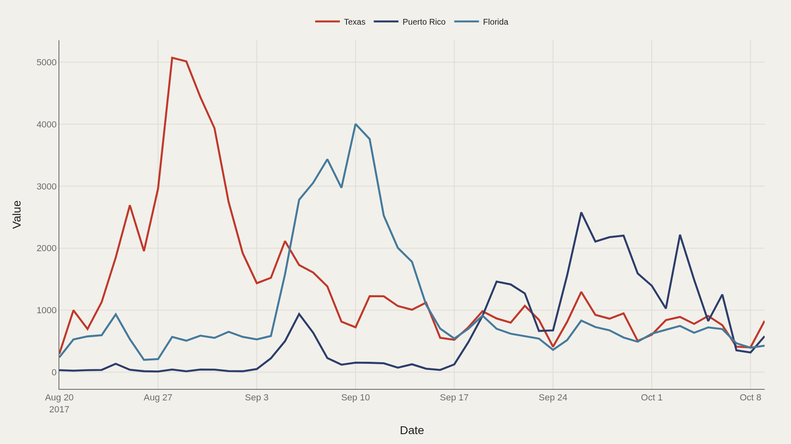
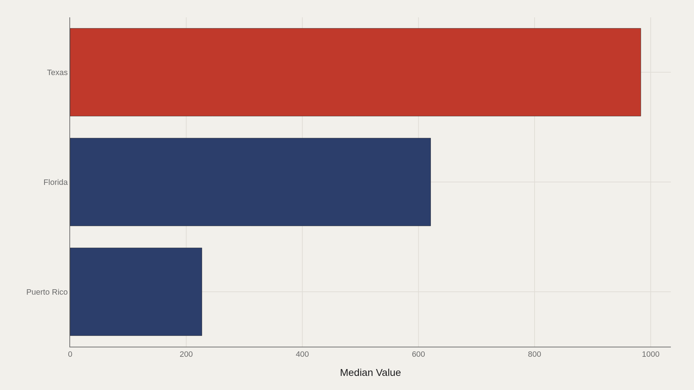
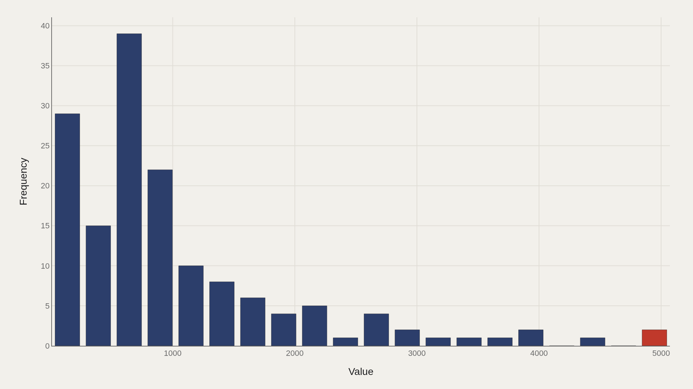
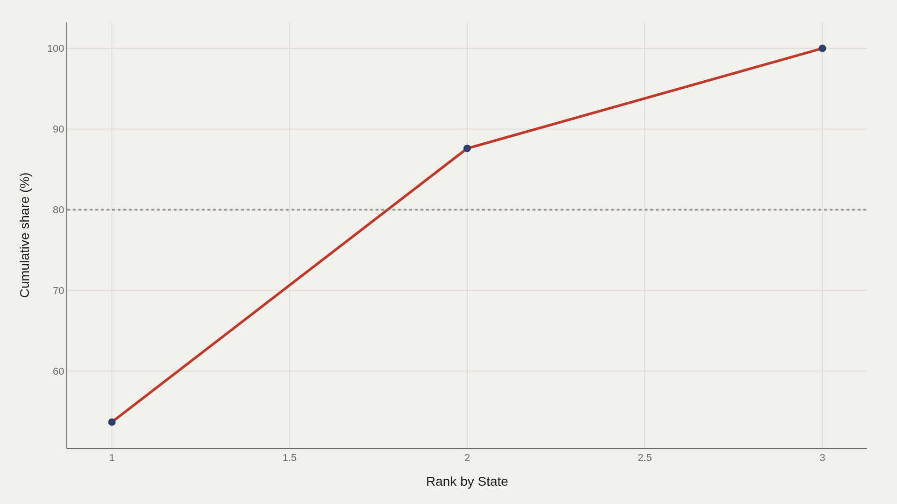

> **TL;DR** Three places absorbed 100% of measured hurricane impact in the 2017 TidyTuesday extract: Texas leads state totals at 983, Florida follows, and Puerto Rico recorded the season's 5,072 peak. The 153-record file shows median value 703, mean 1,020, and a right-skewed distribution where the top decile begins at 2,214.

Three places absorbed 100% of measured hurricane impact in the 2017 TidyTuesday extract: Texas leads state totals at 983, Florida follows, and Puerto Rico recorded the season's 5,072 peak.

The 153-record file from the R for Data Science community tracks intensity values across the late-summer Atlantic window. Median reading is 703; the right-skewed distribution pushes mean to 1,020. The top decile begins at 2,214—the threshold where defining storm days separate from elevated but survivable readings.

This is not a full Caribbean cyclone climatology. It is a season-slice that places Texas, Florida, and Puerto Rico side by side on intensity, concentration, and timing.

## Data and method {#data-and-method}

Source: TidyTuesday release from 2018-06-19, published by the R for Data Science community. The working file contains 153 rows and 4 columns after cleaning—a narrow table built for cross-state comparison in the 2017 window.

Medians are preferred for robustness. Charts ship as Plotly JSON with PNG fallbacks. Because the year span collapses to 2017, conclusions are about that season's comparative geography, not multi-decade hurricane climatology.

## Timeline across states {#timeline}

### Value by State

Daily value lines separate which state or territory bore the brunt on which days. Peaks rarely align. Texas, Florida, and Puerto Rico experienced the same basin season on different clocks—landfall timing and local intensity created staggered curves rather than a single shared crest.

The 5,072 maximum defines the intensity ceiling. Everything else in the file is read relative to that spike and to the 703 median.

## Who sits at the top {#who-sits-at-the-top}

### Texas leads at 983 — 621 marks the median among the top dozen

Texas leads at 983; median among the top dozen entries is 621. Florida and Puerto Rico complete the short list of places that dominate the aggregate signal.

A short leaderboard is itself a finding: storm impact is not evenly distributed across dozens of states. A handful of geographies carry the measurable season.

## How values are spread {#how-the-field-is-spread}

### Median 703 vs mean 1,020 — the shape is right-skewed

Right-skewed distribution: median 703 versus mean 1,020. The top decile begins at 2,214. That tail is where the defining storm days live—and why a mean-based summary sounds more extreme than a typical day in the file.

Skewness is the statistical signature of disaster data. Most observations are elevated but survivable; a minority of days rewrite the season's memory.

## Concentration of impact {#concentration}

### The top 3 state entries account for 100% of the aggregate value

The top three state or territory entries account for 100% of the aggregate value. The Pareto curve is not merely steep—it is a three-place map.

That concentration explains why comparative journalism about 2017 returned to Texas, Florida, and Puerto Rico. The file's structure matches public memory: a short head, not a long list of mildly affected places.

## Concentration, from another cut {#concentration-detail}

### The top 3 state entries account for 100% of the aggregate value

A second concentration chart repeats the same structural claim from a related table cut: the measurable aggregate is carried by the same three-place head. Steep Pareto curves mean a small head drives most of the signal.

For Puerto Rico, the lesson is not that other places did not suffer. In this season-slice, comparative magnitude collapses onto a tiny set of names—and Puerto Rico is inside that set.

## What this file cannot tell you {#what-this-file-cannot-tell-you}

Community-cleaned TidyTuesday snapshots are not live APIs. Missing values, spelling variants, and week-of-export coverage limits apply. A 153-row season extract cannot stand in for FEMA damage ledgers, mortality studies, or multi-decade storm catalogs.

Value in the working columns is the file's measured intensity metric—not a universal currency of loss. Pair these charts with official after-action reporting before converting them into legal or fiscal claims.

## What to take away {#what-to-take-away}

The 2017 window in this file is a story of concentration: median 703, ceiling 5,072, and an aggregate dominated by three places. Texas leads the ranking cut; Puerto Rico holds the season's peak.

Disaster seasons are not democratic distributions. They are skewed clocks. The citable map is the short head of places where the season actually happened.

## Sources {#sources}

