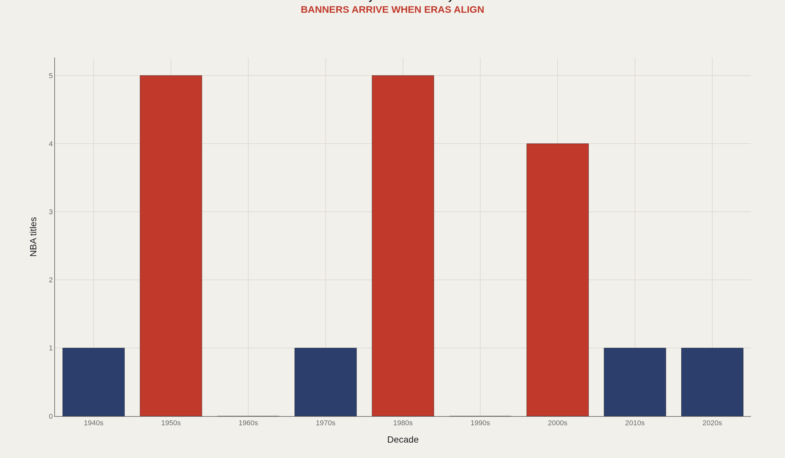
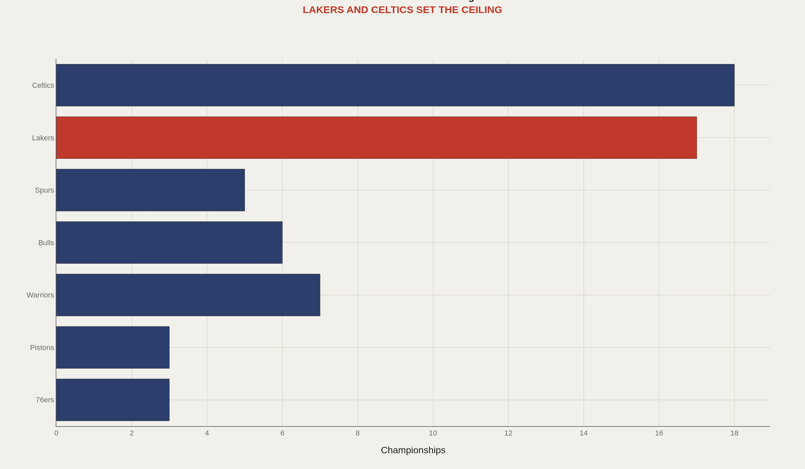
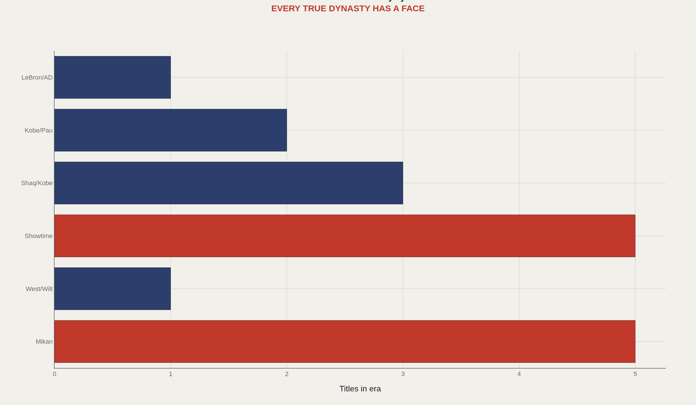
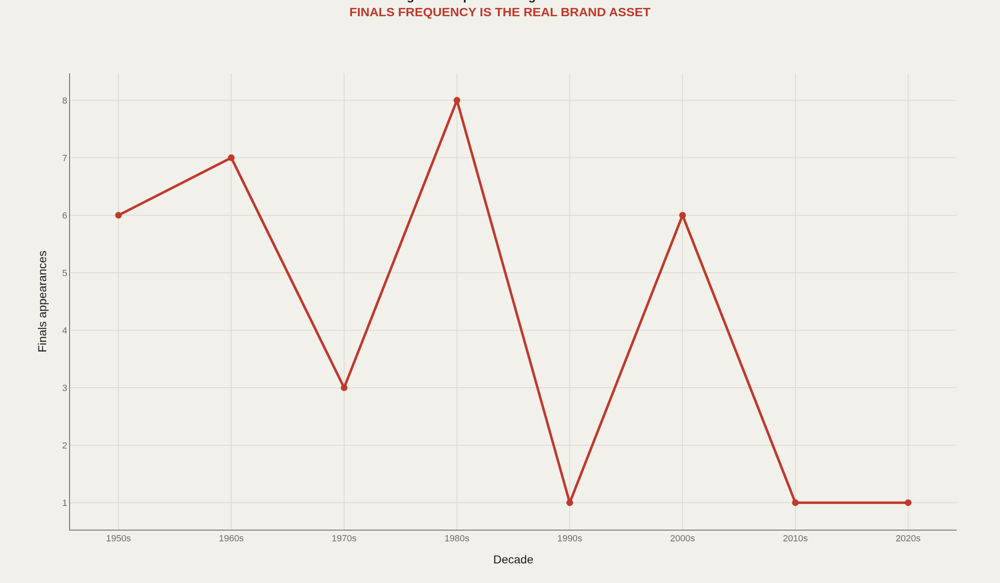
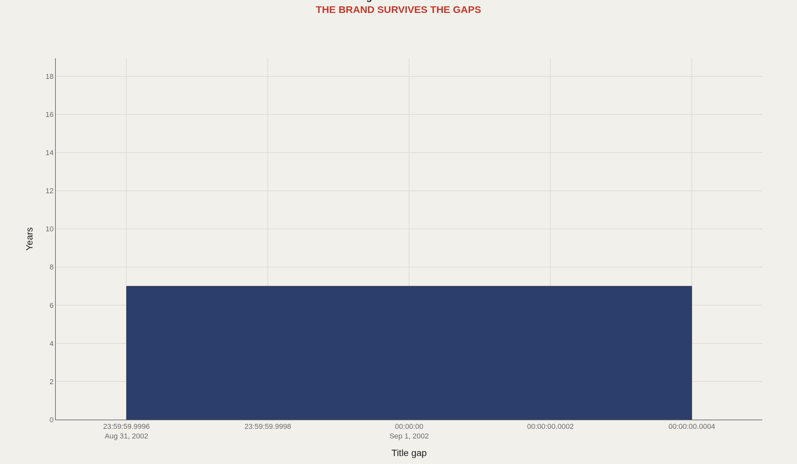

> **TL;DR** The Los Angeles Lakers run winning and celebrity as the same operating system. Seventeen championships and 32 Finals appearances — the deepest final-round archive in the league — reveal a consistent pattern: star gravity lowers the cost of becoming relevant again. From Mikan in 1949 through the 2020 bubble championship, the franchise does not win smoothly; it wins in concentrated acts when the right face arrives.

Seventeen championships and 32 Finals appearances make the Los Angeles Lakers more than a glamour brand — they are a machine for converting star gravity into concentrated title runs. Other franchises develop stars; the Lakers absorb them, frame them, and convert them into eras.

That pattern holds from 1949 through 2020. The franchise does not win as a steady-state institution. It wins in acts: when the right face arrives, supporting pieces and narrative suddenly align. Market size and historical proof keep the casting call open between leads. Showtime's five banners in a single decade remain the clearest proof that concentrated star power can industrialize a window.

The charts below track that system — banner cycles by decade, the two-franchise ceiling with Boston, championship engines by star era, Finals frequency as institutional access, and the gaps between titles when the recruitment magnet must work again.

## The numbers behind the story {#fast-facts}

- **17** — NBA championships in franchise history

  32Approximate Finals appearances, the league's deepest final-round archive
  5Titles in the Showtime decade
  6Defining title eras from Mikan to LeBron/AD
  1949First championship season
  2020Most recent championship

## Los Angeles does not win smoothly—it wins in acts {#banner-cycles}

Championship distribution by decade confirms the franchise does not win as a smooth institution. It wins in eras: Mikan in the 1950s, West and Chamberlain in the 1970s, Showtime in the 1980s, Shaq and Kobe in the 2000s, Kobe and Gasol at the 2000s–2010s boundary, LeBron and Davis in 2020. The 1980s delivered five titles — the franchise's most concentrated run and proof that star power plus institutional infrastructure can industrialize a window.

The data shows no steady-state excellence. Instead, it reveals a machine for converting transcendent players into compressed title runs.

## The NBA's title race is still a two-name conversation {#the-two-name-ceiling}

The Lakers–Celtics comparison defines the actual shape of NBA championship history. Both franchises hold 17 titles; no other team exceeds 7. Golden State, Chicago, and San Antonio fight for the second tier while Boston and Los Angeles set the ceiling.

The question is not whether the Lakers are elite. It is how often glamour can rebuild itself before the market advantage decays.

## The product is star gravity, not just basketball {#star-engines}

Six defining title eras from Mikan to LeBron/AD reveal the same front-office product: star gravity. Showtime anchored by Magic Johnson delivered five championships. Shaq and Kobe delivered three. Kobe and Gasol added two. LeBron and Davis brought one more in 2020. When the right face arrives, supporting pieces and narrative align. When the face leaves, the franchise can look ordinary faster than its brand admits.

That risk is the cost of the model. Between leads, the script stalls.

## The real glamour metric is recurring invitation {#final-table-frequency}

Championships are rare. Finals appearances measure institutional access. Across tactical eras, ownership changes, and league economic shifts, the Lakers have repeatedly returned to the final round. The 1980s alone delivered eight Finals appearances — proof that concentrated talent plus market advantages create recurring pathways to title contention.

That is the durable glamour metric: not invincibility, but recurring invitation to the rooms where eras begin.

## Even Hollywood winters demand the next organizing star {#winter-in-los-angeles}

The Lakers have winters. They just rarely become permanent. The longest gap — eight seasons between Kobe/Gasol and LeBron/Davis — ended when the next organizing star could imagine becoming the next chapter. Market size, historical proof, and patient ownership keep the casting call open after the credits roll.

The gaps are reminders, not obituaries. Even the most glamorous franchise needs the next organizing star before the machine restarts.

## Fade-out, casting, title run, repeat {#conclusion}

The Lakers' advantage is not that they avoid decline. It is that decline rarely destroys the recruitment story. Market gravity plus historical proof keep the next star within reach. From 1949 to 2020, the plot has changed but the structure has not: fade-out, casting, title run, repeat.

That is why Lakers data looks less like a franchise line and more like a sequence of acts. Six title eras, 17 championships, 32 Finals appearances — the numbers describe a machine for converting star gravity into institutional memory, then converting institutional memory back into star gravity.

## Data and method {#dataset-context}

Public NBA championship records, Basketball Reference franchise histories, and Sports Reference Finals summaries supply the counts. Era buckets are editorial groupings around the players and teams most responsible for each title window — from Mikan through Showtime, Shaq and Kobe, Kobe and Gasol, and LeBron and Davis.

The question is how a franchise repeatedly reopens title windows. The answer is market gravity plus historical proof: each new star can imagine becoming the next era because the previous eras already exist.

## References {#references}

Basketball Reference. Los Angeles Lakers Franchise Index.

NBA.com historical championship records.

Sports Reference and Basketball Reference Finals appearance summaries.

Related Artometrics reports: Celtics · Warriors.

## Editor's note {#editors-note}

Finals appearance totals are approximate franchise summaries from public records. Era buckets are editorial groupings for chart legibility.

