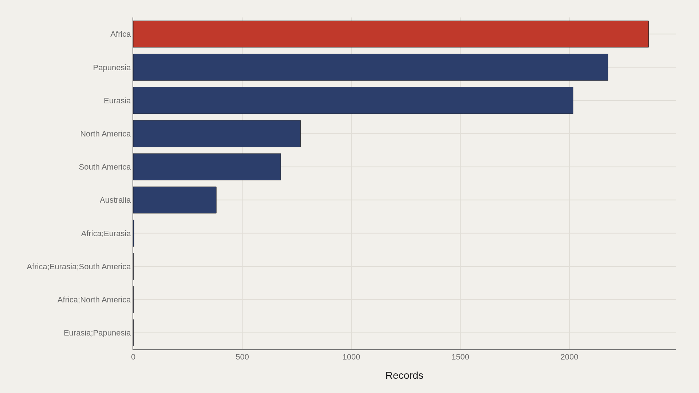
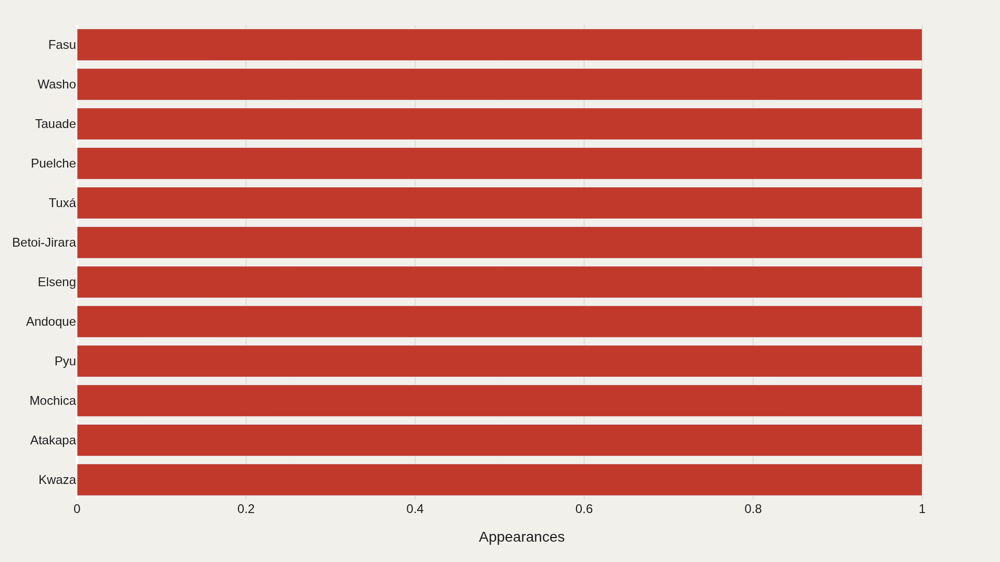
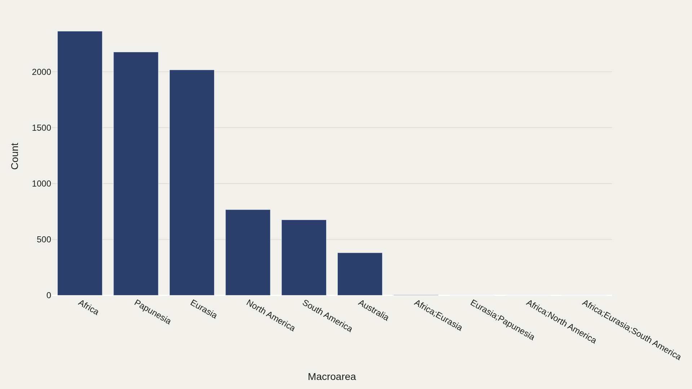
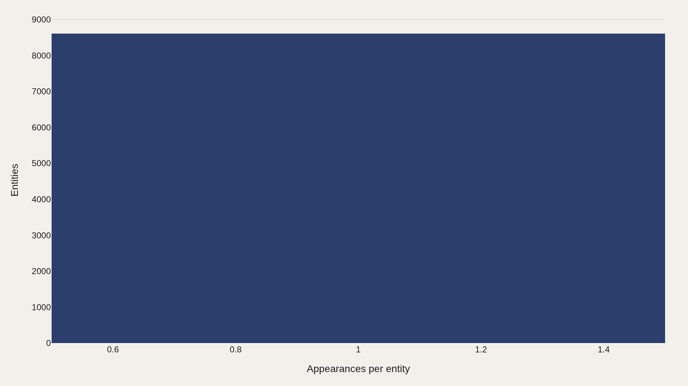
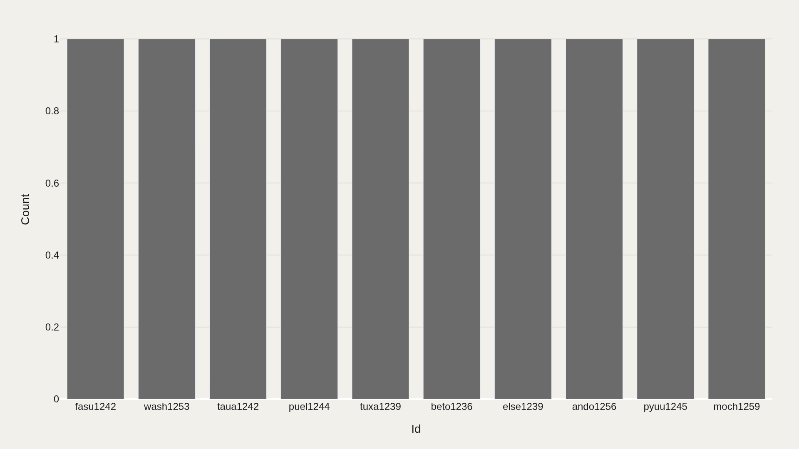

> **TL;DR** A TidyTuesday Glottolog extract shows 8,612 language records clustered by region: 2,363 in Africa, with most language names appearing once while a short head repeats. The file maps documentation effort — where grammars, identifiers, and fieldwork concentrate — not the lived geography of speech communities.

2,363 of 8,612 language records in a Glottolog-derived TidyTuesday extract sit in the Africa macroarea bucket — 27% of the catalog. The concentration maps documentation density — where grammars, identifiers, and fieldwork accumulate — not the lived geography of speech.

The working file holds 8,612 records. Africa is the largest macroarea at 2,363 entries; most language names appear once while a short head repeats. Row counts are not speaker counts, and macroarea labels are database shortcuts, not political borders.

A language catalog is also an archive of scholarly attention. Regions with denser fieldwork traditions show higher row counts even when underlying human diversity is more even — or more endangered — than the table suggests.

## Research question {#research-question}

What does a Glottolog-derived catalog reveal about the geography of linguistic documentation, not the geography of language itself? This report asks where the 8,612-record extract concentrates by macroarea, where names and identifiers repeat, and how much of the visible language map is shaped by catalog infrastructure.

The question is observational because row counts are not speaker counts, vitality scores, or political claims. The aim is to distinguish language diversity as lived by communities from language visibility as preserved in databases, grammars, ISO-style identifiers, and scholarly citation systems.

## Data and method {#data-and-method}

The source is the TidyTuesday release from December 23, 2025 (R for Data Science community). The working file contains 8,612 rows and 9 columns after cleaning — language names, identifiers, macroarea labels, and related Glottolog metadata.

Because many fields are categorical rather than scored, the analysis leans on counts, concentration, and repetition rather than medians of a single numeric quality metric. Charts export as Plotly JSON with PNG fallbacks.

## A geographically uneven landscape {#landscape}

### Language documentation is geographically uneven

Africa dominates with 2,363 records in the primary macroarea cut. Other macroareas — Papunesia, Eurasia, the Americas, Australia — follow at lower counts. The main bucket carries 27% of the story; this field does not behave like a gentle long-tail split across dozens of equal regions.

Uneven documentation is not identical to uneven linguistic diversity, but it shapes what comparative science can see. Extinction risk, revitalization, and typology research all inherit the map of what has been recorded.

Africa's lead is plausible in linguistic terms: the continent contains large families such as Niger-Congo, Afro-Asiatic, Nilo-Saharan groupings as traditionally defined, and Khoisan-associated lineages, alongside intense contact zones and multilingual states. But the chart does not validate any particular family taxonomy; it records how the Glottolog-style file assigns macroarea metadata to rows.

Papunesia and Australia are especially important comparison cases because they contain many small language communities with high typological diversity and severe endangerment pressure. A lower row count than Africa does not mean lower scientific importance. It means the record is distributed unevenly across regions, fieldwork histories, and naming conventions.

## Who sits at the top of name repetition {#who-sits-at-the-top}

### Repeated language names show documentation density

Fasu appears among the recurring names in the file; the top dozen account for a visible share of all 8,612 rows even though most languages appear only once. Name repetition can reflect dialect documentation, alternate glottonyms, or multiple database entries tied to related varieties.

Fasu is a Papuan language name associated with Papua New Guinea, and its recurrence is a reminder that catalog entries are not always one-to-one with what a lay reader calls a language. Varieties, dialect clusters, alternate names, bibliographic records, and genealogical nodes can all push the same surface name into repeated view.

This is where Glottolog's infrastructure differs from a census. A national census might ask who speaks a language at home; Glottolog asks how a language or lineage is classified and documented in the linguistic literature. The same community can be highly visible in one system and nearly invisible in another.

## Regional concentration {#category}

### Regional concentration shapes the language map

Africa is again the largest bucket with 2,363 records on the regional concentration chart. Category concentration shows where editorial and scientific attention should look first if the goal is to understand the file's center of gravity.

Mixed macroarea labels in the data — combinations such as Eurasia with Papunesia — remind readers that languages and contact zones do not always respect tidy continental borders.

The macroarea scheme is a practical database compromise. Eurasia contains Indo-European, Uralic, Turkic, Sino-Tibetan, Japonic, Koreanic, Dravidian, and many other lineages; the Americas contain hundreds of Indigenous languages with colonial-era documentation gaps; Papunesia compresses a spectacularly dense set of Papuan and Austronesian histories into one label. The labels help chart structure, but they are not theory in themselves.

Regional concentration also encodes academic history. Missionary grammars, colonial surveys, national language academies, SIL International work, university field programs, and contemporary community-led documentation all leave traces in catalogs. The chart is therefore a map of evidence output as much as a map of human speech.

## Most languages appear once {#frequency}

### Most languages appear once while a small head repeats

Most name entities appear only once; a small head revisits repeatedly. That power-law shape is typical of catalog-style tables: a few repeatedly documented varieties, and a long inventory of singleton entries.

For endangered-language work, the singleton majority is the point. Visibility in a database is already a scarce resource; languages that appear once may still be under-described relative to their social importance.

A singleton entry can represent a language with thousands of speakers, a severely endangered variety with only elders remaining, or a poorly documented name whose classification remains uncertain. Without speaker counts, vitality levels, and bibliographic depth, the frequency chart should be read as documentation structure, not community scale.

UNESCO's language vitality framework and Ethnologue-style speaker estimates answer different questions than Glottolog identifiers. The chart is valuable precisely because it shows the catalog layer that those other systems need to join against before scholars can ask about endangerment, education policy, or intergenerational transmission.

## Identifiers as metadata {#mix}

### Identifier fields are metadata rather than a reader-facing thesis

Glottolog-style IDs such as fasu1242 are the most repeated identifiers in the extract. Secondary dimensions add context when the primary table has no numeric score column — they are join keys for typology databases, not a popularity contest.

Reading IDs as if they were rankings misunderstands the infrastructure. The useful claim is that documentation systems create machine-readable handles that make some languages easier to cite, map, and study than others.

Identifier fields are the quiet machinery of comparative linguistics. Glottocodes such as fasu1242, ISO 639-3 codes, and family IDs let researchers connect grammars, lexicons, sound inventories, phylogenies, and geographic coordinates without relying on unstable spelling variants. The identifier is not the language; it is the database handle that lets the language remain findable.

That infrastructure has real consequences. A language with a stable identifier can be linked into typological databases such as WALS, Glottolog, PHOIBLE, or Grambank more easily than a language whose names are fragmented across archives. Machine readability becomes a form of scholarly visibility.

## What this file cannot tell you {#what-this-file-cannot-tell-you}

Community-cleaned TidyTuesday snapshots are not live APIs. Missing values, spelling variants, and release coverage limits apply. Row counts are not speaker counts, and macroarea labels are not political maps.

The file cannot by itself measure vitality, endangerment, or intergenerational transmission. It measures documentation structure — a necessary but incomplete layer of the global language story.

## What to take away {#what-to-take-away}

World linguistic diversity, as seen through this Glottolog-derived extract, is geographically lumpy: Africa leads the macroarea counts at 2,363 of 8,612 records, while most language names appear once.

The citable lesson is about visibility. What scholars can count depends on where fieldwork and cataloging have been dense — and that density is itself a cultural and scientific fact.

## Sources {#sources}

Data Science Learning Community. (2025). TidyTuesday: Glottolog / language data. https://github.com/rfordatascience/tidytuesday/tree/main/data/2025/2025-12-23

Hammarström, H., Forkel, R., Haspelmath, M., & Bank, S. Glottolog. Max Planck Institute for Evolutionary Anthropology. https://glottolog.org/

UNESCO. Atlas of the World's Languages in Danger. https://www.unesco.org/languages-atlas/

Dryer, M. S., & Haspelmath, M. (Eds.). The World Atlas of Language Structures Online. https://wals.info/

Skirgård, H., et al. (2023). Grambank reveals the importance of genealogical constraints on linguistic diversity and highlights the impact of language loss. Science Advances, 9(16). https://doi.org/10.1126/sciadv.adg6175

