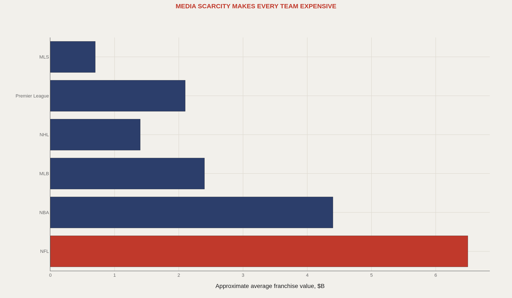
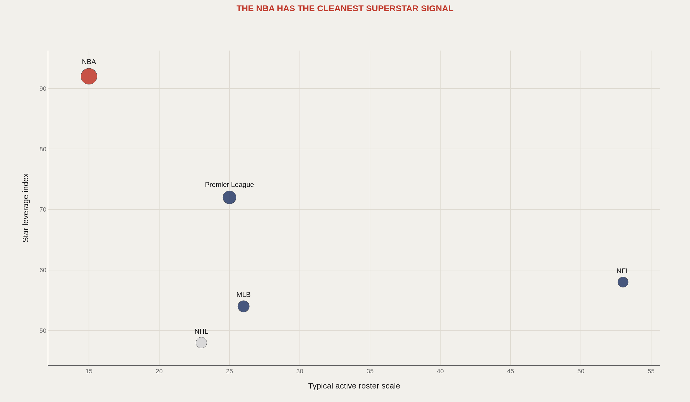
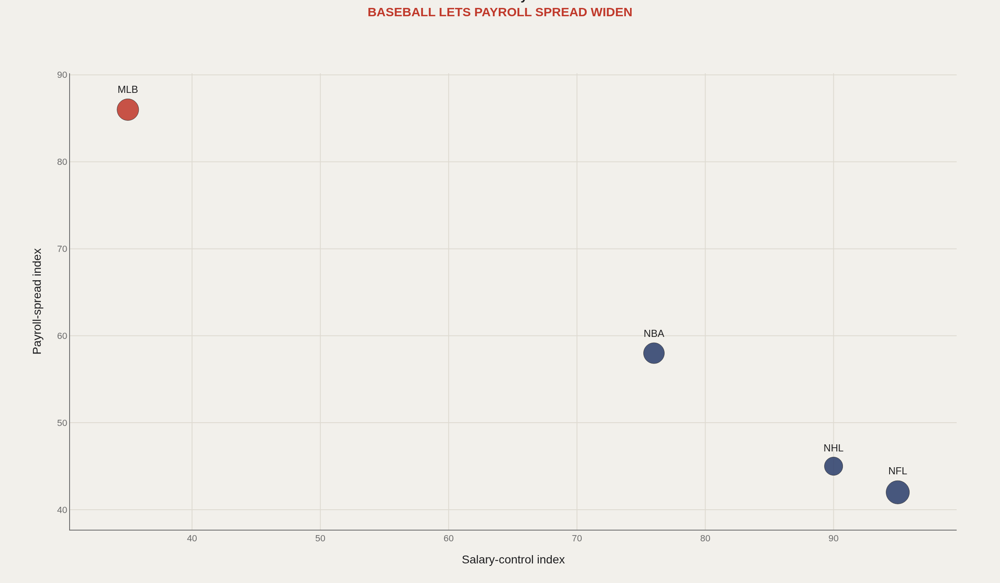
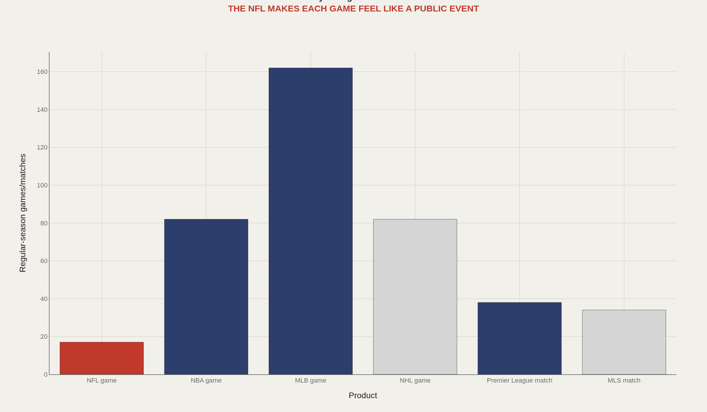
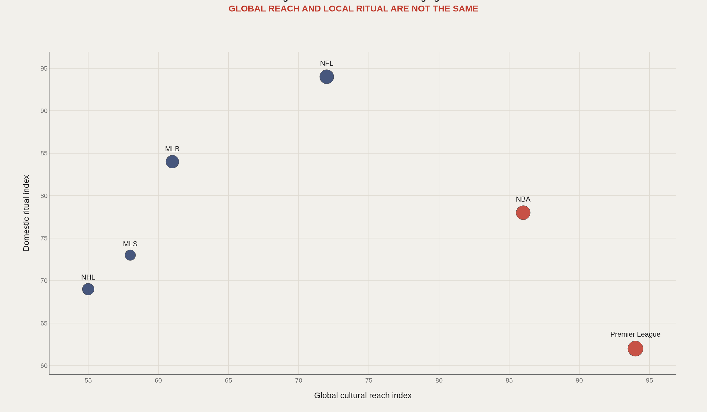

> **TL;DR** League rules — salary caps, game totals, roster depth — manufacture franchise identity before market size or player talent. The NFL's 17-game scarcity and hard cap compress variance and push average team value to $6.5 billion. The NBA's star leverage index of 92 reflects five-player rosters and possession concentration. Compare six leagues and team identity stops looking portable.

NFL teams average $6.5 billion in franchise value not because of market size but because 17-game scarcity, synchronized broadcasts, and hard salary caps compress variance. League rules manufacture identity before talent or geography enter the equation.

Compare six leagues — NFL, NBA, MLB, NHL, Premier League, MLS — across five structural variables: franchise value floors, star leverage, salary-cap compression versus payroll spread, event scarcity, and the split between global reach and domestic ritual. The NBA's star leverage index of 92 reflects five-player rosters and high possession concentration per player. MLB's 162-game season spreads payroll variance and lowers per-game stakes. Each league's rulebook writes a different psychology.

The five charts below isolate how league design — not fan passion or player skill alone — creates the economic and emotional conditions for franchise identity.

## Fast facts {#fast-facts}

The numbers that set the scale for this report:

- **$6.5B** — NFL average franchise value driven by 17-game scarcity and national broadcast architecture

  17NFL regular-season games per team
  162MLB regular-season games per team
  92NBA star leverage index reflecting five-player rosters and high possession concentration per player
  6Leagues compared
  

## Data and method {#data-and-method}

Figures combine public Forbes valuation summaries, Spotrac salary-cap and payroll snapshots, and reference-record league structures from Basketball Reference, Baseball Reference, Pro Football Reference, and Hockey Reference, plus Premier League and MLS competition records. Editorial indices — including the NBA star-leverage score of 92 — compare systems transparently rather than claim laboratory precision.

The shared layer across commissioners, analysts, and fans: what does the league make easy, what does it make scarce, and what does it make emotionally expensive?

## The NFL makes ordinary franchises expensive {#value-floor}

### The NFL turns scarcity and national television into the highest average club value

The NFL does not need glamorous markets. Its media structure makes the ordinary franchise expensive because the league product is scarce, synchronized, and nationally distributed. An average club value of approximately $6.5 billion reflects that design.

Football teams function as local flags plugged into a national machine — a structural difference that creates both economic and cultural consequences.

## Basketball lets one name rewrite the jersey {#star-leverage}

### The NBA gives individual stars the strongest control over team identity

A basketball star touches a large share of possessions — the reason this model's NBA star-leverage index sits at 92. A baseball star can disappear into lineup order and variance. A football star may be trapped inside scheme, injuries, and roster scale.

NBA identity travels through names; NFL identity often travels through systems. Star leverage is not personality — it is structural control over meaning.

## Caps and taxes decide whether money separates or merely sustains {#rules-and-money}

### League rules shape whether money becomes separation or merely survival

Salary caps, luxury taxes, revenue sharing, and roster rules are identity engines. They decide whether capital becomes separation or merely the cost of staying competitive.

MLB's wider payroll gap is intentional: baseball lets market and development systems express themselves with less hard compression than the NFL or NHL. Rules write the economics; economics write the culture.

## Seventeen games and 162 games are different psychologies {#event-scarcity}

### The number of games changes how fans process failure

A baseball team can lose four straight inside a 162-game season and remain competitive. An NFL team can lose two games inside a 17-game season and trigger a crisis. The schedule is a psychology machine.

Pain, momentum, and panic operate on different clocks across leagues. Team profiles that ignore event scarcity will misread fan emotion as competitive failure — or the reverse.

## Global reach and domestic ritual manufacture different loyalties {#belonging}

### Global reach and domestic ritual create different cultural signatures

The Premier League and NBA travel globally with exceptional ease. The NFL remains more domestically ritualized even as its valuation dominates. Reach and ritual are separate cultural products.

The question is not which league is bigger but what kind of belonging each league manufactures — and which teams become meaningful because of that design.

## What to take away {#what-to-take-away}

League design creates fan reality. The same owner, player, or city would produce a different identity under a different schedule, cap structure, roster size, and media architecture.

Team profiles cannot compare clubs without comparing the sports that made them. Money, skill, and stardom only mean what the rulebook allows them to mean.

## Sources {#sources}

Forbes. Professional sports franchise valuation lists.

Spotrac. Salary-cap and payroll summaries.

Basketball Reference, Baseball Reference, Pro Football Reference, Hockey Reference. League and team records.

Premier League and MLS public competition records.

