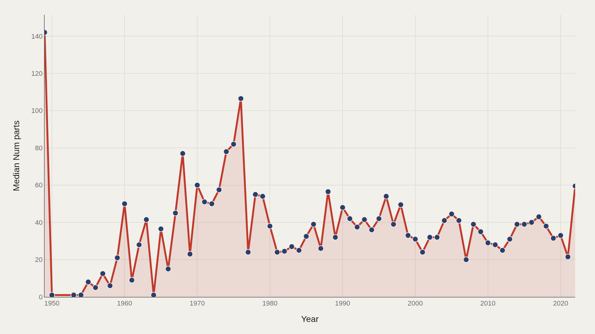
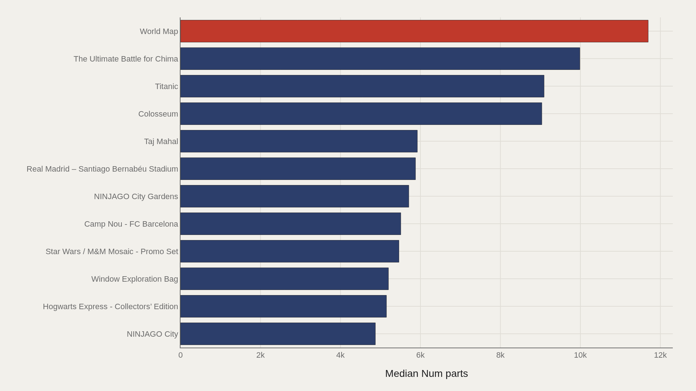
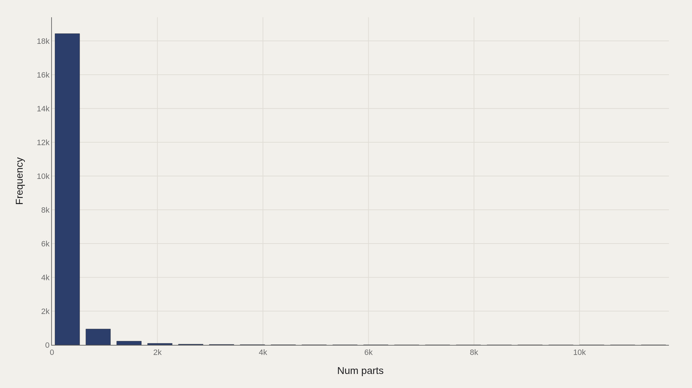
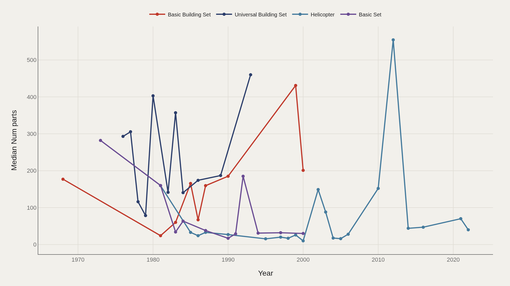
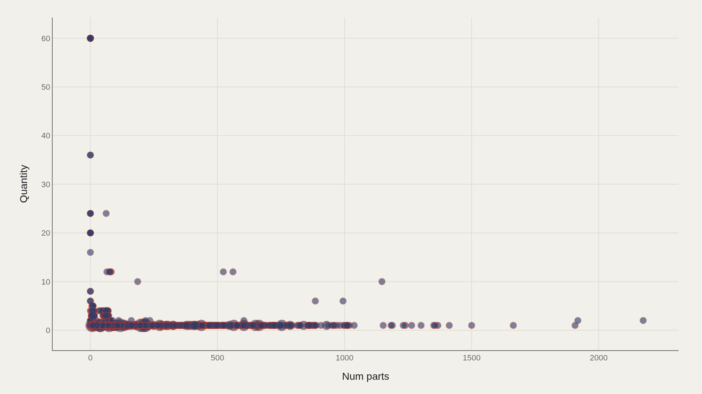

> **TL;DR** The Rebrickable dataset covering 1949–2022 shows a catalog split: median part counts fell from 142 to 59.5 while flagship builds like World Map reached 11,695 pieces. The typical set became smaller as LEGO introduced a new tier of adult display architecture.

The Rebrickable dataset covering 1949–2022 shows a catalog split: median part counts fell from 142 to 59.5 while flagship builds like World Map reached 11,695 pieces. The typical set became smaller as LEGO introduced a new tier of adult display architecture.

World Map leads at 11,695 parts — the median among the top twelve is 5,792, still 170 times the file-wide median of 34. The drop in median counts does not signal declining complexity; it signals catalog segmentation. LEGO produces more small sets for everyday buyers while reserving ultra-high part counts for adult collectors willing to treat brick builds as furniture-scale architecture.

Part count is an industrial signal, not a quality measure. It tracks how much plastic inventory a box commits and how the company balances volume production against showcase releases.

## Data and method {#data-and-method}

The source is the TidyTuesday release from 2022-09-06 (R for Data Science community). The working file contains 19,798 rows across set and parts tables after merging — set names, years, part counts, and quantity fields.

Medians are reported because a few architectural and mosaic sets pull means upward. Charts export as Plotly JSON with PNG fallbacks. Part counts describe inventory complexity, not retail price or build time.

## How part counts changed over time {#how-the-pattern-changed-over-time}

### Median Num parts Over Time

Median part counts fell from 142 in the opening period to 59.5 at the close. LEGO did not abandon complexity — the typical catalog entry became smaller even as a new class of ultra-large display sets appeared at the extreme.

A falling median beside a rising ceiling is a catalog split: more small sets for everyday buyers and a thinner tier of destination builds for adults and collectors.

## Who sits at the top {#who-sits-at-the-top}

### World Map leads at 11,695 — 5,792 marks the median among the top dozen

World Map leads at 11,695 parts. The median among the top dozen is 5,792 — still orders of magnitude above the file-wide median of 34. NINJAGO City, Hogwarts Express Collectors' Edition, stadium sets, Taj Mahal, Colosseum, and Titanic populate the same high-complexity band.

These are not children's starter boxes. They are furniture-scale plastic architecture sold under a toy brand, and the part counts make that product shift quantitative.

## How the field is spread {#how-the-field-is-spread}

### Num parts Distribution

The distribution is sharply right-skewed: median 34 versus mean 161. The top decile begins near 432 parts. Most sets are modest; a long right tail carries the Instagram-era display pieces.

Quoting the mean as the typical LEGO set describes a more complex object than most boxes on the shelf. The median is the honest center; the tail is the brand's adult collector strategy made visible.

## Leader trends {#leader-trends}

### Top Name Over Time

The leading names do not move in lockstep. Some franchise icons fade as others surge; licensed themes and modular city sets take turns occupying the complexity frontier.

Tracking leaders over time separates sustained flagship lines from one-off mosaic promotions. Both matter commercially; only the sustained lines reshape what LEGO means as a cultural object.

## Parts and quantity {#what-moves-together}

### Num parts vs Quantity

Plotting number of parts against quantity fields shows clusters that averages erase. Some rows describe unique large sets; others describe common small parts used in volume across many builds.

The scatter reminds that the database mixes set-level and parts-level grains depending on the joined table. Complexity at the box level and repetition at the brick level are related industrial facts, not the same metric.

## What this file cannot tell you {#what-this-file-cannot-tell-you}

Community-cleaned TidyTuesday snapshots are not live APIs. Missing values, spelling variants, and release coverage limits apply. Part counts are not prices, and set names can recur across regions or reissues.

Findings describe structural signals about LEGO catalog complexity — not a full financial history of the company or a ranking of which sets are best to build.

## What to take away {#what-to-take-away}

LEGO's catalog is two products sharing one logo: a dense middle of small sets around a few dozen parts and a thin upper tier of multi-thousand-piece display builds that redefine the brand's adult market.

The citable tension is the falling median beside the extreme ceiling. Everyday LEGO became smaller in the typical case even as the largest boxes became architectural.

## Sources {#sources}

