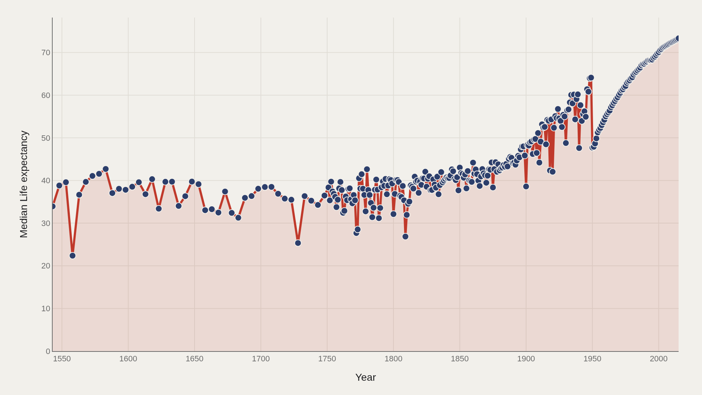
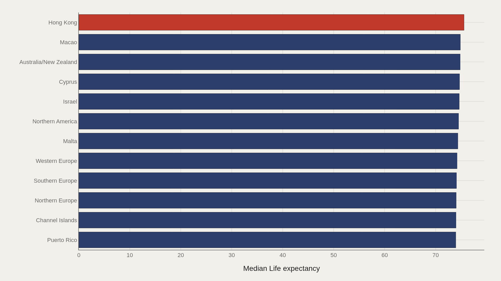
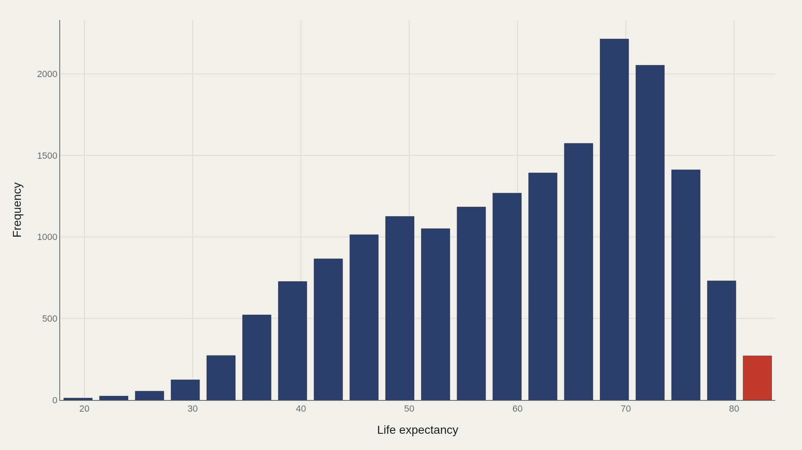
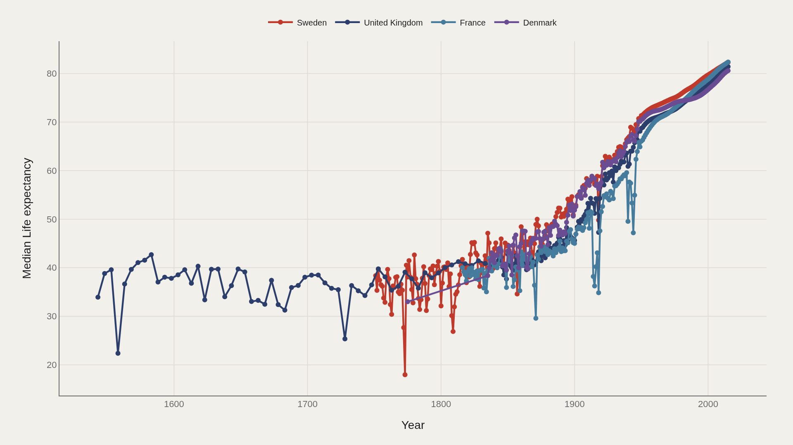
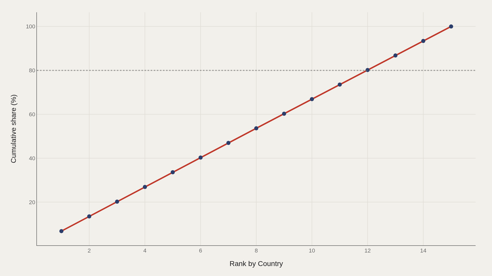

> **TL;DR** Global median life expectancy rose from 33.9 to 73 years between 1543 and 2015. Hong Kong leads at 75.6 years averaged across the dataset, while the distribution remains bimodal — one cluster at 35–45 years, another in the high-70s — revealing that the aggregate average describes almost nobody's lived reality.

Global median life expectancy rose from 33.9 to 73 years between 1543 and 2015 — nearly triple the opening baseline — yet countries at the top of the distribution still outlive the lowest by more than two-to-one in the same closing years.

The aggregate trend hides the most important structure: a persistent bimodal split between the long-lived and the short-lived. The median describes almost nobody's actual regime — one cluster sits at 35–45 years, another in the high-70s, with the summary statistic falling in the valley between them.

The scale: 73.3 — median life expectancy in 2015; 83.8 — the highest single observation, Hong Kong near peak; 472 years — the span from 1543 to 2015.

## Data and method {#data-and-method}

Life expectancy at birth stayed between 25 and 40 years for most of recorded history because childhood mortality dominated the average, not because adults aged faster. Parish registers, early censuses, and model life tables supply the pre-modern estimates; national statistics and UN compilations supply the recent ones.

The modern transformation begins around 1850 with clean water infrastructure, followed by germ theory, vaccines, antibiotics, and the broader public health package that raised survival at every age. This dataset stitches country-year observations across that arc so long-run medians and cross-country gaps can be read on the same axis.

## 500 years of survival {#500-years-of-survival}

### Global median life expectancy from 1543 to 2015

The long-run trend shows three phases: a slow, stalling climb from 1543 to roughly 1850; a steep industrial and public-health acceleration from the mid-nineteenth to mid-twentieth century; and a late-modern continuation where gains are smaller in absolute years but still real, especially where child mortality has already fallen.

The curve does not plateau after 2000 — life expectancy continues rising through the final years. The median path from opening to close — 33.9→73 — is the calibration line for every country comparison that follows.

## Who lives longest {#who-lives-longest}

### Top 12 countries by average life expectancy across all years

Hong Kong leads at 75.6 years averaged across the full dataset. The top dozen form a recognizable cluster: East Asian economies, Northern and Western European states, and a handful of high-income island and city systems. The gap between first (75.6) and twelfth (~73.5) is narrow.

The gap between twelfth and the global median (62.4) is enormous. Longevity leadership is crowded at the top and steep underneath. Averaging across all years also favors places with long, well-documented modern series — a coverage effect that limits any ranking read as permanent hierarchy.

## The split world {#the-split-world}

### Distribution of life expectancy across all country-year observations

The distribution is bimodal — two peaks, not one. One cluster sits around 35–45 years, reflecting historical and lower-income observations. Another sits in the modern high-70s. The valley between them is where average life expectancy lands.

The median (62.4) and mean (60.0) converge near that valley, which means the summary statistic can sound reassuring while describing almost nobody's lived regime. Bimodality proves that global longevity has been two worlds sharing one chart.

## The frontrunners {#the-frontrunners}

### Life expectancy trajectories for the top-ranked countries over time

The frontrunner countries do not rise together at the same rate. Japan's trajectory is among the most striking: relatively ordinary through early modern data, then a steep climb into the global lead. Iceland and Sweden present a different profile — high from the earliest modern observations, climbing steadily rather than surging.

The trajectory chart shows path dependence. Places that entered the twentieth century with strong public-health foundations stayed high. Places that industrialized later sometimes closed the gap faster in absolute years, but membership of the top tier remains sticky once child survival and chronic-disease care are both in place.

## Where longevity concentrates {#where-longevity-concentrates}

### Cumulative share of total life-years by country rank

The Pareto curve for life expectancy is shallower than you might expect from a deeply unequal dataset. The top countries account for a meaningful but not totalizing share of aggregate life-years. Longevity, unlike wealth, has a hard biological ceiling — no country can compound past the limits of human survival the way capital compounds without bound.

The curve still reveals concentration of advantage. A thin set of high-income systems occupies the long end of the distribution year after year. Closing the gap is possible — the long-run median proves it — but catching the frontrunners requires repeating their public-health and living-standard package, not wishing the ceiling higher.

## What this file cannot tell you {#what-this-file-cannot-tell-you}

Historical life expectancy estimates — particularly before 1800 — carry substantial uncertainty. They are reconstructed from fragmentary parish records, model life tables, and incomplete censuses. Country coverage is selective: some regions, especially parts of sub-Saharan Africa and Central Asia, have sparse pre-twentieth-century series.

Life expectancy at birth is not the same as healthy lifespan or adult survival conditional on reaching age five. The file measures a summary of mortality, not the full texture of aging, disability, or quality of life.

## What to take away {#what-to-take-away}

The most important fact in 472 years of life expectancy data is that the trend is real. Humans have reliably extended average lifespan through sanitation, medicine, nutrition, and institutions — from a world near 30 years to a median above 73.

The second most important fact is the gap. Countries at the top of this distribution still live far longer than countries at the bottom in the same closing years. The curve shows what is possible. The spread shows what remains unfinished.

## Sources {#sources}

