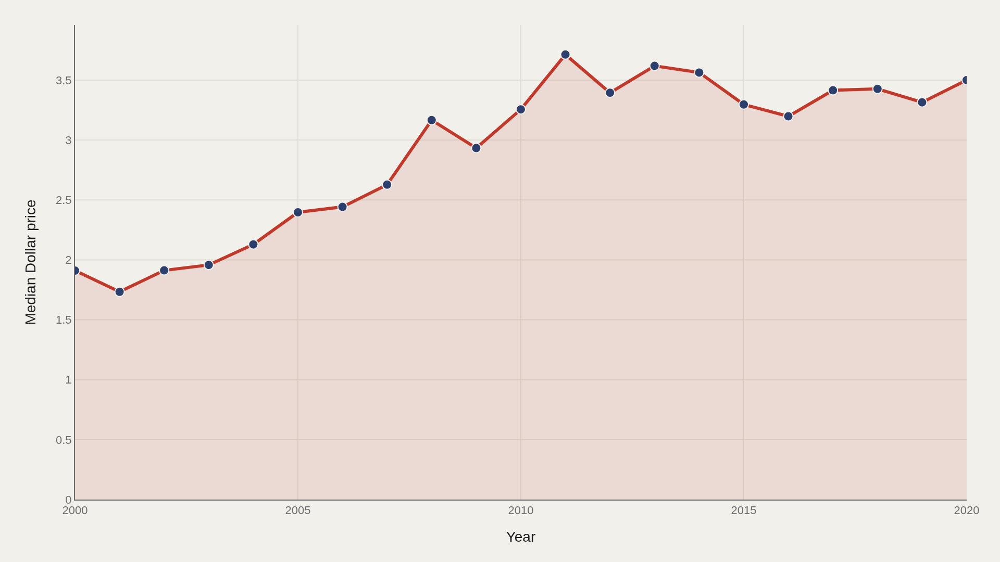
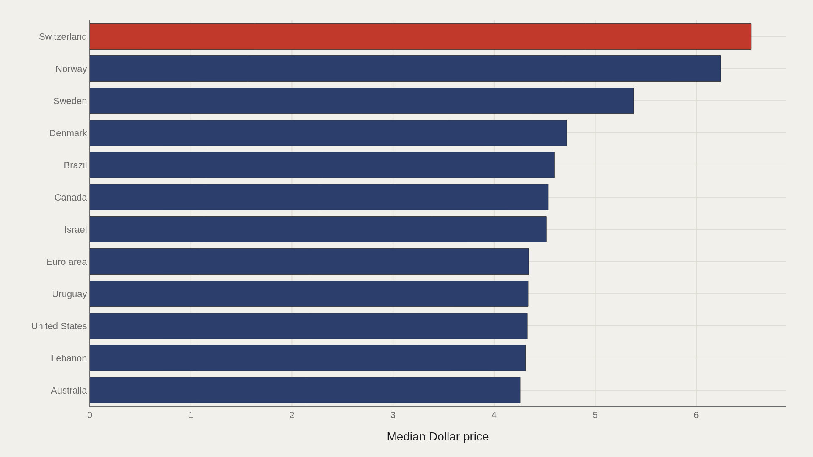
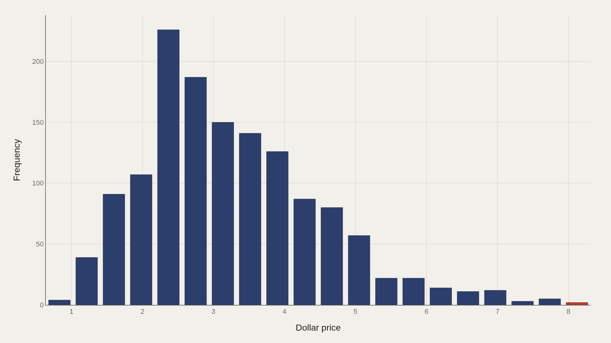
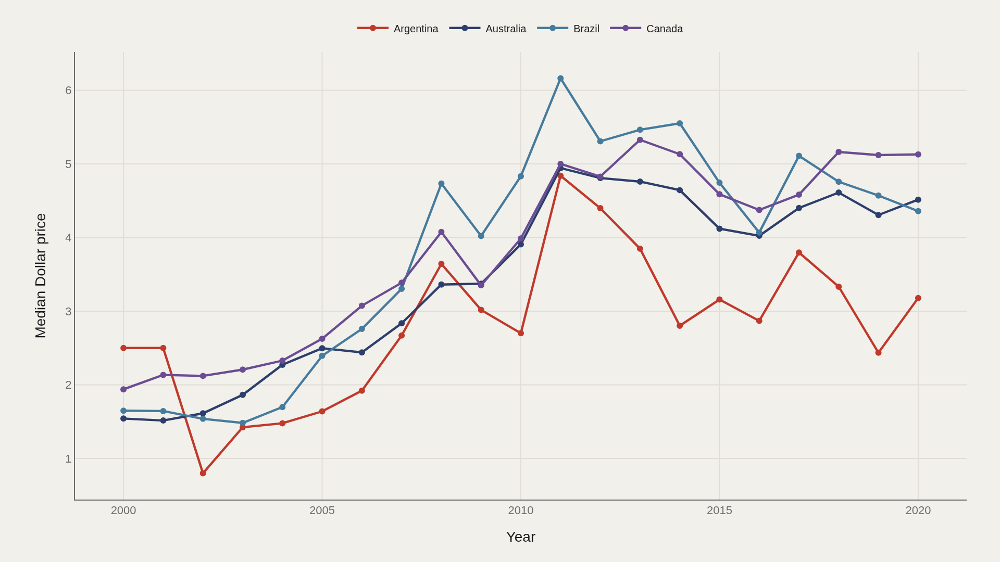
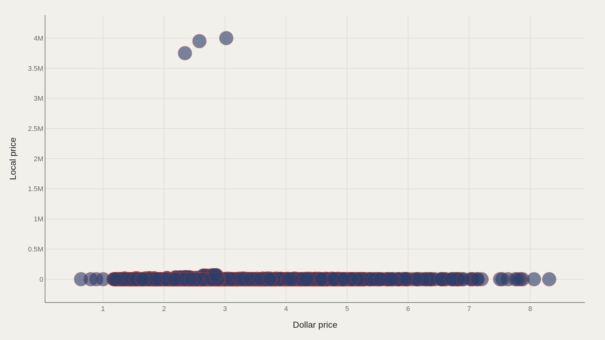

> **TL;DR** A Big Mac is the same product everywhere on Earth — same bun, same patties, same sauce. That sameness is exactly what makes its price interesting. The Economist’s Big Mac Index, running since 1986, converts local burger prices into US dollars to reveal how far currencies stray from purchasing power parity.

A Big Mac is the same product everywhere on Earth — same bun, same patties, same sauce. That sameness is exactly what makes its price interesting. The Economist’s Big Mac Index, running since 1986, converts local burger prices into US dollars to reveal how far currencies stray from purchasing power parity. The working extract covers 1,386 observations spanning 2000 through 2020.

The gap between the cheapest and most expensive burger in any given year is not noise. It maps onto wage structures, agricultural policy, taxes, and the raw purchasing power of local currencies. Switzerland’s peak above $8 encodes a high-wage cost structure; a sub-$2 burger elsewhere tells a symmetrically different story.

Keep the calibration numbers close: the median dollar price across all country-years is $3.04, the peak observed is $8.31, and the global median rose about 83% from 2000 to 2020.

## Data and method {#data-and-method}

Purchasing power parity (PPP) theory says exchange rates should eventually converge so identical goods cost the same everywhere. In practice they rarely do — tariffs, non-tradeable costs (rent, labor), and monetary policy all interfere. The Big Mac Index sidesteps complex econometric models: if a burger costs less in dollar terms than the U.S. price implies, that currency is often read as undervalued; if it costs more, overvalued.

The TidyTuesday snapshot (2020-12-22) supplies the country-year price series used here. The index is deliberately blunt: better at identifying structural divergence than at predicting short-run FX moves.

## Global Price Trend {#global-price-trend}

### Global median Big Mac dollar price, 2000–2020

The median dollar price nearly doubles over two decades, climbing from about $1.91 in 2000 to about $3.50 by 2020. The path is not linear: medians stall and dip in the mid-2010s as a strong U.S. dollar compresses dollar-equivalent prices recorded in many markets, then recover toward the end of the sample.

Using the median — rather than the mean — keeps Switzerland, Norway, and other extreme outliers from rewriting the global story. The median says what a typical country pays; the mean says what the expensive tail can afford.

## Most Expensive Countries {#most-expensive-countries}

### Top 12 countries by average Big Mac dollar price

Switzerland leads average dollar prices at about $6.54, with Norway close behind near $6.24. Sweden, Denmark, Brazil, Canada, Israel, and the Euro area fill out the upper tier. Norway holds the highest average dollar price over the full 20-year span among the fact-box leaders.

The gap between Switzerland and the twelfth-ranked country is larger than the gap between that twelfth country and the global median of $3.04. The top of the distribution is thin air.

## How Prices Spread {#how-prices-spread}

### Distribution of Big Mac dollar prices across all country-year observations

Most country-year observations cluster between roughly $2 and $4, with a long right tail of wealthy, high-price markets. The median ($3.04) sits below the mean because that tail pulls the average upward.

“Expensive” is a select club in this histogram, not a smooth continuum. The bottom half of the world, in this sample, pays between the low end of the distribution and the $3.04 median for the same standardized burger.

## Tracking the Leaders {#tracking-the-leaders}

### Price trajectories for the top-ranked countries over time

Country trajectories do not rise in unison. Argentina, Australia, Brazil, and Canada each show distinct dollar-price paths — commodity cycles, currency crashes, and local inflation leave different fingerprints.

Membership in the expensive-burger club is relatively stable; rankings inside it are not. Sustained dominance requires sustained structural advantage, not a one-year FX spike.

## Local vs Dollar Price {#local-vs-dollar-price}

### Local currency price vs US dollar price — scatter plot

The scatter of local-currency prices against dollar prices makes exchange-rate distortion visible. Points far from a simple correspondence are countries where conversion, not the kitchen, does most of the work.

Emerging-market currencies often produce low dollar prices even when local nominal prices look large. That joint distribution is the index’s entire point: sameness of product, difference of money.

## What this file cannot tell you {#what-this-file-cannot-tell-you}

McDonald’s does not charge a uniform markup everywhere: franchise agreements, competition, and brand positioning move prices independently of pure PPP. Coverage is uneven — the series misses many countries where McDonald’s has little or no presence.

The snapshot ends in 2020 and excludes the post-pandemic inflation surge. Treat the findings as a structural portrait of two decades, not a live FX dashboard.

## What to take away {#what-to-take-away}

Twenty years of Big Mac prices describe a slow rise in global living costs and a persistent hierarchy between high-wage and lower-wage economies. The median nearly doubles; the gap between Switzerland and the median barely disappears.

The index collapses complex macroeconomics into one comparable number. What it measures unambiguously is concentration at the top — a small cluster of high-cost economies that the rest of the sample does not reach.

## Sources {#sources}

Data Science Learning Community. (2020). TidyTuesday: Big Mac Index. https://raw.githubusercontent.com/rfordatascience/tidytuesday/main/data/2020/2020-12-22/mac.csv

The Economist. (2020). The Big Mac Index. economist.com/mac

## Editor’s note {#editor-s-note}

This analysis is part of the Artometrics TidyTuesday series. All charts are interactive (hover for values) with static PNG fallbacks. Source data is publicly available and reproducible from the GitHub link below.

Dollar prices reflect the raw local price converted at the prevailing exchange rate — not adjusted for inflation or PPP. All medians computed on the full annual sample for each year.

Source archive (GitHub)

