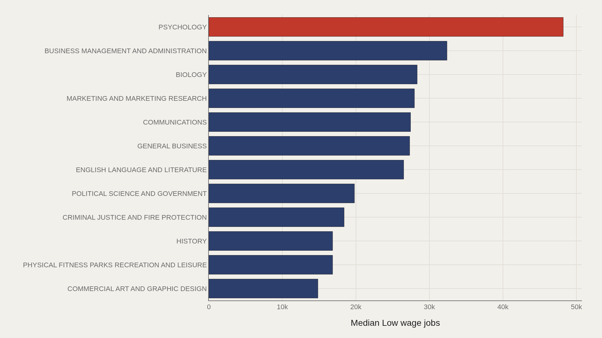
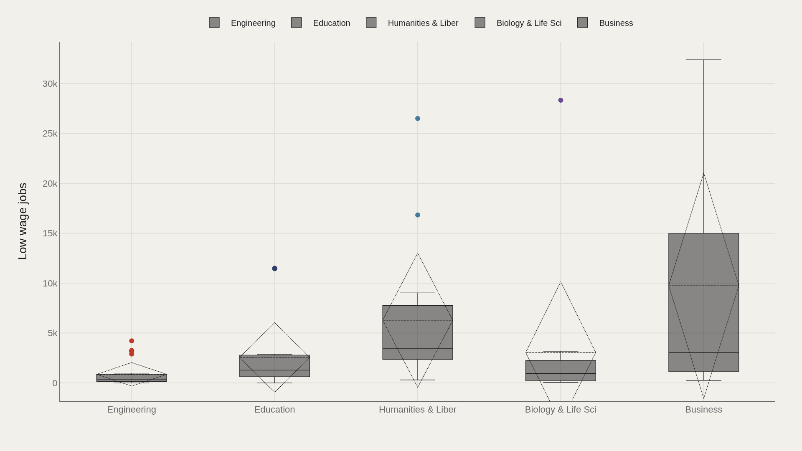
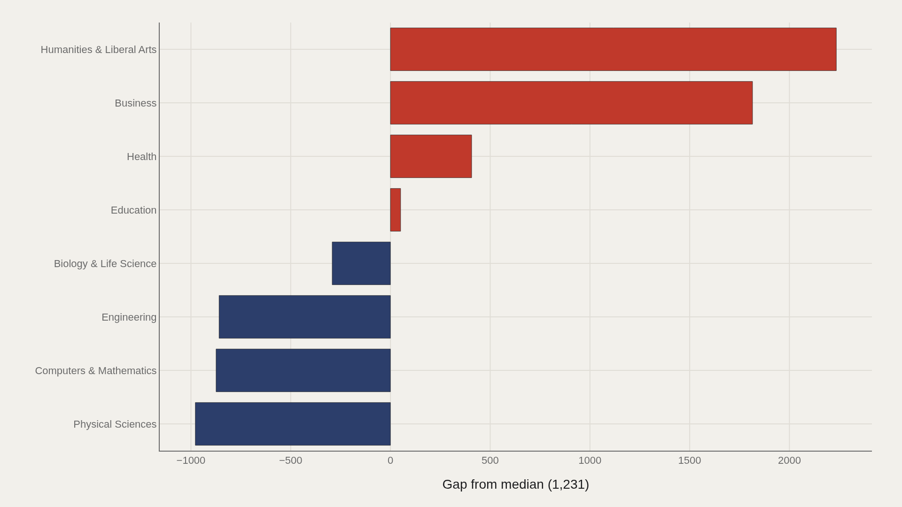
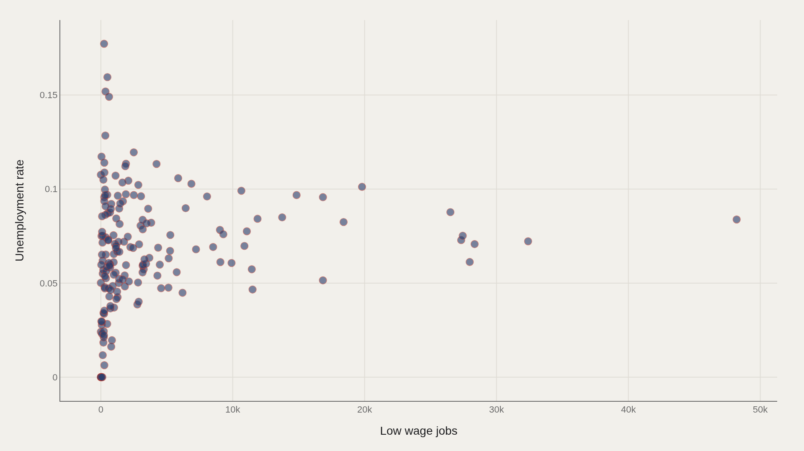

> **TL;DR** Across 173 college majors, psychology graduates account for 48,207 low-wage jobs—nearly twice the second-place count. The overall median is 1,231, but the top dozen average 26,912, concentrating underemployment in a handful of high-enrollment fields. Engineering's median of 372 demonstrates that major choice correlates with wage-floor risk independent of unemployment.

Psychology graduates account for 48,207 low-wage jobs across the 173 majors in this TidyTuesday extract—nearly double the second-place total and forty times the overall median of 1,231. Engineering, the most common category label, carries a median of just 372, revealing that major choice predicts wage-floor exposure independent of unemployment.

This framing inverts the prestige narrative: the analysis leads with the count of graduates in low-wage work, then pairs it with unemployment rates. Pay ceilings matter, but so does the size of the floor.

## Data and method {#data-and-method}

The source is the TidyTuesday release from 2018-10-16 (recent-grads.csv). After cleaning, 173 major rows remain.

Low wage jobs is the primary ranked metric; major category provides distributional context; unemployment rate appears in the scatter. Charts are Plotly JSON with PNG fallbacks.

## Psychology Leads Low-Wage Job Counts by a Wide Margin {#psychology-leads-low-wage-job-counts-by-a-wide-margin}

### Low wage jobs by Major

Psychology posts 48,207 low-wage jobs—ahead of Business Management and Administration (32,395), Biology (28,339), Marketing (27,968), Communications (27,440), and General Business (27,320). English Language and Literature follows at 26,503.

These leaders combine large graduating cohorts with labor-market absorption into lower-wage roles. The metric is a count, not a rate—scale and risk travel together.

## The Top Dozen's Median Is Still Enormous {#the-top-dozen-s-median-is-still-enormous}

### PSYCHOLOGY leads at 48,207 — 26,912 marks the median among the top dozen

Psychology remains first at 48,207, while the median among the top dozen is 26,912—twenty-two times the overall median of 1,231.

The low-wage problem in this file is concentrated in a short list of high-enrollment majors, not distributed evenly across all 173 fields.

## Humanities and Business Categories Sit Higher Than Engineering {#humanities-and-business-categories-sit-higher-than-engineeri}

### Low wage jobs by Major category

Humanities & Liberal Arts shows a median of 3,466 low-wage jobs (n=15) and Business 3,046 (n=13). Engineering's median is 372 (n=29), Education 1,282 (n=16), and Biology & Life Science 939 (n=14).

Engineering's low median does not mean zero risk—its maximum still reaches into the thousands—but the center of the category is an order of magnitude below psychology's scale.

## Gaps Confirm Humanities and Business Above the Median {#gaps-confirm-humanities-and-business-above-the-median}

### Low wage jobs vs median by Major category

Relative to the overall low-wage median, Humanities & Liberal Arts leads at +2,235, with Business at +1,815. Engineering, Computers & Mathematics, and Physical Sciences sit below the median by several hundred to nearly a thousand.

STEM categories in this extract are not immune to low-wage outcomes, but they clear the baseline more often than large humanities and business majors.

## Low-Wage Counts and Unemployment Are Different Risks {#low-wage-counts-and-unemployment-are-different-risks}

### Low wage jobs vs Unemployment rate

Low wage jobs versus unemployment rate spreads majors across both axes. Some fields show elevated unemployment with modest low-wage counts; others show large low-wage tallies without sitting at the top of the unemployment ranking.

The scatter's warning is practical: underemployment and joblessness are related labor-market failures, but they measure different risks—and majors can fail on either axis.

## What this file cannot tell you {#what-this-file-cannot-tell-you}

Low-wage job counts favor large majors; rates would reorder the list. "Recent graduates" definitions and survey vintages constrain comparison. Category bins are broad—"Engineering" hides subfield wage gaps.

The file cannot speak to graduate-school pathways that delay earnings, or to geographic cost-of-living differences that redefine what "low wage" means.

## What to take away {#what-to-take-away}

Across 173 majors, the median low-wage count is 1,231, while psychology alone exceeds 48,000. The top-dozen median of 26,912 shows how concentrated the exposure is.

Cite category gaps when comparing fields of study, and keep unemployment on a separate axis—low-wage absorption and joblessness are twin risks, not synonyms.

## Sources {#sources}

Data Science Learning Community. (2018). TidyTuesday: College Major & Income. https://raw.githubusercontent.com/rfordatascience/tidytuesday/main/data/2018/2018-10-16/recent-grads.csv

