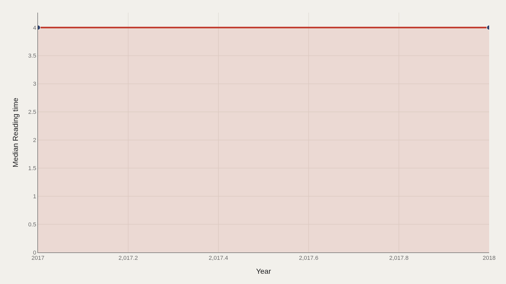
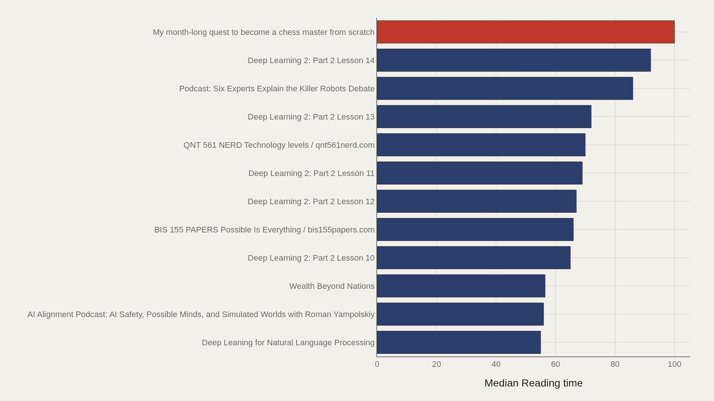
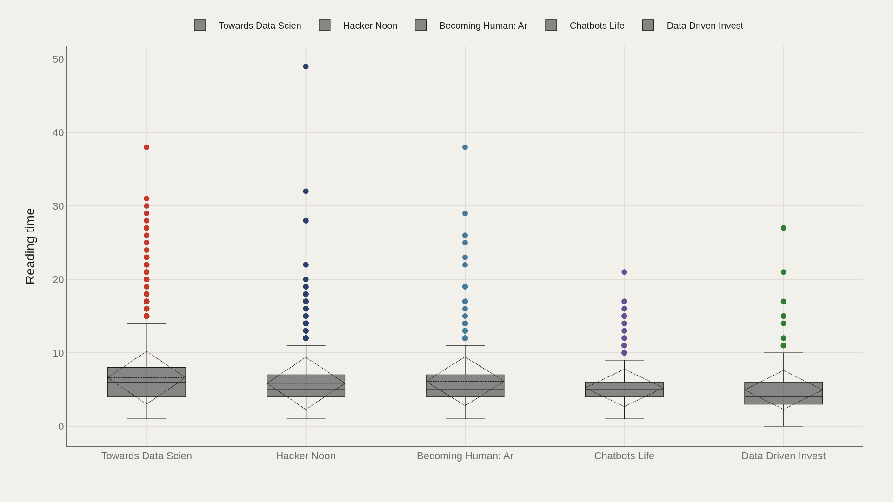
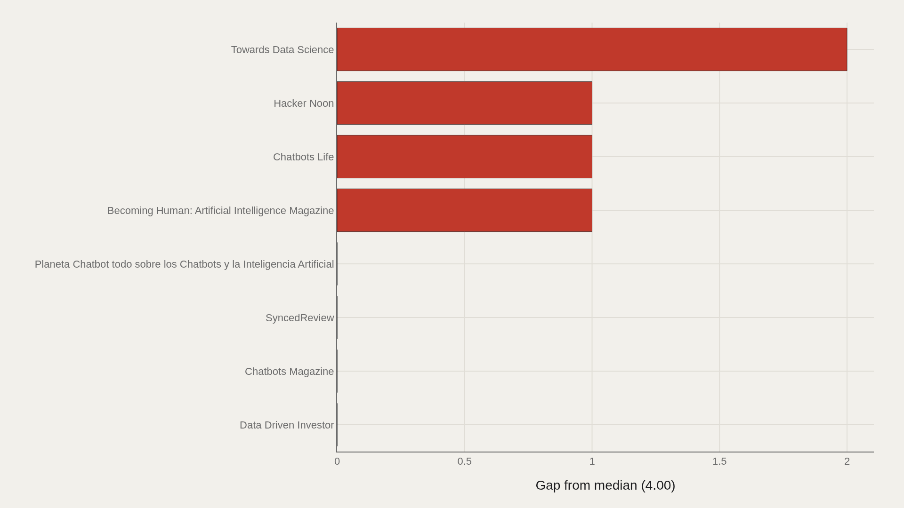
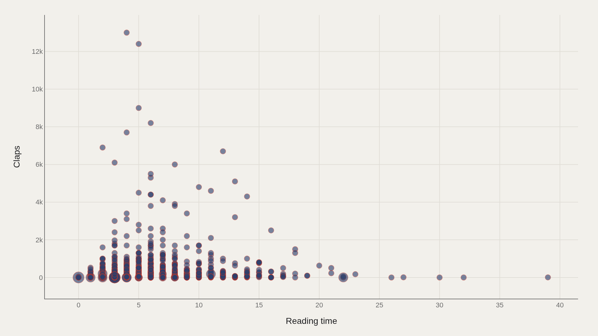

> **TL;DR** Medium's metadata trail — reading time, claps, publication tags — lets the platform's length-versus-attention promise be tested. A TidyTuesday extract of 78,388 articles from 2017–2018 shows median reading time at 4.00 minutes, with one chess-mastery post reaching 100 minutes. Longer posts sometimes earn more claps, but the scatter is noisy enough that length alone is not a reliable applause machine.

Medium's median reading time sits at 4.00 minutes across 78,388 articles from 2017–2018 — a short-form default that holds steady even as a thin tier of hour-scale essays pushes the right tail past 100 minutes.

The open question is whether longer posts earned more applause. Reading time and claps are related enough to chart and messy enough that a single correlation will not settle the culture of the platform. The highest observed reading time — 100 minutes — belongs to a month-long chess-mastery quest; Towards Data Science is the most common publication label in the file.

The metadata trail — reading time, claps, publication tags — lets that promise be tested without reading every essay. Scatter plots reveal no clean law linking length to applause.

## Data and method {#data-and-method}

The source is the TidyTuesday release from 2018-12-04 (R for Data Science community). The working file contains 78,388 rows and 22 columns after assembly — titles, publications, reading time, claps, and related metadata.

Medians stabilize a distribution with a long right tail of mega-posts. Charts export as Plotly JSON with PNG fallbacks. Reading time is a platform estimate, not a stopwatch on every reader.

## How reading time moved {#how-the-pattern-changed-over-time}

### Median Reading time Over Time

Across the 2017–2018 window, median reading time stays near 4.00 minutes from opening period to close. Stability at the median does not mean the tails were quiet — only that the typical post length did not shift during the snapshot.

A flat median is still informative: whatever clap dynamics existed in this period were not driven by a wholesale move toward longer or shorter default essays.

## Who sits at the top of length {#who-sits-at-the-top}

### My month-long quest to become a chess master from scratch leads at 100 — 68.0 marks the median among the top dozen

My month-long quest to become a chess master from scratch leads at 100 minutes of estimated reading time. The median among the top dozen is 68.0 — more than fifteen times the file-wide median of 4 minutes.

Deep-learning lesson writeups, AI alignment podcasts, and longform data essays populate the same extreme band. The length frontier of Medium in this file is a specialist pedagogy genre as much as a literary one.

## How publications spread length {#how-the-field-is-spread}

### Reading time by Publication

Publication box plots show whether reading-time consensus is shared or contested across houses. Some publications cluster tightly around short explainers; others tolerate or encourage long technical serials.

Towards Data Science's frequency as the most common publication does not make it the longest. Volume of posts and length of posts are different editorial strategies that coexist under one brand.

## Who beats the median — and who trails {#who-beats-the-median-and-who-trails}

### Reading time vs median by Publication

Towards Data Science sits 2.00 minutes above the median on the gap chart; Data Driven Investor trails by 0.00 in the highlighted comparison — effectively on the median line in that cut.

Publication gaps of a couple of minutes sound small until you remember the median is only four. A two-minute lift is a 50% longer typical article in that house's mix.

## Reading time and claps {#what-moves-together}

### Reading time vs Claps

Plotting reading time against claps shows clusters that averages erase. Many short posts earn modest applause; some long posts earn a lot; some long posts earn almost none. Length is not a reliable applause machine.

If there is a relationship, it is noisy and genre-dependent. Tutorial serials and viral short takes can both succeed. The scatter kills the slogan that longer always wins without replacing it with the opposite.

## What this file cannot tell you {#what-this-file-cannot-tell-you}

Community-cleaned TidyTuesday snapshots are not live APIs. Missing values, spelling variants, and 2017–2018 coverage limits apply. Claps are a platform-specific applause metric, not revenue or unique readers.

Findings describe structural signals about Medium article metadata in the release window — not a complete theory of online writing incentives after paywalls, algorithms, and audience shifts.

## What to take away {#what-to-take-away}

Most Medium posts in this file are short: median reading time of four minutes. A thin upper tier stretches to hour-scale essays, especially in technical and quest narratives.

The citable answer to the title question is cautious: longer posts sometimes earn more claps, but the scatter refuses a clean law. Publication norms and genre explain as much as length alone.

## Sources {#sources}

