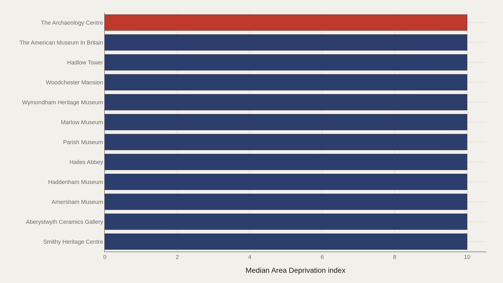
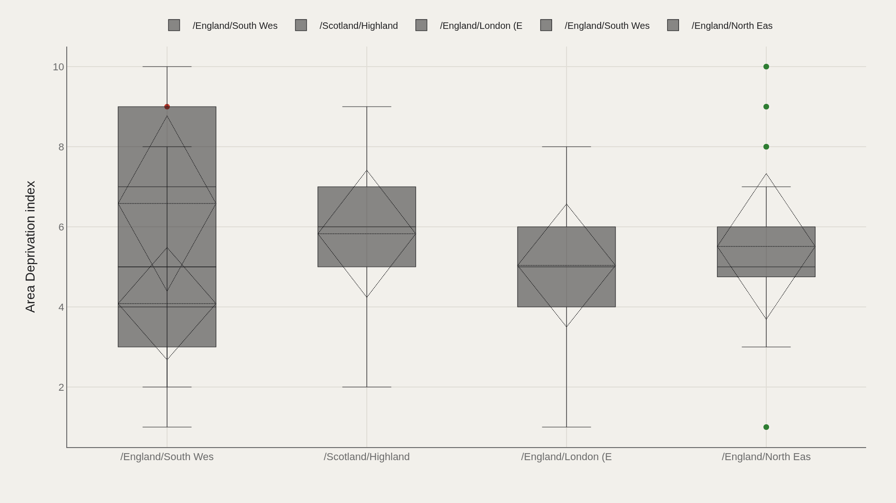
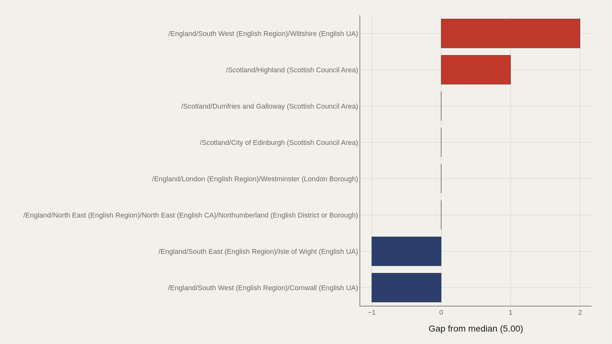
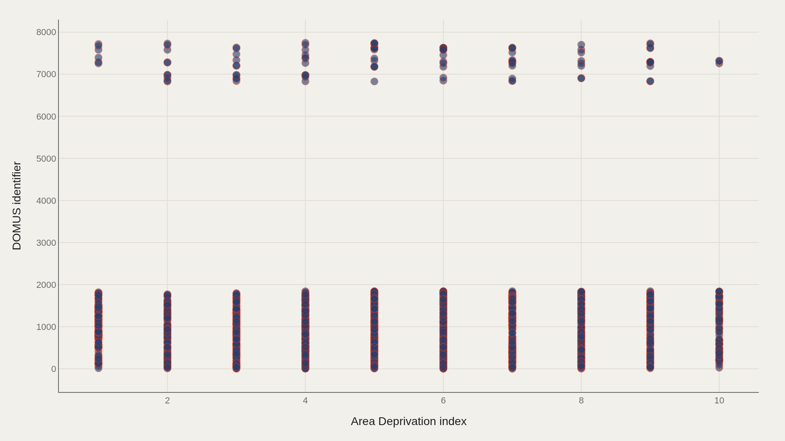

> **TL;DR** 4,191 UK museums sit at a median area deprivation index of 5.00, with an observed maximum of 10.0. Blenheim Palace anchors the top-name fact box. Inside South West England, Wiltshire scores 2.00 points above the median while Cornwall trails 1.00 point below.

4,191 UK museums sit at a median area deprivation index of 5.00, with an observed maximum of 10.0 and a 3-point spread inside South West England alone — evidence that cultural institutions map onto place inequality in measurable, uneven patterns.

Area deprivation describes the surrounding community context, not museum quality. The question is how collections sit on that scale: whether they cluster in less-deprived bands, and how named sites and admin areas compare to the 5.00 median.

## Data and method {#data-and-method}

Source: TidyTuesday release 2022-11-22 (R for Data Science community). The working file contains 4,191 rows and 35 columns after merging available tables in the week folder. Area deprivation index is the primary metric; museum name and admin area are the categorical axes; DOMUS identifier appears in the scatter plot.

Medians are used for robustness. Deprivation scores describe surrounding area context in the source, not museum quality or visitor volume.

## Named museums pin the top of the deprivation scale {#named-museums-pin-the-top-of-the-deprivation-scale}

### Area Deprivation index by Name of museum

The Archaeology Centre leads at 10.0; Smithy Heritage Centre also hits 10.0. Multiple sites share the observed maximum — a reminder that the upper slice compresses when many institutions cluster at the same index band.

Grouping by museum name makes individual institutions visible on the deprivation axis. This is a catalog of places, not a visitor-numbers league table.

## The leaders chart sits at the index ceiling {#the-leaders-chart-sits-at-the-index-ceiling}

### Top Name of museum

The Archaeology Centre leads at 10.0, and 10.0 marks the median among the top dozen in this cut. When the top is flat, the story is saturation at the high end of the deprivation index rather than a single runaway institution.

Blenheim Palace remains a fact-box landmark; the charted leaders emphasize which names hit the 10.0 maximum in this aggregation.

## Admin areas spread museums across different deprivation bands {#admin-areas-spread-museums-across-different-deprivation-bands}

### Area Deprivation index by Admin area

Category boxes by admin area show whether deprivation bands are shared or contested across local jurisdictions. Museums do not all sit in the same band; geography fragments the index.

The spread matters: cultural infrastructure is unevenly distributed across deprivation contexts, and the boxes make the pattern visible.

## Wiltshire clears the median; Cornwall trails in the South West cut {#wiltshire-clears-the-median-cornwall-trails-in-the-south-west-cut}

### Area Deprivation index vs median by Admin area

/England/South West (English Region)/Wiltshire (English UA) sits 2.00 above the median; /England/South West (English Region)/Cornwall (English UA) trails by 1.00. Even inside one English region, admin areas do not share the same offset from the file center.

Signed gaps turn geography into comparable scale. They do not explain why a museum is where it is; they locate area context relative to the 5.00 median deprivation index.

## Deprivation and DOMUS IDs form a joint map {#deprivation-and-domus-ids-form-a-joint-map}

### Area Deprivation index vs DOMUS identifier

Plotting area deprivation index against DOMUS identifier shows clusters a single average erases. Identifier ranges and deprivation bands co-locate in ways that matter for joining and auditing the catalog.

The scatter is a data-structure check as much as a social map: it shows how the numeric deprivation field sits beside the museum identity field in the 4,191-row extract.

## What this file cannot tell you {#what-this-file-cannot-tell-you}

TidyTuesday snapshots are community-cleaned extracts, not live heritage registries. Missing values, naming variants, and week-of-export coverage limits apply. Merged tables may duplicate rows when join keys are imperfect.

Area deprivation index describes place context in the source file. Findings are structural signals about UK museums in this extract — not a verdict on institutional excellence or funding.

## What to take away {#what-to-take-away}

UK museums in this file sit around a median deprivation index of 5.00, with an observed maximum of 10.0 and clear admin-area gaps even inside the South West. Wiltshire leads the median by 2.00; Cornwall trails by 1.00 — a 3-point spread within one region.

Name leaders, area boxes, and the deprivation–DOMUS scatter together show how cultural sites map onto inequality of place — a geography story first, a prestige story only by implication.

## Sources {#sources}

Data Science Learning Community. (2022). TidyTuesday: UK Museums. https://raw.githubusercontent.com/rfordatascience/tidytuesday/main/data/2022/2022-11-22/museums.csv

## Editor's note {#editors-note}

Artometrics data report from the TidyTuesday research pipeline. Charts and aggregates are reproducible from the embedded exhibits and public source files.

Source archive (GitHub)

