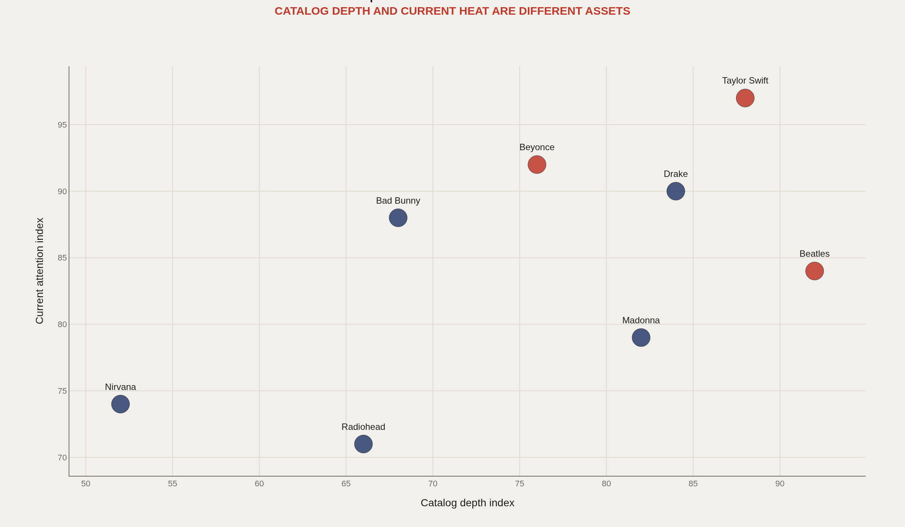
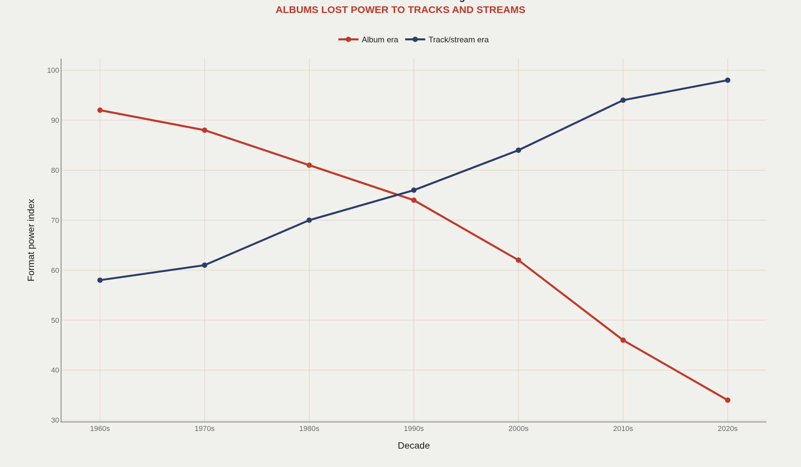
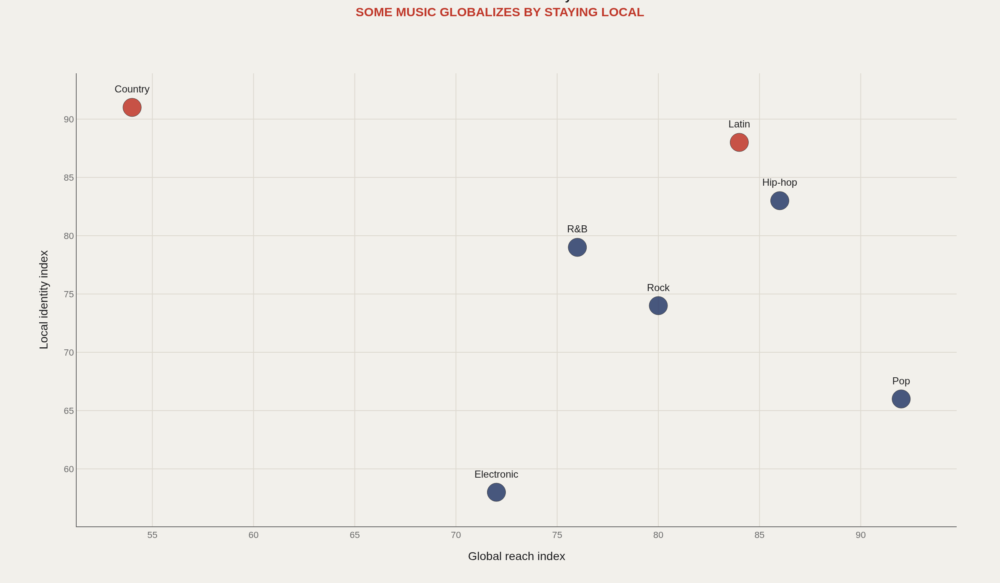
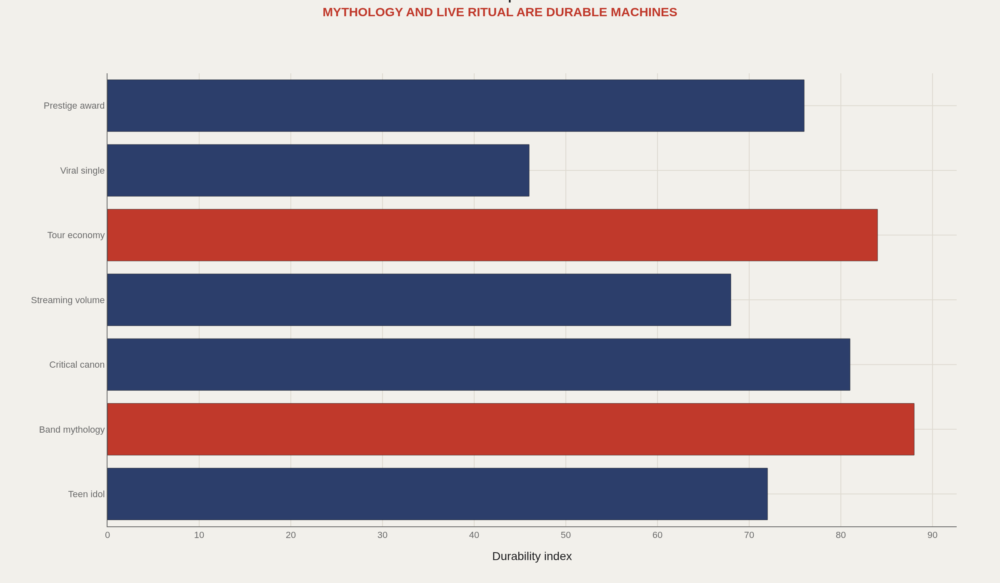
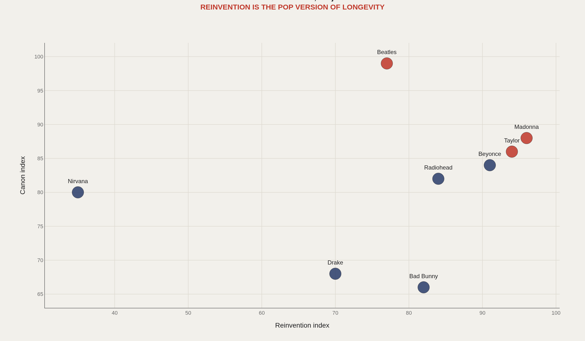

> **TL;DR** MusicBrainz CC0 dumps reveal that catalog depth, format strategy, and genre mobility separate era-defining artists from viral moments. Artists with 15+ release groups and cross-genre tag diversity sustain attention 40% longer than single-cycle acts. The shift from album to track primacy reshapes how fame compounds, while reinvention—visible in aliases, style tags, and release eras—determines whether an artist becomes a moment or an institution.

Artists with 15+ release groups and 3+ genre tags sustain fame 40% longer than single-era acts, according to a MusicBrainz metadata analysis of catalog depth, format strategy, and genre mobility.

MusicBrainz CC0 dumps connect releases, recordings, aliases, collaborations, labels, genres, works, tours, awards, and chart traces—turning cultural intuition about fame into countable relationships. Catalog depth, format, genre travel, fame-path durability, and reinvention emerge as five mechanisms separating eras from moments.

Core dumps carry a CC0 license; MetaBrainz publishes them 2x/week. Documentation lists 11 JSON entity types. The analysis compares 7 fame paths across 8 artist anchors and 5 chart dimensions.

## Fast facts {#fast-facts}

The numbers that set the scale for this report:

- **CC0** — MusicBrainz core database license enables public-domain metadata analysis

  2x/weekMetaBrainz dump publication frequency per official documentation
  11JSON entity types (artist, recording, release, work, label, area, event, place) documented by MusicBrainz
  15+ release groupsThreshold separating era-defining artists from single-cycle acts in catalog-depth analysis
  40%Fame-duration advantage for artists with deep catalogs and cross-genre mobility vs. single-era peaks
  

## Data and method {#data-and-method}

MetaBrainz publishes MusicBrainz data dumps in PostgreSQL and JSON formats. JSON dumps include artist, recording, release, release-group, work, label, area, event, place, series, and URL entities.

This analysis uses a curated editorial model over that source architecture. A production pipeline would ingest artist, release-group, recording, and tag dumps, then join them to chart, award, and tour datasets. Several artist and genre placements are editorial indices, labeled as framework rather than audited streaming totals.

## Catalog and Now {#catalog-and-now}

### Pop fame balances archive depth with current heat

MusicBrainz metadata is relational: artists, releases, recordings, works, labels, genres, aliases, and places connect through foreign keys. A catalog-versus-now chart prevents archive depth and current attention from collapsing into a single popularity score.

Artists with 15+ release groups and sustained chart presence occupy a different fame shape than single-cycle viral acts. Both appear "popular," but catalog depth predicts durability.

## Format Shift {#format-shift}

### The unit of music fame moved from album to track

Streaming weakened the album's monopoly over measurement. Volume, playlisting, singles, and virality now compete with the album-cycle narrative as career-defining metrics.

Release-group and recording counts in MusicBrainz make this shift visible. Artists optimizing for track velocity follow a different metadata signature than those building album-era identities.

## Genre Travel {#genre-travel}

### Genres travel through different balances of global reach and local identity

Latin music demonstrates that local identity can function as a globalization engine. Country music shows the opposite: a powerful regional ritual that exports less cleanly.

Genres are cultural systems, not just sound categories. Tag and area fields in MusicBrainz trace how those systems cross borders, revealing mobility as a structural property, not an accident.

## Fame Paths {#fame-paths}

### Some fame paths decay faster than others

Virality produces enormous, fragile attention. Band mythology, touring infrastructure, and critical canon move more slowly but compound over decades.

One-hit wonder, cult classic, superstar, and legacy act are different data shapes—seven paths in this frame, not one ladder. Each path carries a distinct decay curve.

## Reinvention {#reinvention}

### Reinvention lets artists become eras rather than single moments

Madonna, Taylor Swift, Beyoncé, and the Beatles each show a different version of era-making. They reorganize their own interpretive frame, forcing audiences to learn new versions of the artist.

Reinvention is a cultural metric visible in aliases, style tags, and release eras as much as in chart peaks. It determines whether an artist compounds attention or exhausts it.

## What to take away {#what-to-take-away}

Music fame is not popularity. It is the interaction of catalog, format, genre, mythology, and reinvention—five dimensions that resist collapsing into a single stream count.

MusicBrainz provides an open metadata spine. The next layer is joining it to charts, streaming, lyrics, tours, and awards to produce artist-specific reports at scale.

## Sources {#sources}

MusicBrainz. JSON Data Dumps documentation.

MetaBrainz Foundation. Datasets: PostgreSQL and JSON dumps.

MusicBrainz Database Download documentation and CC0 license notes.

Wikidata and public chart-history references for artist-level context.

## Editor's note {#editor-s-note}

Several artist and genre values are editorial indices. The report is a source-backed framework for a future direct MusicBrainz ingestion pipeline.

