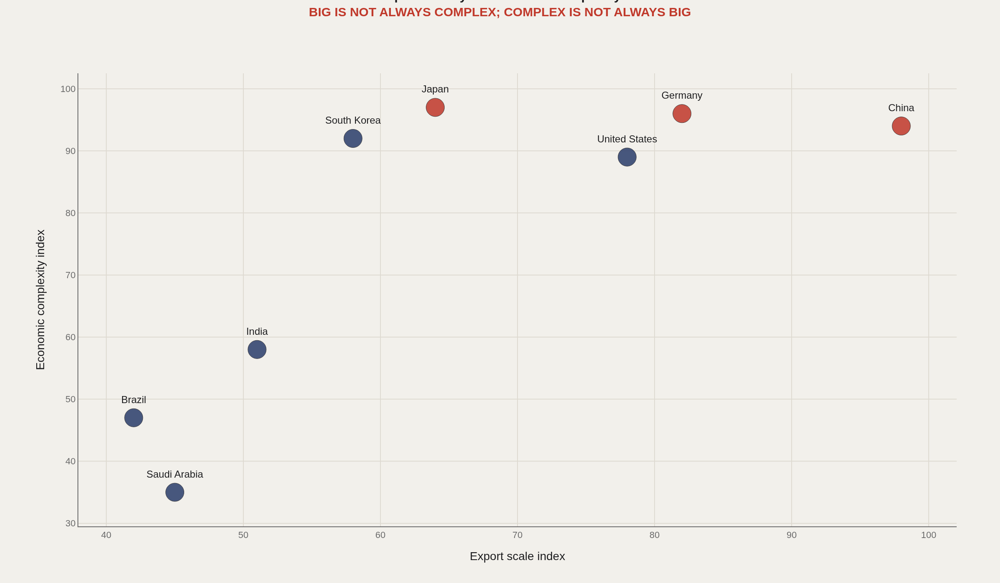
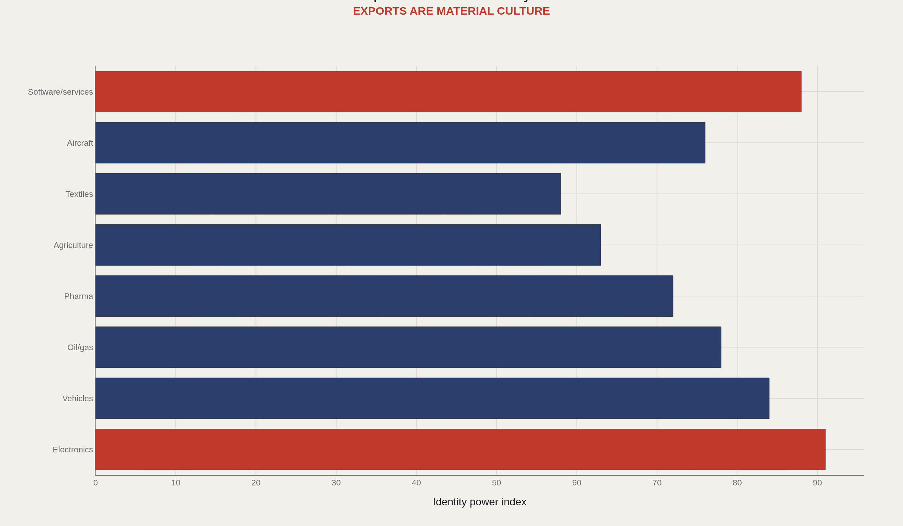
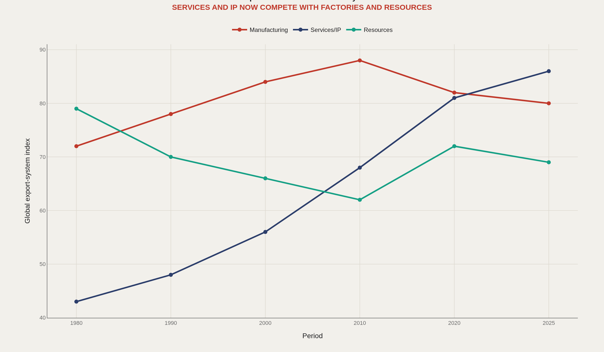
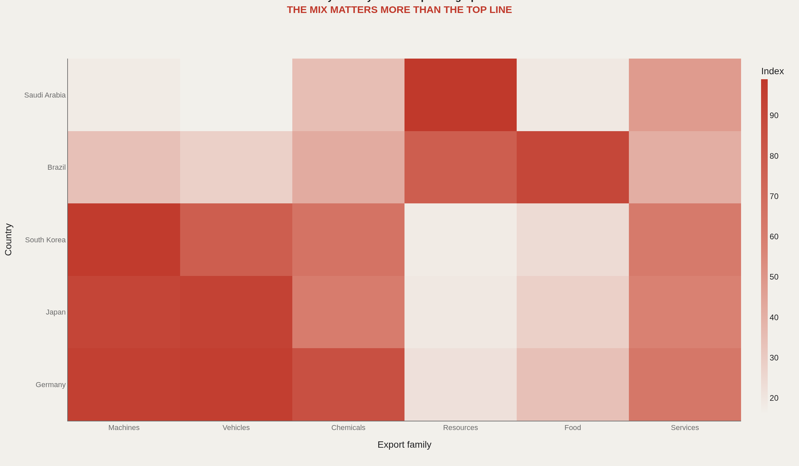
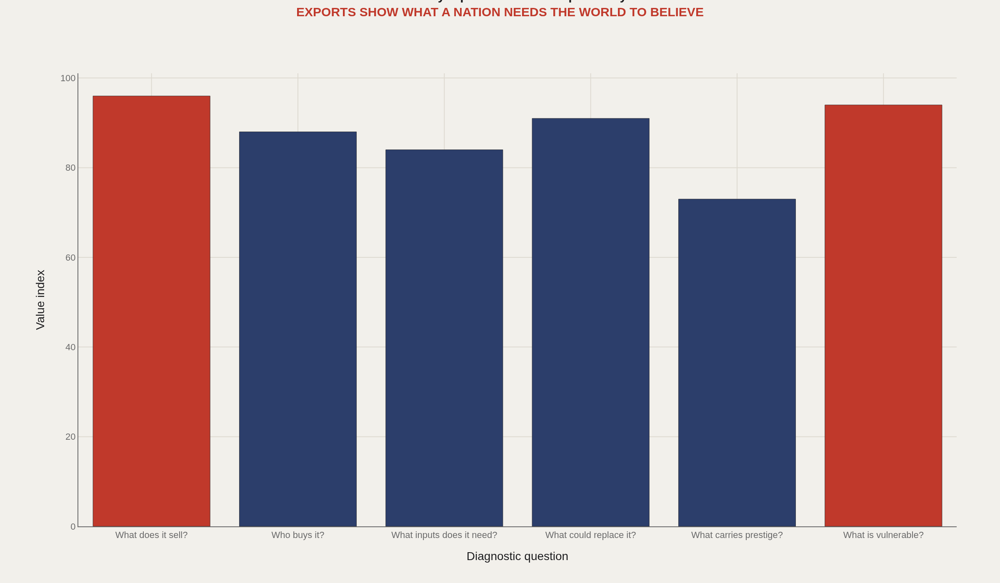

> **TL;DR** Export ledgers record what other countries will actually pay for, making them one of the few identity claims that must clear a market test. UN Comtrade and OEC systems track 200+ countries and 5,000+ products under Harmonized System codes. Six diagnostic questions turn trade tables into identity analysis: what a country sells, who buys it, what inputs it needs, what could replace it, what carries prestige, and what is vulnerable.

What a nation sells abroad is one of the few identity claims that must clear a market test. Tourism slogans can invent a self-image; export ledgers record what other countries will actually pay for.

UN Comtrade and OEC systems track 200+ countries and zones and 5,000+ products under Harmonized System codes. The atlas below uses 6 diagnostic questions to make identity readable without pretending the indices are final official rankings.

Scale and complexity are different virtues. A country can be large because it sells one thing in volume, or complex because it sells many hard-to-make things. Those identities behave differently under shock.

## Fast facts {#fast-facts}

The numbers that set the scale:

- **200+** — Countries/zones covered in UN Comtrade-style trade systems

  5,000+Products in OEC-style trade classifications
  HSHarmonized System product code architecture
  6Diagnostic country questions
  8Export families or countries highlighted
  

## Data and method {#data-and-method}

The source stack includes the OEC API, UN Comtrade, World Bank WDI, OECD, IMF, and national statistics offices. OEC is useful for complexity-minded views of what countries can make and sell.

These charts use editorial indices to define the comparative structure before a full product-level ingestion pass. Observed trade flows, derived complexity measures, and interpretive scores are kept conceptually separate even when they appear on the same axes.

## Scale and complexity {#scale-and-complexity}

### Countries differ by export scale and product complexity

Exports reveal what a country can reliably make and sell into the world. Scale and complexity are different axes: volume without sophistication is one identity; sophistication without volume is another; both together is rarer.

Countries plotted high on both dimensions occupy a different strategic neighborhood from resource giants that score high on scale alone. The chart stops those neighborhoods from being collapsed into a single big-exporter label.

## Product identity {#product-identity}

### Some export categories become national symbols

Cars, electronics, oil, pharmaceuticals, aircraft, software, agriculture, and textiles are not just commodities. They become reputational shorthand—Germany and machines, Saudi Arabia and energy, the United States and software services.

Exports become part of national mythology when they are repeated long enough to feel like character. The data still matter because mythology that loses market share eventually becomes nostalgia.

## The export frontier moved {#export-frontier}

### The frontier moved from resources to factories to systems and IP

The last generation of globalization did not erase goods. It added services, software, intellectual property, finance, and standards to the frontier. Manufacturing indices that peak and then soften while services and IP climb are the signature of that shift.

A modern country atlas must therefore track both containers and code. An economy that only reports tonnage will misread its own power—and its own vulnerability.

## Export fingerprints {#fingerprint}

### The export fingerprint is the mix, not just the headline product

Germany and Japan can look similar through machines and vehicles, while Brazil and Saudi Arabia show very different resource and food signatures. The fingerprint is the mix across machines, vehicles, chemicals, resources, food, and services—not a single headline product.

The question is not only what a place sells. It is what would break if the world stopped buying it, and what prestige categories would remain even if volume fell.

## Dependency questions {#dependency-questions}

### A country identity atlas asks what the world buys, substitutes, and depends on

The atlas ends with vulnerability questions: what does the country sell, who buys it, what inputs does it need, what could replace it, what carries prestige, and what is vulnerable? Those six prompts turn trade tables into identity analysis.

Countries that cannot answer them with data are flying blind about their own external face. Countries that answer only with slogans are doing public relations, not strategy.

## What to take away {#what-to-take-away}

Exports are identity under constraint. They show what a country can do at scale, what the world believes it is good for, and where substitution would hurt.

Later comparison work can rank places by complexity, concentration, cultural export power, and substitutability—but only after the fingerprint and the six diagnostic questions are in view.

## Sources {#sources}

