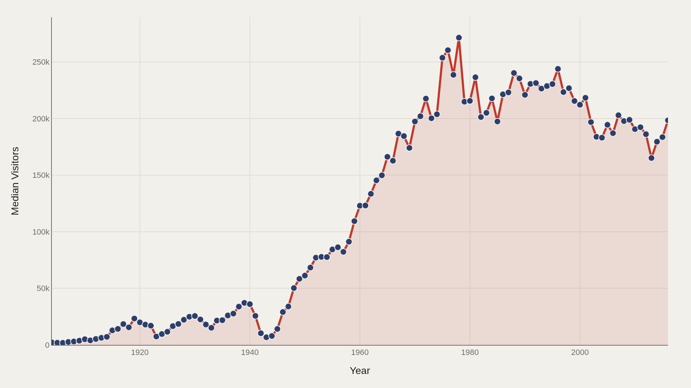
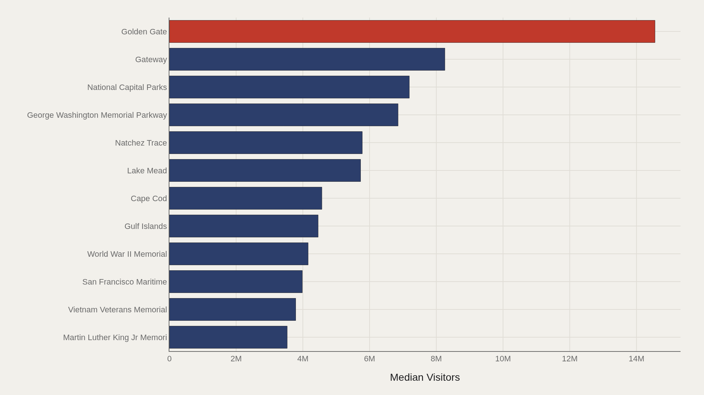
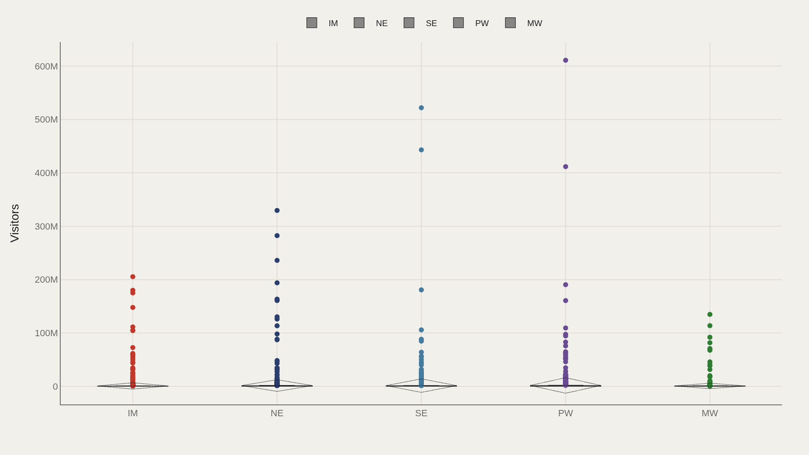
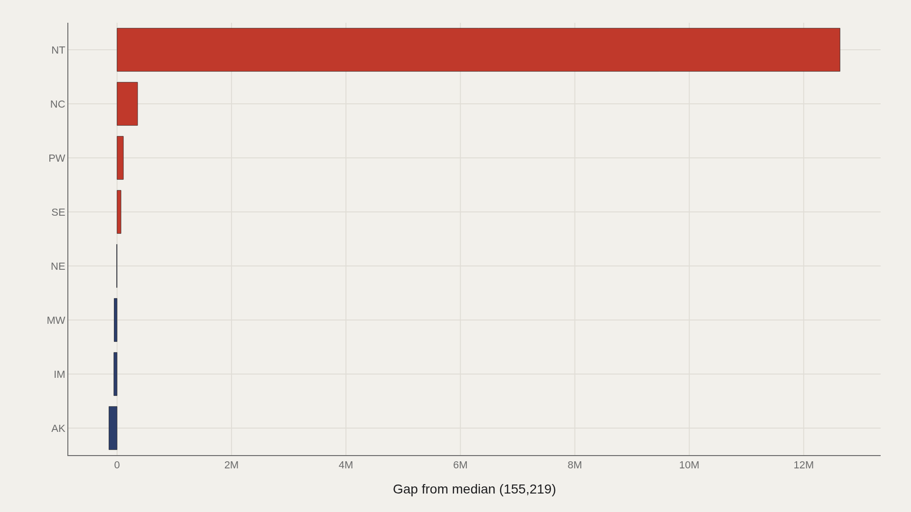
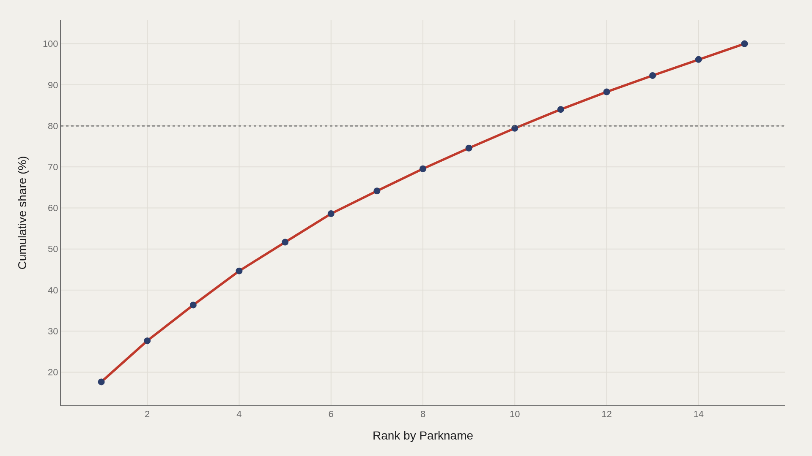

> **TL;DR** National Park Service visitation from 1904–2016 reveals a two-tier system: median annual visits rose from 2,200 to 198,478, while the top five parks captured 52% of all recorded traffic. Golden Gate leads at 14.6 million; Alaska trails the median by 142,104.

Golden Gate National Recreation Area recorded 14,554,750 annual visits at its dataset peak — 94 times the system median of 155,219 — because proximity to San Francisco matters more than wilderness purity in the visitation ledger.

A TidyTuesday working file of 21,560 park-year records spans 1904–2016. Median visits sit at 155,219; the highest single observation reaches 871,922,828. Golden Gate leads the park-name ranking, and region code IM (Intermountain) appears most frequently in the data.

Urban gateways and memorial parkways often outdraw remote wilderness. The leaderboard reflects access and metropolitan adjacency as much as scenic reputation.

## Fast facts {#fast-facts}

The numbers that set the scale for this report:

- **21,560** — Records in the working dataset

  155,219Median Visitors
  871,922,828Highest observed Visitors
  Golden GateTop Parkname by Visitors
  1904–2016Year span covered in the file
  IMMost common Region

## Data and method {#data-and-method}

The source is the TidyTuesday release from 2019-09-17 (R for Data Science community). The working file contains 21,560 rows and 13 columns — park names, regions, years, and visitor totals.

Medians handle skew from hyper-visited units. Charts export as Plotly JSON with PNG fallbacks. Visitor totals are administrative counts; definition changes over a century mean long-run levels are directional, not exact.

## How visits grew over time {#how-the-pattern-changed-over-time}

### Median Visitors Over Time

Median visitors rose from 2,200 in the opening period to 198,478 by 2016 — a 90-fold increase driven by automobile access, population growth, system expansion, and the conversion of outdoor recreation into a middle-class norm.

The median's climb is the system story; the leaders are the celebrity story.

## Who sits at the top {#who-sits-at-the-top}

### Golden Gate leads at 14,554,750 — 5,151,270 marks the median among the top dozen

Golden Gate leads at 14,554,750 annual visits, with 5,151,270 as the median among the top dozen. Other high-traffic units include urban memorials and parkways — Vietnam Veterans Memorial, World War II Memorial, Lake Mead, Natchez Trace, Cape Cod — where recreation, commuting, and civic pilgrimage overlap.

Wilderness icons still matter culturally. They do not win the raw visit count contest against metropolitan National Park Service units that function as public squares with transit access.

## How regions spread visits {#how-the-field-is-spread}

### Visitors by Region

Regional box plots show whether visitor consensus is shared or contested across NPS regions. Some regions host many modest units; others host a few magnets that dominate the regional total.

Spread within a region can exceed differences between region medians. A single gateway park can outdraw an entire cluster of remote units.

## Who beats the median — and who trails {#who-beats-the-median-and-who-trails}

### Visitors vs median by Region

Region NT (National Capital) sits 12,634,481 above the median; AK (Alaska) trails by 142,104. Those gaps encode access and population gravity — Alaska's vast parklands are not built for weekend volume.

The gap is a map of visitation pressure, not beauty.

## Concentration of visits {#concentration}

### The top 5 parkname entries account for 52% of the aggregate visitors

The top five park-name entries account for 52% of aggregate visitors in the working file. Infrastructure stress, concession economics, and reservation politics concentrate in a short list of places — even while the agency's mission names a much longer list.

## What this file cannot tell you {#what-this-file-cannot-tell-you}

Community-cleaned TidyTuesday snapshots are not live APIs. Missing values, spelling variants, and century-scale definition changes apply. Visitor counts are not unique individuals and are not measures of ecological impact.

Findings describe structural signals about National Park Service visitation patterns in the file — not a conservation audit or a ranking of which landscapes matter most.

## What to take away {#what-to-take-away}

Median park traffic rose 90-fold from 1904 to 2016, while the top five units absorbed 52% of all visits. The citable tension is access versus myth: America's most visited park units are often the ones closest to cities and memorials, not the ones on the wilderness postcard.

## Sources {#sources}

