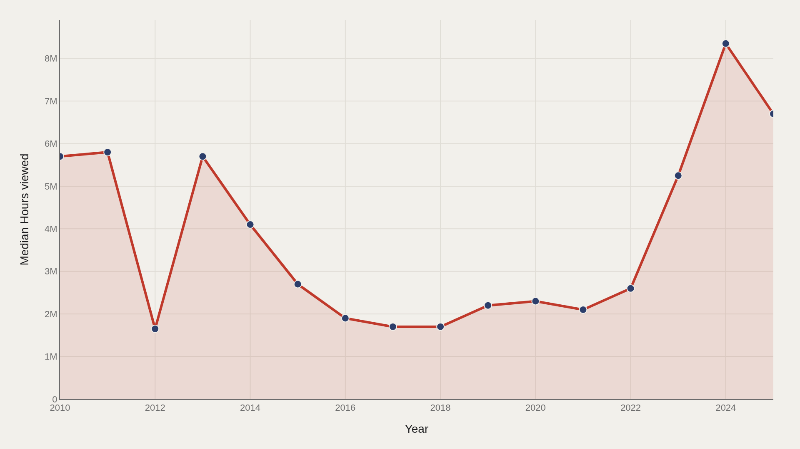
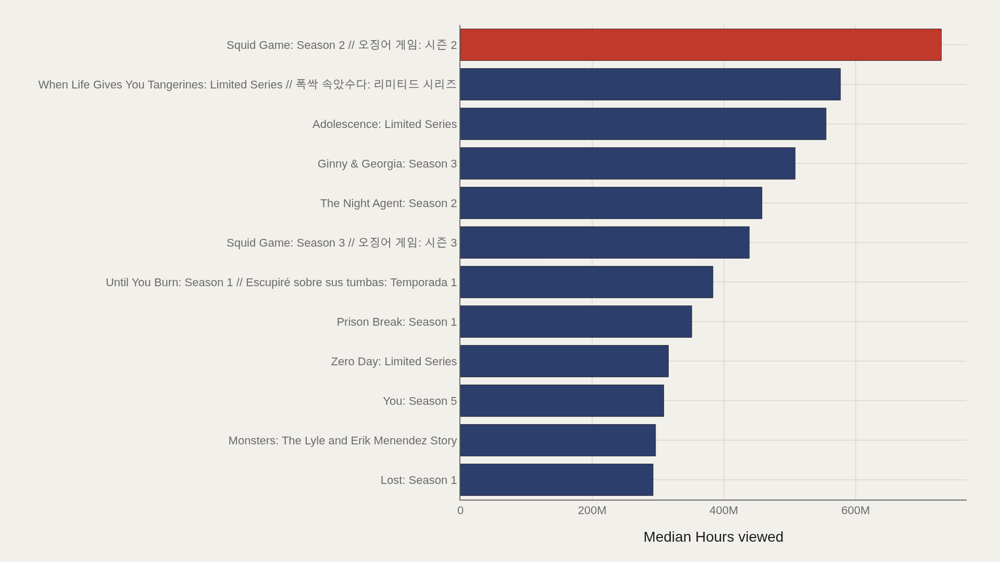
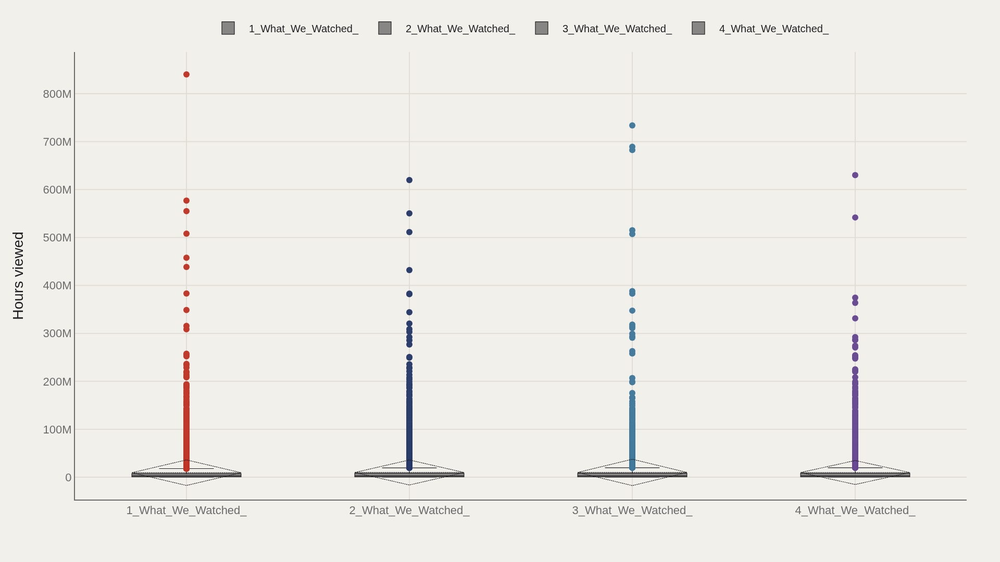
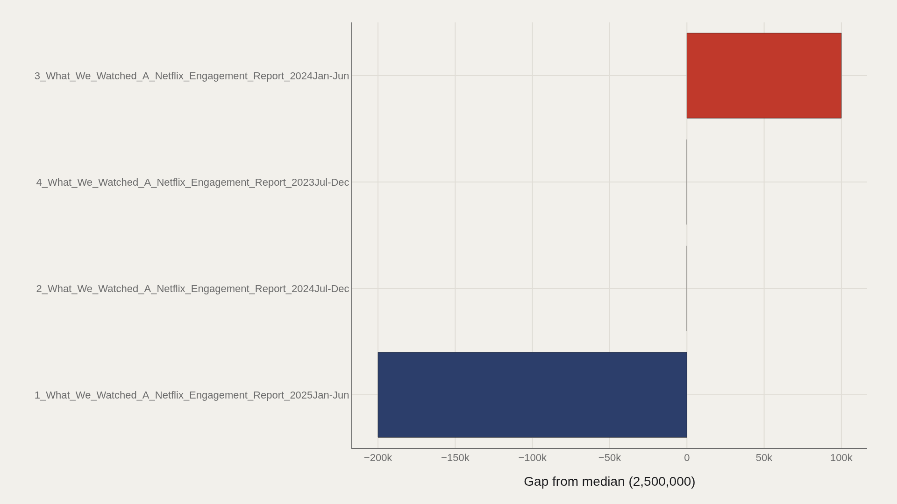
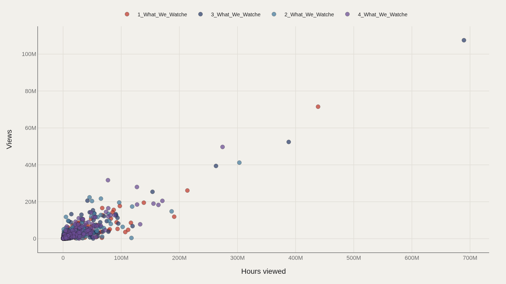

> **TL;DR** Squid Game Season 2 logged 730 million hours viewed, 292 times the 2.5 million-hour median across 27,803 Netflix titles from 2010–2025. The catalog median rose 18% from 5.7 million to 6.7 million hours between the earliest and latest report windows, signaling a higher middle even as mega-hits define the ceiling.

Squid Game Season 2 logged 730 million hours viewed on Netflix — 292 times the 2.5 million-hour median across 27,803 titles from 2010–2025.

The catalog median rose 18% from 5.7 million in the earliest report window to 6.7 million in the latest, signaling a higher middle even as mega-hits define the ceiling. The top dozen titles hold a median of 411 million hours, confirming sustained concentration at the head.

## Fast facts {#fast-facts}

The numbers that set the scale for this report:

- **27,803** — Records in the working dataset

  2,500,000Median Hours viewed
  840,300,000Highest observed Hours viewed
  Squid Game: Season 2 // 오징어 Top Title by Hours viewed
  2010–2025Year span covered in the file
  1_What_We_Watched_A_Netflix_Most common Source

## Data and method {#data-and-method}

Engagement reports from Netflix's weekly viewership releases — hours viewed, runtime, and global availability flags — arrive here via the TidyTuesday 2025-07-29 shows table.

Source labels distinguish engagement-report windows. Medians dampen mega-hit skew. Charts export as Plotly JSON with PNG fallbacks.

## How the pattern changed over time {#how-the-pattern-changed-over-time}

### Median Hours viewed Over Time

The catalog median rose 18% from 5.7 million hours in the opening period to 6.7 million at the close — a higher middle even as individual mega-hits define the headlines.

Engagement tables mix report windows and title types; the trend reflects a shift in the reported middle, not a claim that every viewer watches more.

## Who sits at the top {#who-sits-at-the-top}

### Squid Game: Season 2 // 오징어 게임: 시즌 2 leads at 730,100,000 — 411,000,000 marks the median among the top dozen

Squid Game: Season 2 // 오징어 게임: 시즌 2 logged 730 million hours. Among the top dozen, the median is 411 million — elevated, but not a single lonely spike.

Global event titles dominate the ceiling. Below that head is a long descent into ordinary catalog hours.

## How the field is spread {#how-the-field-is-spread}

### Hours viewed by Source

Hours viewed by engagement-report source show whether different publication windows share the same middle or disagree about typical scale.

Report vintages are not identical instruments. Comparing boxes across sources reveals stability — or drift — in how Netflix's tables describe the catalog.

## Who beats the median — and who trails {#who-beats-the-median-and-who-trails}

### Hours viewed vs median by Source

3_What_We_Watched_A_Netflix_Engagement_Report_2024Jan-Jun sits 100,000 above the median; 1_What_We_Watched_A_Netflix_Engagement_Report_2025Jan-Jun trails by 200,000.

Those gaps are modest relative to the hundreds of millions at the title ceiling. Source-to-source differences matter most when interpreting medians across report windows.

## What moves together {#what-moves-together}

### Hours viewed vs Views

Hours viewed and views rise together for many titles, but runtime and completion behavior leave clusters that a single ranking would hide.

A short title can rack up views without matching a long series' hour total. The scatter is where that distinction appears.

## What this file cannot tell you {#what-this-file-cannot-tell-you}

Community-cleaned TidyTuesday snapshots are not live APIs. Missing values, spelling variants, and week-of-export coverage limits apply. Merged tables may fan out or duplicate rows when join keys are imperfect.

Findings describe the file on hand — structural signals about reported Netflix engagement, not a full private ledger of every stream.

## What to take away {#what-to-take-away}

Hours viewed concentrate at the top: Squid Game: Season 2 leads at 730 million, while the catalog median sits at 2.5 million. Leaders, report-window gaps, and the hours-versus-views scatter each answer a different question about attention.

Treat the charts as a map of published engagement tables — then check the source window before turning any title into a platform strategy claim.

## Sources {#sources}

Data Science Learning Community. (2025). TidyTuesday: Netflix Engagement. https://raw.githubusercontent.com/rfordatascience/tidytuesday/main/data/2025/2025-07-29/shows.csv

