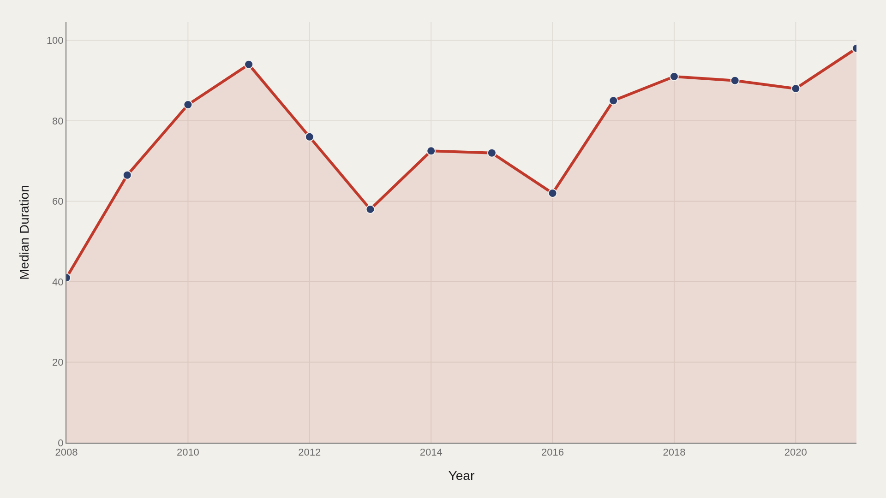
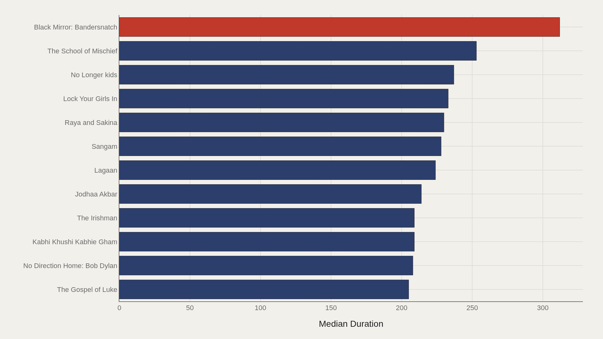
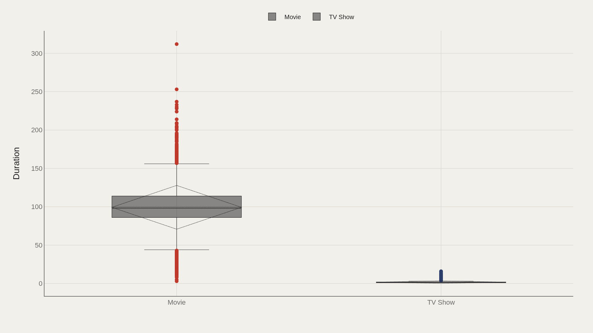
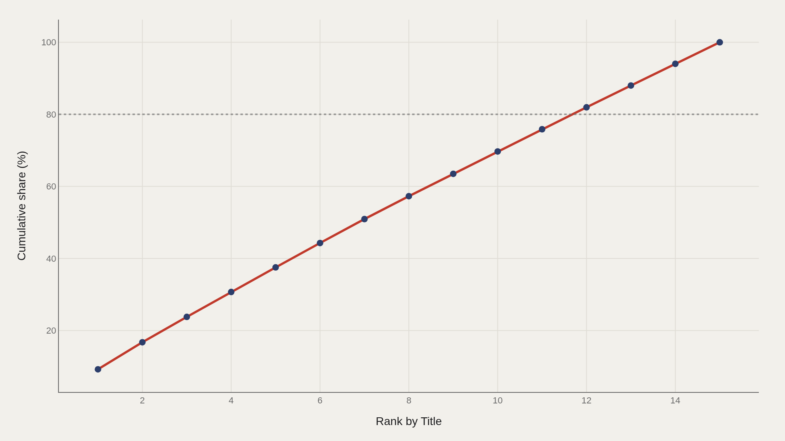

> **TL;DR** Netflix catalog data from 2008 to 2021 show median duration climbed from 41 to 98 minutes while movies outnumbered TV shows. Black Mirror: Bandersnatch led at 312 minutes, and the top five titles accounted for 38% of aggregate duration—a steep concentration curve beneath the homepage's long tail.

Median duration in Netflix's catalog rose from 41 minutes in 2008 to 98 minutes by 2021—a 139% climb driven by longer films, multi-season TV encodings, and interactive outliers like Black Mirror: Bandersnatch, which clocked 312 minutes.

The working file holds 7,787 records. Median duration is 88.0; the highest observed duration is 312, led by Black Mirror: Bandersnatch. Movie is the most common type label.

## Fast facts {#fast-facts}

The numbers that set the scale for this report:

- **7,787** — Records in the working dataset

  88.0Median Duration
  312Highest observed Duration
  Black Mirror: BandersnatchTop Title by Duration
  2008–2021Year span covered in the file
  MovieMost common Type

## Data and method {#data-and-method}

The source is the TidyTuesday release from 2021-04-20 (R for Data Science community). The working file contains 7,787 rows and 13 columns after merging available tables in the week folder.

Duration represents catalog metadata as published—minutes for films, season counts for TV rows where the export encodes type that way. Medians and Plotly exports absorb skew and missing cells without distortion.

## How the pattern changed over time {#how-the-pattern-changed-over-time}

### Median Duration Over Time

Median duration rises from 41.0 in the opening period to 98.0 at the close—a catalog whose typical row lengthens as the library ages.

That climb reflects more feature-length films, longer TV season encodings, or both. The trend is a mix signal, not a single format story.

## Who sits at the top {#who-sits-at-the-top}

### Black Mirror: Bandersnatch leads at 312 — 226 marks the median among the top dozen

Black Mirror: Bandersnatch leads at 312; 226 marks the median among the top dozen.

Interactive and long-form outliers define the ceiling. Most of the library lives nowhere near those peaks—which is why the median of 88.0 remains the better everyday calibration.

## How the field is spread {#how-the-field-is-spread}

### Duration by Type

Duration by type separates movies from TV rows in the catalog encoding. The boxes show whether each type shares a tight middle or stretches into long tails.

Movie dominance in count does not guarantee movie dominance in duration shape. The distribution is where that distinction becomes visible.

## Concentration {#concentration}

### The top 5 title entries account for 38% of the aggregate duration

The top 5 title entries account for 38% of the aggregate duration—a steep head for a library that otherwise looks vast on the homepage.

Steep Pareto curves mean a small set of rows drives most of the summed duration signal. The long tail is real inventory; it is not where the aggregate concentrates.

## Concentration {#concentration-pareto}

### The top 5 title entries account for 38% of the aggregate duration

A second Pareto view of the same 38% concentration confirms the head–tail split under an alternate chart export.

When two exhibits agree on the same share, the claim is about structure in the file—not a rendering choice.

## What this file cannot tell you {#what-this-file-cannot-tell-you}

Community-cleaned TidyTuesday snapshots are not live APIs. Missing values, spelling variants, and week-of-export coverage limits apply. Merged tables may fan out or duplicate rows when join keys are imperfect.

Findings describe the file on hand—structural signals about Netflix title rows through 2021, not today's live catalog in every territory.

## What to take away {#what-to-take-away}

Median duration climbed from 41.0 to 98.0 while Movie remained the most common type. A handful of long outliers—Bandersnatch at 312 among them—and a 38% duration concentration in the top five rows show how uneven a "library" can be once you stop counting titles and start summing length.

Use the charts to separate mix, length, and concentration before treating any homepage as a flat shelf.

## Sources {#sources}

Data Science Learning Community. (2021). TidyTuesday: Netflix Titles. https://raw.githubusercontent.com/rfordatascience/tidytuesday/main/data/2021/2021-04-20/netflix_titles.csv

