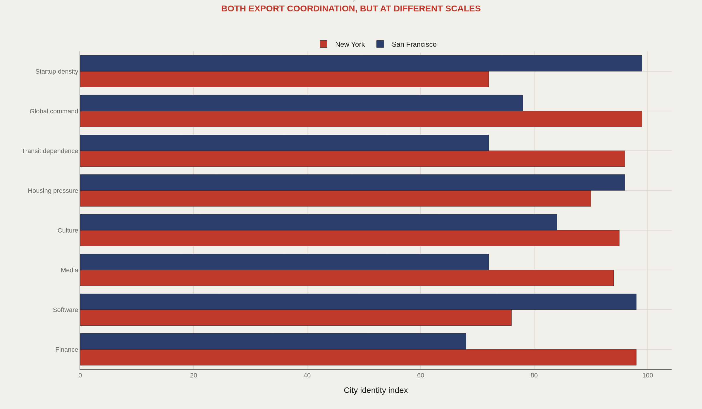
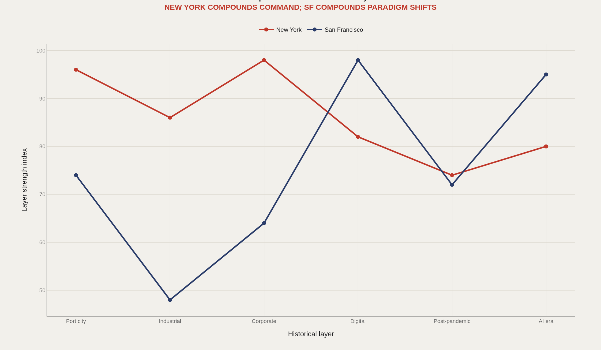
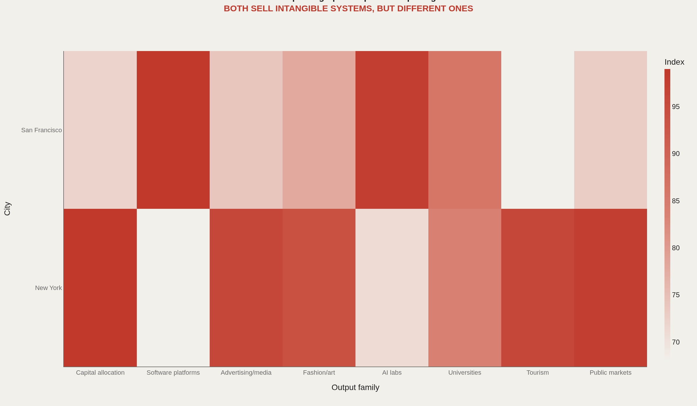
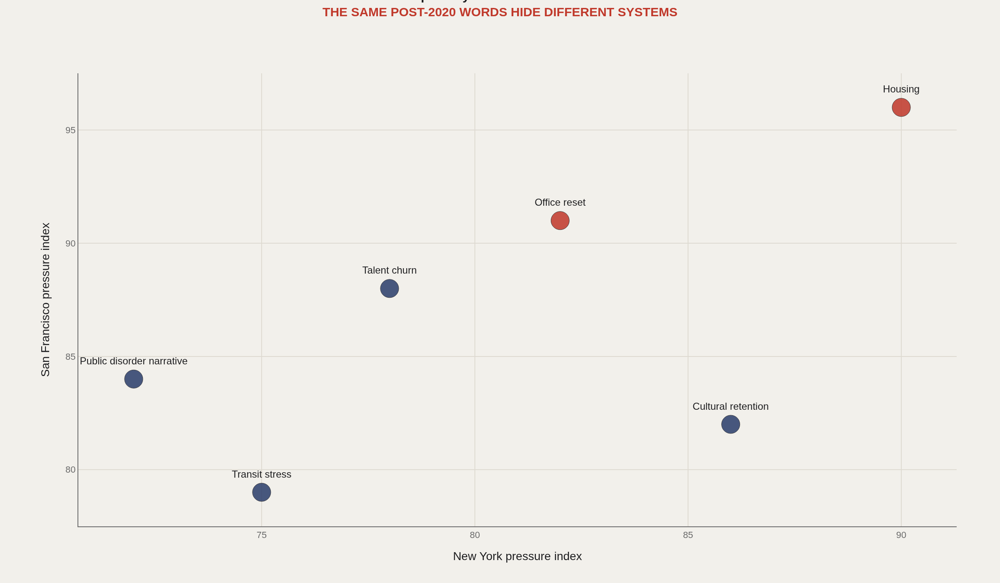
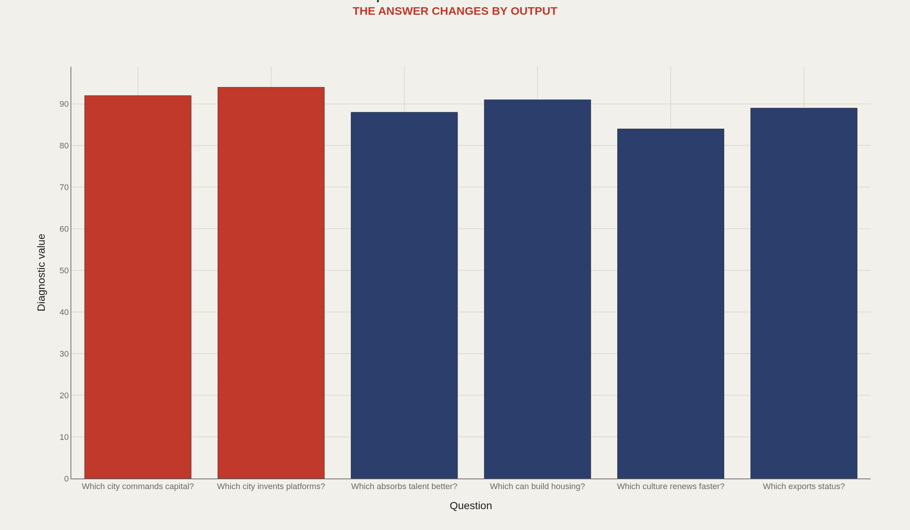

> **TL;DR** New York and San Francisco export coordination, talent, symbols, and future-facing industries — not physical goods. New York legitimizes and commands; San Francisco invents and prototypes. The comparison fails when reduced to rent or office vacancy alone.

New York and San Francisco export coordination, talent, symbols, and future-facing industries — not physical goods. New York legitimizes and commands; San Francisco invents and prototypes.

The question is why they belong in the same conversation and what breaks when they are compared only by rent, taxes, or office vacancy.

Start with the scale: 2 global intangible-output cities compared across 8 identity axes.

## Fast facts {#fast-facts}

The numbers that set the scale for this report:

- **2** — Global intangible-output cities compared

  8Identity axes scored
  6Shared pressure narratives tested
  5Charts in this comparison
  0Single-variable answers
  1Core contrast: command versus invention

## Data and method {#data-and-method}

The source stack includes BEA metro GDP, Census ACS, BLS employment, DataSF, NYC Open Data, World Cities Culture Forum, public venture-capital references, transit agencies, and office-market summaries.

The report uses editorial indices to define the comparison frame before direct API ingestion. It also references the San Francisco Data Microscope as the local profile layer.

## Command versus Lab {#command-versus-lab}

### New York commands capital and culture while San Francisco prototypes new systems

New York and San Francisco are compared because both export invisible value: finance, media, software, talent, coordination, status, and ideas.

The difference is posture. New York is the command center; San Francisco is the laboratory.

## History Timing {#history-timing}

### New York compounds older command layers while San Francisco spikes around paradigm shifts

New York's power is layered and old: port, finance, media, corporate headquarters, immigration, culture. San Francisco's modern power is sharper and more episodic: software, venture capital, platforms, AI.

Both cities feel globally central while operating on different clocks.

## Output Fingerprint {#output-fingerprint}

### The cities both export intangible systems but not the same systems

New York exports capital allocation, status, media, fashion, finance, and market legitimacy. San Francisco exports software platforms, venture risk, AI, and a cultural permission structure for invention.

The pairing is valid because both cities sell coordination more than physical goods.

## Pressure Pairing {#pressure-pairing}

### Post-2020 pressures rhyme across the two cities but come from different causes

Both cities face office vacancy, housing, disorder narratives, transit, and talent churn. But the same words are not the same system.

New York's office reset sits inside a giant command economy. San Francisco's sits inside a smaller city whose downtown was overexposed to tech-office rhythms.

## What to Ask Next {#what-to-ask-next}

### The useful comparison asks which city commands, invents, absorbs, builds, renews, and exports status

Neither city simply beats the other. The answer changes by output: capital, platforms, culture, housing, talent, or status.

This gives future city reports a linked framework instead of isolated profiles.

## What to take away {#what-to-take-away}

New York and San Francisco are comparable because both sell systems more than goods. The difference is that New York legitimizes and commands while San Francisco invents and prototypes.

The richer comparison is not which city is better, but which system each city is best at producing.

## Sources {#sources}

BEA. Metropolitan GDP and regional industry data.

U.S. Census ACS.

BLS metro employment data.

DataSF and NYC Open Data Socrata portals.

World Cities Culture Forum CREATIVE Data Framework.

Transit agency and office-market public summaries.

## Editor's note {#editor-s-note}

Values are editorial indices designed to structure a later direct-data comparison. They should be replaced with source aggregates for formal ranking.

