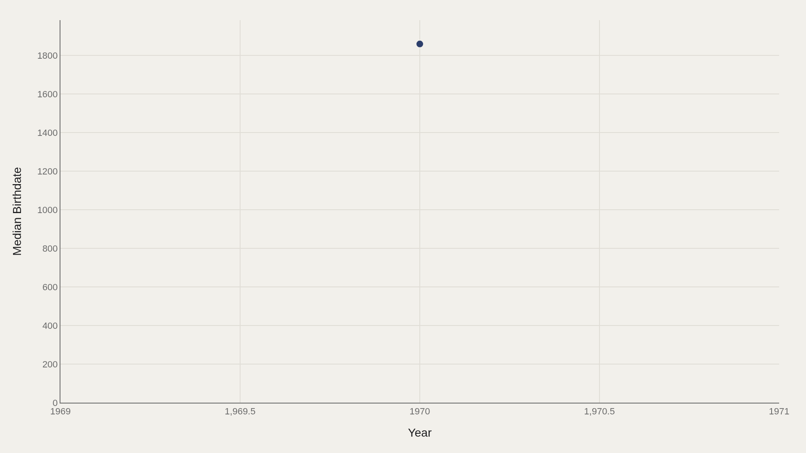
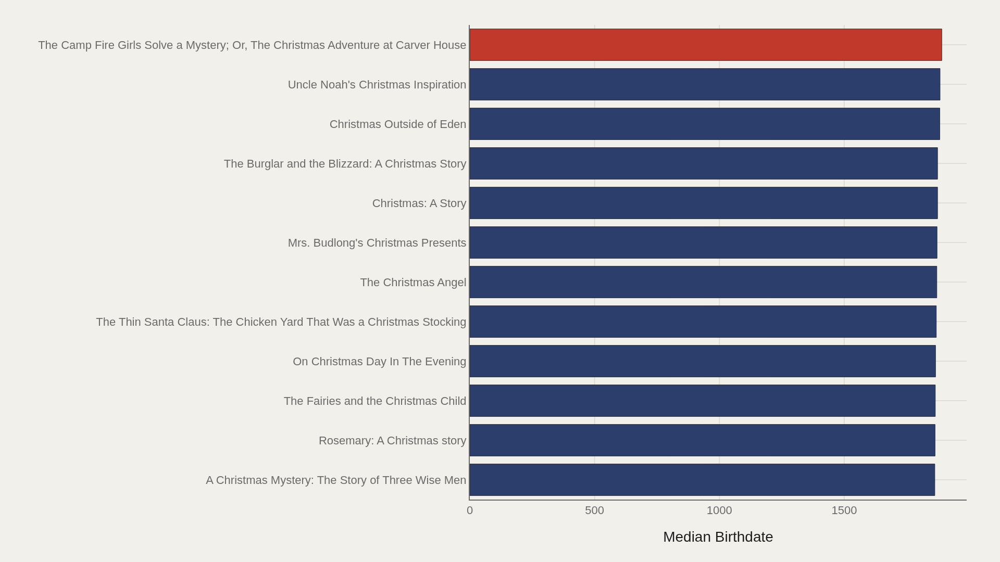
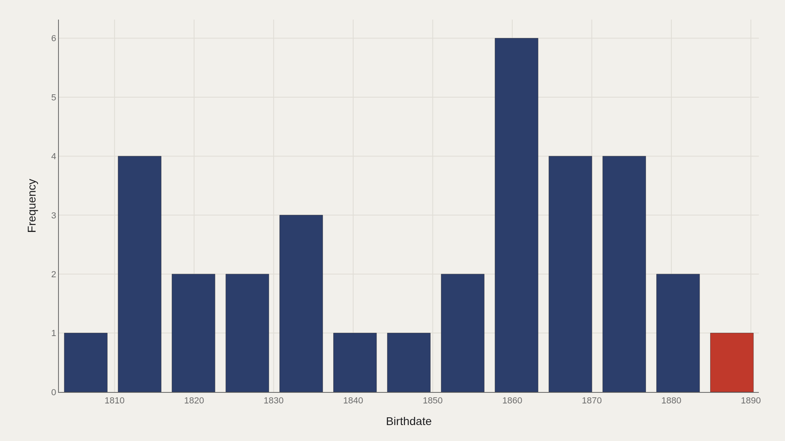
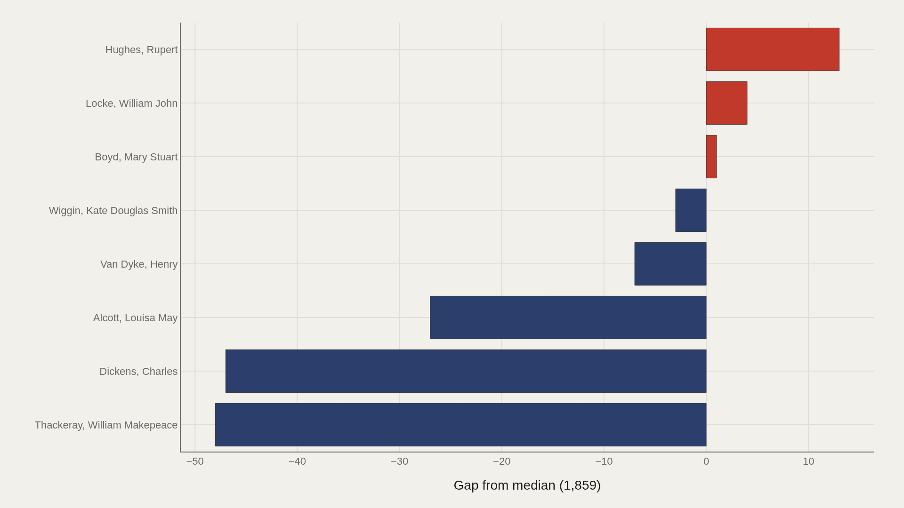
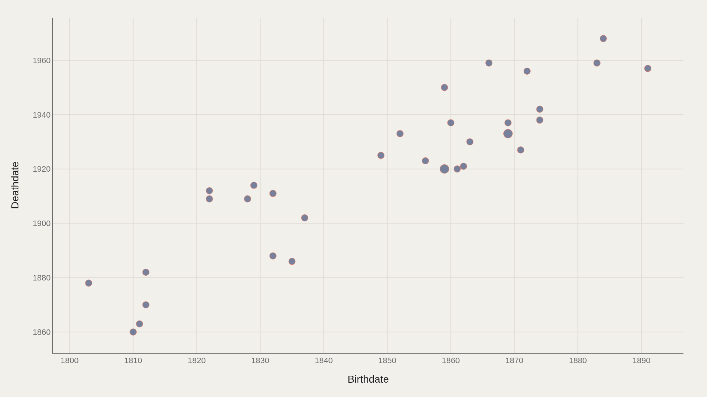

> **TL;DR** The TidyTuesday Christmas-novel extract holds 35 records with a median author birthdate of 1859 and a latest birthdate of 1891. Charles Dickens is the most common author label. The shelf is Victorian-centered: industrial-era childhood, Christian seasonal ritual, serialized storytelling.

The median author birthdate in this 35-record Christmas-novel extract is 1859, the latest is 1891, and Charles Dickens is the most common name. The shelf is Victorian-centered: Dickensian ghosts, children's mysteries, parlor sentimentalism.

Because the sample is tiny, every chart maps a curated canon rather than a complete market. Birthdate becomes a proxy for which literary generations stock the holiday shelf.

## Data and method {#data-and-method}

The source is the TidyTuesday release from 2025-12-30 (christmas_novels.csv). After cleaning, 35 rows remain.

Author birthdate is the primary numeric metric in this chart stack; deathdate appears in the joint plot. Charts are Plotly JSON with PNG fallbacks.

## The Shelf Centers on Mid-Nineteenth-Century Births {#the-shelf-centers-on-mid-nineteenth-century-births}

### Median Birthdate Over Time

The median birthdate is 1859 — Victorian and immediately post-Victorian authors anchor the holiday novel list.

That center of gravity explains the tone of the canon: industrial-era childhood, Christian seasonal ritual, and serialized storytelling habits.

## Later-Born Titles Mark the Edge of the Canon {#later-born-titles-mark-the-edge-of-the-canon}

### The Camp Fire Girls Solve a Mystery; Or, The Christmas Adventure at Carver House leads at 1,891 — 1,872 marks the median among the...

The Camp Fire Girls Solve a Mystery; Or, The Christmas Adventure at Carver House leads at birthdate 1891. Other later births include Uncle Noah's Christmas Inspiration (1884) and Christmas Outside of Eden (1883). The median among the top dozen by birthdate is about 1872.

Even the "late" edge of this shelf is still nineteenth-century. Modern holiday romances are mostly outside this particular extract.

## Birthdates Cluster Around the 1860s {#birthdates-cluster-around-the-1860s}

### Median 1,859 vs mean 1,849 — the shape is relatively symmetric

The distribution piles several authors near the early 1860s bins, with smaller counts in earlier nineteenth-century bands. Mean birthdate (approximately 1849) sits close to the median, producing a relatively symmetric distribution for such a small n.

With only 35 rows, bin heights are fragile — but the Victorian concentration is robust enough to cite.

## Dickens and Thackeray Sit Earlier Than the Median {#dickens-and-thackeray-sit-earlier-than-the-median}

### Birthdate vs median by Author

Author gaps to the median birthdate show Rupert Hughes furthest above (+13), while Dickens (−47) and Thackeray (−48) sit well earlier. Louisa May Alcott is also clearly before the median (−27).

The holiday shelf's most famous names are often older than the shelf's statistical middle — canon gravity pulling toward earlier births.

## Birth and Death Dates Trace Finite Author Lives {#birth-and-death-dates-trace-finite-author-lives}

### Birthdate vs Deathdate

Birthdate versus deathdate for 32 plotted authors follows the expected upward diagonal: later-born authors die later, with points stretching from early-nineteenth-century pairs into mid-twentieth-century deaths.

The scatter is a mortality timeline for a seasonal literature, not a sales chart — useful for placing which generations could still be writing when Christmas publishing industrialized.

## What this file cannot tell you {#what-this-file-cannot-tell-you}

n=35 is a teaching canon, not a market census. Missing modern titles and non-English traditions are structural absences. Birthdate as a ranking metric is biographical, not a measure of holiday popularity.

Author name authority control may still split or merge identities in a small file.

## What to take away {#what-to-take-away}

This Christmas-novel shelf is a Victorian-centered canon: median birthdate 1859, latest 1891, with Dickens as the recurring name.

Cite the small n alongside any ranking. The value is literary geography — which generations stock the holiday imagination — not a bestseller index.

## Sources {#sources}

Data Science Learning Community. (2025). TidyTuesday: Christmas Novels. https://raw.githubusercontent.com/rfordatascience/tidytuesday/main/data/2025/2025-12-30/christmas_novels.csv

