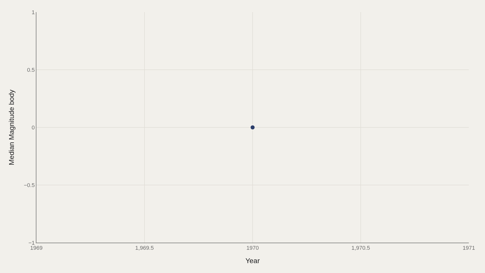
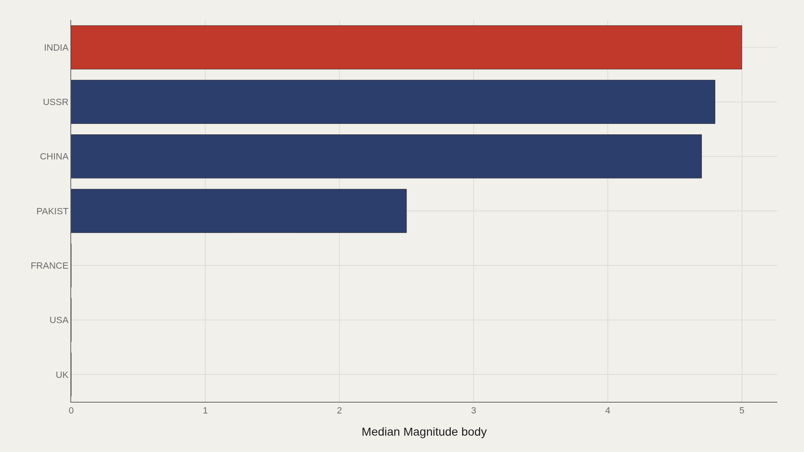
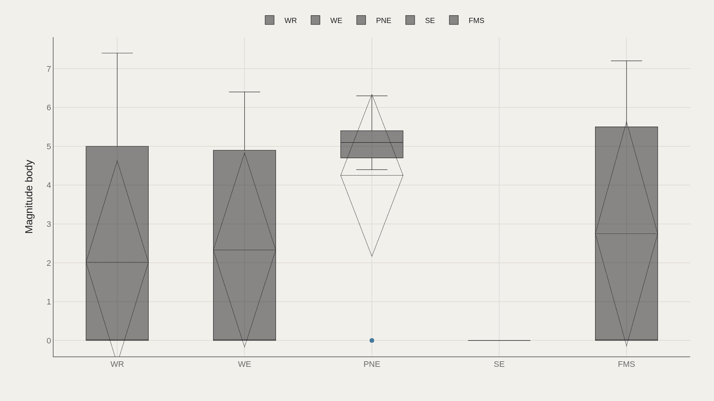
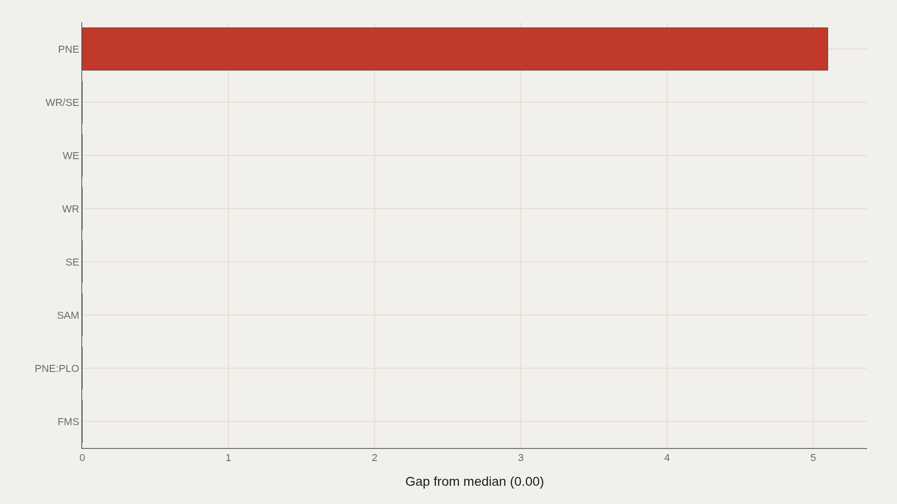
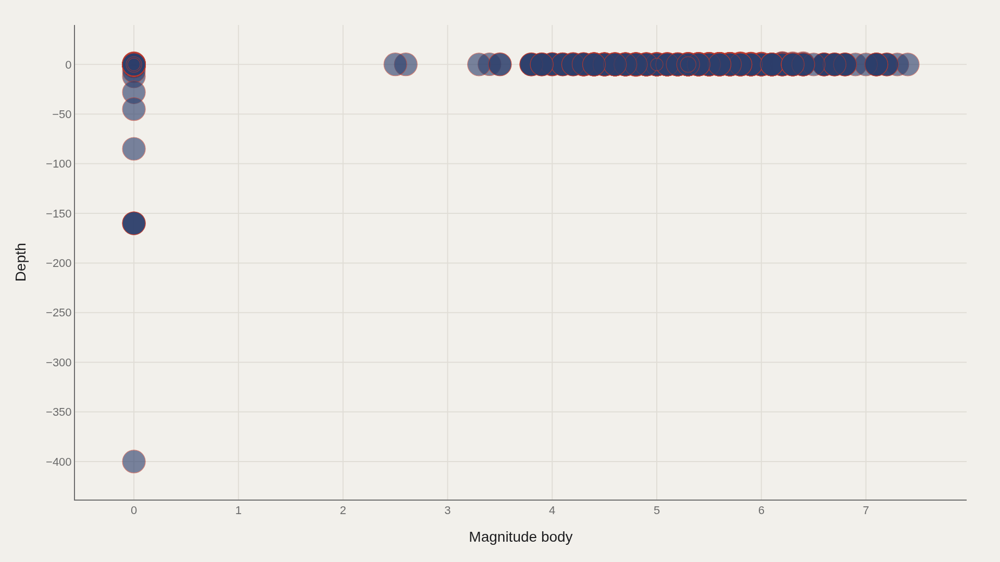

> **TL;DR** Public nuclear test catalogs record 2,051 detonations with a median body-wave magnitude of 0.00—driven by missing measurements—and a maximum of 7.40. The USSR leads by aggregate magnitude, weapons-related tests (WR) dominate purpose codes, and the dataset's year-span artifact collapses to 1970 in summary fields.

Public seismology catalogs of nuclear tests record 2,051 detonations with a median body-wave magnitude of 0.00—not because devices were quiet, but because most events lack filled magnitude values—and a maximum of 7.40, marking the upper tail of instrumentally detectable yields.

A TidyTuesday working extract shows the USSR leads by aggregate magnitude, WR (weapons-related) dominates purpose codes, and the year-span artifact collapses to 1970 in summary fields—read timelines as the file's available event clock, not a claim that all testing concentrated in a single year. The 7.40 maximum captures the seismically loudest events that shook global instruments; the 0.00 median reflects structural missingness, not a physics finding.

Zeros in the magnitude field mark measurement gaps, non-detections, or unfilled cells—diplomatic secrecy and uneven seismic coverage both shape what enters the public record.

## Data and method {#data-and-method}

The source is the TidyTuesday nuclear explosions release maintained by the R for Data Science community. The working file assembles event-level rows with country labels, purpose codes, body-wave magnitude, depth, and related fields after cleaning.

Medians anchor the analysis because missing and zero magnitudes dominate the center of the distribution. Charts export as Plotly JSON with PNG fallbacks. Public test catalogs are incomplete by design—secrecy and uneven seismology limit coverage.

## How magnitudes move through the record {#how-the-pattern-changed-over-time}

### Median Magnitude body Over Time

The time chart of median body-wave magnitude tracks how the typical recorded event sits across the file's date spine. Periods with denser instrumentation and more reported yields diverge from periods dominated by missing magnitude cells.

The curve traces what entered the public measurement record, not a complete energy ledger of every device—diplomatic moratoria and underground testing both reshape what seismology detects.

## Who sits at the top {#who-sits-at-the-top}

### INDIA leads at 5.00 — 2.50 marks the median among the top dozen

On the highlighted leader cut, INDIA leads at 5.00, with 2.50 as the median among the top dozen country entries. Related state labels in the broader ranking—USSR, China, Pakistan, France, USA, UK—confirm that the nuclear club is small and that magnitude leadership in a cleaned table reflects which events were well measured as much as which states tested most often.

The USSR's fact-box lead by magnitude body and India's lead on this chart can both be true under different aggregations—always name the cut before converting a bar into a hierarchy of arsenals.

## Purpose spreads magnitudes {#how-the-field-is-spread}

### Magnitude body by Purpose

Box plots by purpose code show whether magnitude distributions are shared or contested across test categories. WR dominates headcount as the most common purpose label; other purpose codes may rank higher or lower on intensity even with fewer rows.

Purpose codes encode political grammar: weapons-related tests, peaceful nuclear explosion labels, and related categories are not interchangeable events even when they share explosive physics.

## Who beats the median — and who trails {#who-beats-the-median-and-who-trails}

### Magnitude body vs median by Purpose

The gap chart ranks purpose categories above or below the magnitude median. Categories that beat the median concentrate the instrumentally loud events; categories that trail are either genuinely smaller or more missingness-heavy.

Because the file-wide median is 0.00, almost any filled magnitude will sit above the mathematical center—that is a data-structure warning as much as a physics finding.

## Magnitude and depth {#what-moves-together}

### Magnitude body vs Depth

Plotting body-wave magnitude against depth reveals clusters that averages erase. Atmospheric and surface events occupy different depth regimes from underground tests; the scatter separates testing modes that country labels alone cannot distinguish.

Depth is not a perfect proxy for political intent, but it is one of the cleanest engineering signatures in the archive—combined with magnitude, it separates theater from concealment more clearly than country labels alone.

## What this file cannot tell you {#what-this-file-cannot-tell-you}

Community-cleaned TidyTuesday snapshots are not live APIs. Missing values, spelling variants, and incomplete yield reporting apply. A median magnitude of 0.00 is a missingness signal as much as a physical one.

Findings describe structural signals in the public nuclear-test table—not a classified inventory, not a health study, and not a complete history of every device.

## What to take away {#what-to-take-away}

The nuclear test archive in this file is a skewed measurement story: 2,051 records, a median body-wave magnitude at zero because of gaps, and a thin upper tail that reaches 7.40.

A small set of states dominates the known record, and the record itself is shaped by what seismology and disclosure were willing to make countable.

## Sources {#sources}

